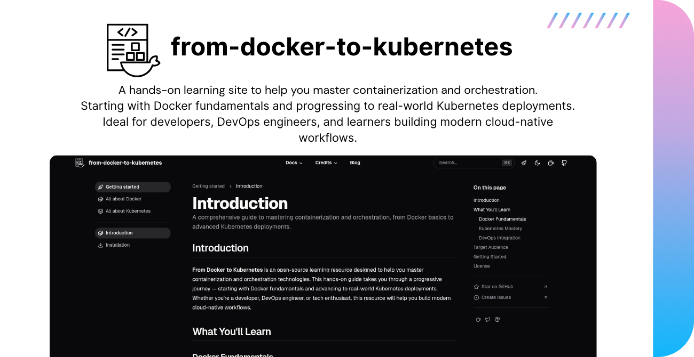

# From Docker to Kubernetes

<div align="center">
  
  
  <h3>A Free & Open Source Learning Platform for Container Orchestration</h3>

  [](https://github.com/NotHarshhaa/from-docker-to-kubernetes/stargazers)
  [](LICENSE)
  [](#contributing)

  [Website](https://dockertokubernetes.live) • [Documentation](https://dockertokubernetes.live/getting-started/introduction) • [Community](https://t.me/prodevopsguy)
</div>

## 🚀 About The Project



**From Docker to Kubernetes** is a comprehensive, hands-on learning platform designed to help developers and DevOps engineers master containerization and orchestration technologies. Our platform provides a structured learning path from Docker basics to advanced Kubernetes deployments, all completely free and open source.

### 🎯 What You'll Learn

<ul>
  <li><strong>Docker Fundamentals</strong>
    <ul>
      <li><a href="https://dockertokubernetes.live/learn-docker/docker/containers" target="_blank" rel="noopener">Container basics and lifecycle</a></li>
      <li><a href="https://dockertokubernetes.live/learn-docker/docker/images" target="_blank" rel="noopener">Image creation and optimization</a></li>
      <li><a href="https://dockertokubernetes.live/learn-docker/docker/networking" target="_blank" rel="noopener">Docker Networking</a></li>
      <li><a href="https://dockertokubernetes.live/learn-docker/docker/volumes" target="_blank" rel="noopener">Docker Volumes</a></li>
      <li><a href="https://dockertokubernetes.live/learn-docker/docker/docker-compose" target="_blank" rel="noopener">Multi-container applications with Docker Compose</a></li>
      <li><a href="https://dockertokubernetes.live/learn-docker/docker/security" target="_blank" rel="noopener">Docker Security</a></li>
    </ul>
  </li>
  <li><strong>Kubernetes Mastery</strong>
    <ul>
      <li><a href="https://dockertokubernetes.live/learn-kubernetes/kubernetes/architecture" target="_blank" rel="noopener">Cluster architecture and components</a></li>
      <li><a href="https://dockertokubernetes.live/learn-kubernetes/kubernetes/workloads" target="_blank" rel="noopener">Pod management and deployments</a></li>
      <li><a href="https://dockertokubernetes.live/learn-kubernetes/kubernetes/networking" target="_blank" rel="noopener">Service networking and discovery</a></li>
      <li><a href="https://dockertokubernetes.live/learn-kubernetes/kubernetes/storage" target="_blank" rel="noopener">Storage and state management</a></li>
      <li><a href="https://dockertokubernetes.live/learn-kubernetes/kubernetes/security" target="_blank" rel="noopener">Security and access control</a></li>
      <li><a href="https://dockertokubernetes.live/learn-kubernetes/kubernetes/config-secrets" target="_blank" rel="noopener">ConfigMaps &amp; Secrets management</a></li>
    </ul>
  </li>
  <li><strong>Advanced Docker Topics</strong>
    <ul>
      <li><a href="https://dockertokubernetes.live/learn-docker/docker/registry-distribution" target="_blank" rel="noopener">Registry &amp; Distribution</a></li>
      <li><a href="https://dockertokubernetes.live/learn-docker/docker/optimization" target="_blank" rel="noopener">Docker Optimization techniques</a></li>
      <li><a href="https://dockertokubernetes.live/learn-docker/docker/monitoring-logging" target="_blank" rel="noopener">Monitoring &amp; Logging</a></li>
      <li><a href="https://dockertokubernetes.live/learn-docker/docker/cicd-integration" target="_blank" rel="noopener">CI/CD Integration</a></li>
      <li><a href="https://dockertokubernetes.live/learn-docker/docker/multi-architecture-builds" target="_blank" rel="noopener">Multi-Architecture Builds</a></li>
      <li><a href="https://dockertokubernetes.live/learn-docker/docker/docker-desktop-dev-environments" target="_blank" rel="noopener">Docker Desktop &amp; Dev Environments</a></li>
      <li><a href="https://dockertokubernetes.live/learn-docker/docker/docker-swarm" target="_blank" rel="noopener">Docker Swarm</a></li>
      <li><a href="https://dockertokubernetes.live/learn-docker/docker/docker-extensions" target="_blank" rel="noopener">Docker Extensions</a></li>
      <li><a href="https://dockertokubernetes.live/learn-docker/docker/docker-buildx" target="_blank" rel="noopener">Docker Buildx</a></li>
      <li><a href="https://dockertokubernetes.live/learn-docker/docker/docker-contexts" target="_blank" rel="noopener">Docker Contexts</a></li>
      <li><a href="https://dockertokubernetes.live/learn-docker/docker/content-trust-image-signing" target="_blank" rel="noopener">Content Trust &amp; Image Signing</a></li>
      <li><a href="https://dockertokubernetes.live/learn-docker/docker/docker-for-ai-ml" target="_blank" rel="noopener">Docker for AI/ML</a></li>
      <li><a href="https://dockertokubernetes.live/learn-docker/docker/docker-edge-computing" target="_blank" rel="noopener">Docker Edge Computing</a></li>
      <li><a href="https://dockertokubernetes.live/learn-docker/docker/docker-plugins-runtime-extensions" target="_blank" rel="noopener">Docker Plugins &amp; Runtime Extensions</a></li>
      <li><a href="https://dockertokubernetes.live/learn-docker/docker/docker-caching-strategies" target="_blank" rel="noopener">Docker Caching Strategies</a></li>
      <li><a href="https://dockertokubernetes.live/learn-docker/docker/docker-storage-drivers" target="_blank" rel="noopener">Docker Storage Drivers</a></li>
      <li><a href="https://dockertokubernetes.live/learn-docker/docker/docker-resource-management" target="_blank" rel="noopener">Docker Resource Management</a></li>
      <li><a href="https://dockertokubernetes.live/learn-docker/docker/docker-wasm-support" target="_blank" rel="noopener">Docker WebAssembly (Wasm) Support</a></li>
      <li><a href="https://dockertokubernetes.live/learn-docker/docker/docker-telepresence-remote-development" target="_blank" rel="noopener">Docker Telepresence &amp; Remote Development</a></li>
    </ul>
  </li>
  <li><strong>Advanced Kubernetes Topics</strong>
    <ul>
      <li><a href="https://dockertokubernetes.live/learn-kubernetes/kubernetes/monitoring-logging" target="_blank" rel="noopener">Monitoring &amp; Logging</a></li>
      <li><a href="https://dockertokubernetes.live/learn-kubernetes/kubernetes/service-mesh-ingress" target="_blank" rel="noopener">Service Mesh &amp; Ingress</a></li>
      <li><a href="https://dockertokubernetes.live/learn-kubernetes/kubernetes/autoscaling-resource-management" target="_blank" rel="noopener">Autoscaling &amp; Resource Management</a></li>
      <li><a href="https://dockertokubernetes.live/learn-kubernetes/kubernetes/operators-crds" target="_blank" rel="noopener">Operators &amp; CRDs</a></li>
      <li><a href="https://dockertokubernetes.live/learn-kubernetes/kubernetes/deployment-strategies" target="_blank" rel="noopener">Deployment Strategies</a></li>
      <li><a href="https://dockertokubernetes.live/learn-kubernetes/kubernetes/gitops" target="_blank" rel="noopener">GitOps with Kubernetes</a></li>
      <li><a href="https://dockertokubernetes.live/learn-kubernetes/kubernetes/multi-cluster-management" target="_blank" rel="noopener">Multi-Cluster Management</a></li>
      <li><a href="https://dockertokubernetes.live/learn-kubernetes/kubernetes/cloud-native-security" target="_blank" rel="noopener">Cloud Native Security</a></li>
      <li><a href="https://dockertokubernetes.live/learn-kubernetes/kubernetes/api-priority-fairness" target="_blank" rel="noopener">API Priority and Fairness</a></li>
      <li><a href="https://dockertokubernetes.live/learn-kubernetes/kubernetes/job-cronjob-enhancements" target="_blank" rel="noopener">Job &amp; CronJob Enhancements</a></li>
      <li><a href="https://dockertokubernetes.live/learn-kubernetes/kubernetes/gateway-api" target="_blank" rel="noopener">Gateway API</a></li>
      <li><a href="https://dockertokubernetes.live/learn-kubernetes/kubernetes/cost-optimization-finops" target="_blank" rel="noopener">Cost Optimization &amp; FinOps</a></li>
      <li><a href="https://dockertokubernetes.live/learn-kubernetes/kubernetes/backup-disaster-recovery" target="_blank" rel="noopener">Backup &amp; Disaster Recovery</a></li>
      <li><a href="https://dockertokubernetes.live/learn-kubernetes/kubernetes/policy-management-opa" target="_blank" rel="noopener">Policy Management with OPA</a></li>
      <li><a href="https://dockertokubernetes.live/learn-kubernetes/kubernetes/statefulsets-daemonsets" target="_blank" rel="noopener">StatefulSets &amp; DaemonSets</a></li>
      <li><a href="https://dockertokubernetes.live/learn-kubernetes/kubernetes/advanced-scheduling-affinity" target="_blank" rel="noopener">Advanced Scheduling &amp; Affinity</a></li>
      <li><a href="https://dockertokubernetes.live/learn-kubernetes/kubernetes/kubernetes-multi-tenancy" target="_blank" rel="noopener">Kubernetes Multi-tenancy</a></li>
      <li><a href="https://dockertokubernetes.live/learn-kubernetes/kubernetes/kubernetes-ai-ml-workloads" target="_blank" rel="noopener">Kubernetes for AI/ML Workloads</a></li>
    </ul>
  </li>
</ul>

## 🛠️ Getting Started

### Prerequisites

```bash
# Install dependencies
npm install
# or
yarn install
# or
pnpm install
# or
bun install
```

### Development

```bash
# Start development server
npm run dev
# or
yarn dev
```

The development server will start at http://localhost:3000

### Production

```bash
# Build for production
npm run build

# Preview production build
npm run preview
```

## 🌟 Features

- 📚 Comprehensive learning modules with 50+ detailed topics
- 💻 Hands-on practical examples with code snippets and configurations
- 🔄 Real-world use cases and deployment scenarios
- 🤝 Community-driven content and continuous updates
- 🆓 Completely free and open source
- 📱 Mobile-responsive design
- 🔄 Regular updates with cutting-edge container technologies

## 🤝 Contributing

We welcome contributions from the community! Whether it's:

- 📝 Adding new tutorials
- 🐛 Fixing bugs
- 📚 Improving documentation
- 💡 Suggesting features
- 🌍 Translations

Check our [Contributing Guidelines](CONTRIBUTING.md) to get started.

## 📦 Deployment

[](https://vercel.com/new/clone?repository-url=https%3A%2F%2Fgithub.com%2FNotHarshhaa%2Ffrom-docker-to-kubernetes)
[](https://app.netlify.com/start/deploy?repository=https%3A%2F%2Fgithub.com%2FNotHarshhaa%2Ffrom-docker-to-kubernetes)

## 🌐 Tech Stack

- [Nuxt 3](https://nuxt.com) - The Vue Framework
- [Nuxt Content](https://content.nuxt.com) - Content Management
- [shadcn-vue](https://www.shadcn-vue.com/) - UI Components
- [TailwindCSS](https://tailwindcss.com) - Styling

## 📞 Connect With Us

- [GitHub](https://github.com/NotHarshhaa)
- [LinkedIn](https://linkedin.com/in/harshhaa-vardhan-reddy)
- [Telegram](https://t.me/NotHarshhaa)
- [Website](https://prodevopsguytech.com)

## ❤️ Support

If you find this project helpful, please consider:

- ⭐ Starring the repository
- 🍕 [Supporting us on Ko-fi](https://ko-fi.com/NotHarshhaa)
- 📢 Sharing with your network

## 📄 License

This project is licensed under the MIT License - see the [LICENSE](LICENSE) file for details.

## 📅 Latest Updates

Our latest release (v1.8.0) includes:
- **Docker for Edge Computing**: Deployment patterns and optimization for edge environments
- **Security Scanning & Vulnerability Management**: Comprehensive security practices for Docker containers
- **Database Containerization**: Best practices for containerizing various database systems
- **Event-Driven Autoscaling (KEDA)**: Advanced Kubernetes scaling based on external metrics
- **FinOps & Cost Management**: Optimizing Kubernetes cloud spend and implementing chargeback
- **GitOps with Flux and ArgoCD**: Declarative infrastructure management for Kubernetes

[View the full changelog](https://dockertokubernetes.live/getting-started/changelog)

## 🙏 Acknowledgments

- Thanks to all our [contributors](https://github.com/NotHarshhaa/from-docker-to-kubernetes/graphs/contributors)
- Built with [shadcn-docs-nuxt](https://github.com/ZTL-UwU/shadcn-docs-nuxt)
- Special thanks to the DevOps community

---

<div align="center">
  <sub>Built with ❤️ by the ProDevOpsGuy Tech Community</sub>
</div>

---

## 📢 Stay Updated  

🔔 **Regular updates** keep this collection **relevant and practical**.  
⭐ **Star this repository** to stay updated!  

---

## 🛠️ Author & Community  

This project is crafted with 💡 by **[Harshhaa](https://github.com/NotHarshhaa)**.  
Your feedback is always welcome! Let's build together. 🚀  

📧 **Connect with me:**  
🔗 **GitHub**: [@NotHarshhaa](https://github.com/NotHarshhaa)  
🔗 **Blog**: [ProDevOpsGuy](https://blog.prodevopsguy.xyz)  
🔗 **Telegram Community**: [Join Here](https://t.me/prodevopsguy)  
🔗 **LinkedIn**: [Harshhaa Vardhan Reddy](https://www.linkedin.com/in/harshhaa-vardhan-reddy/)  

---

## ⭐ Support the Project  

If this helped you, consider:  
✅ **Starring** ⭐ this repository  
✅ **Sharing** 📢 with your network  

---

### 📢 Stay Connected  


