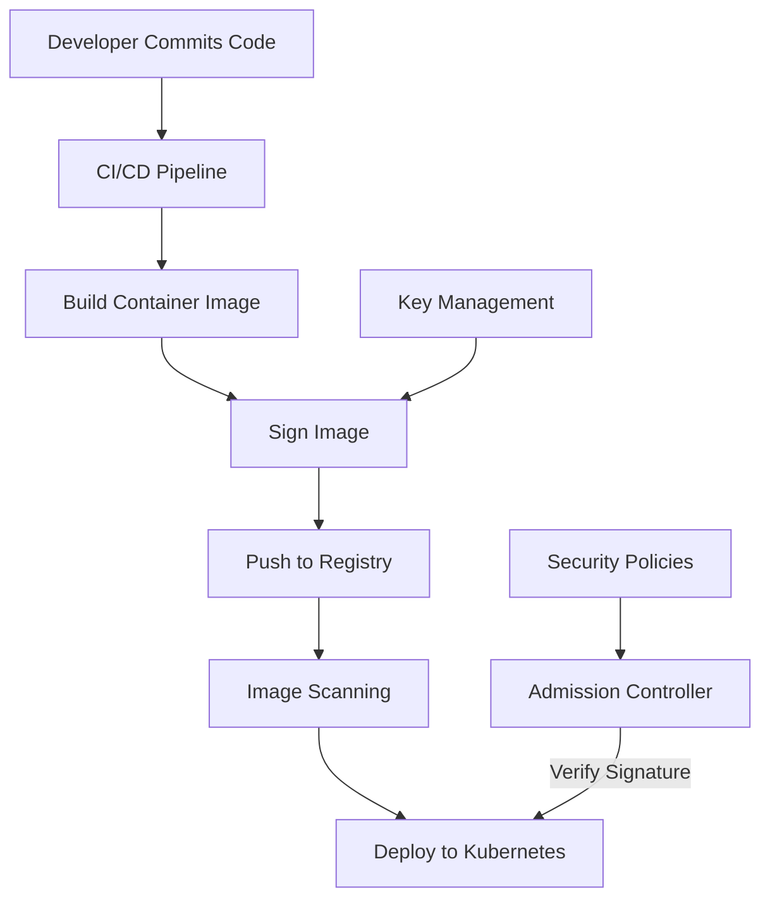

## Docker Content Trust and Image Signing

Docker Content Trust (DCT) provides a way to verify the integrity and publisher of container images, enabling secure software supply chains and ensuring that only trusted content runs in your environment. It implements a signing system that allows users to cryptographically verify the authenticity of images before pulling or running them, which is crucial for security-sensitive applications and environments.

DCT creates a chain of trust from image publishers to consumers, ensuring images haven't been tampered with at any point in the distribution process. This mechanism addresses critical security challenges in container deployments by preventing unauthorized or modified container images from running in your infrastructure.

## Core Concepts

::steps
### Docker Content Trust
- Verifies image integrity through cryptographic hashing of all layers
- Validates image publisher identity using digital signatures
- Prevents running tampered images by rejecting unsigned or invalidly signed content
- Integrates with Docker CLI through native commands and environment variables
- Provides chain of trust from publisher to runtime environment
- Enables non-repudiation of image publishing actions
- Secures the entire software supply chain from build to deployment

### Signing System
- Uses Notary project, an open-source implementation of a signing system
- Implements The Update Framework (TUF), a security specification for secure content distribution
- Manages root keys (highest authority, kept offline) and delegation keys (day-to-day signing)
- Establishes offline root of trust to minimize exposure of critical keys
- Maintains online repository metadata for signature verification
- Creates hierarchical trust relationships for flexible signing workflows
- Includes timestamp services to prevent replay attacks
::

## Enabling Content Trust

::alert{type="info"}
Docker Content Trust can be enabled globally with an environment variable or per-command with a flag. When enabled, Docker automatically verifies signatures when pulling images and signs images when pushing:

```bash
# Enable globally for all Docker commands in current shell session
export DOCKER_CONTENT_TRUST=1

# Use per command to enable for a specific operation
docker pull --disable-content-trust=false nginx:latest

# Use per command to disable for a specific operation when globally enabled
docker pull --disable-content-trust=true nginx:latest

# Check if Docker Content Trust is enabled
echo $DOCKER_CONTENT_TRUST
```

Enabling DCT will require signature verification for all image operations. With DCT enabled, Docker will refuse to pull or run images that aren't properly signed by their publishers or have been tampered with after signing.
::

## Key Management

```bash
# Generate and load keys (done automatically on first push with DCT enabled)
docker trust key generate my-signing-key
# This creates a new signing key pair and stores them in your local Docker trust store
# The private key is protected with a passphrase you'll need to provide
# The public key is used for verification and can be shared

# Add a signer to a repository
docker trust signer add --key my-signing-key.pub alice myorg/myimage
# This adds a new authorized signer (alice) to the repository
# Only designated signers can create valid signatures for the repository
# Enables delegation of signing authority to multiple team members
# Requires repository admin permissions

# Remove a signer
docker trust signer remove alice myorg/myimage
# Revokes signing privileges for the specified user
# Previously signed images remain valid
# Future signatures from this signer will be rejected
# Useful when team members leave or responsibilities change

# View signing keys
docker trust key ls
# Lists all signing keys available to the current user
# Shows key IDs, types, and locations
# Helps manage your signing infrastructure
# Does not display private key material

# Rotate keys
docker trust key rotate myorg/myimage
# Updates the signing keys for a repository
# Critical for security after potential compromise
# Establishes new trust chain while maintaining image access
# Should be part of regular security maintenance
```

Docker creates two types of keys when you first enable DCT:
- Root key: Your most valuable key that should be kept offline and secure
- Repository key: Generated for each repository you push to, used for day-to-day signing

## Signing Images

::steps
### Basic Image Signing
```bash
# With DCT enabled, signing happens automatically on push
export DOCKER_CONTENT_TRUST=1
docker push myorg/myimage:latest
# Docker will prompt for your signing key passphrase
# Image layers and manifest are cryptographically signed
# Signatures are stored in the Notary server (often co-located with registry)
# The signed content can now be verified by consumers

# Explicitly sign an image that was previously pushed
docker trust sign myorg/myimage:latest
# Signs an existing image without pushing it again
# Useful for retroactively signing images
# Adds your signature to the trust metadata
# Requires the image to already exist in the registry
```

### Viewing Signature Information
```bash
# Inspect trust data for an image
docker trust inspect myorg/myimage:latest
# Shows signers, roles, and signature metadata
# Displays signing timestamps and expiration dates
# Lists key IDs used for signing
# JSON format output for programmatic processing

# Inspect with expanded certificates and human-readable format
docker trust inspect --pretty myorg/myimage:latest
# Provides a more readable output format with formatted dates
# Shows detailed certificate information
# Displays hierarchical trust relationships
# Better for human analysis and troubleshooting
```

When Docker trust is enabled, every image pull operation will verify the signatures against the Notary server before allowing the image to be used, providing continuous protection against image tampering.
::

## Automating Image Signing

::alert{type="warning"}
For CI/CD pipelines, you need to securely manage signing keys with specialized security measures:
1. Store keys in secure vaults
   - Use services like HashiCorp Vault, AWS KMS, or Azure Key Vault
   - Never store private keys in source code or unsecured CI variables
   - Implement access controls with least privilege principles
   - Consider Hardware Security Modules (HSMs) for critical keys

2. Use delegation roles for automated signing
   - Create CI-specific signing identities with limited scope
   - Implement role-based access control for signing operations
   - Separate development, testing, and production signing authorities
   - Use different keys for different stages of your pipeline

3. Implement proper key rotation policies
   - Schedule regular key rotations (e.g., quarterly)
   - Automate the rotation process to minimize human error
   - Maintain a secure backup of previous keys during transition
   - Document clear procedures for emergency key rotations

4. Consider threshold signing for critical images
   - Require multiple signers for production images (m-of-n signing)
   - Implement approval workflows before signature application
   - Separate duties between build and signing operations
   - Create security gates between build and deployment

5. Audit signature events
   - Log all signing operations with detailed metadata
   - Monitor for unusual signing patterns or unauthorized attempts
   - Create alerts for signature verification failures
   - Maintain immutable audit trails for compliance purposes
   - Regularly review signing activity for security governance
::

```yaml
# Example GitHub Actions workflow with signing
name: Build and Sign Image

on:
  push:
    branches: [ main ]

jobs:
  build-and-sign:
    runs-on: ubuntu-latest
    steps:
      - uses: actions/checkout@v3
      
      - name: Set up Docker Buildx
        uses: docker/setup-buildx-action@v2
      
      - name: Login to DockerHub
        uses: docker/login-action@v2
        with:
          username: ${{ secrets.DOCKERHUB_USERNAME }}
          password: ${{ secrets.DOCKERHUB_TOKEN }}
      
      - name: Setup Docker Content Trust
        run: |
          mkdir -p ~/.docker/trust
          echo "${{ secrets.DCT_PRIVATE_KEY }}" > ~/.docker/trust/private.key
          echo "${{ secrets.DCT_PASSPHRASE }}" > ~/.docker/trust/passphrase
          export DOCKER_CONTENT_TRUST=1
          export DOCKER_CONTENT_TRUST_REPOSITORY_PASSPHRASE="$(cat ~/.docker/trust/passphrase)"
          
      - name: Build and Push
        run: |
          docker build -t myorg/myimage:${{ github.sha }} .
          docker tag myorg/myimage:${{ github.sha }} myorg/myimage:latest
          docker push myorg/myimage:${{ github.sha }}
          docker push myorg/myimage:latest
```

## Notary Architecture

::steps
### Notary Components
- Notary Server: Stores and serves signed metadata for repositories
  - Acts as a trusted source of signature verification data
  - Provides secure storage for all signature metadata
  - Implements TUF protocol for secure updates
  - Exposes API for clients to fetch and update trust data
  
- Notary Signer: Handles signing operations securely
  - Manages private keys for signing operations
  - Provides isolated environment for cryptographic operations
  - Offers hardware security module (HSM) integration
  - Maintains separation of concerns from metadata storage
  
- Notary Client: CLI tool for managing content trust
  - Interacts with both server and signer
  - Provides user interface for trust operations
  - Manages local key storage and signing requests
  - Validates and updates trust metadata
  
- TUF Metadata: Multiple layers of signed metadata files
  - Implements The Update Framework specification
  - Provides defense-in-depth through hierarchical trust
  - Protects against various attacks including freeze, rollback, and mix-and-match
  - Enables secure metadata updates even over untrusted channels

### Trust Metadata
- Root: Top-level key, typically offline
  - Highest authority in the trust hierarchy
  - Signs and authorizes all other top-level keys
  - Stored offline to maximize security
  - Long expiration time (typically 1+ years)
  - Used rarely, primarily for key rotation
  
- Targets: Controls content hashes
  - Contains hashes of the actual container images
  - Maps image tags to their cryptographic digests
  - Signed by targets key or delegation keys
  - Defines the content that is officially approved
  - Can be extended with custom metadata
  
- Snapshot: Records current collection of metadata
  - Prevents mix-and-match attacks
  - Contains references to all current metadata versions
  - Ensures consistency across all trust information
  - Updated whenever any metadata changes
  - Provides a consistent view of repository state
  
- Timestamp: Indicates freshness of repository
  - Prevents replay attacks with expired metadata
  - Updated frequently (typically daily)
  - Has shortest expiration of all metadata
  - Signed by online keys for automation
  - Confirms the repository is actively maintained
  
- Delegations: Additional signing authorities
  - Enables distributed trust model
  - Allows multiple signers for different paths
  - Supports team-based signing workflows
  - Can create hierarchical signing responsibilities
  - Enables fine-grained access control for signing
::

## Advanced Signing with Notary

```bash
# Initialize a Notary repository
notary init example.com/myorg/myimage
# Creates a new trusted collection for your image
# Generates initial root, targets, snapshot, and timestamp metadata
# Establishes trust hierarchy for the repository
# You'll need to provide a passphrase for the root and repository keys

# Add a delegation key
notary delegation add example.com/myorg/myimage targets/releases alice.crt --all-paths
# Creates a delegation role called "releases" under the targets role
# Adds Alice's certificate as an authorized signer for this delegation
# The --all-paths flag allows signing any path in the repository
# For more granular control, specify paths like "path:v1*" instead

# Publish changes
notary publish example.com/myorg/myimage
# Uploads the locally modified trust metadata to the Notary server
# Makes your changes visible to other users of the repository
# Updates the snapshot and timestamp metadata with current state
# Requires authentication to the Notary server

# List keys in Notary
notary key list
# Shows all keys in your local Notary trust store
# Displays key IDs, locations, roles, and key types
# Helps inventory your signing capabilities
# Does not show private key material or passphrases

# Rotate a key
notary key rotate example.com/myorg/myimage targets/releases
# Replaces the existing key with a new one for the specified role
# Maintains trust chain during key transition
# Critical for security after suspected compromise
# Updates delegation metadata to use new key
# All previously signed content remains valid
```

The Notary CLI provides a more direct and granular interface to the trust system than the Docker trust commands, making it valuable for advanced trust management scenarios and automation.

## Cosign Integration

::alert{type="info"}
Cosign is a modern alternative to Docker Content Trust that offers additional features as part of the Sigstore project. It provides simpler tooling, keyless signing options, and better integration with cloud-native ecosystems:

```bash
# Install Cosign
brew install cosign
# Also available via other package managers:
# apt-get install cosign
# npm install -g cosign
# Available as a container: docker run gcr.io/projectsigstore/cosign

# Generate keys
cosign generate-key-pair
# Creates a public/private key pair for signing
# Private key (cosign.key) is protected with a password
# Public key (cosign.pub) is used for verification
# Keys use modern ECDSA cryptography (P-256 curve)

# Sign an image
cosign sign --key cosign.key myorg/myimage:latest
# Signs the image and stores signature in the registry alongside the image
# No separate Notary server required
# Signature is stored as an OCI artifact in the same registry
# Supports both OCI and Docker registries

# Verify an image
cosign verify --key cosign.pub myorg/myimage:latest
# Retrieves and verifies the signature for the specified image
# Shows signature details and verification status
# Outputs the signing certificate and timestamp
# Provides non-repudiation for signed images

# Keyless signing with OIDC identity
cosign sign --identity-token=$(gcloud auth print-identity-token) myorg/myimage:latest
# Uses your authenticated identity instead of a key file
# Leverages OIDC providers (GitHub, Google, etc.)
# Signatures can be traced back to authenticated users
# Simplifies key management by eliminating private keys
```

Cosign integrates with other Sigstore projects like Fulcio (certificate authority) and Rekor (transparency log) to provide a complete trust ecosystem with enhanced security and auditability.
::

## Policy Enforcement

::steps
### Admission Controllers
- Kubernetes validating webhooks that intercept and validate requests
  - Run as independent services within your Kubernetes cluster
  - Receive admission requests before objects are persisted
  - Can approve, reject, or modify incoming resources
  - Operate asynchronously to minimize performance impact
  
- Enforce signature verification at deployment time
  - Check image signatures before allowing pods to run
  - Verify signatures against trusted public keys
  - Support multiple verification providers (DCT, Cosign, etc.)
  - Implement configurable verification policies
  
- Block unsigned or untrusted images from running
  - Reject deployments with unverified images
  - Provide detailed rejection reasons in error messages
  - Create exceptions for specific namespaces or sources
  - Support emergency bypass mechanisms with proper authorization
  
- Implement organization policies for image trust
  - Define allowed signers for different environments
  - Set minimum signature requirements by namespace
  - Create tiered trust policies (dev, staging, production)
  - Enforce supply chain security requirements
  
- Audit and compliance reporting for security governance
  - Log all verification decisions with detailed metadata
  - Generate reports on signature compliance
  - Track policy exceptions and bypass events
  - Provide evidence for security audits and certifications
  - Integrate with security information and event management (SIEM) systems

### Example Admission Policy
```yaml
apiVersion: admissionregistration.k8s.io/v1
kind: ValidatingWebhookConfiguration
metadata:
  name: image-signature-webhook
webhooks:
- name: image-verify.example.com
  clientConfig:
    service:
      namespace: image-verify
      name: image-verify-webhook
      path: "/validate"
  rules:
  - operations: ["CREATE", "UPDATE"]
    apiGroups: [""]
    apiVersions: ["v1"]
    resources: ["pods"]
  failurePolicy: Fail
  sideEffects: None
  admissionReviewVersions: ["v1"]
```
::

## Software Supply Chain Security



## Securing Private Registries

::alert{type="warning"}
Private registries should be configured for content trust with multiple security layers:

1. Configure TLS for registry connections
   - Use valid certificates from trusted certificate authorities
   - Implement strong TLS ciphers (TLS 1.2+ with PFS ciphers)
   - Set appropriate certificate renewal processes
   - Consider mutual TLS for client authentication
   - Use TLS termination with proper certificate validation

2. Enable content trust on the registry
   - Configure Notary server alongside your registry
   - Set up proper database backend for trust metadata
   - Implement separate backup procedures for signature data
   - Configure proper certificate chains for the Notary service
   - Ensure compatibility with your registry version

3. Implement user authentication
   - Use strong authentication methods (OIDC, LDAP, etc.)
   - Implement multi-factor authentication for registry access
   - Create service accounts with limited scope for automation
   - Define clear user provisioning and deprovisioning procedures
   - Audit authentication events and failed login attempts

4. Use network policies to restrict registry access
   - Limit registry access to authorized networks only
   - Implement egress filtering on production environments
   - Create separate network segments for registry traffic
   - Use firewall rules to enforce access policies
   - Consider private connectivity options (VPC endpoints, etc.)

5. Monitor registry access and operations
   - Enable comprehensive logging for all registry operations
   - Implement real-time alerts for suspicious activities
   - Track pull, push, and signature verification events
   - Create dashboards for registry usage patterns
   - Set up anomaly detection for unexpected access patterns
   - Regularly review access logs for security governance
::

## Vulnerability Management

::steps
### Integration with Scanning
- Sign images after security scanning to certify their security status
  - Run comprehensive vulnerability scans before signing
  - Only sign images that meet security thresholds
  - Include scan results as attestations with signatures
  - Create secure pipeline stages for scan-then-sign workflow
  - Document the security baseline for each signed image
  
- Revoke signatures for vulnerable images when new threats emerge
  - Monitor CVE databases for new vulnerabilities
  - Implement automatic signature revocation for critical issues
  - Notify teams when signatures are revoked
  - Provide clear paths for remediation
  - Track vulnerability-to-revocation timeframes
  
- Implement re-signing after patching to maintain trusted status
  - Verify patch effectiveness before re-signing
  - Update attestations with new security information
  - Maintain version history of signature changes
  - Document justification for each re-signing event
  - Implement proper approval workflows for re-signing
  
- Automated security update workflow for continuous protection
  - Detect vulnerable components automatically
  - Build, test, and sign patched images
  - Deploy updates with minimal human intervention
  - Verify successful update deployment
  - Roll back automatically if verification fails
  
- Policy-based signature enforcement tied to security requirements
  - Define security levels required for different environments
  - Implement stricter policies for production workloads
  - Create exception processes for emergency situations
  - Review and update policies based on threat landscape
  - Align policies with regulatory requirements

### Continuous Validation
- Regular verification of deployed images beyond initial deployment
  - Periodic signature validation of running containers
  - Compare running images against trusted signatures
  - Detect container drift or tampering
  - Implement verification as part of health checks
  - Create reconciliation loops for continuous compliance
  
- Monitoring for compromised signatures and trust issues
  - Watch for revoked certificates or compromised keys
  - Alert on unexpected signature changes
  - Implement dead man's switch for timestamp validation
  - Track signature expiration to prevent trust lapses
  - Monitor Notary server health and security
  
- Automated remediation for policy violations
  - Define clear action plans for different violation types
  - Implement graduated response based on severity
  - Create automated quarantine procedures for suspect containers
  - Build self-healing capabilities for trust violations
  - Document remediation actions for compliance purposes
  
- Audit trails for image provenance across the entire lifecycle
  - Record all signature events with complete metadata
  - Track image history from build to retirement
  - Implement immutable logging for signature operations
  - Create verifiable evidence chains for forensic analysis
  - Maintain historical records for compliance requirements
  
- Supply chain transparency for all stakeholders
  - Provide visibility into signing authorities and processes
  - Document trust relationships in a human-readable format
  - Create dashboards showing image trust status
  - Enable verification of supply chain integrity
  - Support third-party audits of trust infrastructure
::

## Best Practices

::steps
### Key Management
- Store root keys offline (hardware tokens)
  - Use hardware security modules (HSMs) or smart cards
  - Store root keys in air-gapped systems
  - Implement physical security controls for offline keys
  - Consider tamper-evident storage for critical keys
  - Create ceremonies for root key operations
  
- Use separate keys for different environments
  - Maintain strict separation between development and production keys
  - Create environment-specific trust hierarchies
  - Implement different security levels for different key types
  - Use separate delegations for different teams or services
  - Never share keys between security boundaries
  
- Implement secure key rotation procedures
  - Schedule regular rotation based on key sensitivity
  - Create clear procedures for planned and emergency rotations
  - Test rotation procedures before implementation
  - Maintain backward compatibility during transition periods
  - Document each rotation event for audit purposes
  
- Define clear key custodian responsibilities
  - Assign specific roles for key management
  - Implement separation of duties for critical operations
  - Create backup custodian assignments
  - Train custodians on security procedures
  - Implement multi-person control for highest-value keys
  
- Document key recovery processes
  - Create detailed recovery procedures for key loss scenarios
  - Test recovery processes regularly
  - Store recovery materials securely with appropriate access controls
  - Implement break-glass procedures for emergency access
  - Consider legal and compliance implications of recovery

### Operational Security
- Enforce content trust in production environments
  - Make signature verification mandatory for production workloads
  - Implement technical controls to prevent bypass
  - Create clear exception processes for emergency scenarios
  - Regularly test enforcement mechanisms
  - Document compliance with trust requirements
  
- Train developers on signing workflow and security implications
  - Create educational materials on content trust concepts
  - Provide hands-on training for signing procedures
  - Include content trust in security awareness programs
  - Train incident responders on trust-related issues
  - Make security a shared responsibility across teams
  
- Automate signing in CI/CD pipelines for consistency
  - Design secure signing stages in build pipelines
  - Implement proper secret management for signing keys
  - Create approval gates before signing operations
  - Log and monitor all automated signing activities
  - Test signing automation regularly
  
- Regularly audit signature policies and implementation
  - Conduct periodic reviews of trust configuration
  - Verify adherence to signing policies
  - Test signature verification on random samples
  - Update policies based on emerging threats
  - Include trust systems in security assessments
  
- Monitor for unauthorized image usage or trust violations
  - Implement real-time alerting for trust failures
  - Create dashboards for trust status across environments
  - Use anomaly detection for unusual signing patterns
  - Track attempted uses of unsigned images
  - Include trust violations in security incident procedures
::

## Troubleshooting

::alert{type="info"}
Common issues and solutions:

1. **Missing signatures**: Verify DCT was enabled during push
   - Check if DOCKER_CONTENT_TRUST=1 was set when pushing
   - Confirm push operation completed successfully
   - Try explicitly signing with `docker trust sign`
   - Verify user has signing permissions for the repository
   - Check for errors in Docker daemon logs
   - Verify image exists in the registry before attempting to sign

2. **Key access issues**: Check key permissions and passphrases
   - Verify key files have correct permissions (600 for private keys)
   - Confirm correct passphrase is being used
   - Check key storage location (~/.docker/trust)
   - Verify trust directory ownership and permissions
   - Look for hardware token connectivity issues
   - Consider key recovery if passphrase is lost

3. **Trust server connectivity**: Verify network connectivity to Notary server
   - Test connectivity to Notary server endpoints
   - Check firewall rules and network policies
   - Verify TLS certificates are valid and trusted
   - Check DNS resolution for Notary server
   - Look for proxy configuration issues
   - Verify authentication credentials for Notary server

4. **Expired signatures**: Update timestamp metadata
   - Run `notary publish` to update timestamp
   - Check system clock synchronization
   - Verify Notary server timestamp key is valid
   - Look for expiration dates in trust metadata
   - Consider automatic timestamp refresh mechanisms
   - Implement monitoring for approaching expirations

5. **CI/CD integration problems**: Verify secret management and environment variables
   - Check secure handling of signing keys in CI/CD
   - Verify environment variables are correctly set
   - Ensure passphrase is properly provided to signing process
   - Look for permission issues in CI/CD environment
   - Check for tool compatibility in CI/CD runners
   - Implement proper error handling in build scripts

6. **Client/server version mismatch**: Ensure compatible versions
   - Verify Docker client and daemon versions
   - Check Notary client and server compatibility
   - Look for API version mismatches
   - Update components to compatible versions
   - Check for TUF format changes between versions
   - Review release notes for breaking changes
   - Consider version pinning for stable environments
::

## Modern Approaches and Tools

::steps
### Sigstore and Cosign
- Keyless signing options that eliminate private key management
  - Uses short-lived certificates tied to identity
  - Leverages OpenID Connect (OIDC) for authentication
  - Provides non-repudiation without key storage concerns
  - Issues ephemeral certificates from Fulcio CA
  - Minimizes risk of key compromise
  
- Transparency logs for public verification and auditability
  - Records all signatures in a tamper-evident log (Rekor)
  - Enables third-party verification of signing events
  - Creates immutable audit trails of signature activities
  - Supports inclusion proofs for signature verification
  - Makes supply chain activities publicly verifiable
  
- OIDC identity integration for human and workload authentication
  - Uses existing identity providers (GitHub, Google, etc.)
  - Supports both human and service account identities
  - Ties signatures directly to authenticated identities
  - Enables identity-based verification policies
  - Simplifies access management for signing operations
  
- Simplified developer experience with modern tooling
  - Reduces complexity compared to traditional PKI
  - Provides clear, user-friendly commands and interfaces
  - Integrates with existing development workflows
  - Supports multiple signature formats and verification methods
  - Reduces friction in adopting supply chain security
  
- Kubernetes integration through admission controllers and policies
  - Works with Policy Controller and OPA Gatekeeper
  - Provides CRDs for Kubernetes-native policy definition
  - Integrates with Kubernetes RBAC for authorization
  - Supports namespace-level policy configuration
  - Enables cluster-wide signature enforcement

### In-toto Attestations
- Capture entire build provenance with detailed metadata
  - Records all steps in the build and release process
  - Documents inputs, outputs, and environment for each step
  - Creates verifiable evidence of build process integrity
  - Supports reproducible builds verification
  - Enables complete software bill of materials generation
  
- Link steps in build process with cryptographic guarantees
  - Creates a verifiable chain of operations
  - Ensures each step was performed as expected
  - Detects tampering or unauthorized modifications
  - Provides transitive trust across the pipeline
  - Enforces order and dependencies between steps
  
- Verify complete supply chain from source to deployment
  - Validates every transformation in the software lifecycle
  - Ensures no unauthorized steps were introduced
  - Verifies all components meet security requirements
  - Creates end-to-end verification of software provenance
  - Supports complex supply chain topologies
  
- Additional metadata beyond signatures for rich verification
  - Includes vulnerability scan results
  - Documents policy compliance status
  - Records build environment configuration
  - Captures test results and quality metrics
  - Provides licensing and compliance information
  
- Framework for custom attestations tailored to specific needs
  - Supports domain-specific attestation types
  - Enables creation of custom verification rules
  - Allows extension for organization-specific requirements
  - Provides standardized format for diverse metadata
  - Integrates with existing security and compliance systems
::

## Future Directions

::alert{type="warning"}
The image signing ecosystem is evolving rapidly with several important trends emerging:

1. **SBOM integration**: Linking signatures to Software Bill of Materials
   - Embedding SBOM data directly within signature attestations
   - Creating verifiable claims about software components
   - Enabling automated vulnerability correlation with package data
   - Supporting compliance requirements like US Executive Order 14028
   - Facilitating risk assessment based on component inventory
   - Enabling dependency analysis for security and licensing
   - Creating machine-readable component transparency

2. **Zero-trust supply chains**: Continuous verification at all stages
   - Implementing verification at every step in the software lifecycle
   - Removing implicit trust between pipeline stages
   - Creating verifiable evidence for each transformation
   - Enabling continuous revalidation of running workloads
   - Implementing least-privilege principles for build systems
   - Supporting dynamic trust decisions based on current context
   - Creating secure build environments with minimal attack surface

3. **Standardized attestations**: Broader ecosystem support for provenance
   - Developing industry standards for attestation formats
   - Creating interoperable verification mechanisms
   - Supporting cross-vendor attestation exchange
   - Enabling audit and compliance across heterogeneous environments
   - Fostering community adoption of attestation standards
   - Improving tooling ecosystem for attestation creation and verification
   - Supporting regulatory compliance with standardized evidence

4. **Identity-based trust**: Moving beyond key-based to identity-based trust
   - Leveraging existing identity providers (OIDC, SAML)
   - Binding signatures to real-world identities
   - Supporting role-based signature verification
   - Implementing fine-grained access control for signing operations
   - Creating audit trails linked to authenticated identities
   - Supporting federation across organizational boundaries
   - Simplifying key management through identity federation

5. **Policy as code**: Declarative signature requirements
   - Defining trust requirements in machine-readable formats
   - Automating policy enforcement across environments
   - Supporting complex verification rules and exceptions
   - Enabling programmatic trust decisions based on context
   - Creating hierarchical policies for different security levels
   - Implementing continuous validation against evolving policies
   - Supporting policy simulation and impact analysis
::