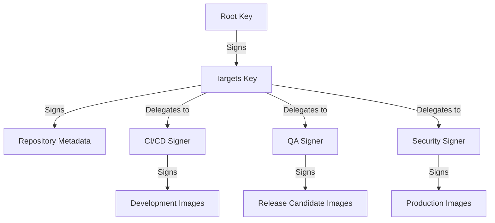
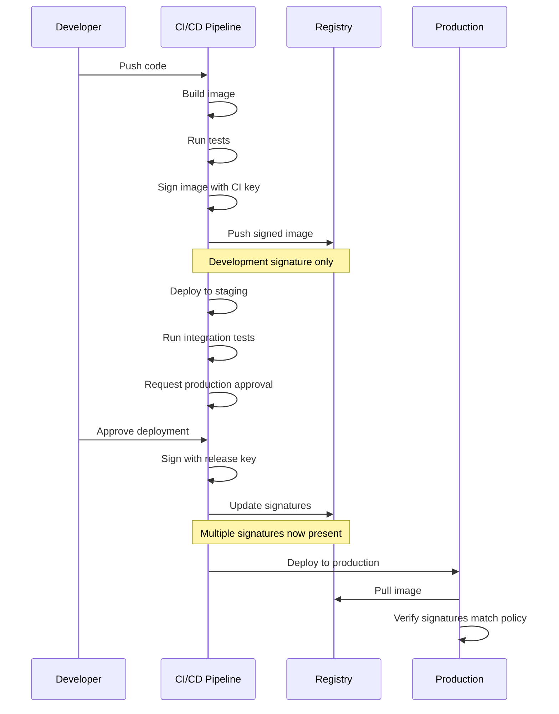

## Docker Content Trust Advanced

Docker Content Trust (DCT) provides a sophisticated framework for ensuring the integrity, authenticity, and publisher verification of container images. While the basic implementation provides strong security guarantees, advanced usage of DCT enables organizations to implement comprehensive trust chains, delegation models, and automated verification systems that are essential for enterprise security postures.

This advanced exploration delves into the internals of DCT, delegation hierarchies, key management best practices, and integration strategies that enable organizations to maintain robust security throughout their container lifecycle.

## DCT Architecture and Cryptographic Foundations

Docker Content Trust is built on The Update Framework (TUF), a secure design architecture for software distribution systems. DCT's implementation uses several layers of cryptographic signing to establish a chain of trust:

::steps
### Root of Trust
- Established by the root key, the ultimate source of trust
- Generated once and typically stored offline (air-gapped) for maximum security
- Signs the targets key which signs repository metadata
- Key compromise would compromise entire trust system
- Example root key generation:
  ```bash
  docker trust key generate root
  ```

### Targets Signing
- Repository-specific signing key
- Signs the metadata for all images in a repository
- Can delegate signing authority to other keys
- Typically used by repository owners and administrators
- Example targets key usage:
  ```bash
  docker trust signer add --key maintainer.pub maintainer registry.example.com/myorg/myapp
  ```

### Snapshot Signing
- Ensures consistency of the repository metadata
- Prevents mix-and-match attacks with different versions of metadata
- Automatically managed by the Docker registry or Notary server
- Rotated periodically to maintain security

### Timestamp Signing
- Prevents replay attacks by providing proof of freshness
- Signed metadata includes a timestamp of when it was created
- Automatically managed by the Docker registry or Notary server
- Provides short-term verification of repository state
::

The Notary service, which powers DCT, operates as a separate component in the Docker ecosystem, maintaining a database of all signatures and providing verification services during image pulls.

## Advanced Delegation Models

DCT's delegation system allows for sophisticated trust relationships that can mirror organizational structures:



This delegation hierarchy enables several advanced workflows:

::alert{type="info"}
1. **Multi-role Approvals**
   - Require signatures from multiple parties before an image can be deployed
   - Implement separation of duties between development and operations
   - Create trust thresholds (e.g., 2 of 3 signers must approve)
   - Example policy configuration in Notary:
     ```json
     {
       "roles": {
         "targets/releases": {
           "paths": ["v1.0/*", "v2.0/*"],
           "threshold": 2,
           "signers": ["dev-team", "security-team", "ops-team"]
         }
       }
     }
     ```

2. **Path-based Delegations**
   - Assign signing authority based on image path patterns
   - Different teams can manage different products or versions
   - Enables decentralized signing responsibility with centralized oversight
   - Example delegation by path:
     ```bash
     docker trust signer add --key team1.pub team1 registry.example.com/myorg/product1
     docker trust signer add --key team2.pub team2 registry.example.com/myorg/product2
     ```

3. **Progressive Trust Levels**
   - Development environments accept images signed by developers
   - Staging environments require additional QA signatures
   - Production environments require security team signatures
   - Example enforcement in container orchestration:
     ```yaml
     # Kubernetes Admission Controller Policy
     apiVersion: admissionregistration.k8s.io/v1
     kind: ValidatingAdmissionPolicy
     metadata:
       name: require-prod-signatures
     spec:
       failurePolicy: Fail
       matchConstraints:
         namespaceSelectors:
           - matchLabels:
               environment: production
       validations:
         - expression: "has(object.spec.containers[0].image) && object.spec.containers[0].image.contains('signed-by=security-team')"
     ```

4. **Temporal Delegations**
   - Grant signing authority for limited time periods
   - Automatically expire signing capabilities
   - Implement key rotation policies
   - Managed through Notary's expiration mechanisms
::

Implementing these delegation models requires careful planning of the trust hierarchy and key management procedures.

## Enterprise Key Management

For organizations adopting DCT at scale, key management becomes a critical concern. Advanced practices include:

::steps
### Hardware Security Modules (HSMs)
- Store root and targets keys in dedicated hardware
- Protect keys from extraction or unauthorized use
- Support for YubiKey, smart cards, and enterprise HSMs
- Implementation using PKCS#11 interface
- Example YubiKey configuration:
  ```bash
  # Generate key on YubiKey
  docker trust key generate root --hardware
  
  # Sign using key on YubiKey
  docker trust sign registry.example.com/myorg/myapp:1.0
  ```

### Key Rotation Policies
- Regular rotation of all signing keys except root key
- Automated rotation of snapshot and timestamp keys
- Planned rotation of targets and delegation keys
- Emergency procedures for compromised keys
- Example targets key rotation:
  ```bash
  # Generate new targets key
  docker trust key generate newtargets
  
  # Rotate targets key for repository
  docker trust key rotate targets registry.example.com/myorg/myapp -r
  ```

### Threshold Signing
- Require multiple key holders to approve signing operations
- Split root key material among multiple stakeholders
- Implement M-of-N threshold schemes for critical operations
- Use Shamir's Secret Sharing or similar cryptographic techniques
- Example using Notary's native threshold support:
  ```bash
  # Configure 2-of-3 threshold for targets role
  notary delegate targets/releases registry.example.com/myorg/myapp --threshold=2 signer1.pub signer2.pub signer3.pub
  ```

### Backup and Recovery
- Secure offline storage of root key material
- Encrypted backups of all signing keys
- Documentation of recovery procedures
- Regular testing of key recovery process
- Example root key backup procedure:
  ```bash
  # Export encrypted root key
  docker trust key export --key root.json
  
  # Store in secure location (multiple physical locations)
  # Document recovery procedure and share with key stakeholders
  ```
::

## Integration with CI/CD Pipelines

Automating DCT within CI/CD pipelines is essential for enterprise adoption. Advanced integration strategies include:



Key considerations for CI/CD integration:

::alert{type="warning"}
1. **Automated Signing**
   - Integrate signing steps into CI/CD pipelines
   - Store CI/CD signing keys securely in pipeline secrets management
   - Implement proper access controls to signing keys
   - Example GitLab CI configuration:
     ```yaml
     sign_image:
       stage: sign
       script:
         - export DOCKER_CONTENT_TRUST=1
         - export DOCKER_CONTENT_TRUST_REPOSITORY_PASSPHRASE=$SIGNING_PASSPHRASE
         - docker trust sign $CI_REGISTRY_IMAGE:$CI_COMMIT_TAG
       only:
         - tags
     ```

2. **Attestation Integration**
   - Combine DCT with attestation systems like in-toto or SLSA
   - Provide provenance information alongside signatures
   - Create verifiable build records
   - Example Tekton pipeline with attestation:
     ```yaml
     - name: sign-and-attest
       taskRef:
         name: cosign-sign
       params:
         - name: image
           value: "$(params.IMAGE_URL)"
         - name: attestation
           value: |
             {
               "builder": "tekton",
               "buildType": "$(context.taskRun.name)",
               "materials": ["$(context.git.url)@$(context.git.commit)"]
             }
     ```

3. **Policy Enforcement**
   - Implement admission controllers in Kubernetes
   - Use OPA Gatekeeper or Kyverno for signature verification
   - Create graduated policies for different environments
   - Example Kyverno policy:
     ```yaml
     apiVersion: kyverno.io/v1
     kind: ClusterPolicy
     metadata:
       name: verify-image-signatures
     spec:
       validationFailureAction: Enforce
       rules:
       - name: verify-trusted-images
         match:
           resources:
             kinds:
             - Pod
         verifyImages:
         - imageReferences:
           - "registry.example.com/myorg/*"
           attestors:
           - entries:
             - keyless:
                 subject: "https://github.com/myorg/myrepo/.github/workflows/build.yaml@refs/heads/main"
     ```

4. **Break-glass Procedures**
   - Define emergency procedures to bypass signature verification
   - Document audit requirements for emergency deployments
   - Implement time-limited exceptions
   - Require post-incident review and re-signing
   - Example emergency override:
     ```bash
     # Documented emergency procedure
     # Requires manager approval and incident tracking
     kubectl annotate namespace production trust.enforcement.temporary-override="true" --overwrite
     # Valid for 4 hours, then reverts to enforcing signatures
     ```
::

## Advanced Notary Server Configuration

Enterprise deployments of DCT often involve running a dedicated Notary service. Advanced configurations include:

1. **High Availability Setup**
   - Deploy redundant Notary servers
   - Implement load balancing
   - Use replicated database backends
   - Example Docker Compose for HA Notary:
     ```yaml
     version: '3'
     services:
       notary-server-1:
         image: notary-server:latest
         environment:
           NOTARY_SERVER_STORAGE_BACKEND: postgres
           NOTARY_SERVER_DB_HOST: notary-db
         deploy:
           replicas: 2
       
       notary-signer-1:
         image: notary-signer:latest
         environment:
           NOTARY_SIGNER_STORAGE_BACKEND: postgres
           NOTARY_SIGNER_DB_HOST: signer-db
         deploy:
           replicas: 2
           
       notary-db:
         image: postgres:12
         deploy:
           replicas: 1
     ```

2. **Custom Certificate Authorities**
   - Deploy private PKI infrastructure
   - Configure Notary to use custom CAs
   - Rotate TLS certificates periodically
   - Example configuration with custom CA:
     ```json
     {
       "server": {
         "tls_cert_file": "/certs/notary-server.crt",
         "tls_key_file": "/certs/notary-server.key",
         "client_ca_file": "/certs/ca.crt"
       }
     }
     ```

3. **External Authentication Integration**
   - LDAP/Active Directory integration
   - OIDC authentication
   - Role-based access control
   - Example OIDC configuration:
     ```json
     {
       "auth": {
         "type": "oidc",
         "options": {
           "client_id": "notary-server",
           "client_secret": "secret",
           "issuer": "https://auth.example.com",
           "scope": ["openid", "profile", "email"]
         }
       }
     }
     ```

## Auditing and Compliance

For regulated industries, DCT provides essential capabilities for compliance with security standards:

1. **Signature Verification Logs**
   - Record all signature verification attempts
   - Log successful and failed verifications
   - Implement tamper-evident logging
   - Example logging configuration:
     ```json
     {
       "logging": {
         "level": "info",
         "formatters": {
           "json": {
             "format": "json"
           }
         },
         "outputs": {
           "file": {
             "type": "file",
             "filename": "/var/log/notary/audit.log",
             "formatter": "json"
           },
           "syslog": {
             "type": "syslog",
             "formatter": "json"
           }
         }
       }
     }
     ```

2. **Chain of Custody Verification**
   - Track image provenance from build to deployment
   - Create attestations about build environment
   - Sign and verify software bill of materials (SBOM)
   - Example SBOM signing:
     ```bash
     # Generate SBOM
     syft registry.example.com/myorg/myapp:1.0 -o spdx-json > sbom.json
     
     # Sign SBOM
     docker trust sign --attachment sbom.json registry.example.com/myorg/myapp:1.0
     ```

3. **Regular Trust Verification**
   - Implement scheduled trust verification
   - Verify all deployed images against current trust database
   - Detect and alert on trust changes
   - Example verification script:
     ```bash
     #!/bin/bash
     # Daily trust verification
     export DOCKER_CONTENT_TRUST=1
     
     # Get all running containers
     containers=$(docker ps --format '{{.Image}}')
     
     # Verify each image
     for image in $containers; do
       echo "Verifying trust for $image"
       docker pull $image 2>&1 | grep "Tagging" || echo "ALERT: Trust verification failed for $image"
     done
     ```

## Trust Revocation and Key Compromise Response

A robust DCT implementation must include procedures for handling key compromises and trust revocation:

::steps
### Detection Systems
- Implement monitoring for unauthorized signing activities
- Watch for unusual repository changes
- Use timestamp analysis to detect backdating
- Example monitoring alert:
  ```yaml
  alert: UnexpectedImageSigning
  expr: notary_signature_count{repo="myorg/myapp"} > notary_signature_count{repo="myorg/myapp"}[1h] offset 1h
  for: 5m
  labels:
    severity: warning
  annotations:
    summary: "Unexpected signing activity detected"
    description: "New signatures detected for repository {{ $labels.repo }}"
  ```

### Revocation Procedures
- Document step-by-step process for revoking compromised keys
- Include notification procedures for all stakeholders
- Train security teams on emergency response
- Example revocation steps:
  ```bash
  # 1. Rotate the compromised key
  docker trust key rotate [role] registry.example.com/myorg/myapp
  
  # 2. Remove specific signatures
  notary delete registry.example.com/myorg/myapp [tag] -s [compromised-key-id]
  
  # 3. Notify all users and trigger image reverification
  ```

### Recovery Actions
- Rebuild and resign affected images
- Update trust database with new signatures
- Verify all deployments against new trust information
- Example recovery script:
  ```bash
  #!/bin/bash
  # Rebuild and resign affected images after key compromise
  
  # List of affected images
  AFFECTED_IMAGES="image1:tag1 image2:tag2 image3:tag3"
  
  for img in $AFFECTED_IMAGES; do
    echo "Rebuilding $img"
    # Trigger rebuild in CI system
    ci_trigger_build $img
    
    # Wait for build completion
    wait_for_build $img
    
    # Sign with new keys
    export DOCKER_CONTENT_TRUST=1
    docker pull $img
    docker trust sign $img
    
    # Verify new signature
    docker trust inspect $img
  done
  ```

### Post-Incident Analysis
- Conduct thorough investigation of key compromise
- Document lessons learned
- Improve key management procedures
- Update security policies
- Example post-incident review template:
  ```markdown
  # Key Compromise Incident Review
  
  ## Incident Summary
  - Date/Time of Detection:
  - Affected Keys:
  - Potential Impact:
  
  ## Timeline
  - Detection:
  - Initial Response:
  - Containment Actions:
  - Recovery Steps:
  - Return to Normal Operations:
  
  ## Root Cause Analysis
  
  ## Lessons Learned
  
  ## Action Items
  ```
::

## Advanced DCT Use Cases

DCT enables several sophisticated trust models beyond basic image signing:

1. **Air-gapped Environments**
   - Transfer signed images to disconnected environments
   - Implement offline verification procedures
   - Maintain synchronized trust databases
   - Example air-gap transfer process:
     ```bash
     # On connected system
     docker pull --disable-content-trust registry.example.com/myorg/myapp:1.0
     docker save registry.example.com/myorg/myapp:1.0 > image.tar
     
     # Export trust metadata
     notary -d ~/.docker/trust dump registry.example.com/myorg/myapp > trust.json
     
     # Transfer image.tar and trust.json to air-gapped system
     
     # On air-gapped system
     docker load < image.tar
     notary -d ~/.docker/trust verify -i trust.json registry.example.com/myorg/myapp:1.0
     ```

2. **Multi-vendor Trust Chains**
   - Implement cross-signing between different organizations
   - Create trusted software supply chains
   - Verify both vendor and internal signatures
   - Example multi-vendor verification:
     ```bash
     # Require signatures from both vendor and internal security team
     notary delegate targets/releases registry.example.com/vendor/app vendor.pub internal-security.pub --threshold=2
     ```

3. **Hierarchical Verification Models**
   - Create parent-child trust relationships between organizations
   - Implement trust inheritance from parent organizations
   - Delegate partial trust to subsidiaries
   - Example hierarchical delegation:
     ```bash
     # Parent company signs base image
     docker trust sign parent.registry.com/base:1.0
     
     # Subsidiary signs derived image, maintaining parent signature
     docker build --build-arg BASE_IMAGE=parent.registry.com/base:1.0 -t subsidiary.registry.com/app:1.0 .
     docker trust sign subsidiary.registry.com/app:1.0
     
     # Verification requires both signatures
     ```

## Conclusion

Advanced Docker Content Trust implementation goes far beyond basic image signing, enabling sophisticated trust models that can secure even the most complex container deployments. By combining proper key management, delegation hierarchies, automation, and integration with other security systems, DCT provides a foundation for comprehensive supply chain security.

Organizations implementing these advanced DCT concepts will achieve:
- Cryptographically verified software supply chains
- Enforceable trust policies across environments
- Auditability of image provenance and deployment
- Defense against sophisticated supply chain attacks
- Compliance with stringent security regulations

As container deployments become increasingly critical infrastructure, these advanced trust mechanisms become essential components of a robust security posture.