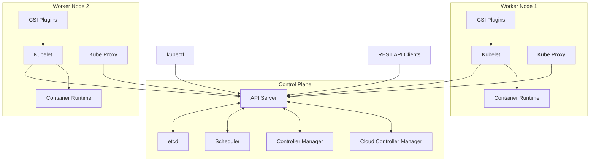

## Kubernetes Architecture

Kubernetes (K8s) follows a master-worker architecture pattern, consisting of a control plane (master) and worker nodes. This distributed system is designed to orchestrate containerized applications across a cluster of machines, automating deployment, scaling, and operations of application containers.

The architecture is highly modular, with each component having a specific role in the cluster's operation. This design enables high availability, scalability, and resilience, making Kubernetes suitable for production environments of any size.

## Control Plane Components

The control plane is the brain of Kubernetes, responsible for maintaining the desired state of the cluster. It makes global decisions about the cluster and detects and responds to cluster events.

::steps
### API Server (kube-apiserver)
- Central management point that exposes the Kubernetes API
- RESTful interface for all cluster operations
- Validates and processes API requests from various clients
- Acts as the frontend to the cluster's shared state
- Implements authentication, authorization, and admission control
- Scales horizontally by deploying multiple instances
- All communications with the cluster pass through the API server

### etcd
- Distributed key-value store that serves as Kubernetes' primary datastore
- Stores cluster configuration, state, and metadata
- Ensures consistency and high availability across the cluster
- Implements the Raft consensus algorithm for data replication
- Provides reliable watch functionality for state changes
- Typically runs as a cluster for redundancy (3, 5, or 7 nodes recommended)
- Critical component that requires regular backups

### Scheduler (kube-scheduler)
- Watches for newly created pods with no assigned node
- Assigns pods to nodes based on multiple factors
- Considers resource requirements, hardware/software constraints
- Implements complex scheduling algorithms for optimal placement
- Respects taints, tolerations, node affinity, and anti-affinity rules
- Makes binding decisions that are stored in etcd
- Can be customized or replaced with custom schedulers

### Controller Manager (kube-controller-manager)
- Runs controller processes as a single binary
- Manages node lifecycle and responds to node failures
- Includes Node Controller, Replication Controller, Endpoints Controller
- Maintains the correct number of pods for each deployment
- Handles node failures and corrective actions
- Creates default accounts and API access tokens
- Reconciles observed cluster state with desired state
- Different controllers handle different resource types

### Cloud Controller Manager (cloud-controller-manager)
- Interfaces with underlying cloud provider APIs
- Manages cloud-specific control loops
- Handles node lifecycle in cloud environments
- Manages load balancers, routes, and storage
- Enables cloud providers to integrate with Kubernetes
- Separates cloud-provider-specific code from core Kubernetes
- Only present when running Kubernetes in a cloud environment
::

## Worker Node Components

Worker nodes are the machines that run containerized applications. They contain all the necessary services to manage the containers and communicate with the control plane.

::steps
### Kubelet
- Primary node agent that runs on every node
- Ensures containers are running in a Pod as expected
- Reports node and pod status to the API server regularly
- Takes PodSpecs from various sources (API server, file, HTTP endpoint)
- Monitors pod specifications and ensures they're running and healthy
- Manages container lifecycle, including startup, health checks, and termination
- Interfaces with the container runtime using the Container Runtime Interface (CRI)
- Handles volume mounts, secrets, and ConfigMap data

### Container Runtime
- Responsible for running containers on the node
- Usually containerd, CRI-O, or other CRI-compatible runtimes (Docker being phased out)
- Handles container operations (pulling images, starting/stopping containers)
- Manages container isolation, resource constraints, and networking
- Implements the Container Runtime Interface (CRI) specification
- Responsible for image management and storage
- Provides isolation and resource management features
- Handles container logging and monitoring

### Kube Proxy (kube-proxy)
- Network proxy that runs on each node
- Implements the Kubernetes Service concept
- Maintains network rules on the host
- Performs connection forwarding or load balancing
- Manages pod networking through iptables/IPVS rules
- Enables service discovery and load-balancing
- Handles service IP routing and port mapping
- Implements different proxy modes (iptables, IPVS, userspace)

### Container Storage Interface (CSI)
- Standardized interface for container storage plugins
- Enables storage vendors to develop plugins once for all container orchestrators
- Handles volume creation, attachment, mounting operations
- Supports dynamic provisioning of storage resources
- Enables advanced storage features like snapshots and cloning
- Decouples Kubernetes core from storage implementation details
::

## Basic Architecture Diagram



This diagram shows:
1. The control plane components and their interactions
2. Multiple worker nodes connecting to the API server
3. The components running on each worker node
4. External clients interacting with the cluster through the API server

## Communication Flow

The communication in a Kubernetes cluster follows a specific pattern that ensures consistency, security, and reliability:

1. **User Interaction**: User sends request to API Server using kubectl or direct API calls
   ```bash
   kubectl create deployment nginx --image=nginx
   ```

2. **Authentication & Authorization**: API Server authenticates the user and authorizes the request
   - Checks credentials, tokens, or certificates
   - Verifies RBAC permissions for the requested operation
   - Runs admission controllers to validate or modify the request

3. **Validation & Persistence**: API Server validates request and persists to etcd
   - Validates the object specifications
   - Converts the request to the internal API version
   - Stores the object in etcd as the source of truth
   - Returns success or failure response to user

4. **Controller Processing**: Controller Manager notices the new object
   - Deployment controller creates a ReplicaSet
   - ReplicaSet controller creates Pods
   - Sends Pod specifications to API Server

5. **Scheduling**: Scheduler assigns workload to appropriate nodes
   - Filters nodes based on resource requirements and constraints
   - Scores remaining nodes based on optimization criteria
   - Selects the best node and updates the Pod object
   - API Server stores the updated Pod with node assignment

6. **Node Operations**: Kubelet on the selected node executes the workload
   - Notices it has been assigned a new Pod
   - Pulls the necessary container images
   - Creates and starts containers via the container runtime
   - Monitors container health
   - Reports status back to API Server

7. **Networking**: Kube Proxy sets up networking
   - Updates local iptables/IPVS rules for service endpoints
   - Enables service discovery and load balancing
   - Manages pod-to-pod and pod-to-service communication

8. **Continuous Reconciliation**: Controllers continuously ensure desired state
   - Monitor actual state versus desired state
   - Take corrective actions when discrepancies are found
   - Update status in etcd via the API server

## High Availability

High availability (HA) is crucial for production Kubernetes clusters to ensure resilience against failures.

::alert{type="info"}
For production environments, implement these HA strategies:

1. **Multiple control plane nodes**
   - Run at least three control plane nodes (odd number to maintain quorum)
   - Distribute across failure domains (availability zones, racks)
   - Example stacked etcd topology:
     ```bash
     kubeadm init --control-plane-endpoint "LOAD_BALANCER_DNS:LOAD_BALANCER_PORT" \
       --upload-certs \
       --pod-network-cidr=192.168.0.0/16
     ```

2. **Distributed etcd cluster**
   - Configure etcd as a cluster with at least 3 nodes
   - Use external etcd topology for larger clusters
   - Ensure regular etcd backups
   - Example external etcd setup:
     ```bash
     # On etcd nodes
     kubeadm init phase etcd local --config=etcd-config.yaml
     
     # Then initialize control plane with external etcd
     kubeadm init --config=kubeadm-config.yaml
     ```

3. **Load balanced API servers**
   - Place a load balancer in front of API servers
   - Configure health checks to detect API server failures
   - Use TCP or HTTPS health checks on port 6443
   - Support session affinity for websocket connections

4. **Geographic distribution**
   - Spread nodes across multiple availability zones
   - Consider multi-region deployments for critical workloads
   - Use anti-affinity rules to distribute workloads
   - Implement proper network latency considerations

5. **Worker node redundancy**
   - Run multiple worker nodes
   - Ensure critical workloads have multiple replicas
   - Use Pod Disruption Budgets to maintain availability during maintenance
   - Example PodDisruptionBudget:
     ```yaml
     apiVersion: policy/v1
     kind: PodDisruptionBudget
     metadata:
       name: app-pdb
     spec:
       minAvailable: 2  # or maxUnavailable: 1
       selector:
         matchLabels:
           app: critical-service
     ```

6. **Backup and recovery procedures**
   - Regular etcd backups (recommended every 30 minutes)
   - Snapshot etcd data:
     ```bash
     ETCDCTL_API=3 etcdctl --endpoints=https://127.0.0.1:2379 \
       --cacert=/etc/kubernetes/pki/etcd/ca.crt \
       --cert=/etc/kubernetes/pki/etcd/healthcheck-client.crt \
       --key=/etc/kubernetes/pki/etcd/healthcheck-client.key \
       snapshot save /backup/etcd-snapshot-$(date +%Y-%m-%d_%H:%M:%S).db
     ```
   - Document and test restoration procedures
:: 