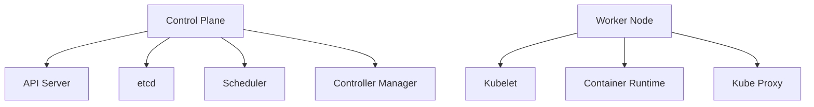

## Kubernetes Architecture

Kubernetes follows a master-worker architecture pattern, consisting of a control plane (master) and worker nodes.

## Control Plane Components

::steps
### API Server
- Central management point
- RESTful interface for cluster
- Validates and processes API requests

### etcd
- Distributed key-value store
- Stores cluster configuration
- Ensures consistency across cluster

### Scheduler
- Watches for new pods
- Assigns pods to nodes
- Considers resources, constraints

### Controller Manager
- Runs controller processes
- Manages node lifecycle
- Handles node failures
::

## Worker Node Components

::steps
### Kubelet
- Primary node agent
- Ensures containers running
- Reports node and pod status

### Container Runtime
- Runs containers
- Usually Docker/containerd
- Handles container operations

### Kube Proxy
- Network proxy
- Implements Service concept
- Manages pod networking
::

## Basic Architecture Diagram

## Communication Flow

1. User sends request to API Server
2. API Server validates request
3. etcd stores configuration
4. Scheduler assigns workload
5. Controller Manager ensures state
6. Kubelet executes on node

## High Availability

::alert{type="info"}
For production environments:
- Multiple control plane nodes
- Distributed etcd cluster
- Load balanced API servers
- Geographic distribution
:: 