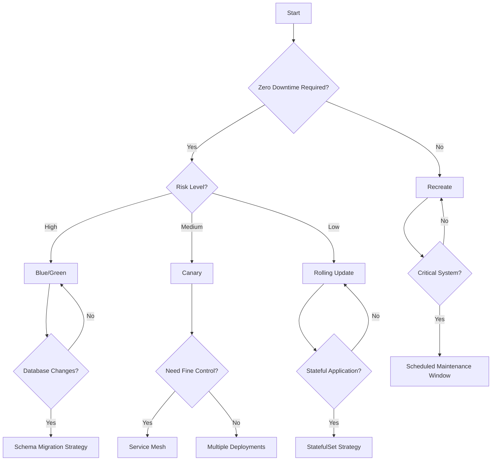

## Kubernetes Deployment Strategies

Deployment strategies in Kubernetes define how updates are rolled out to your applications, balancing between availability, stability, and user experience. The right deployment strategy is crucial for minimizing downtime, maintaining application performance, and reducing the risk of failures during updates.

Deployment strategies address several key concerns:
- How to handle in-flight requests during updates
- How to minimize or eliminate downtime
- How to validate new versions before full deployment
- How to quickly roll back if problems are detected
- How to manage database schema changes alongside application updates

## Basic Deployment Types

::steps
### Rolling Updates
- **Default strategy**: Kubernetes uses this by default for Deployment resources
- **Gradually replaces pods**: Updates pods one by one or in small batches
- **No downtime**: Traffic continues flowing to available pods during update
- **Configurable surge and unavailability**: Control how many pods can be added or unavailable
- **Automatic rollback on failure**: Reverts to previous version if health checks fail
- **Resource efficient**: Only requires minimal extra resources during transition
- **Suitable for**: Most application updates with backward compatibility
- **Limitations**: Runs both old and new versions simultaneously during transition

### Recreate
- **Terminates all pods at once**: Removes entire old version in a single operation
- **Creates new pods after termination**: Deploys new version only after old version is gone
- **Causes downtime**: Period between old version termination and new version readiness
- **Simple but disruptive**: Easiest to implement but impacts availability
- **Useful for major version changes**: Good when versions cannot coexist
- **Resource efficient**: No overlap in resource usage between versions
- **Suitable for**: Dev/test environments, breaking changes, schema migrations
- **Limitations**: Guaranteed downtime during the update process
::

## Rolling Update Strategy

The Rolling Update strategy gradually replaces instances of the old version with the new version, maintaining availability throughout the process.

```yaml
apiVersion: apps/v1
kind: Deployment
metadata:
  name: nginx-deployment
spec:
  replicas: 5
  strategy:
    type: RollingUpdate
    rollingUpdate:
      maxSurge: 1        # How many pods can be created above desired number
      maxUnavailable: 1  # How many pods can be unavailable during update
  selector:
    matchLabels:
      app: nginx
  template:
    metadata:
      labels:
        app: nginx
    spec:
      containers:
      - name: nginx
        image: nginx:1.16.1
        ports:
        - containerPort: 80
        readinessProbe:     # Ensures traffic only routes to ready pods
          httpGet:
            path: /healthz
            port: 80
          initialDelaySeconds: 5
          periodSeconds: 10
        resources:
          requests:
            memory: "64Mi"
            cpu: "100m"
          limits:
            memory: "128Mi"
            cpu: "200m"
```

How rolling updates work:
1. A new ReplicaSet is created with the updated pod template
2. Pods are gradually added to the new ReplicaSet and removed from the old one
3. The rate of replacement is controlled by `maxSurge` and `maxUnavailable`
4. Traffic is only routed to pods that pass their readiness probes
5. The update completes when all pods are running the new version

Tuning your rolling update:
- Set `maxSurge: 0, maxUnavailable: 1` for conservative updates (one at a time)
- Set `maxSurge: 50%, maxUnavailable: 0` to ensure full capacity during updates
- Set `maxSurge: 100%, maxUnavailable: 0` for fastest updates with full capacity

## Recreate Strategy

::alert{type="warning"}
Use Recreate strategy when your application doesn't support running multiple versions simultaneously or requires a complete refresh:

```yaml
apiVersion: apps/v1
kind: Deployment
metadata:
  name: database-deployment
spec:
  replicas: 3
  strategy:
    type: Recreate  # All pods will be terminated before new ones are created
  selector:
    matchLabels:
      app: database
  template:
    metadata:
      labels:
        app: database
    spec:
      containers:
      - name: database
        image: postgres:13
        env:
        - name: POSTGRES_PASSWORD
          valueFrom:
            secretKeyRef:
              name: db-credentials
              key: password
        ports:
        - containerPort: 5432
```

Common scenarios for using Recreate strategy:
1. Database schema migrations that aren't backward compatible
2. Application versions with incompatible APIs
3. Stateful applications that cannot run multiple instances
4. Dev/test environments where downtime is acceptable
5. Complete infrastructure refreshes
::

## Advanced Deployment Strategies

::steps
### Blue/Green Deployment
- **Run two identical environments**: Maintain parallel production-ready deployments
- **One environment active (blue)**: Serves all production traffic initially
- **Deploy to inactive environment (green)**: Update and test completely before exposure
- **Switch traffic when ready**: Instant cutover by updating service selector
- **Easy rollback**: Simply switch back to previous environment if issues occur
- **Higher resource usage**: Requires double the resources during transition
- **Zero downtime**: No service interruption during the switch
- **Complete testing**: Fully validate new version before traffic switch
- **All-or-nothing transition**: No gradual rollout, entire traffic switches at once
- **Best for**: Critical applications where testing in isolation is important

### Canary Deployment
- **Release to subset of users**: Initially expose new version to limited traffic
- **Gradually increase traffic**: Slowly adjust percentage as confidence grows
- **Monitor for issues**: Collect metrics and errors from canary deployment
- **Roll back if problems detected**: Minimal impact if issues occur
- **Minimizes risk for new features**: Tests in production with limited exposure
- **Real user validation**: Tests with actual production traffic
- **Fine-grained control**: Adjust traffic percentages precisely
- **Lower resource overhead**: Only needs resources for the canary portion
- **Progressive rollout**: Continue increasing traffic until 100% migration
- **Best for**: Features that benefit from gradual user exposure and real-world testing
::

## Blue/Green with Services

The Blue/Green deployment strategy involves maintaining two identical environments, only one of which receives production traffic at any time.

```yaml
# Service pointing to blue deployment
apiVersion: v1
kind: Service
metadata:
  name: my-app
  labels:
    app: my-app
spec:
  selector:
    app: my-app
    version: blue  # Initially points to blue
  ports:
  - port: 80
    targetPort: 8080

---
# Blue Deployment (current production)
apiVersion: apps/v1
kind: Deployment
metadata:
  name: my-app-blue
spec:
  replicas: 3
  selector:
    matchLabels:
      app: my-app
      version: blue
  template:
    metadata:
      labels:
        app: my-app
        version: blue
    spec:
      containers:
      - name: my-app
        image: my-app:1.0.0
        ports:
        - containerPort: 8080
        readinessProbe:
          httpGet:
            path: /health
            port: 8080
          initialDelaySeconds: 10
          periodSeconds: 5

---
# Green Deployment (new version)
apiVersion: apps/v1
kind: Deployment
metadata:
  name: my-app-green
spec:
  replicas: 3
  selector:
    matchLabels:
      app: my-app
      version: green
  template:
    metadata:
      labels:
        app: my-app
        version: green
    spec:
      containers:
      - name: my-app
        image: my-app:1.1.0
        ports:
        - containerPort: 8080
        readinessProbe:
          httpGet:
            path: /health
            port: 8080
          initialDelaySeconds: 10
          periodSeconds: 5
```

Implementation steps for Blue/Green deployment:
1. Create both blue and green deployments (blue serving production)
2. Validate the green deployment with testing and verification
3. Switch traffic by updating the service selector from blue to green:
   ```bash
   kubectl patch service my-app -p '{"spec":{"selector":{"version":"green"}}}'
   ```
4. Monitor the green deployment for any issues
5. If problems occur, switch back to blue for immediate rollback
6. Once confident, decommission the old blue environment or keep it for the next update

Blue/Green deployments can also be implemented with Ingress controllers or service meshes for more sophisticated traffic management.

## Canary with Kubernetes

Canary deployments allow you to test new versions with a subset of users before full rollout, significantly reducing risk.

::steps
### Using Multiple Deployments
```yaml
# Main deployment (stable version)
apiVersion: apps/v1
kind: Deployment
metadata:
  name: my-app-stable
spec:
  replicas: 9  # 90% of traffic
  selector:
    matchLabels:
      app: my-app
      version: stable
  template:
    metadata:
      labels:
        app: my-app
        version: stable
    spec:
      containers:
      - name: my-app
        image: my-app:1.0.0
        resources:
          requests:
            memory: "64Mi"
            cpu: "100m"
          limits:
            memory: "128Mi"
            cpu: "200m"
        livenessProbe:
          httpGet:
            path: /health
            port: 8080
          initialDelaySeconds: 30
          periodSeconds: 10

---
# Canary deployment (new version)
apiVersion: apps/v1
kind: Deployment
metadata:
  name: my-app-canary
spec:
  replicas: 1  # 10% of traffic
  selector:
    matchLabels:
      app: my-app
      version: canary
  template:
    metadata:
      labels:
        app: my-app
        version: canary
    spec:
      containers:
      - name: my-app
        image: my-app:1.1.0
        resources:
          requests:
            memory: "64Mi"
            cpu: "100m"
          limits:
            memory: "128Mi"
            cpu: "200m"
        livenessProbe:
          httpGet:
            path: /health
            port: 8080
          initialDelaySeconds: 30
          periodSeconds: 10

---
# Service selecting both deployments
apiVersion: v1
kind: Service
metadata:
  name: my-app
spec:
  selector:
    app: my-app  # Matches both stable and canary
  ports:
  - port: 80
    targetPort: 8080
```

Canary deployment process with native Kubernetes:
1. Deploy the stable version with desired number of replicas (e.g., 9)
2. Deploy the canary version with a small number of replicas (e.g., 1)
3. Both deployments have the same app label, so the service routes to both
4. Traffic split is proportional to the number of pods (e.g., 90% stable, 10% canary)
5. Monitor the canary deployment for errors, performance issues, etc.
6. If successful, gradually increase the canary replicas and decrease stable replicas
7. If issues arise, delete or scale down the canary deployment

Limitations of this approach:
- Traffic split is based on pod count, which can be imprecise
- Cannot target specific users or requests for canary testing
- Limited to percentage-based routing without fine-grained control

### Using Service Mesh
```yaml
# Istio destination rules defining subsets
apiVersion: networking.istio.io/v1alpha3
kind: DestinationRule
metadata:
  name: my-app
spec:
  host: my-app
  subsets:
  - name: v1
    labels:
      version: stable
  - name: v2
    labels:
      version: canary

---
# Istio virtual service for canary
apiVersion: networking.istio.io/v1alpha3
kind: VirtualService
metadata:
  name: my-app
spec:
  hosts:
  - my-app
  http:
  - route:
    - destination:
        host: my-app-stable
        subset: v1
      weight: 90
    - destination:
        host: my-app-canary
        subset: v2
      weight: 10
```

Advanced canary with Istio enables:
- Precise traffic control with exact percentages
- User-specific canary targeting (e.g., specific regions or user groups)
- HTTP header-based routing for internal testing
- Gradual traffic shifting with fine-grained control
- Automated rollbacks based on metrics
- More sophisticated deployment patterns
::

## A/B Testing Strategy

A/B testing is a technique for comparing two versions of an application to determine which performs better against specific business metrics. Unlike canary deployments (which focus on technical validation), A/B testing targets business outcomes.

```yaml
apiVersion: networking.istio.io/v1alpha3
kind: VirtualService
metadata:
  name: my-app
spec:
  hosts:
  - my-app.example.com
  http:
  - match:
    - headers:
        cookie:
          regex: "^(.*?;)?(user=test)(;.*)?$"
    route:
    - destination:
        host: my-app-b
        subset: v2
  - match:
    - headers:
        user-agent:
          regex: ".*Mobile.*"
    route:
    - destination:
        host: my-app-b
        subset: v2
  - route:
    - destination:
        host: my-app-a
        subset: v1
```

Key components of A/B testing:
1. **Selection criteria**: Routes specific users to different versions based on:
   - Cookies or session IDs
   - Geographic regions
   - Device types
   - User demographics
   - Random sampling
   
2. **Metrics collection**: Tracks business metrics such as:
   - Conversion rates
   - Time spent on page
   - Click-through rates
   - Cart size
   - Revenue per user
   
3. **Statistical analysis**: Determines which version performs better
   - Requires sufficient sample size
   - Controls for confounding variables
   - Tests for statistical significance
   
4. **Duration**: Typically runs longer than canary deployments
   - Days or weeks rather than hours
   - Needs enough time to collect meaningful data
   
A/B testing typically requires integration with analytics platforms to measure business impact effectively.

## Shadow Deployment

::alert{type="info"}
Shadow deployments (also called "traffic mirroring" or "dark launches") send a copy of production traffic to a new version without affecting users. This allows testing with real-world traffic patterns while eliminating risk to users.

```yaml
apiVersion: networking.istio.io/v1alpha3
kind: VirtualService
metadata:
  name: my-app
spec:
  hosts:
  - my-app.example.com
  http:
  - route:
    - destination:
        host: my-app-v1  # All user traffic goes to v1
    mirror:
      host: my-app-v2    # Copy of traffic sent to v2
    mirrorPercentage:
      value: 100.0       # Percentage of traffic to mirror (100% = all)
```

Shadow deployment benefits:
1. **Real production traffic**: Tests with actual user patterns and data volumes
2. **Zero user impact**: Responses from shadow service are discarded
3. **Performance testing**: Validates capacity and response times under real load
4. **Bug detection**: Identifies issues with real-world inputs before affecting users
5. **Data comparison**: Allows side-by-side comparison of results between versions

Implementation considerations:
- Ensure the shadow deployment can handle production-level traffic
- Modify the shadow service to prevent duplicate side effects (e.g., emails, payments)
- Set up comprehensive monitoring to compare performance metrics
- Consider database implications if both versions write to the same database
- Be aware of the additional resource requirements for handling mirrored traffic
::

## Deployment Tools and Solutions

::steps
### Helm
- **Package manager**: Bundle Kubernetes resources into reusable charts
- **Template-based releases**: Parameterize manifests for different environments
- **Version tracking**: Maintain history of releases and configurations
- **Predefined deployment hooks**: Run jobs before/after install, upgrade, delete
- **Easy rollbacks**: Revert to previous versions with simple commands
- **Dependency management**: Handle relationships between charts
- **Configurable values**: Override defaults with values files or command-line flags
- **Plugin ecosystem**: Extend functionality with custom plugins
- **Release testing**: Validate deployments with test hooks
- **Large chart repository**: Leverage community-maintained packages

### Argo CD
- **GitOps controller**: Sync Kubernetes resources from Git repositories
- **Declarative deployments**: Define desired state in Git
- **Automated syncing**: Detect and apply changes automatically
- **Progressive delivery**: Support for blue/green and canary deployments
- **Visualization of deployments**: Web UI for deployment status and history
- **Multi-cluster management**: Deploy to multiple clusters from one control plane
- **SSO integration**: Connect to enterprise identity providers
- **RBAC controls**: Fine-grained access control for teams
- **Health assessment**: Track application health across environments
- **Automated rollbacks**: Revert to last known good state when health checks fail
- **Webhook integration**: Trigger workflows from external events

### Flagger
- **Progressive delivery operator**: Automate canary, A/B, and blue/green deployments
- **Automated canary releases**: Gradually shift traffic based on metrics
- **Metric-based promotion**: Use Prometheus metrics to determine success
- **Multiple deployment strategies**: Support for various advanced deployment patterns
- **Service mesh integration**: Works with Istio, Linkerd, App Mesh, NGINX, Skipper
- **Webhook notifications**: Alert teams of deployment events
- **Custom metrics**: Define application-specific success criteria
- **Failure detection**: Automatically roll back failed deployments
- **Traffic shaping**: Fine-grained control over request routing
- **Load testing hooks**: Integrate with load testing tools during canary analysis
::

## Rollbacks

Effective rollback strategies are essential for minimizing impact when deployments don't go as planned. Kubernetes provides built-in capabilities for reverting to previous versions.

```bash
# View rollout history
kubectl rollout history deployment/my-app
# Sample output:
# REVISION  CHANGE-CAUSE
# 1         <none>
# 2         kubectl set image deployment/my-app my-app=my-app:1.1.0
# 3         kubectl set image deployment/my-app my-app=my-app:1.2.0

# View details of a specific revision
kubectl rollout history deployment/my-app --revision=2

# Rollback to previous version
kubectl rollout undo deployment/my-app

# Rollback to specific revision
kubectl rollout undo deployment/my-app --to-revision=2

# Monitor rollback status
kubectl rollout status deployment/my-app

# Pause a problematic rollout before rolling back
kubectl rollout pause deployment/my-app
kubectl rollout undo deployment/my-app
kubectl rollout resume deployment/my-app
```

Best practices for effective rollbacks:
1. **Record deployment changes**: Use `--record` flag or annotations to track change reasons
2. **Set appropriate revision history limits**: Configure `spec.revisionHistoryLimit` to balance history vs resource usage
3. **Test rollbacks regularly**: Practice rollbacks as part of deployment testing
4. **Consider database compatibility**: Ensure app versions are compatible with current database schema
5. **Use readiness probes**: Prevent traffic to pods that aren't ready after rollback
6. **Monitor closely**: Watch application metrics during and after rollbacks
7. **Automate when possible**: Implement automatic rollbacks based on health metrics

## Progressive Delivery with Flagger

Flagger is a Kubernetes operator that automates canary deployments and progressive delivery. It can manage traffic shifting, metrics analysis, and automatic promotion or rollback without manual intervention.

```yaml
apiVersion: flagger.app/v1beta1
kind: Canary
metadata:
  name: my-app
spec:
  # Reference to the deployment to be updated
  targetRef:
    apiVersion: apps/v1
    kind: Deployment
    name: my-app
  # Deployment progresses deadline (in seconds)
  progressDeadlineSeconds: 60
  # Service mesh provider configuration
  provider: istio
  # Service configuration (optional)
  service:
    port: 80
    targetPort: 8080
    # Istio gateways (optional)
    gateways:
    - public-gateway.istio-system.svc.cluster.local
    # Istio virtual service host names (optional)
    hosts:
    - app.example.com
  # Metrics analysis configuration
  analysis:
    # Schedule interval for metrics analysis
    interval: 30s
    # Number of failed checks before rollback
    threshold: 10
    # Maximum traffic percentage routed to canary
    maxWeight: 50
    # Percentage increment step for canary traffic
    stepWeight: 5
    # Metrics to analyze
    metrics:
    - name: request-success-rate
      threshold: 99
      interval: 1m
    - name: request-duration
      threshold: 500
      interval: 1m
    # Testing hooks (optional)
    webhooks:
    - name: load-test
      url: http://flagger-loadtester.test/
      timeout: 5s
      metadata:
        cmd: "hey -z 1m -q 10 -c 2 http://my-app-canary.test:80/"
```

Flagger's progressive delivery process:
1. **Initialization**: Creates a canary deployment and related resources
2. **Analysis**: Runs metric checks according to the analysis configuration
3. **Promotion**: Gradually increases traffic to the canary if metrics are healthy
4. **Finalization**: Promotes canary to primary when all analysis is successful
5. **Rollback**: Automatically reverts if metrics fail to meet thresholds

The process visualized:
- Start: Primary 100%, Canary 0%
- Step 1: Primary 95%, Canary 5% - analyze metrics
- Step 2: Primary 90%, Canary 10% - analyze metrics
- Step 3: Primary 85%, Canary 15% - analyze metrics
- ... continue until ...
- Final Step: Primary 50%, Canary 50% - analyze metrics
- Promotion: Primary (now with new version) 100%, Canary 0%

Flagger works with multiple service mesh and ingress providers:
- Istio
- Linkerd
- AWS App Mesh
- NGINX Ingress
- Contour
- Gloo
- Open Service Mesh

## Best Practices

::alert{type="warning"}
1. **Use readiness probes to ensure only healthy pods receive traffic**
   - Implement application-specific health checks
   - Set appropriate timeouts and thresholds
   - Include dependency checks when relevant
   - Use startup probes for slow-starting applications

2. **Implement proper health checks for accurate deployment status**
   - Create endpoints that verify critical functionality
   - Include deep health checks that verify database connectivity
   - Distinguish between liveness (restart) and readiness (traffic) concerns
   - Consider separate endpoints for different health aspects

3. **Set appropriate resource requests and limits**
   - Base resources on actual application needs
   - Leave headroom for traffic spikes
   - Consider startup resource requirements
   - Avoid CPU throttling during deployment transitions
   - Test with production-like workloads

4. **Monitor deployments with appropriate metrics**
   - Track error rates, latency, and throughput
   - Monitor both system and business metrics
   - Set up alerts for deployment-related anomalies
   - Use distributed tracing for service dependencies
   - Implement custom application metrics for business logic

5. **Automate rollbacks based on key performance indicators**
   - Define clear thresholds for acceptable performance
   - Implement automated monitoring during deployment
   - Create alerting for critical metrics
   - Set up auto-rollback triggers for severe issues
   - Balance sensitivity vs. false positives

6. **Test deployment strategies in non-production environments**
   - Create production-like staging environments
   - Simulate real-world traffic patterns
   - Test both successful deployments and failures
   - Practice manual and automated rollbacks
   - Include database migrations in testing

7. **Use deployment strategies that match application architecture**
   - Consider stateful vs. stateless requirements
   - Evaluate microservices dependencies
   - Account for database schema changes
   - Match strategy to business requirements for availability
   - Consider traffic patterns and user impact

8. **Document deployment procedures and rollback plans**
   - Create detailed runbooks for deployments
   - Document expected behavior during updates
   - Define clear rollback criteria and procedures
   - Keep historical records of deployment outcomes
   - Update documentation after incidents or changes

## Feature Flags

Feature flags (also called feature toggles) are a powerful technique that decouples deployment from feature release, allowing teams to modify system behavior without changing code.

::steps
### Benefits
- **Decouple deployment from release**: Deploy code without exposing features
- **Gradual feature rollout**: Enable features for increasing percentages of users
- **A/B testing capabilities**: Compare different implementations side by side
- **Kill switch for problematic features**: Disable features quickly without rollbacks
- **User segmentation**: Target specific user groups, regions, or customer tiers
- **Testing in production**: Validate with real users while limiting exposure
- **Continuous delivery**: Ship code frequently with less risk
- **Experimentation culture**: Test hypotheses with minimal overhead

### Implementation
```yaml
# Using SMI TrafficSplit for feature flagging
apiVersion: split.smi-spec.io/v1alpha1
kind: TrafficSplit
metadata:
  name: my-app-split
spec:
  service: my-app
  backends:
  - service: my-app-v1  # Version without new feature
    weight: 80          # 80% of traffic
  - service: my-app-v2  # Version with new feature
    weight: 20          # 20% of traffic
```

### Feature Flag Implementations
```yaml
# ConfigMap-based feature flag
apiVersion: v1
kind: ConfigMap
metadata:
  name: feature-flags
data:
  flags: |
    {
      "newUIEnabled": true,
      "experimentalSearch": false,
      "betaCheckout": {
        "enabled": true,
        "percentage": 25,
        "allowedUsers": ["user1", "user2"]
      }
    }
```

### Feature Flag Management
- **Dedicated services**: LaunchDarkly, Split.io, Flagsmith, Unleash
- **Application libraries**: Internal feature flag frameworks
- **Infrastructure approaches**: Traffic splitting at network level
- **Testing strategies**: Automated tests with different flag combinations
- **Flag lifecycle**: Creation, testing, rollout, cleanup
::

## Deployment Verification

::alert{type="info"}
Verify deployments with:
1. **Automated testing**
   - Integration tests against deployed services
   - End-to-end tests validating critical user journeys
   - Contract tests ensuring API compatibility
   - Smoke tests for basic functionality validation
   - Security and compliance validation

2. **Synthetic monitoring**
   - Simulated user transactions at regular intervals
   - Critical path monitoring for core functions
   - Cross-region availability checking
   - Third-party integration verification
   - Continuous validation post-deployment

3. **Real user monitoring**
   - Actual user experience tracking
   - Page load and transaction times
   - User journey completion rates
   - Client-side error reporting
   - Geographic performance distribution

4. **Error rate tracking**
   - HTTP error code frequency and types
   - Application exceptions and stack traces
   - Dependency failure rates
   - Correlation with deployment events
   - Comparison to historical baselines

5. **Performance metrics**
   - Request latency (p50, p95, p99)
   - Throughput and transaction rates
   - Resource utilization (CPU, memory, network)
   - Database query performance
   - Cache hit/miss ratios

6. **Business KPIs**
   - Conversion rates
   - Cart abandonment
   - Session duration
   - Revenue impact
   - Customer satisfaction metrics
::

## Deployment Anti-patterns

::steps
### Common Mistakes
- **No rollback strategy**
  - Failing to plan for failures
  - Not testing rollback procedures
  - Irreversible changes without mitigation
  - Missing version history
  - Inadequate backup procedures

- **Missing health checks**
  - Superficial liveness probes
  - No readiness probes for traffic control
  - Failing to check critical dependencies
  - Improper timeouts and thresholds
  - Lack of startup probes for slow applications

- **Inadequate monitoring**
  - Insufficient metrics collection
  - Missing alerts for critical thresholds
  - Poor visibility into deployment progress
  - No correlation between deployments and issues
  - Lack of user impact metrics

- **Resource constraints**
  - Insufficient CPU/memory for new version
  - No headroom for traffic spikes during transition
  - Missing resource limits (causing node issues)
  - Pod disruption during node resource pressure
  - Failure to account for init container resources

- **Not testing deployment process**
  - Untested deployment scripts
  - Production-only deployment patterns
  - Missing rehearsals for critical updates
  - Failure to simulate realistic conditions
  - Inadequate testing of failure scenarios

- **Ignoring database migrations**
  - Schema changes incompatible with running code
  - No backward compatibility planning
  - Missing migration rollback procedures
  - Data integrity risks during deployment
  - Failing to test migrations with production-scale data

- **Lack of automated verification**
  - Missing post-deployment validation
  - No smoke tests after deployment
  - Manual verification of success criteria
  - Inconsistent validation procedures
  - Inadequate test coverage for critical paths

- **Manual approval bottlenecks**
  - Unnecessary human intervention
  - Unclear approval criteria
  - Long wait times for sign-offs
  - No delegation of approval authority
  - Deployment delays during off-hours
::

## Choosing a Strategy

When selecting a deployment strategy, consider your application requirements, infrastructure capabilities, and business constraints. The following decision tree can help guide your choice:



Key factors to consider when choosing a deployment strategy:

1. **Application Architecture**
   - Stateless vs. stateful components
   - Microservices dependencies
   - Data persistence requirements
   - API compatibility between versions

2. **Infrastructure Capabilities**
   - Kubernetes version and features
   - Service mesh availability
   - Resource constraints
   - Multi-cluster options

3. **Business Requirements**
   - Acceptable downtime windows
   - Risk tolerance
   - User impact sensitivity
   - Regulatory compliance needs
   - Release frequency goals

4. **Team Capabilities**
   - Operational experience
   - Monitoring maturity
   - Automation level
   - Incident response readiness
