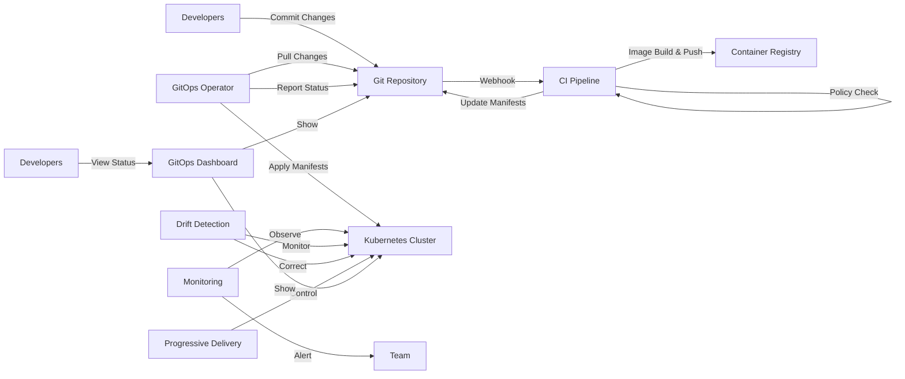

## GitOps Fundamentals

GitOps is an operational framework that applies DevOps best practices for application deployment and infrastructure automation to Kubernetes using Git as the single source of truth. This approach combines Infrastructure as Code (IaC) principles with Git workflows to manage cluster configurations and application deployments declaratively.

Key aspects that make GitOps distinctive:
- Git repositories as the canonical source of truth for the entire system
- Declarative descriptions of the desired infrastructure and applications
- Automated synchronization between Git state and cluster state
- Pull-based deployment model (versus traditional push-based CI/CD)
- Continuous reconciliation between desired and actual system state

## Core GitOps Principles

::steps
### Declarative Configuration
- **Infrastructure defined as code**: All infrastructure components expressed as code
- **Desired state explicitly declared**: Specify what you want, not how to get there
- **Environment configuration versioned**: All environments described in version control
- **Self-documenting systems**: Configuration serves as documentation
- **No imperative operations**: Avoid direct cluster changes (no kubectl apply)
- **Idempotent operations**: Same input always produces same result
- **Configuration drift prevention**: System automatically returns to desired state
- **Environment parity**: Same configuration approach across all environments

### Version Controlled
- **Git as single source of truth**: All changes must go through Git
- **Complete history of changes**: Full audit trail of what changed, when, and by whom
- **Audit trail for compliance**: Meet regulatory requirements with immutable history
- **Easy rollbacks to previous states**: Revert to any previous working configuration
- **Collaborative workflows**: Use PRs, code reviews, and approvals for changes
- **Branch-based environments**: Map Git branches to deployment environments
- **Change verification**: Validate changes before applying to the cluster
- **Immutable change records**: Cannot modify history after changes are applied

### Automated Delivery
- **Continuous reconciliation**: Controllers constantly compare desired vs. actual state
- **Pull-based deployments**: Cluster pulls configuration from Git, not pushed by CI
- **Self-healing systems**: Automatic correction of unauthorized changes
- **Drift detection and correction**: Identify and fix configuration drift
- **Consistent deployment patterns**: Same deployment process for all applications
- **Reduced human error**: Minimize manual intervention in deployment process
- **Increased reliability**: Reproducible, tested deployments
- **Separation of delivery from deployment**: CI builds artifacts, GitOps deploys them
::

## GitOps Tools Landscape

::alert{type="info"}
Popular GitOps tools for Kubernetes:
1. **Flux CD** - CNCF graduated project that supports multi-tenancy and Helm
   - Highly extensible with custom controllers and APIs
   - Native Helm and Kustomize support
   - Notification system for alerts and events
   - Multi-cluster and multi-tenant capabilities
   - Progressive delivery with Flagger integration

2. **ArgoCD** - Declarative GitOps tool with rich UI and RBAC
   - Web UI with visualization of application state
   - SSO integration and fine-grained RBAC
   - Application of Apps pattern for managing multiple applications
   - Support for multiple config management tools (Helm, Kustomize, Jsonnet)
   - Health status assessment for Kubernetes resources

3. **Jenkins X** - CI/CD solution built around GitOps
   - Integrated CI/CD pipeline automation
   - Preview environments for pull requests
   - Automated versioning and release management
   - ChatOps integration for team collaboration
   - Built-in secret management

4. **Gimlet** - Simplifies GitOps with templates and validations
   - Template-based application manifests
   - Environment promotion workflows
   - Validation gates for deployments
   - GitOps dashboard for visibility
   - Compatible with existing CI tools

5. **Weave GitOps** - Enterprise GitOps platform with policy controls
   - Policy-as-code integration
   - Cluster fleet management
   - Advanced progressive delivery
   - Compliance reporting and auditing
   - Enterprise support and services
::

## Implementing Flux CD

```yaml
# Install Flux CLI
# brew install fluxcd/tap/flux

# Bootstrap Flux on your cluster
flux bootstrap github \
  --owner=my-github-username \
  --repository=my-fleet-infra \
  --branch=main \
  --path=clusters/my-cluster \
  --personal

# This bootstrap command:
# 1. Creates a repository if it doesn't exist
# 2. Generates deploy keys with read/write access
# 3. Installs Flux components in the cluster
# 4. Configures Flux to sync the specified path in the repository

# Example Flux Kustomization
apiVersion: kustomize.toolkit.fluxcd.io/v1beta2
kind: Kustomization
metadata:
  name: apps
  namespace: flux-system
spec:
  # Reconcile every 10 minutes
  interval: 10m0s
  # Path within the Git repository
  path: ./apps
  # Remove resources that are no longer in Git
  prune: true
  # Wait for resources to be ready
  wait: true
  # Timeout for resource readiness
  timeout: 5m
  # Source to pull from
  sourceRef:
    kind: GitRepository
    name: flux-system
  # Health checks for deployed resources
  healthChecks:
    - apiVersion: apps/v1
      kind: Deployment
      name: frontend
      namespace: default
  # Validation with strategic merge or JSON patches
  patches:
    - patch: |
        apiVersion: apps/v1
        kind: Deployment
        metadata:
          name: backend
        spec:
          template:
            metadata:
              annotations:
                environment: production
      target:
        kind: Deployment
        name: backend
```

The Flux architecture consists of several components working together:
1. **Source Controller**: Manages repositories (Git, Helm, OCI, etc.)
2. **Kustomize Controller**: Reconciles resources from sources 
3. **Helm Controller**: Manages Helm releases
4. **Notification Controller**: Handles events and alerts
5. **Image Automation Controller**: Updates container images automatically

## Implementing ArgoCD

::steps
### Installation
```bash
# Install ArgoCD in your cluster
kubectl create namespace argocd
kubectl apply -n argocd -f https://raw.githubusercontent.com/argoproj/argo-cd/stable/manifests/install.yaml

# Access ArgoCD UI
kubectl port-forward svc/argocd-server -n argocd 8080:443

# Get the initial admin password
kubectl -n argocd get secret argocd-initial-admin-secret -o jsonpath="{.data.password}" | base64 -d

# Install ArgoCD CLI
brew install argocd

# Login to ArgoCD
argocd login localhost:8080 --username admin --password <password>

# Add a Git repository
argocd repo add https://github.com/your-org/your-repo.git --username <username> --password <password>
```

### Application Definition
```yaml
apiVersion: argoproj.io/v1alpha1
kind: Application
metadata:
  name: guestbook
  namespace: argocd
  # Optional finalizer to cascade delete resources
  finalizers:
    - resources-finalizer.argocd.argoproj.io
spec:
  # The project the application belongs to
  project: default
  
  # Source repository and configuration
  source:
    # Git repository URL containing manifests
    repoURL: https://github.com/argoproj/argocd-example-apps.git
    # Revision to use (branch, tag, commit hash)
    targetRevision: HEAD
    # Path within the repository
    path: guestbook
    
    # Optional - If using Kustomize
    kustomize:
      namePrefix: prod-
      images:
      - gcr.io/my-repo/my-image:v1.0.0
    
    # Optional - If using Helm
    # helm:
    #   releaseName: guestbook
    #   valueFiles:
    #   - values.yaml
    #   values: |
    #     ingress:
    #       enabled: true
    #     replicaCount: 3
  
  # Destination cluster and namespace
  destination:
    # Target cluster - https://kubernetes.default.svc refers to the same cluster
    server: https://kubernetes.default.svc
    # Target namespace for the application
    namespace: guestbook
  
  # Sync policy and options
  syncPolicy:
    automated:
      # Automatically delete resources that no longer exist in Git
      prune: true
      # Automatically sync when drift is detected
      selfHeal: true
      # Only allow auto-sync from specific branches
      allowEmpty: false
    # Additional options
    syncOptions:
    - CreateNamespace=true
    - PrunePropagationPolicy=foreground
    - PruneLast=true
    
  # Ignore differences in specific fields
  ignoreDifferences:
  - group: apps
    kind: Deployment
    jsonPointers:
    - /spec/replicas
```

### App of Apps Pattern
```yaml
# Parent application managing multiple child applications
apiVersion: argoproj.io/v1alpha1
kind: Application
metadata:
  name: app-of-apps
  namespace: argocd
spec:
  project: default
  source:
    repoURL: https://github.com/my-org/gitops-repo.git
    targetRevision: HEAD
    path: apps
  destination:
    server: https://kubernetes.default.svc
    namespace: argocd
  syncPolicy:
    automated:
      prune: true
      selfHeal: true
```
::

## Repository Structure

A well-structured GitOps repository is crucial for maintainability and scalability. Here's a comprehensive structure that works well for multi-environment deployments:

```
fleet-infra/
├── clusters/                     # Cluster-specific configurations
│   ├── production/               # Production cluster
│   │   ├── apps.yaml             # References to applications for this cluster
│   │   ├── infrastructure.yaml   # References to infrastructure components
│   │   └── flux-system/          # Flux installation manifests
│   │       ├── gotk-components.yaml
│   │       └── gotk-sync.yaml
│   └── staging/                  # Staging cluster
│       ├── apps.yaml
│       ├── infrastructure.yaml
│       └── flux-system/
│           ├── gotk-components.yaml
│           └── gotk-sync.yaml
├── infrastructure/               # Shared infrastructure components
│   ├── sources/                  # External Helm repositories and Git sources
│   │   ├── bitnami.yaml          # Bitnami Helm repository
│   │   └── podinfo.yaml          # Git repository for podinfo
│   ├── monitoring/               # Monitoring stack
│   │   ├── kustomization.yaml    # Kustomize configuration
│   │   ├── grafana/
│   │   │   ├── dashboards/       # Grafana dashboards
│   │   │   ├── datasources/      # Grafana datasources
│   │   │   └── deployment.yaml
│   │   └── prometheus/
│   │       ├── alerts/           # Prometheus alert rules
│   │       └── deployment.yaml
│   └── networking/               # Networking components
│       ├── kustomization.yaml
│       ├── ingress-nginx/        # Ingress controller
│       └── cert-manager/         # Certificate management
└── apps/                         # Application definitions
    ├── base/                     # Base configurations (shared across environments)
    │   └── podinfo/              # Example application
    │       ├── kustomization.yaml
    │       ├── deployment.yaml
    │       ├── service.yaml
    │       ├── hpa.yaml          # Horizontal Pod Autoscaler
    │       └── configmap.yaml    # Configuration
    └── overlays/                 # Environment-specific overrides
        ├── production/           # Production-specific configurations
        │   ├── kustomization.yaml
        │   └── podinfo-patch.yaml  # Patches for production
        └── staging/              # Staging-specific configurations
            ├── kustomization.yaml
            └── podinfo-patch.yaml  # Patches for staging
```

This structure follows key organizational principles:

1. **Separation of concerns**: Infrastructure, applications, and cluster configurations are separate
2. **DRY (Don't Repeat Yourself)**: Base configurations are reused across environments
3. **Environment parity**: Consistent structure between environments
4. **Progressive delivery**: Clear path for promoting changes between environments
5. **Team boundaries**: Can be extended to support multiple teams with their own applications

For larger organizations, you might extend this structure with:
- Team-specific directories
- Multiple Git repositories for different teams or application groups
- Environment-specific repositories for stricter access control
- Policy directories for governance and compliance rules

## Implementing GitOps Workflows

::alert{type="warning"}
Follow these steps for a successful GitOps workflow:
1. **Create a dedicated Git repository for Kubernetes manifests**
   - Use a separate repository from application code
   - Implement proper access controls and branch protection
   - Consider mono-repo vs multi-repo approach based on team structure
   - Set up signed commits for security

2. **Structure your repository for environments and applications**
   - Organize by environments (dev, staging, production)
   - Use a consistent directory structure
   - Implement configuration inheritance (base/overlays)
   - Document the repository structure and conventions

3. **Set up a GitOps operator in your cluster**
   - Install Flux or ArgoCD following best practices
   - Configure RBAC permissions appropriately
   - Set up proper credentials for Git access
   - Deploy the operator with high availability for production

4. **Configure reconciliation for your manifests**
   - Set appropriate sync intervals (balance responsiveness vs load)
   - Configure health checks and timeouts
   - Implement proper error handling and alerting
   - Set up pruning for resources that no longer exist in Git

5. **Implement PR workflows for changes**
   - Require code reviews for all changes
   - Set up CI validation of manifests (linting, policy checks)
   - Configure automated testing of changes
   - Implement approval gates for critical environments

6. **Set up notifications for sync events**
   - Configure alerting for failed syncs
   - Send deployment notifications to team channels
   - Track deployment metrics and history
   - Implement audit logging for compliance
   
7. **Establish deployment promotion processes**
   - Define clear paths from development to production
   - Implement automated or manual promotion gates
   - Document rollback procedures
   - Create emergency process for critical fixes
::

## Multi-Environment Management

Managing multiple environments in GitOps requires a structured approach to configuration inheritance and customization. Kustomize is a popular tool for this purpose, allowing you to define a base configuration and overlay environment-specific changes.

```yaml
# base/kustomization.yaml - Common configuration for all environments
apiVersion: kustomize.config.k8s.io/v1beta1
kind: Kustomization
resources:
- deployment.yaml
- service.yaml
- configmap.yaml
- serviceaccount.yaml

# base/deployment.yaml - Base deployment configuration
apiVersion: apps/v1
kind: Deployment
metadata:
  name: my-application
spec:
  replicas: 1  # Default value, will be overridden in environments
  selector:
    matchLabels:
      app: my-application
  template:
    metadata:
      labels:
        app: my-application
    spec:
      containers:
      - name: app
        image: my-application:latest  # Will be overridden
        resources:
          requests:
            memory: "128Mi"
            cpu: "100m"
          limits:
            memory: "256Mi"
            cpu: "200m"

# overlays/staging/kustomization.yaml - Staging environment customization
apiVersion: kustomize.config.k8s.io/v1beta1
kind: Kustomization
bases:
- ../../base
patchesStrategicMerge:
- deployment-patch.yaml
resources:
- horizontalpodautoscaler.yaml  # Staging-specific resource
namePrefix: staging-            # Prefixes all resource names
namespace: staging              # Places all resources in this namespace
commonLabels:                   # Adds these labels to all resources
  environment: staging
  team: backend
images:                         # Sets specific image versions
- name: my-application
  newName: my-registry/my-application
  newTag: v1.2.3-beta

# overlays/staging/deployment-patch.yaml - Specific changes for staging
apiVersion: apps/v1
kind: Deployment
metadata:
  name: my-application
spec:
  replicas: 2  # Staging uses 2 replicas
  template:
    spec:
      containers:
      - name: app
        env:
        - name: LOG_LEVEL
          value: "debug"
        - name: FEATURE_FLAGS
          value: "new-ui=true,experimental=true"

# overlays/production/kustomization.yaml - Production environment customization
apiVersion: kustomize.config.k8s.io/v1beta1
kind: Kustomization
bases:
- ../../base
patchesStrategicMerge:
- deployment-patch.yaml
resources:
- pdb.yaml                      # Production-specific PodDisruptionBudget
- networkpolicy.yaml            # Production-specific NetworkPolicy
namePrefix: production-
namespace: production
commonLabels:
  environment: production
  team: backend
images:
- name: my-application
  newName: my-registry/my-application
  newTag: v1.2.0-stable         # Production uses stable version

# overlays/production/deployment-patch.yaml - Specific changes for production
apiVersion: apps/v1
kind: Deployment
metadata:
  name: my-application
spec:
  replicas: 5  # Production uses 5 replicas
  strategy:
    rollingUpdate:
      maxSurge: 1
      maxUnavailable: 0
  template:
    metadata:
      annotations:
        prometheus.io/scrape: "true"
        prometheus.io/port: "8080"
    spec:
      containers:
      - name: app
        resources:
          requests:
            memory: "512Mi"
            cpu: "200m"
          limits:
            memory: "1Gi"
            cpu: "500m"
        env:
        - name: LOG_LEVEL
          value: "info"
        - name: FEATURE_FLAGS
          value: "new-ui=false,experimental=false"
```

Key multi-environment management strategies:
1. **Configuration inheritance**: Define common configuration once
2. **Environment-specific customization**: Override only what differs
3. **Resource scaling**: Adjust replica counts and resource limits per environment
4. **Feature toggling**: Use environment variables or config maps to enable/disable features
5. **Promotion workflow**: Clear path for promoting changes between environments
6. **Namespacing**: Isolate environments in separate namespaces
7. **Labeling**: Consistent labeling for filtering and selection

## Secrets Management

Managing secrets in GitOps workflows presents a unique challenge: how to store sensitive information in Git without exposing credentials. Several solutions address this problem, each with different trade-offs.

::steps
### Sealed Secrets
Sealed Secrets, developed by Bitnami, uses asymmetric encryption to securely store secrets in Git.

```yaml
# Install kubeseal
# brew install kubeseal

# Install the Sealed Secrets controller in your cluster
kubectl apply -f https://github.com/bitnami-labs/sealed-secrets/releases/download/v0.19.1/controller.yaml

# Create a sealed secret
kubectl create secret generic db-creds \
  --from-literal=username=admin \
  --from-literal=password=t0p-s3cr3t \
  --dry-run=client -o yaml | \
kubeseal --format yaml > sealed-db-creds.yaml

# Example sealed secret
apiVersion: bitnami.com/v1alpha1
kind: SealedSecret
metadata:
  name: db-creds
  namespace: default
  # These annotations control the scope of secret decryption
  annotations:
    sealedsecrets.bitnami.com/cluster-wide: "false"
    sealedsecrets.bitnami.com/namespace-wide: "false"
spec:
  encryptedData:
    password: AgBy8hCi...truncated
    username: AgCtr7nk...truncated
  template:
    metadata:
      name: db-creds
      namespace: default
    type: Opaque
```

How Sealed Secrets works:
1. The controller generates a private/public key pair
2. `kubeseal` encrypts secrets with the public key
3. Only the controller can decrypt secrets using the private key
4. Encrypted secrets can be safely stored in Git
5. The controller automatically decrypts and creates Kubernetes secrets

Best practices for Sealed Secrets:
- Back up the controller's private key regularly
- Consider scope limitations (strict, namespace-wide, or cluster-wide)
- Set up proper RBAC for who can create and use sealed secrets
- Consider key rotation policies

### SOPS Integration
Mozilla SOPS (Secrets OPerationS) is a more flexible encryption tool that supports multiple key management systems.

```yaml
# Install SOPS
# brew install sops

# Create a GPG key for encryption
gpg --full-generate-key

# Example .sops.yaml configuration file
creation_rules:
  - path_regex: .*.yaml
    encrypted_regex: ^(data|stringData)$
    pgp: FINGERPRINT_HERE  # Replace with your GPG key fingerprint
    # Alternative: Use AWS KMS, GCP KMS, Azure Key Vault, etc.
    # kms: 'arn:aws:kms:us-west-2:111122223333:key/1234abcd-12ab-34cd-56ef-1234567890ab'

# Encrypt a Kubernetes secret
sops --encrypt --in-place secret.yaml

# Example encrypted secret with SOPS
apiVersion: v1
kind: Secret
metadata:
    name: database-credentials
type: Opaque
data:
    # Values are encrypted inline by SOPS
    username: ENC[AES256_GCM,data:sO3j2YrZ,iv:Gh32,tag:gGH=,type:str]
    password: ENC[AES256_GCM,data:yQ7cPNxoQw==,iv:JHF1,tag:1l70,type:str]
sops:
    kms: []
    gcp_kms: []
    azure_kv: []
    hc_vault: []
    age: []
    lastmodified: "2023-04-18T19:02:44Z"
    mac: ENC[AES256_GCM,data:LnBhv12F+g==,iv:LxYS,tag:vS6D,type:str]
    pgp:
        - created_at: "2023-04-18T19:02:03Z"
          enc: |
            -----BEGIN PGP MESSAGE-----
            [... encrypted content ...]
            -----END PGP MESSAGE-----
          fp: 1234ABCD1234ABCD1234ABCD1234ABCD12345678

# Usage with Flux
apiVersion: kustomize.toolkit.fluxcd.io/v1beta2
kind: Kustomization
metadata:
  name: secrets
  namespace: flux-system
spec:
  # Enable SOPS decryption
  decryption:
    provider: sops
    secretRef:
      name: sops-gpg  # Secret containing the private key
  path: ./secrets
  prune: true
  sourceRef:
    kind: GitRepository
    name: flux-system

# Create the GPG key secret for Flux
gpg --export-secret-keys --armor FINGERPRINT_HERE |
kubectl create secret generic sops-gpg \
  --namespace=flux-system \
  --from-file=sops.asc=/dev/stdin
```

SOPS advantages:
- Support for multiple key management systems (PGP, AWS KMS, GCP KMS, Azure Key Vault, etc.)
- Partial file encryption (only encrypt specific values)
- Works with various file formats (YAML, JSON, ENV, INI)
- Can be integrated with multiple GitOps tools
- More flexible than Sealed Secrets for complex scenarios
- Better for multi-environment setups with different keys per environment

### External Secrets Operator
For production environments, you might want to use a dedicated external secret management system.

```yaml
# Install External Secrets Operator
kubectl apply -f https://github.com/external-secrets/external-secrets/releases/download/v0.6.1/external-secrets.yaml

# Configure a SecretStore (AWS Secrets Manager example)
apiVersion: external-secrets.io/v1beta1
kind: SecretStore
metadata:
  name: aws-secretsmanager
  namespace: default
spec:
  provider:
    aws:
      service: SecretsManager
      region: us-east-1
      auth:
        secretRef:
          accessKeyIDSecretRef:
            name: aws-credentials
            key: access-key-id
          secretAccessKeySecretRef:
            name: aws-credentials
            key: secret-access-key

# Define an ExternalSecret
apiVersion: external-secrets.io/v1beta1
kind: ExternalSecret
metadata:
  name: database-credentials
  namespace: default
spec:
  refreshInterval: "15m"
  secretStoreRef:
    name: aws-secretsmanager
    kind: SecretStore
  target:
    name: database-credentials
    creationPolicy: Owner
  data:
  - secretKey: username
    remoteRef:
      key: database/credentials
      property: username
  - secretKey: password
    remoteRef:
      key: database/credentials
      property: password
```

External Secrets Operator advantages:
- Secrets stored in specialized external systems (HashiCorp Vault, AWS Secrets Manager, GCP Secret Manager, etc.)
- No encryption/decryption in Git repository
- Centralized secrets management with existing enterprise tools
- Automatic secret rotation and versioning
- Audit trail and access controls from the secret management system
- Works well with existing secrets management processes
::


## Progressive Delivery

Progressive delivery extends continuous delivery with controlled, gradual deployment strategies. In a GitOps context, it ensures safer production deployments by limiting the blast radius of potential issues.

```yaml
# Flagger with Flux for progressive delivery
apiVersion: flagger.app/v1beta1
kind: Canary
metadata:
  name: podinfo
  namespace: test
  annotations:
    flagger.app/slack-channel: "#deployments"
    flagger.app/slack-user: "flagger"
spec:
  # Reference to the service to be deployed
  targetRef:
    apiVersion: apps/v1
    kind: Deployment
    name: podinfo
  # Deployment progress deadline (timeout)
  progressDeadlineSeconds: 60
  # Service mesh provider
  provider: istio
  # Service configuration
  service:
    port: 80          # Container port number or name
    targetPort: 9898  # Container port to forward traffic
    # Istio gateways (optional)
    gateways:
    - public-gateway.istio-system.svc.cluster.local
    # Istio virtual service host names (optional)
    hosts:
    - podinfo.example.com
  # Metrics analysis configuration
  analysis:
    # Schedule interval for metrics analysis
    interval: 30s
    # Number of failed checks before rollback
    threshold: 10
    # Maximum traffic percentage routed to canary
    maxWeight: 50
    # Percentage increment step for canary traffic
    stepWeight: 5
    # Metrics to analyze
    metrics:
    - name: request-success-rate  # Percentage of successful requests
      thresholdRange:
        min: 99                   # Minimum acceptable success rate
      interval: 1m                # Metrics collection interval
    - name: request-duration      # Request duration in milliseconds
      thresholdRange:
        max: 500                  # Maximum acceptable latency
      interval: 1m
    # Webhook for integration testing during canary analysis
    webhooks:
    - name: acceptance-test
      type: pre-rollout           # Executed before routing traffic to canary
      url: http://flagger-loadtester.test/
      timeout: 30s
      metadata:
        type: bash
        cmd: "curl -sd 'test' http://podinfo-canary:9898/token | grep token"
    - name: load-test
      type: rollout               # Executed during canary analysis
      url: http://flagger-loadtester.test/
      timeout: 5s
      metadata:
        cmd: "hey -z 1m -q 10 -c 2 http://podinfo-canary.test:9898/"
    - name: slack-notification
      type: post-rollout          # Executed after the canary analysis
      url: http://flagger-slack-hook.kube-system/
      timeout: 5s
```

## Monitoring GitOps Processes

Effective monitoring is crucial for GitOps operations, providing visibility into reconciliation processes and identifying issues before they impact users.

::steps
### Observability Setup
- **Prometheus metrics for reconciliation**: Track sync status, duration, and error rates
- **Grafana dashboards for visualization**: Visualize deployment frequency, success rates, and MTTR
- **Alert rules for failed syncs**: Notify teams when reconciliation fails
- **Audit logging for all operations**: Record who changed what and when
- **Status reporting via Git**: Update deployment status in Git (commit status, PR comments)
- **Health checks for deployed applications**: Verify application functionality post-deployment
- **SLO/SLI tracking**: Monitor service level objectives for deployments
- **Distributed tracing**: Track reconciliation process across components

### Notification Controller
```yaml
# Flux notification provider for Slack
apiVersion: notification.toolkit.fluxcd.io/v1beta1
kind: Provider
metadata:
  name: slack
  namespace: flux-system
spec:
  type: slack
  channel: gitops-notifications  # Slack channel name
  address: https://hooks.slack.com/services/YOUR/SLACK/WEBHOOK  # For non-secret config
  secretRef:
    name: slack-url  # Reference to a secret containing the webhook URL
---
# Secret containing the Slack webhook URL
apiVersion: v1
kind: Secret
metadata:
  name: slack-url
  namespace: flux-system
stringData:
  address: https://hooks.slack.com/services/YOUR/SLACK/WEBHOOK
---
# Alert configuration for a specific application
apiVersion: notification.toolkit.fluxcd.io/v1beta1
kind: Alert
metadata:
  name: on-call-webapp
  namespace: flux-system
spec:
  providerRef:
    name: slack
  eventSeverity: info  # Minimum severity to trigger alerts (info, error)
  eventSources:        # Resources to watch for events
    - kind: GitRepository
      name: webapp
    - kind: Kustomization
      name: webapp
    - kind: HelmRelease
      name: webapp
  exclusionList:       # Regex patterns to exclude from alerting
    - ".*upgrade.*succeeded.*"
  inclusionList:       # Regex patterns to specifically include (optional)
    - ".*error.*"
    - ".*failed.*"
  suspend: false       # Whether to suspend this alert
---
# Example for Microsoft Teams notification
apiVersion: notification.toolkit.fluxcd.io/v1beta1
kind: Provider
metadata:
  name: teams
  namespace: flux-system
spec:
  type: msteams
  address: https://outlook.office.com/webhook/YOUR-TEAMS-WEBHOOK-URL
---
# Example for email notifications
apiVersion: notification.toolkit.fluxcd.io/v1beta1
kind: Provider
metadata:
  name: email
  namespace: flux-system
spec:
  type: smtp
  address: smtp.gmail.com:587
  username: sender@gmail.com
  secretRef:
    name: smtp-credentials
```

### Prometheus Metrics
```yaml
# Grafana dashboard ConfigMap example
apiVersion: v1
kind: ConfigMap
metadata:
  name: flux-dashboards
  namespace: monitoring
  labels:
    grafana_dashboard: "true"  # Label for Grafana to discover this dashboard
data:
  flux-control-plane.json: |
    {
      "annotations": { ... },
      "editable": true,
      "gnetId": null,
      "graphTooltip": 0,
      "id": 1,
      "links": [],
      "panels": [
        {
          "datasource": "Prometheus",
          "fieldConfig": { ... },
          "gridPos": { ... },
          "id": 1,
          "title": "Reconciliation Operations",
          "options": { ... },
          "targets": [
            {
              "expr": "sum(increase(gotk_reconcile_count{}[5m])) by (controller)",
              "interval": "",
              "legendFormat": "{{controller}}",
              "refId": "A"
            }
          ],
          "type": "timeseries"
        },
        {
          "datasource": "Prometheus",
          "fieldConfig": { ... },
          "gridPos": { ... },
          "id": 2,
          "title": "Reconciliation Duration",
          "options": { ... },
          "targets": [
            {
              "expr": "histogram_quantile(0.95, sum(rate(gotk_reconcile_duration_seconds_bucket{}[5m])) by (le, controller))",
              "interval": "",
              "legendFormat": "{{controller}} p95",
              "refId": "A"
            }
          ],
          "type": "timeseries"
        }
      ],
      "refresh": "10s",
      "schemaVersion": 30,
      "style": "dark",
      "tags": ["flux", "gitops"],
      "templating": { ... },
      "time": { ... },
      "timepicker": { ... },
      "timezone": "",
      "title": "Flux Control Plane",
      "uid": "flux-control-plane",
      "version": 1
    }
```
::

## Team Collaboration

::alert{type="info"}
Best practices for team collaboration:
1. **Use feature branches and pull requests**
   - Follow GitHub Flow or GitLab Flow for changes
   - Create short-lived feature branches
   - Use descriptive branch names (feature/add-redis, fix/memory-leak)
   - Request reviews from relevant team members
   - Squash or rebase commits for clean history

2. **Implement approval workflows for production changes**
   - Require minimum number of approvals for PRs
   - Set up protected branches for production environments
   - Implement required status checks before merging
   - Consider environment-specific approvers
   - Create change advisory board for critical changes

3. **Set up automated validation and policy checks**
   - Validate Kubernetes manifests for correctness
   - Run policy checks with OPA/Kyverno/Conftest
   - Verify security best practices
   - Check for resource requirements and limits
   - Validate against organizational standards

4. **Create team-specific namespaces and RBAC**
   - Isolate team resources in dedicated namespaces
   - Implement namespace-scoped permissions
   - Use service accounts with minimum privileges
   - Consider multi-tenancy solutions for larger organizations
   - Document RBAC policies for teams

5. **Document deployment patterns and standards**
   - Create templates for common application types
   - Document naming conventions and label standards
   - Maintain runbooks for operational procedures
   - Use READMEs in repository directories
   - Create onboarding guides for new team members

6. **Use tools like pre-commit hooks for validation**
   - Implement client-side checks before commits
   - Validate YAML syntax and formatting
   - Check for sensitive information (secrets)
   - Run linters for Kubernetes manifests
   - Enforce conventional commit messages
::

## Disaster Recovery

GitOps provides an effective disaster recovery strategy since your entire infrastructure and application configuration is stored in Git. Recovery becomes as simple as recreating your cluster and reconnecting it to the Git repository.

```bash
# GitOps facilitates disaster recovery
# 1. Recreate cluster infrastructure
# First, recreate your Kubernetes cluster using your infrastructure provisioning tool
# (Terraform, CloudFormation, etc.)

# 2. Install GitOps operator
# For Flux:
flux check --pre

# 3. Point to existing Git repository
# 4. System self-heals to desired state

# Example Flux bootstrap for recovery
flux bootstrap github \
  --owner=my-github-username \
  --repository=my-fleet-infra \
  --branch=main \
  --path=clusters/recovery-cluster \
  --personal

# Verify reconciliation status
flux get all

# Check resource creation
kubectl get pods -A

# Verify application health
kubectl get deployments -A
```

The disaster recovery process works because:
1. All configuration is stored in Git (infrastructure as code)
2. The GitOps operator knows how to reconcile the desired state
3. Resources are recreated in the correct order based on dependencies
4. State is continuously reconciled until it matches the Git repository

Key considerations for effective disaster recovery:
- Ensure all configuration is truly in Git with no manual cluster modifications
- Regularly test recovery procedures with disaster recovery drills
- Store critical secrets securely and include secret management in recovery plans
- Document recovery procedures thoroughly
- Consider multi-region and multi-cluster strategies for high availability
- Back up persistent volumes separately if applications have state
- Include proper RBAC and access management in recovery plans

## GitOps Security Considerations

Security is a critical aspect of GitOps implementations, as they control your entire infrastructure and application deployment pipeline.

::steps
### Security Practices
- **Use signed commits for manifest changes**
  - Enable GPG signing of all Git commits
  - Verify signatures in CI/CD pipelines
  - Set up branch protection rules requiring signed commits
  - Establish key management procedures for teams
  - Consider implementing The Update Framework (TUF) for more robust signing

- **Implement RBAC for Git repository access**
  - Restrict who can merge to production branches
  - Implement branch protection rules
  - Use separate repositories for sensitive configurations
  - Set up granular permissions for different environments
  - Audit repository access regularly

- **Scan manifests for misconfigurations**
  - Run security scanners in CI pipelines
  - Check for common Kubernetes security issues
  - Integrate tools like Checkov, kube-score, or Kubesec
  - Block merges for critical security issues
  - Generate security reports for review

- **Enforce policies with tools like Kyverno**
  - Implement policies as code
  - Enforce organizational standards
  - Create validation, mutation, and generation policies
  - Set up audit and enforcement modes
  - Regularly review and update policies

- **Use admission controllers for runtime validation**
  - Implement OPA Gatekeeper or Kyverno
  - Create custom admission webhooks when needed
  - Enable ValidatingAdmissionWebhooks
  - Configure PodSecurityPolicies or Pod Security Standards
  - Audit admission controller decisions

### Policy as Code
```yaml
# Example Kyverno policy
apiVersion: kyverno.io/v1
kind: ClusterPolicy
metadata:
  name: require-labels
  annotations:
    policies.kyverno.io/title: Require Labels
    policies.kyverno.io/category: Best Practices
    policies.kyverno.io/severity: medium
    policies.kyverno.io/description: >-
      Enforce organizational labels for resource ownership and management.
spec:
  validationFailureAction: enforce  # 'enforce' or 'audit'
  background: true  # Process existing resources
  rules:
  - name: check-team-label
    match:
      resources:
        kinds:
        - Deployment
        - StatefulSet
        - DaemonSet
    validate:
      message: "The label 'team' is required to identify resource ownership"
      pattern:
        metadata:
          labels:
            team: "?*"  # Requires non-empty string
            
---
# Example requiring resource limits
apiVersion: kyverno.io/v1
kind: ClusterPolicy
metadata:
  name: require-resource-limits
spec:
  validationFailureAction: enforce
  background: true
  rules:
  - name: validate-resources
    match:
      resources:
        kinds:
        - Deployment
        - StatefulSet
    validate:
      message: "Resource limits are required for CPU and memory"
      pattern:
        spec:
          template:
            spec:
              containers:
                - name: "*"
                  resources:
                    limits:
                      memory: "?*"
                      cpu: "?*"
```

### Security Tooling Integration
```yaml
# Example Flux pipeline with security scanning
apiVersion: source.toolkit.fluxcd.io/v1beta2
kind: GitRepository
metadata:
  name: podinfo
  namespace: flux-system
spec:
  interval: 5m
  url: https://github.com/stefanprodan/podinfo
  ref:
    branch: master
---
apiVersion: kustomize.toolkit.fluxcd.io/v1beta2
kind: Kustomization
metadata:
  name: podinfo
  namespace: flux-system
spec:
  interval: 5m
  path: "./kustomize"
  prune: true
  sourceRef:
    kind: GitRepository
    name: podinfo
  validation: client
  postBuild:
    substituteFrom:
    - kind: ConfigMap
      name: security-policies
    substitute:
      scan_images: "true"
      block_severity: "CRITICAL"
```
::

## Continuous Improvement

::alert{type="warning"}
Metrics to track for GitOps maturity:
1. **Time from commit to deployment**
   - Measures efficiency of CI/CD pipeline
   - Should trend downward over time
   - Segment by environment and application type
   - Set SLOs for deployment time
   - Identify bottlenecks in the process

2. **Deployment frequency**
   - How often you deploy to production
   - Indicator of CI/CD and GitOps maturity
   - Higher frequency generally indicates better practices
   - Track trends over time
   - Compare across teams and applications

3. **Change failure rate**
   - Percentage of deployments causing incidents or rollbacks
   - Measure of deployment quality
   - Should decrease as GitOps practices mature
   - Categorize failures by root cause
   - Establish improvement targets

4. **Mean time to recovery**
   - Time to recover from failed deployments
   - Tests effectiveness of rollback mechanisms
   - Should decrease with GitOps implementation
   - Include in incident postmortems
   - Drive improvements with automation

5. **Drift detection rate**
   - Frequency of configuration drift from Git source
   - Indicates manual changes or system issues
   - Should approach zero in mature GitOps
   - Track source of drift (human vs. system)
   - Implement guardrails to prevent drift

6. **PR cycle time**
   - Time from PR creation to merge
   - Measures efficiency of review process
   - Break down by stages (review, approval, CI)
   - Identify bottlenecks in collaboration
   - Balance speed with quality

7. **Automation coverage**
   - Percentage of infrastructure managed by GitOps
   - Tracks progress of GitOps adoption
   - Set targets for increasing coverage
   - Identify manual processes for automation
   - Measure reduction in manual operations
::

## Best Practices

::steps
### GitOps Success Factors
- **Keep manifests DRY using Kustomize or Helm**
  - Avoid duplication across environments
  - Extract common configuration to base templates
  - Use overlays for environment-specific values
  - Parameterize with variables and values files
  - Create reusable components and patterns

- **Implement clear branch strategies**
  - Define trunk-based or GitFlow approach
  - Map branches to environments
  - Document branch protection rules
  - Define merge requirements
  - Create automated promotion workflows
  - Establish emergency hotfix procedures

- **Automate validation and testing**
  - Implement manifest validation in CI
  - Run policy compliance checks
  - Create test environments for changes
  - Use synthetic tests post-deployment
  - Monitor deployments for anomalies
  - Set up automated rollbacks for failures

- **Define clear ownership boundaries**
  - Use CODEOWNERS files in repositories
  - Implement team labels for resources
  - Create team-specific namespaces
  - Document responsibility matrices
  - Set up proper access controls
  - Establish escalation paths

- **Document reconciliation patterns**
  - Define standard reconciliation intervals
  - Document expected behavior for changes
  - Create troubleshooting guides
  - Set up alerting for reconciliation failures
  - Define SLOs for reconciliation time
  - Monitor drift and correction patterns

- **Build progressive delivery pipelines**
  - Implement canary deployments
  - Set up blue/green capabilities
  - Define success metrics for promotion
  - Automate rollbacks based on metrics
  - Create feature flag integration
  - Document traffic shifting patterns

- **Integrate security scanning**
  - Scan manifests for misconfigurations
  - Check container images for vulnerabilities
  - Enforce compliance policies
  - Implement secrets management
  - Create security gates in pipelines
  - Run periodic security audits

- **Implement continuous verification**
  - Create health checks for applications
  - Monitor key performance indicators
  - Set up SLOs and error budgets
  - Run chaos experiments
  - Test disaster recovery regularly
  - Verify security posture continuously
::

## Real-World Case Study

Here's an example of a comprehensive GitOps workflow in a production environment:



**Case Study: E-commerce Company Transition to GitOps**

A mid-sized e-commerce company with 20 microservices implemented GitOps to improve their deployment reliability and speed:

**Before GitOps:**
- Manual kubectl commands for deployments
- Ad-hoc changes to production
- Configuration drift between environments
- No clear audit trail of changes
- Slow recovery from incidents
- Limited deployment frequency (bi-weekly)

**GitOps Implementation:**
1. Created a structured monorepo for all Kubernetes manifests
2. Implemented Flux CD for automated synchronization
3. Set up Kustomize for environment-specific configurations
4. Integrated policy checks with OPA Gatekeeper
5. Implemented progressive delivery with Flagger
6. Created comprehensive monitoring with Prometheus and Grafana
7. Established team ownership with CODEOWNERS and namespaces

**Results:**
- Deployment frequency increased to multiple times per day
- Mean time to recovery reduced by 70%
- Configuration drift eliminated
- Complete audit trail for all changes
- Reduced production incidents by 45%
- Developer onboarding time reduced from days to hours
- Successful recovery from cluster failure in under 30 minutes

## Troubleshooting

::alert{type="info"}
Common GitOps issues and solutions:
1. **Reconciliation failures**: Check operator logs and Git connectivity
   ```bash
   # Check Flux controller logs
   kubectl -n flux-system logs deploy/source-controller
   kubectl -n flux-system logs deploy/kustomize-controller
   
   # Check Flux resources status
   flux get all
   flux get kustomizations --all-namespaces
   
   # Verify Git repository access
   flux reconcile source git flux-system
   ```

2. **Manifest errors**: Validate YAML syntax and resource specifications
   ```bash
   # Validate manifests locally
   kubectl apply --dry-run=client -f manifest.yaml
   
   # Use tools like kubeval
   kubeval --kubernetes-version 1.22.0 ./manifests/
   
   # Check for indentation and syntax errors
   yamllint ./manifests/
   
   # Debug Kustomize rendering
   kustomize build ./overlays/production/ | kubectl apply --dry-run=client -f -
   ```

3. **Permission issues**: Verify RBAC and service account permissions
   ```bash
   # Check if service account has required permissions
   kubectl auth can-i get deployments --as=system:serviceaccount:flux-system:kustomize-controller
   
   # Inspect role bindings
   kubectl get rolebindings,clusterrolebindings -o wide | grep flux-system
   
   # Check if namespace exists
   kubectl get ns target-namespace
   ```

4. **Secret management**: Ensure proper encryption and key management
   ```bash
   # Verify Sealed Secrets controller is running
   kubectl -n kube-system get pods -l app.kubernetes.io/name=sealed-secrets
   
   # Check SOPS integration
   flux -n flux-system get kustomizations
   
   # Validate secret references
   grep -r "secretRef" ./clusters/
   ```

5. **Drift detection**: Manually check for out-of-band changes
   ```bash
   # Force reconciliation to detect drift
   flux reconcile kustomization apps --with-source
   
   # Compare live state with Git state
   kubectl get deployment app -o yaml > live.yaml
   kustomize build ./apps/base/app > git.yaml
   diff live.yaml git.yaml
   ```

6. **Network problems**: Verify access to Git repositories and registries
   ```bash
   # Check if cluster can access Git
   kubectl -n flux-system exec -it deploy/source-controller -- \
     git ls-remote https://github.com/org/repo.git
   
   # Verify image registry access
   kubectl -n flux-system exec -it deploy/kustomize-controller -- \
     curl -I https://registry.example.com/v2/
   
   # Check for network policies blocking access
   kubectl get networkpolicies --all-namespaces
   ```

7. **Webhook integration issues**: Debug notification and webhook configurations
   ```bash
   # Check notification controller logs
   kubectl -n flux-system logs deploy/notification-controller
   
   # Verify provider configuration
   kubectl -n flux-system get providers
   
   # Test webhook manually
   curl -X POST -H "Content-Type: application/json" \
     -d '{"text":"Test message"}' \
     https://hooks.slack.com/services/YOUR/SLACK/WEBHOOK
   ```

8. **Resource sync ordering**: Handle dependencies between resources
   ```bash
   # Check for dependencies
   grep -r "dependsOn" ./clusters/
   
   # Force specific order with wait option
   kubectl -n flux-system edit kustomization apps
   # Add spec.wait: true
   ```
::