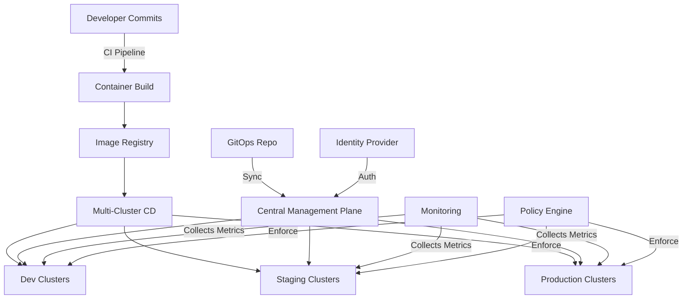

## Multi-Cluster Management

Multi-cluster management involves operating, securing, and deploying applications across multiple Kubernetes clusters, which may span different environments, regions, or cloud providers. This approach is increasingly important as organizations scale their Kubernetes footprint to address various technical, business, and compliance requirements.

Managing multiple clusters introduces complexity but provides significant benefits in terms of isolation, reliability, and geographical distribution. Effective multi-cluster management requires specialized tools, processes, and architectural approaches to maintain consistency and operational efficiency.

## Why Multiple Clusters

::steps
### Isolation Requirements
- **Environment segregation (dev/test/prod)**: Separate clusters for different stages of the application lifecycle
- **Team and project isolation**: Dedicated clusters for different teams or business units
- **Resource allocation boundaries**: Preventing resource contention between critical workloads
- **Fault domain isolation**: Limiting the blast radius of failures
- **Security and compliance separation**: Isolating workloads with different security requirements
- **Noisy neighbor prevention**: Avoiding performance impact from resource-intensive applications
- **Upgrade management**: Staggering upgrades to minimize risk
- **Testing cluster changes**: Validating Kubernetes version upgrades safely

### Geographic Distribution
- **Latency reduction for global users**: Placing workloads closer to users
- **Regional data compliance (GDPR, etc.)**: Meeting data sovereignty requirements
- **Disaster recovery capabilities**: Maintaining availability during regional outages
- **Local access to cloud services**: Using region-specific cloud services efficiently
- **Edge computing requirements**: Deploying to edge locations for IoT and low-latency applications
- **Traffic management**: Routing users to nearest cluster
- **Follow-the-sun operations**: Supporting global business operations
- **Regional scalability**: Scaling resources based on regional demand patterns

### Cloud Diversity
- **Avoid vendor lock-in**: Preventing dependency on a single cloud provider
- **Cost optimization across providers**: Leveraging pricing differences between clouds
- **Best-of-breed service utilization**: Using optimal services from each provider
- **Hybrid and multi-cloud strategies**: Combining on-premises and multiple cloud environments
- **Migration and portability options**: Enabling smoother migrations between providers
- **Provider-specific capabilities**: Leveraging unique features of different clouds
- **Risk mitigation**: Reducing impact of cloud provider outages
- **Specialized hardware access**: Using GPU/TPU offerings from different providers
::

## Management Challenges

::alert{type="warning"}
Managing multiple clusters introduces several challenges:
1. **Operational complexity**
   - Increased management overhead
   - More complex CI/CD pipelines
   - Higher operational knowledge requirements
   - Complex troubleshooting across cluster boundaries
   - Increased coordination requirements

2. **Configuration drift**
   - Maintaining consistency across clusters
   - Tracking differences between environments
   - Preventing unauthorized changes
   - Managing cluster-specific configurations
   - Synchronizing configuration updates

3. **Security policy enforcement**
   - Consistent security controls across clusters
   - Managing different security requirements per environment
   - Centralized audit and compliance reporting
   - Vulnerability management across clusters
   - Credential and secret management

4. **Application deployment consistency**
   - Ensuring identical application behavior
   - Managing environment-specific configurations
   - Coordinating deployments across clusters
   - Handling deployment failures gracefully
   - Maintaining version consistency

5. **Identity and access management**
   - Centralized authentication and authorization
   - Managing different RBAC policies per cluster
   - Federation of identities across environments
   - Service-to-service authentication
   - Managing service accounts across clusters

6. **Monitoring and observability**
   - Aggregating logs and metrics
   - End-to-end tracing across clusters
   - Unified alerting and dashboards
   - Performance comparison between clusters
   - Troubleshooting distributed applications

7. **Cost management**
   - Tracking expenses across multiple providers
   - Optimizing resource utilization
   - Implementing consistent cost controls
   - Attributing costs to teams and projects
   - Forecasting and budgeting accurately

8. **Cross-cluster networking**
   - Service discovery between clusters
   - Secure cross-cluster communication
   - Managing different networking models
   - DNS resolution across clusters
   - Load balancing across multiple clusters
::

## Multi-Cluster Management Tools

Several tools have emerged to address the challenges of multi-cluster management, with Cluster API being one of the most prominent for cluster lifecycle management.

```yaml
# Example of using a tool like Cluster API
apiVersion: cluster.x-k8s.io/v1beta1
kind: Cluster
metadata:
  name: my-cluster
  namespace: clusters
  labels:
    region: us-west
    environment: production
    owner: platform-team
  annotations:
    description: "Production cluster for Western region"
spec:
  clusterNetwork:
    pods:
      cidrBlocks: ["192.168.0.0/16"]  # Pod network CIDR
    services:
      cidrBlocks: ["10.96.0.0/12"]    # Service network CIDR
    serviceDomain: "cluster.local"    # Cluster DNS domain
  controlPlaneRef:
    apiVersion: controlplane.cluster.x-k8s.io/v1beta1
    kind: KubeadmControlPlane
    name: my-cluster-control-plane
  infrastructureRef:
    apiVersion: infrastructure.cluster.x-k8s.io/v1beta1
    kind: AWSCluster
    name: my-cluster
```

The Cluster API (CAPI) provides a declarative approach to cluster management with several key benefits:
- **Infrastructure abstraction**: Create clusters on any supported provider (AWS, Azure, GCP, vSphere, etc.)
- **Declarative lifecycle management**: Define and manage clusters as Kubernetes objects
- **GitOps compatibility**: Store cluster definitions in Git for consistent management
- **Provider-agnostic API**: Use the same tooling regardless of underlying infrastructure
- **Upgrade automation**: Perform rolling upgrades of cluster nodes
- **Machine management**: Control machine scaling, remediation, and updates

Other important components in a multi-cluster toolset include:
- **Configuration management tools**: Sync configurations across clusters
- **Service mesh solutions**: Enable cross-cluster service communication
- **Multi-cluster networking tools**: Connect cluster networks securely
- **Observability platforms**: Aggregate monitoring data from all clusters

## Cluster Management Platforms

::steps
### Kubernetes Federation
- **Kubefed for multi-cluster coordination**: Federated control plane for multiple clusters
- **Centralized configuration**: Manage configs from a single location
- **Propagation of resources**: Deploy workloads to multiple clusters
- **Cross-cluster service discovery**: Locate services across clusters
- **Challenges with version compatibility**: Handling different Kubernetes versions
- **Resource placement policies**: Control which clusters receive which resources
- **Federated types**: Support for various Kubernetes resources
- **Status aggregation**: Collect and display status from multiple clusters
- **Limitations**: Not as actively developed as other solutions

### Cluster API
- **Declarative cluster lifecycle management**: Define clusters as YAML manifests
- **Provider-agnostic provisioning**: Support for many infrastructure providers
- **Kubernetes-native APIs**: Use Kubernetes API conventions and tooling
- **Machine management abstraction**: Control individual machines or machine sets
- **Bootstrap and control plane flexibility**: Support different bootstrap mechanisms
- **Scaling automation**: Declarative scaling of node pools
- **Self-healing capabilities**: Automatic replacement of failed nodes
- **Upgrade orchestration**: Controlled rolling upgrades of cluster nodes
- **Community support**: Active development by the Kubernetes community

### Commercial Platforms
- **Red Hat Advanced Cluster Management**
  - Based on open source projects (Cluster API, Argo CD)
  - Policy-driven governance
  - Application lifecycle management
  - Observability features
  - Enterprise support

- **Rancher Multi-Cluster Management**
  - Multi-tenant cluster management
  - Centralized authentication
  - Unified RBAC across clusters
  - Integrated monitoring and logging
  - Catalog of applications

- **Google Anthos**
  - Hybrid/multi-cloud management
  - Service mesh integration
  - Config management
  - Policy controller
  - Cloud migration tools

- **Azure Arc**
  - Extends Azure services to any infrastructure
  - GitOps-based configuration
  - Azure security and governance
  - Azure monitoring integration
  - Support for Azure data services

- **VMware Tanzu Mission Control**
  - Centralized cluster lifecycle management
  - Policy-driven security and compliance
  - Integration with Tanzu portfolio
  - Data protection features
  - Enterprise-grade support
::

## Workload Distribution

Distributing workloads effectively across multiple clusters is a key aspect of multi-cluster management. Karmada is an open-source project that provides advanced workload distribution capabilities.

```yaml
# Example of multi-cluster workload with Karmada
apiVersion: apps.karmada.io/v1alpha1
kind: Deployment
metadata:
  name: nginx
  labels:
    app: nginx
    environment: production
spec:
  replicas: 2  # Total desired replicas across all clusters
  selector:
    matchLabels:
      app: nginx
  template:
    metadata:
      labels:
        app: nginx
    spec:
      containers:
      - image: nginx:1.19.3
        name: nginx
        ports:
        - containerPort: 80
        resources:
          requests:
            memory: "64Mi"
            cpu: "100m"
          limits:
            memory: "128Mi"
            cpu: "200m"
        readinessProbe:
          httpGet:
            path: /health
            port: 80
          initialDelaySeconds: 5
          periodSeconds: 10
---
apiVersion: policy.karmada.io/v1alpha1
kind: PropagationPolicy
metadata:
  name: nginx-propagation
spec:
  # Select resources to propagate
  resourceSelectors:
    - apiVersion: apps.karmada.io/v1alpha1
      kind: Deployment
      name: nginx
  # Define placement strategy
  placement:
    # Specify target clusters
    clusterAffinity:
      clusterNames:
        - cluster-1  # US East region
        - cluster-2  # US West region
    # Cluster labels can also be used for selection
    clusterSelector:
      matchLabels:
        environment: production
    # Control replica distribution
    replicaScheduling:
      replicaDivisionPreference: Weighted  # Weighted distribution
      replicaSchedulingType: Divided       # Split replicas across clusters
      weightPreference:
        staticWeightList:
          - targetCluster:
              clusterNames:
                - cluster-1
            weight: 1  # 25% of replicas (1/4)
          - targetCluster:
              clusterNames:
                - cluster-2
            weight: 3  # 75% of replicas (3/4)
    # Spread constraints
    spreadConstraints:
      - maxGroups: 2           # Maximum number of groups
        minGroups: 2           # Minimum number of groups
        spreadByField: region  # Spread by region label
```

Karmada provides several powerful workload distribution features:

1. **Resource propagation**: Deploy resources to multiple clusters from a single API
2. **Customization per cluster**: Override specific fields for each target cluster
3. **Replica scheduling**: Distribute replicas across clusters based on weights or other strategies
4. **Failover**: Automatically redistribute workloads when clusters become unavailable
5. **Resource interpretation**: Handle version differences between clusters
6. **Health monitoring**: Track application health across all clusters
7. **Cluster resource estimation**: Consider available resources when making placement decisions

Other workload distribution approaches include:
- **ArgoCD ApplicationSets**: Template-based multi-cluster application deployment
- **Fleet by Rancher**: GitOps-based workload distribution
- **KubeFed**: Federated deployment management
- **Managed services**: Cloud-provider tools like GKE Multi-cluster Services

## Configuration Management

::alert{type="info"}
Configuration across multiple clusters can be managed using:
1. **GitOps workflows with repository structure for clusters**
   - Single repository with directories for each cluster
   - Branch-based environments (main → production, staging → staging)
   - Pull request workflows for configuration changes
   - Automated validation and deployment
   - Audit trail for all configuration changes

2. **Configuration templating with Kustomize overlays**
   - Base configurations shared across clusters
   - Cluster-specific overlays for customization
   - Patching mechanism for environment-specific changes
   - Progressive configuration promotion
   - Configuration inheritance hierarchy

3. **Helm charts with values files per cluster**
   - Parameterized application templates
   - Cluster-specific values files
   - Built-in templating capabilities
   - Version-controlled chart upgrades
   - Dependency management between components

4. **Policy engines to enforce consistency**
   - OPA/Gatekeeper for policy enforcement
   - Kyverno for validation and mutation
   - Centrally defined policies
   - Audit and enforcement modes
   - Compliance reporting and remediation

5. **Centralized configuration services**
   - External configuration stores (Consul, etcd)
   - Dynamic configuration updates
   - Feature flag services
   - Secret management solutions
   - Configuration versioning and rollback
   
6. **Configuration drift detection**
   - Continuous reconciliation
   - Automated drift correction
   - Reporting on unauthorized changes
   - Compliance verification
   - State comparison tools

7. **Hierarchical namespaces**
   - Namespace inheritance (HNC)
   - Propagating configs to child namespaces
   - Team-based configuration ownership
   - Multi-tenancy support
   - Resource quotas at different levels
::

## GitOps for Multi-Cluster

GitOps provides a powerful approach for managing configuration across multiple clusters consistently. A well-structured GitOps repository can handle multiple clusters, environments, and applications with clear separation of concerns.

```
fleet-infra/
├── clusters/                              # Cluster-specific configurations
│   ├── cluster-1/                         # Production US East
│   │   ├── flux-system/                   # Flux bootstrap components
│   │   │   ├── gotk-components.yaml
│   │   │   └── gotk-sync.yaml
│   │   ├── infrastructure.yaml            # Infrastructure components for this cluster
│   │   ├── apps.yaml                      # Applications deployed to this cluster
│   │   └── cluster-config/                # Cluster-specific configurations
│   │       ├── network-policies.yaml
│   │       └── resource-quotas.yaml
│   ├── cluster-2/                         # Production US West
│   │   ├── flux-system/
│   │   ├── infrastructure.yaml
│   │   ├── apps.yaml
│   │   └── cluster-config/
│   └── cluster-3/                         # Development
│       ├── flux-system/
│       ├── infrastructure.yaml
│       ├── apps.yaml
│       └── cluster-config/
├── infrastructure/                        # Shared infrastructure components
│   ├── sources/                           # External Helm repositories and sources
│   │   ├── helm-repositories.yaml
│   │   └── git-repositories.yaml
│   ├── base/                              # Base infrastructure configurations
│   │   ├── monitoring/
│   │   │   ├── kube-prometheus-stack.yaml
│   │   │   └── dashboards/
│   │   ├── networking/
│   │   │   ├── ingress-nginx.yaml
│   │   │   └── cert-manager.yaml
│   │   └── security/
│   │       ├── sealed-secrets.yaml
│   │       └── policy-controller.yaml
│   └── overlays/                          # Environment-specific infrastructure configs
│       ├── production/
│       └── development/
└── apps/                                  # Application configurations
    ├── base/                              # Base application definitions
    │   ├── app-1/                         # Web application
    │   │   ├── kustomization.yaml
    │   │   ├── deployment.yaml
    │   │   ├── service.yaml
    │   │   └── configmap.yaml
    │   └── app-2/                         # API service
    │       ├── kustomization.yaml
    │       └── deployment.yaml
    └── overlays/                          # Cluster-specific application overlays
        ├── cluster-1/                     # Production US East configs
        │   ├── app-1/
        │   │   ├── kustomization.yaml
        │   │   └── patch.yaml             # Production-specific patches
        │   └── app-2/
        ├── cluster-2/                     # Production US West configs
        │   ├── app-1/
        │   └── app-2/
        └── cluster-3/                     # Development configs
            ├── app-1/
            └── app-2/
```

This structure follows several important GitOps principles for multi-cluster management:

1. **Single source of truth**: All configuration in one repository
2. **Cluster-specific directories**: Clear separation of cluster configurations
3. **Infrastructure/application separation**: Different lifecycles and ownership
4. **Base/overlay pattern**: Reuse common configurations across clusters
5. **Progressive delivery**: Promote changes from development to production
6. **Declarative configuration**: Everything defined as YAML manifests
7. **Automated synchronization**: Changes automatically applied to clusters

With this approach, teams can manage configuration changes across clusters using standard Git workflows:
- Pull requests for configuration changes
- Code reviews for validation
- Branch protection for critical environments
- Automated testing and validation
- Complete audit trail for all changes

## Identity Management

::steps
### Centralized Authentication
- **External identity provider integration**: Connect to enterprise identity systems
- **Single sign-on across clusters**: Unified login experience
- **Role-based access control (RBAC)**: Consistent access policies
- **Identity federation services**: Connect multiple identity sources
- **Audit logging for all clusters**: Track all authentication and authorization events
- **Just-in-time access provisioning**: Automated access management
- **Certificate management**: Handling user and service certificates
- **Multi-factor authentication**: Enhanced security for sensitive environments
- **Emergency access procedures**: Break-glass procedures for critical situations

### Example Configuration
```yaml
# Example with Dex as OIDC provider
apiVersion: v1
kind: ConfigMap
metadata:
  name: kube-apiserver
  namespace: kube-system
data:
  kube-apiserver.yaml: |
    apiVersion: v1
    kind: Pod
    metadata:
      name: kube-apiserver
      labels:
        component: kube-apiserver
        tier: control-plane
    spec:
      containers:
      - name: kube-apiserver
        image: k8s.gcr.io/kube-apiserver:v1.23.0
        command:
        - kube-apiserver
        - --oidc-issuer-url=https://dex.example.com        # OIDC provider URL
        - --oidc-client-id=kubernetes                      # Client ID for the OIDC provider
        - --oidc-username-claim=email                      # Which claim to use as the username
        - --oidc-groups-claim=groups                       # Which claim to use for user groups
        - --oidc-ca-file=/etc/kubernetes/ssl/dex-ca.crt    # CA cert for the OIDC provider
        - --oidc-required-claim=hd=example.com             # Required claims for authentication
        volumeMounts:
        - mountPath: /etc/kubernetes/ssl
          name: ssl-certs
      volumes:
      - name: ssl-certs
        hostPath:
          path: /etc/kubernetes/ssl
```

### RBAC Configuration with Groups
```yaml
# ClusterRole defining permissions
apiVersion: rbac.authorization.k8s.io/v1
kind: ClusterRole
metadata:
  name: app-viewer
rules:
- apiGroups: [""]
  resources: ["pods", "services", "configmaps"]
  verbs: ["get", "list", "watch"]
- apiGroups: ["apps"]
  resources: ["deployments", "statefulsets"]
  verbs: ["get", "list", "watch"]
---
# ClusterRoleBinding for a group from OIDC provider
apiVersion: rbac.authorization.k8s.io/v1
kind: ClusterRoleBinding
metadata:
  name: app-viewers
subjects:
- kind: Group
  name: app-team@example.com  # This matches the group from OIDC provider
  apiGroup: rbac.authorization.k8s.io
roleRef:
  kind: ClusterRole
  name: app-viewer
  apiGroup: rbac.authorization.k8s.io
```

### Multi-Cluster IAM with AWS IAM Authenticator
```yaml
# AWS IAM Authenticator ConfigMap
apiVersion: v1
kind: ConfigMap
metadata:
  name: aws-auth
  namespace: kube-system
data:
  mapRoles: |
    - rolearn: arn:aws:iam::123456789012:role/KubernetesAdmin
      username: kubernetes-admin
      groups:
        - system:masters
    - rolearn: arn:aws:iam::123456789012:role/DeveloperRole
      username: developer-{{ SessionName }}
      groups:
        - developers
  mapUsers: |
    - userarn: arn:aws:iam::123456789012:user/alice
      username: alice
      groups:
        - system:masters
    - userarn: arn:aws:iam::123456789012:user/bob
      username: bob
      groups:
        - developers
        - app-team
```
::

## Network Connectivity

Multi-cluster networking is one of the most challenging aspects of managing multiple Kubernetes clusters. Solutions like Submariner enable secure connectivity between clusters.

```yaml
# Example Submariner configuration
apiVersion: submariner.io/v1alpha1
kind: Submariner
metadata:
  name: submariner
  namespace: submariner-operator
  labels:
    app: submariner
    component: connectivity
spec:
  # Broker configuration for cluster connection
  broker: k8s                                            # Broker type (Kubernetes)
  brokerK8sApiServer: https://broker.example.com:6443    # Broker API server address
  brokerK8sApiServerToken: "token"                       # Authentication token
  brokerK8sCA: "ca-data"                                 # CA certificate data
  brokerK8sRemoteNamespace: "submariner-broker"          # Namespace in broker cluster
  
  # IPsec configuration
  ceIPSecNATTPort: 4500                                  # NAT-T port for IPsec
  ceIPSecIKEPort: 500                                    # IKE port for IPsec
  ceIPSecDebug: false                                    # Debug logging for IPsec
  ceIPSecPSK: "pre-shared-key"                           # Pre-shared key for authentication
  
  # General configuration
  namespace: "submariner-operator"                       # Namespace for Submariner components
  natEnabled: true                                       # Enable NAT traversal
  debug: false                                           # Enable debug logging
  colorCodes: "blue"                                     # Color coding for this cluster
  clusterID: "cluster-1"                                 # Unique cluster identifier
  serviceDiscoveryEnabled: true                          # Enable cross-cluster service discovery
  
  # Cable driver configuration (for connectivity)
  cableDriver: libreswan                                 # IPsec implementation to use
  
  # Network configuration
  globalCIDR: "169.254.0.0/16"                           # Global CIDR for cross-cluster communication
```

Submariner provides several key capabilities for multi-cluster networking:

1. **Cross-cluster connectivity**: Secure tunnels between Kubernetes clusters
2. **Service discovery**: Find and connect to services in other clusters
3. **Network policy support**: Apply security policies to cross-cluster traffic
4. **NAT traversal**: Work through network address translation
5. **High availability**: Maintain connectivity during node failures
6. **Multi-cloud support**: Connect clusters across cloud providers
7. **Encryption**: Secure traffic between clusters with IPsec

Alternative approaches to multi-cluster networking include:

1. **Service mesh solutions**:
   - Istio multi-cluster
   - Linkerd multi-cluster
   - Consul Connect

2. **CNI extensions**:
   - Cilium Cluster Mesh
   - Calico for multi-cluster
   - Weave Net

3. **Cloud provider solutions**:
   - GKE Multi-cluster Services
   - AWS Transit Gateway + VPC peering
   - Azure Virtual Network peering

4. **Custom VPN solutions**:
   - WireGuard
   - OpenVPN
   - IPsec VPN

Each approach offers different trade-offs in terms of complexity, performance, security, and platform compatibility.

## Service Mesh for Multi-Cluster

Service meshes provide advanced networking, security, and observability features for services across multiple clusters.

::steps
### Istio Multi-Cluster
```yaml
# Istio multi-cluster setup

## Backup and Disaster Recovery

::alert{type="warning"}
Multi-cluster backup strategies:
1. **Use backup tools like Velero across all clusters**
   - Deploy Velero to each cluster
   - Standardize backup configurations
   - Centralize backup management
   - Use consistent storage providers
   - Implement proper RBAC for backup operations

2. **Implement cross-cluster backup storage**
   - Use cloud object storage (S3, GCS, Azure Blob)
   - Ensure storage is accessible from all clusters
   - Consider compliance requirements for data location
   - Set up appropriate IAM permissions
   - Implement encryption for backups at rest

3. **Create consistent backup schedules and retention policies**
   - Define appropriate backup frequencies
   - Establish retention periods for different data types
   - Balance frequency with storage costs
   - Schedule backups to minimize impact
   - Implement tiered retention (daily, weekly, monthly)

4. **Test backup restoration regularly**
   - Schedule regular restoration drills
   - Validate data integrity post-restore
   - Test cross-cluster recovery scenarios
   - Measure recovery time objectives (RTOs)
   - Automate restoration testing where possible

5. **Document recovery procedures for each cluster**
   - Create detailed runbooks for different failure scenarios
   - Define roles and responsibilities during recovery
   - Include all dependencies and prerequisites
   - Document communication procedures
   - Keep documentation updated with environment changes

6. **Implement geo-redundant backup storage**
   - Replicate backups across multiple regions
   - Use cross-region replication features
   - Ensure backup metadata is also replicated
   - Test recovery from secondary regions
   - Consider data sovereignty requirements
::

```yaml
# Example Velero backup configuration
apiVersion: velero.io/v1
kind: Backup
metadata:
  name: daily-backup
  namespace: velero
  labels:
    backup-type: scheduled
    environment: production
  annotations:
    description: "Daily backup of all namespaces except system"
    retention: "30 days"
spec:
  # Include all namespaces except those excluded below
  includedNamespaces:
  - '*'
  # Exclude system namespaces to reduce backup size
  excludedNamespaces:
  - kube-system
  - istio-system
  - monitoring
  # Exclude transient resources that don't need backup
  excludedResources:
  - events
  - nodes
  - events.events.k8s.io
  - metrics.k8s.io
  # Include all other resources
  includedResources:
  - '*'
  # Hooks to run before/after backup
  hooks:
    resources:
    # Database consistency hook
    - name: backup-hook
      includedNamespaces:
      - '*'
      labelSelector:
        matchLabels:
          app: database
      # Pre-backup actions
      pre:
      - exec:
          container: database
          command:
          - /bin/sh
          - -c
          - pg_dump -U postgres > /backup/db.sql
          onError: Fail  # Fail backup if hook fails
          timeout: 300s  # 5-minute timeout
      # Post-backup actions
      post:
      - exec:
          container: database
          command:
          - /bin/sh
          - -c
          - rm -f /backup/db.sql
          onError: Continue  # Continue even if cleanup fails
  # Include volume snapshots
  snapshotVolumes: true
  # Default snapshot provider
  defaultVolumesToFsBackup: false
  # TTL (time to live) - 30 days
  ttl: 720h0m0s
  # Storage location for this backup
  storageLocation: aws-s3
  # Volume snapshot location
  volumeSnapshotLocations:
  - aws-us-east-1
  # Ordered resources to ensure proper backup order
  orderedResources:
    persistentvolumes: pvc
    persistentvolumeclaims: pod
```

# Multi-Cluster Disaster Recovery Plan

```yaml
# Velero Schedule for Coordinated Backups Across Clusters
apiVersion: velero.io/v1
kind: Schedule
metadata:
  name: multi-cluster-coordinated-backup
  namespace: velero
spec:
  schedule: "0 1 * * *"  # Daily at 1 AM
  template:
    includedNamespaces:
    - '*'
    excludedNamespaces:
    - kube-system
    - velero
    includedResources:
    - '*'
    excludedResources:
    - events
    labelSelector:
      matchExpressions:
      - key: backup-eligible
        operator: In
        values:
        - "true"
    snapshotVolumes: true
    ttl: 720h0m0s
    storageLocation: shared-storage
```

## Observability

Effective observability across multiple clusters is essential for understanding system behavior, troubleshooting issues, and ensuring consistent performance.

::steps
### Centralized Monitoring
- **Prometheus federation**: Hierarchical collection of metrics from multiple clusters
- **Thanos or Cortex for metrics aggregation**: Long-term storage and global querying
- **Grafana for visualization**: Unified dashboards across all clusters
- **Alert manager for notifications**: Consolidated alerting with deduplication
- **SLO/SLI tracking across clusters**: Consistent service level objectives
- **Cross-cluster metrics correlation**: Compare performance between environments
- **Centralized logging with Elasticsearch/Loki**: Aggregate logs from all clusters
- **Custom metrics for business KPIs**: Track application-specific metrics
- **Resource utilization and capacity planning**: Optimize resource allocation

### Distributed Tracing
- **Jaeger or Zipkin deployment**: End-to-end request tracing
- **OpenTelemetry instrumentation**: Standardized telemetry collection
- **Cross-cluster trace correlation**: Follow requests across cluster boundaries
- **Latency analysis and bottleneck identification**: Pinpoint performance issues
- **Service dependency mapping**: Understand cross-service relationships
- **Sampling strategies for high-volume services**: Balance detail vs. overhead
- **Root cause analysis for complex issues**: Drill down into distributed problems
- **Integration with metrics and logs**: Correlated observability data
- **Trace-based anomaly detection**: Identify unusual patterns automatically
::

### Thanos Implementation for Multi-Cluster Monitoring

```yaml
# Thanos Sidecar configuration for Prometheus
apiVersion: monitoring.coreos.com/v1
kind: Prometheus
metadata:
  name: prometheus
  namespace: monitoring
spec:
  replicas: 2
  version: v2.32.1
  thanos:
    baseImage: quay.io/thanos/thanos
    version: v0.24.0
    objectStorageConfig:
      name: thanos-objectstorage
      key: thanos.yaml
  storage:
    volumeClaimTemplate:
      spec:
        storageClassName: fast
        resources:
          requests:
            storage: 100Gi
  serviceMonitorSelector:
    matchLabels:
      team: frontend

---
# Thanos Querier deployment for global view
apiVersion: apps/v1
kind: Deployment
metadata:
  name: thanos-query
  namespace: monitoring
spec:
  replicas: 2
  selector:
    matchLabels:
      app: thanos-query
  template:
    metadata:
      labels:
        app: thanos-query
    spec:
      containers:
      - name: thanos-query
        image: quay.io/thanos/thanos:v0.24.0
        args:
        - query
        - --log.level=info
        - --query.replica-label=prometheus_replica
        - --store=dnssrv+_grpc._tcp.thanos-store-gateway.monitoring.svc.cluster.local
        - --store=dnssrv+_grpc._tcp.thanos-sidecar.monitoring.svc.cluster.local
        - --store=dnssrv+_grpc._tcp.thanos-receive.monitoring.svc.cluster.local
        - --query.auto-downsampling
        ports:
        - name: http
          containerPort: 10902
        - name: grpc
          containerPort: 10901
        resources:
          limits:
            cpu: "1"
            memory: 1Gi
          requests:
            cpu: 500m
            memory: 500Mi

---
# OpenTelemetry Collector for distributed tracing
apiVersion: opentelemetry.io/v1alpha1
kind: OpenTelemetryCollector
metadata:
  name: cluster-collector
  namespace: monitoring
spec:
  mode: deployment
  config: |
    receivers:
      otlp:
        protocols:
          grpc:
            endpoint: 0.0.0.0:4317
          http:
            endpoint: 0.0.0.0:4318
      jaeger:
        protocols:
          thrift_http:
            endpoint: 0.0.0.0:14268
      zipkin:
        endpoint: 0.0.0.0:9411

    processors:
      batch:
        timeout: 10s
      memory_limiter:
        check_interval: 5s
        limit_mib: 1800
      k8s_attributes:
        auth_type: serviceAccount
        passthrough: false
        filter:
          node_from_env_var: KUBE_NODE_NAME
        extract:
          metadata:
            - k8s.pod.name
            - k8s.pod.uid
            - k8s.deployment.name
            - k8s.namespace.name
            - k8s.node.name
            - k8s.container.name
      resource:
        attributes:
        - key: cluster.name
          value: "cluster-1"
          action: upsert

    exporters:
      jaeger:
        endpoint: jaeger-collector.tracing:14250
        tls:
          insecure: true
      otlp:
        endpoint: tempo.tracing:4317
        tls:
          insecure: true

    service:
      pipelines:
        traces:
          receivers: [otlp, jaeger, zipkin]
          processors: [memory_limiter, k8s_attributes, resource, batch]
          exporters: [otlp, jaeger]
```

## Cost Management

Managing costs across multiple Kubernetes clusters is a significant challenge that requires specialized tools and processes to maintain visibility and control expenses.

```yaml
# Example Kubecost configuration
apiVersion: apps/v1
kind: Deployment
metadata:
  name: cost-analyzer
  namespace: kubecost
spec:
  selector:
    matchLabels:
      app: cost-analyzer
  template:
    metadata:
      labels:
        app: cost-analyzer
    spec:
      containers:
      - name: cost-analyzer
        image: kubecost/cost-analyzer:latest
        env:
        # Prometheus connection for metrics
        - name: PROMETHEUS_SERVER_ENDPOINT
          value: http://prometheus-server.monitoring.svc.cluster.local:9090
        # Cloud provider credentials for accurate billing data
        - name: CLOUD_PROVIDER_API_KEY
          valueFrom:
            secretKeyRef:
              name: cloud-provider-secret
              key: api-key
        # Multi-cluster configuration
        - name: KUBECOST_CLUSTER_ID
          value: cluster-east-prod
        # ETL settings for data processing
        - name: KUBECOST_ETL_ENABLED
          value: "true"
        # Retention settings for cost data
        - name: RETENTION_RESOLUTION_HOURS
          value: "3h"
        - name: RETENTION_RESOLUTION_DAYS
          value: "15d"
        - name: RETENTION_RESOLUTION_WEEKS
          value: "8w"
        - name: RETENTION_RESOLUTION_MONTHS
          value: "13M"
        # Enable federated metrics
        - name: FEDERATED_STORE_ENABLED
          value: "true"
        ports:
        - containerPort: 9003
          name: http
        resources:
          requests:
            cpu: 100m
            memory: 128Mi
          limits:
            cpu: 1
            memory: 1Gi
        volumeMounts:
        - name: persistent-configs
          mountPath: /var/configs
      volumes:
      - name: persistent-configs
        persistentVolumeClaim:
          claimName: kubecost-configs
---
# Kubecost Multi-Cluster ConfigMap
apiVersion: v1
kind: ConfigMap
metadata:
  name: kubecost-clusters-config
  namespace: kubecost
data:
  clusters.yaml: |
    clusters:
      - name: "cluster-east-prod"
        address: "http://kubecost-cost-analyzer.kubecost.svc:9090"
        local: true
        monthlySpendThreshold: 1000.0
      - name: "cluster-west-prod"
        address: "http://kubecost-aggregator.kubecost.svc:9090/federate"
        bearerToken: "${WEST_BEARER_TOKEN}"
        monthlySpendThreshold: 2000.0
      - name: "cluster-dev"
        address: "http://kubecost-aggregator.kubecost.svc:9090/federate"
        bearerToken: "${DEV_BEARER_TOKEN}"
        monthlySpendThreshold: 500.0
```

### Multi-Cluster Cost Optimization Strategies

1. **Centralized visibility and allocation**:
   - Aggregate cost data across all clusters
   - Implement chargeback/showback models
   - Set up cost allocation based on teams, namespaces, or labels
   - Create unified dashboards for global cost analysis

2. **Resource optimization**:
   - Identify underutilized resources across clusters
   - Implement right-sizing recommendations
   - Use spot/preemptible instances where appropriate
   - Consolidate workloads for higher utilization

3. **Policy-driven cost controls**:
   - Set cost thresholds and alerts per cluster
   - Implement resource quotas consistently
   - Use admission controllers to enforce resource limits
   - Create automated responses to cost anomalies

4. **Forecasting and budgeting**:
   - Project future costs based on growth patterns
   - Set budgets per cluster, namespace, or team
   - Monitor spending against budgets
   - Model cost impact of architectural changes

## Multi-Cluster CI/CD

::alert{type="info"}
Implementing CI/CD across multiple clusters:
1. **Centralized CI pipeline with multi-cluster deployment capability**
   - Single CI system building artifacts for all environments
   - Unified container registry for images
   - Standardized build and test processes
   - Consistent versioning strategy
   - Pipeline templates for different application types

2. **Environment promotion workflows (dev → staging → production)**
   - Defined promotion paths between clusters
   - Approval gates for production deployments
   - Configuration management for environment differences
   - Artifact promotion rather than rebuilding
   - Audit trail for promotions

3. **Canary deployments across clusters**
   - Initial deployment to subset of clusters
   - Health monitoring before wider rollout
   - Geographic or data center-based canary strategy
   - Weighted traffic distribution
   - Progressive cluster enrollment

4. **Progressive delivery with traffic shifting**
   - Gradual traffic increase to new versions
   - Service mesh integration for fine-grained control
   - Cross-cluster traffic management
   - Feature flag integration
   - A/B testing capabilities

5. **Automated rollbacks based on metrics**
   - Health metric thresholds for auto-rollback
   - Consistent monitoring across clusters
   - Centralized rollback decision making
   - Coordinated multi-cluster rollbacks
   - Post-rollback analysis

6. **Deployment verification across all clusters**
   - Consistent post-deployment testing
   - Synthetic transaction monitoring
   - Cross-cluster dependency verification
   - Service-level objective validation
   - Security and compliance verification
::

### Multi-Cluster GitOps Implementation

```yaml
# ArgoCD ApplicationSet for multi-cluster deployment
apiVersion: argoproj.io/v1alpha1
kind: ApplicationSet
metadata:
  name: guestbook
  namespace: argocd
spec:
  generators:
  # Generate applications for multiple clusters
  - clusters:
      selector:
        matchLabels:
          environment: production
  # Template for the generated applications
  template:
    metadata:
      name: '{{name}}-guestbook'
      labels:
        environment: '{{metadata.labels.environment}}'
    spec:
      project: default
      source:
        repoURL: https://github.com/argoproj/argocd-example-apps.git
        targetRevision: HEAD
        path: guestbook
        # Environment-specific configuration
        helm:
          valueFiles:
          - values-{{metadata.labels.environment}}.yaml
          # Cluster-specific values
          values: |
            replicaCount: "{{metadata.annotations.preferred_replica_count}}"
            ingress:
              host: guestbook-{{name}}.example.com
            metrics:
              enabled: true
      # Destination cluster from the generator
      destination:
        server: '{{server}}'
        namespace: guestbook
      # Sync policy with automatic syncing
      syncPolicy:
        automated:
          prune: true
          selfHeal: true
        syncOptions:
        - CreateNamespace=true
        # Sync wave for ordering
        retry:
          limit: 5
          backoff:
            duration: 5s
            factor: 2
            maxDuration: 3m
```

### Multi-Cluster Deployment Pipeline

```yaml
# Jenkins Pipeline for Multi-Cluster Deployment
pipeline {
    agent any
    
    environment {
        APP_NAME = 'my-application'
        REGISTRY = 'registry.example.com'
        VERSION = "${env.BUILD_NUMBER}"
        CLUSTERS = 'cluster1,cluster2,cluster3'
    }
    
    stages {
        stage('Build & Test') {
            steps {
                sh 'mvn clean package'
                sh 'docker build -t ${REGISTRY}/${APP_NAME}:${VERSION} .'
            }
        }
        
        stage('Push Image') {
            steps {
                sh 'docker push ${REGISTRY}/${APP_NAME}:${VERSION}'
            }
        }
        
        stage('Deploy to Dev Cluster') {
            steps {
                sh 'kubectl config use-context cluster-dev'
                sh 'helm upgrade --install ${APP_NAME} ./charts/${APP_NAME} --set image.tag=${VERSION} --namespace=${APP_NAME}'
                sh 'kubectl rollout status deployment/${APP_NAME} -n ${APP_NAME} --timeout=300s'
            }
        }
        
        stage('Run Integration Tests') {
            steps {
                sh 'mvn verify -Pintegration-tests -Dtest.host=cluster-dev-ingress.example.com'
            }
        }
        
        stage('Promote to Staging') {
            when {
                branch 'main'
            }
            steps {
                sh 'kubectl config use-context cluster-staging'
                sh 'helm upgrade --install ${APP_NAME} ./charts/${APP_NAME} --set image.tag=${VERSION} --namespace=${APP_NAME}'
                sh 'kubectl rollout status deployment/${APP_NAME} -n ${APP_NAME} --timeout=300s'
            }
        }
        
        stage('Canary Deploy to Production') {
            when {
                branch 'main'
            }
            steps {
                script {
                    // Deploy canary to first production cluster
                    sh 'kubectl config use-context cluster-prod-east'
                    sh 'helm upgrade --install ${APP_NAME}-canary ./charts/${APP_NAME} --set image.tag=${VERSION} --set replicas=1 --namespace=${APP_NAME}'
                    
                    // Monitor canary metrics
                    sh 'sleep 300' // Replace with actual metric evaluation
                    
                    // If successful, continue with full deployment
                    def clusters = env.CLUSTERS.split(',')
                    for (cluster in clusters) {
                        sh "kubectl config use-context ${cluster}"
                        sh "helm upgrade --install ${APP_NAME} ./charts/${APP_NAME} --set image.tag=${VERSION} --namespace=${APP_NAME}"
                        sh "kubectl rollout status deployment/${APP_NAME} -n ${APP_NAME} --timeout=300s"
                    }
                }
            }
        }
    }
    
    post {
        failure {
            // Rollback on failure
            sh 'kubectl config use-context cluster-prod-east'
            sh 'helm rollback ${APP_NAME} 0 --namespace=${APP_NAME}'
        }
    }
}
```

## Policy Management

Policy management across multiple clusters ensures consistent governance, security, and operational standards while accommodating cluster-specific requirements.

::steps
### Open Policy Agent
```yaml
# Example OPA Gatekeeper policy
apiVersion: constraints.gatekeeper.sh/v1beta1
kind: K8sRequiredLabels
metadata:
  name: require-team-label
  annotations:
    description: "Ensures all deployments have a team label for ownership"
    severity: "medium"
    policyType: "governance"
spec:
  # Match criteria - which resources this applies to
  match:
    kinds:
      - apiGroups: ["apps"]
        kinds: ["Deployment", "StatefulSet", "DaemonSet"]
    # Exclude system namespaces
    excludedNamespaces:
      - kube-system
      - gatekeeper-system
      - monitoring
  # Policy parameters
  parameters:
    labels: ["team"]
    # Allow namespaces to use annotations for exceptions
    allowedExceptions:
      - annotation: "policy.example.com/exempt"
        value: "true"
    # Validation message template
    message: "The {{.review.kind.kind}} {{.review.object.metadata.name}} is missing required label: team"
---
# Config to sync policies across clusters
apiVersion: config.gatekeeper.sh/v1alpha1
kind: Config
metadata:
  name: config
  namespace: gatekeeper-system
spec:
  sync:
    syncOnly:
      - group: apps
        version: v1
        kind: Deployment
      - group: apps
        version: v1
        kind: StatefulSet
      - group: apps
        version: v1
        kind: DaemonSet
  # Audit configuration
  match:
    - excludedNamespaces: ["kube-system"]
      processes: ["audit", "webhook"]
```

### Kyverno
```yaml
# Kyverno multi-cluster policy with cluster-specific exceptions
apiVersion: kyverno.io/v1
kind: ClusterPolicy
metadata:
  name: require-resource-requests-limits
  annotations:
    policies.kyverno.io/title: "Resource Constraints"
    policies.kyverno.io/category: "Resource Management"
    policies.kyverno.io/severity: "medium"
    policies.kyverno.io/subject: "Pod"
    policies.kyverno.io/description: >-
      Resource requests and limits are required to ensure proper
      resource allocation and prevent resource contention.
spec:
  validationFailureAction: enforce  # Can be 'enforce' or 'audit'
  background: true  # Process existing resources
  failurePolicy: Fail
  rules:
  - name: validate-resources
    match:
      resources:
        kinds:
        - Pod
      # Cluster-specific selectors
      clusterSelector:
        matchExpressions:
        - key: environment
          operator: NotIn
          values: ["development"]  # Don't enforce in dev clusters
    exclude:
      resources:
        namespaces:
        - kube-system
        - monitoring
    validate:
      message: "CPU and memory resource requests and limits are required"
      # Set different requirements for different clusters
      foreach:
      - list: "request.object.spec.containers"
        pattern:
          resources:
            requests:
              memory: "?*"
              cpu: "?*"
            limits:
              memory: "?*"
              cpu: "?*"
---
# Policy Reporter for multi-cluster policy visualization
apiVersion: policyreport.info/v1alpha2
kind: ClusterPolicyReport
metadata:
  name: cluster-policy-report
  annotations:
    policy-reporter.io/source: kyverno
spec:
  # Scheduled reporting across clusters
  schedule: "0 */6 * * *"  # Every 6 hours
  # Report format configuration
  format:
    kind: JSON
  # Destinations for reports
  destinations:
  - server: "https://policy-hub.example.com/api/reports"
    headers:
      Authorization: "Bearer ${TOKEN}"
```

### Centralized Policy Management
```yaml
# Policy distribution controller
apiVersion: apps/v1
kind: Deployment
metadata:
  name: policy-controller
  namespace: policy-system
spec:
  replicas: 2
  selector:
    matchLabels:
      app: policy-controller
  template:
    metadata:
      labels:
        app: policy-controller
    spec:
      containers:
      - name: policy-controller
        image: policy-hub/controller:v1.2.3
        args:
        - --sync-period=5m
        - --policy-repository=git@github.com:example/policies.git
        - --branch=main
        - --clusters-config=/etc/config/clusters.yaml
        volumeMounts:
        - name: config
          mountPath: /etc/config
        - name: ssh-key
          mountPath: /etc/ssh
        resources:
          limits:
            cpu: 500m
            memory: 512Mi
          requests:
            cpu: 100m
            memory: 128Mi
      volumes:
      - name: config
        configMap:
          name: policy-controller-config
      - name: ssh-key
        secret:
          secretName: policy-repo-key
          defaultMode: 0400
::

## Case Studies

A well-designed multi-cluster architecture addresses specific business needs while balancing complexity and manageability.



### Financial Services Company

A global financial services company implemented a multi-cluster architecture to address regulatory, performance, and availability requirements:

**Challenges:**
- Data residency requirements in different countries
- High availability requirements for trading platforms
- Strict security and compliance needs
- Varied development team requirements

**Solution:**
- Regional clusters in each major market (US, EU, APAC)
- Dedicated clusters for different compliance regimes
- Central management plane with GitOps
- Unified observability platform
- Federated authentication with role-based access
- Standardized CI/CD pipelines

**Results:**
- 99.99% availability across all regions
- Reduced deployment time by 85%
- Successful regulatory audits
- 40% reduction in operational overhead

### E-commerce Platform

A rapidly growing e-commerce platform used multi-cluster Kubernetes to scale during peak shopping seasons:

**Challenges:**
- Unpredictable traffic spikes
- Global customer base with latency concerns
- Development velocity requirements
- Cost optimization needs

**Solution:**
- Regional clusters for customer-facing services
- Dedicated clusters for data processing workloads
- Cluster autoscaling for demand fluctuations
- Global service mesh for cross-cluster communication
- Cost attribution by business unit

**Results:**
- Successfully handled 20x traffic during sales events
- Reduced global latency by 65%
- Maintained development velocity during growth
- Optimized cloud spending with 30% savings

## Best Practices

::alert{type="warning"}
Multi-cluster management best practices:
1. **Treat clusters as cattle, not pets**
   - Make clusters replaceable and reproducible
   - Use infrastructure as code for all cluster components
   - Avoid manual customizations
   - Establish standardized cluster templates
   - Implement immutable infrastructure practices

2. **Automate cluster creation and configuration**
   - Use tools like Cluster API or Terraform
   - Standardize on a single provisioning method
   - Implement day-2 operations automation
   - Create self-service provisioning capabilities
   - Validate configurations automatically

3. **Implement consistent policies across all clusters**
   - Use policy engines like OPA/Gatekeeper or Kyverno
   - Centralize policy definition and distribution
   - Implement policy-as-code practices
   - Set up policy compliance reporting
   - Define exceptions process for special cases

4. **Use GitOps for configuration management**
   - Maintain a single source of truth in Git
   - Implement pull-based configuration deployment
   - Use declarative configuration everywhere
   - Automate drift detection and correction
   - Structure repositories for multi-cluster deployment

5. **Centralize authentication and access control**
   - Implement federated identity management
   - Use consistent RBAC across clusters
   - Establish just-in-time access procedures
   - Audit access regularly
   - Implement least privilege principles

6. **Establish cross-cluster monitoring and alerting**
   - Aggregate logs and metrics centrally
   - Create unified dashboards and alerts
   - Implement distributed tracing
   - Set up automated remediation where possible
   - Define clear ownership for alerts

7. **Document cluster architecture and relationships**
   - Maintain up-to-date architecture diagrams
   - Document cluster purposes and ownership
   - Track dependencies between clusters
   - Create service catalogs
   - Define communication patterns

8. **Implement disaster recovery procedures**
   - Create backup strategies for each cluster type
   - Document recovery procedures
   - Set recovery time objectives (RTOs)
   - Implement cross-region redundancy
   - Maintain offline copies of critical configurations

9. **Regularly test failover scenarios**
   - Schedule disaster recovery drills
   - Practice cluster rebuilding
   - Simulate region failures
   - Validate backup restoration
   - Conduct chaos engineering experiments

10. **Use taints and tolerations for workload placement**
    - Design node affinity rules for optimal placement
    - Implement pod topology spread constraints
    - Use node selectors for hardware-specific workloads
    - Create consistent labeling strategies
    - Isolate critical workloads appropriately
::

## Troubleshooting

Effective troubleshooting in multi-cluster environments requires both specialized tools and methodical approaches.

::steps
### Common Issues
- **Networking connectivity problems**
  - Cross-cluster communication failures
  - DNS resolution issues
  - Network policy conflicts
  - Service mesh configuration errors
  - Load balancer misconfiguration
  - Ingress controller issues
  - Certificate validation failures

- **Certificate expiration and renewal**
  - Expired API server certificates
  - Missing certificate renewal automation
  - Certificate authority trust issues
  - Improper certificate rotation
  - TLS version mismatches
  - Incomplete certificate chains
  - Private key permissions problems

- **Configuration drift between clusters**
  - Manual changes in production
  - Failed GitOps synchronization
  - Inconsistent policy application
  - Version differences between clusters
  - Incomplete rollouts
  - Resource constraint variations
  - Environment-specific overrides

- **Resource constraints and quota management**
  - Inconsistent resource limits
  - Namespace quota exhaustion
  - Node capacity issues
  - Priority class conflicts
  - Resource contention
  - Autoscaling configuration problems
  - Budget overruns

- **Multi-cluster service discovery failures**
  - Service mesh configuration issues
  - Endpoint publication problems
  - DNS federation errors
  - Load balancing imbalances
  - Service account permission issues
  - Network latency between clusters
  - API rate limiting

### Diagnostic Approaches
- **Centralized logging analysis**
  ```bash
  # Search for errors across all clusters
  kubectl exec -it -n logging elasticsearch-client-0 -- \
    curl -X GET "localhost:9200/logstash-*/logs/_search?q=error+AND+kubernetes.cluster.name:*&size=20"
  
  # Filter logs by specific service across clusters
  kubectl port-forward -n logging svc/kibana 5601:5601
  # Then use Kibana with query: kubernetes.labels.app: frontend AND level: error
  ```

- **Cross-cluster tracing**
  ```bash
  # Query Jaeger for traces spanning multiple clusters
  kubectl port-forward -n tracing svc/jaeger-query 16686:16686
  # Then use Jaeger UI with query: service.name=api-gateway tags.cluster=*
  
  # Get trace details from CLI
  kubectl exec -it -n tracing deploy/jaeger-query -- \
    curl -s localhost:16686/api/traces/1234567890 | jq '.data[0].spans[] | {service: .process.serviceName, cluster: .tags[] | select(.key=="cluster").value}'
  ```

- **Configuration comparison tools**
  ```bash
  # Compare deployment across clusters
  kubectl --context=cluster1 get deployment app -o yaml > cluster1-app.yaml
  kubectl --context=cluster2 get deployment app -o yaml > cluster2-app.yaml
  diff -u cluster1-app.yaml cluster2-app.yaml
  
  # Use specialized tools
  kubectl konfig export cluster1 > cluster1.kubeconfig
  kubectl konfig export cluster2 > cluster2.kubeconfig
  popeye --kubeconfig=cluster1.kubeconfig --out=cluster1-report.json
  popeye --kubeconfig=cluster2.kubeconfig --out=cluster2-report.json
  jq -s '.[0].spinach.resources - .[1].spinach.resources' cluster1-report.json cluster2-report.json
  ```

- **Network policy validation**
  ```bash
  # Test connectivity between clusters
  kubectl --context=cluster1 run netshoot -it --rm --image=nicolaka/netshoot -- \
    curl -v api.service.ns.svc.cluster.cluster2.example.com
  
  # Validate network policies
  kubectl --context=cluster1 get networkpolicy -A -o yaml > cluster1-netpol.yaml
  kubectl --context=cluster2 get networkpolicy -A -o yaml > cluster2-netpol.yaml
  netassert --config cluster1-netpol.yaml
  ```

- **Continuous compliance scanning**
  ```bash
  # Run policy validation across clusters
  kubectl --context=cluster1 run polaris-dashboard --image=fairwindsops/polaris:4.0 -- \
    polaris dashboard --port=8080
  kubectl --context=cluster1 port-forward pod/polaris-dashboard 8080:8080
  
  # Use kube-bench for security scanning
  kubectl --context=cluster1 run kube-bench --image=aquasec/kube-bench:latest
  kubectl --context=cluster1 logs kube-bench > cluster1-bench.txt
  kubectl --context=cluster2 run kube-bench --image=aquasec/kube-bench:latest
  kubectl --context=cluster2 logs kube-bench > cluster2-bench.txt
  ```

- **Cluster state comparison**
  ```bash
  # Create a snapshot of cluster resources
  kubectl --context=cluster1 get all -A > cluster1-resources.txt
  kubectl --context=cluster2 get all -A > cluster2-resources.txt
  
  # Compare cluster versions and capabilities
  kubectl --context=cluster1 version > cluster1-version.txt
  kubectl --context=cluster2 version > cluster2-version.txt
  kubectl --context=cluster1 api-resources > cluster1-api.txt
  kubectl --context=cluster2 api-resources > cluster2-api.txt
  ```
::