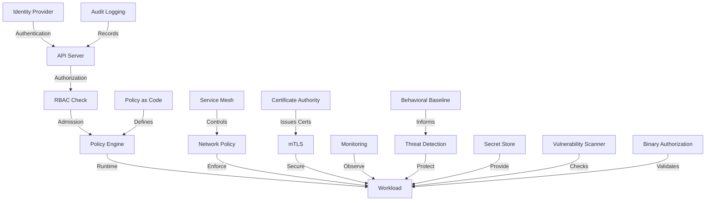

## Cloud Native Security

Cloud Native Security is a holistic approach to protecting applications, infrastructure, and data in distributed, containerized environments. It spans multiple layers from code to runtime to ensure comprehensive protection. This approach recognizes that traditional security models don't adequately address the unique challenges presented by cloud-native architectures, such as ephemeral infrastructure, immutable deployments, microservices, and API-driven automation.

In cloud-native environments, security must be:
- **Integrated throughout the entire lifecycle** - from development to runtime
- **API-driven and automated** - manual processes cannot scale
- **Defense-in-depth** - multiple layers of protection
- **Declarative** - defined as code and configuration
- **Dynamic** - adaptable to changing environments
- **Observable** - with comprehensive logging and monitoring

## The 4C's of Cloud Native Security

The 4C's model provides a structured approach to understanding and implementing security controls across all layers of cloud-native applications. Each layer builds upon the security of the previous layers, creating a comprehensive security strategy.

::steps
### Cloud
- **Infrastructure provider security**: Foundation of security controls from cloud providers
  - Cloud account security (MFA, privileged access management)
  - Provider-specific security services (AWS GuardDuty, Azure Security Center, etc.)
  - Secure baseline configurations (encryption at rest, secure networking defaults)
  - Resource boundary controls (accounts, projects, subscriptions)
- **Identity and access management**: Fine-grained access control
  - IAM roles and policies
  - Service accounts and managed identities
  - RBAC and privilege management
  - Identity federation and SSO integration
- **Network security controls**: Securing communication paths
  - Virtual networks and subnets
  - Security groups and NACLs
  - WAF and DDoS protection
  - Transit gateways and VPC peering
- **Resource isolation**: Preventing cross-tenant vulnerabilities
  - Private connectivity options (VPC endpoints, Private Link)
  - Tenant separation
  - Resource tagging and isolation
  - Encrypted communication channels
- **Compliance frameworks**: Meeting regulatory requirements
  - Provider certifications (ISO, SOC, FedRAMP)
  - Compliance monitoring and reporting
  - Audit logging for all API calls
  - Data residency controls

### Cluster
- **Control plane hardening**: Securing Kubernetes management components
  - API server security configuration
  - Etcd encryption and access controls
  - Controller Manager and Scheduler security
  - Secure TLS configuration and rotation
  - Control plane vulnerability management
- **Node security**: Protecting worker nodes
  - OS hardening and minimal footprints
  - Container runtime security
  - Node maintenance and patching
  - Secure bootstrapping and node identity
  - Host-based intrusion detection
- **Authentication mechanisms**: Verifying identity
  - Certificate-based authentication
  - OIDC integration
  - Service account token management
  - Bootstrap authentication
  - Webhook authentication plugins
- **Authorization policies**: Controlling access
  - Role-Based Access Control (RBAC)
  - Attribute-Based Access Control (ABAC)
  - Node authorization
  - Webhook authorization plugins
  - Namespace isolation
- **Admission controllers**: Runtime policy enforcement
  - ValidatingAdmissionWebhooks
  - MutatingAdmissionWebhooks
  - PodSecurityPolicies (or Pod Security Standards)
  - ImagePolicyWebhook
  - Custom policy controllers

### Container
- **Image security**: Securing the container foundation
  - Minimal base images
  - Multi-stage builds
  - No root processes
  - Image signing and verification
  - Official and trusted images
- **Supply chain validation**: Ensuring integrity
  - Software Bill of Materials (SBOM)
  - Image provenance verification
  - Build system security
  - Dependency verification
  - Chain of custody controls
- **Runtime protection**: Securing containers in production
  - Runtime vulnerability scanning
  - Behavioral monitoring
  - Anomaly detection
  - Container sandboxing
  - Drift prevention
- **Vulnerability management**: Finding and fixing issues
  - Continuous vulnerability scanning
  - Risk-based prioritization
  - Remediation workflows
  - CVE monitoring and notifications
  - Automated patching strategies
- **Least privilege execution**: Minimizing attack surface
  - Non-root users
  - Read-only filesystems
  - Dropped capabilities
  - Seccomp profiles
  - AppArmor/SELinux enforcement

### Code
- **Secure development practices**: Building security in
  - Secure coding standards
  - Threat modeling
  - Code reviews
  - Security champions
  - Developer security training
- **Dependency management**: Managing third-party risks
  - Dependency scanning
  - Versioning strategies
  - License compliance
  - Deprecated package detection
  - Dependency update automation
- **Secret handling**: Protecting sensitive information
  - Secret management services
  - Environment variable security
  - Runtime secret injection
  - Key rotation
  - Encryption standards
- **Static and dynamic analysis**: Finding vulnerabilities
  - SAST (Static Application Security Testing)
  - DAST (Dynamic Application Security Testing)
  - IAST (Interactive Application Security Testing)
  - SCA (Software Composition Analysis)
  - Penetration testing
- **CI/CD pipeline security**: Securing the delivery chain
  - Pipeline authentication and authorization
  - Infrastructure as Code security scanning
  - Artifact integrity verification
  - Deployment approval gates
  - Secure pipeline configuration
::

## Supply Chain Security

Supply chain security has become increasingly critical as attackers focus on exploiting vulnerabilities in the software development and delivery process. A comprehensive approach addresses all stages from source code to production deployment.

::alert{type="warning"}
Container image supply chain security is critical for protecting your applications from their inception:
1. **Use trusted base images**
   - Prefer minimal, official images (Alpine, distroless)
   - Validate publisher identity and authenticity
   - Maintain a private registry of approved base images
   - Consider SLSA (Supply chain Levels for Software Artifacts) framework
   - Regularly update base images for security patches

2. **Scan images for vulnerabilities**
   - Implement scanning in CI/CD pipelines
   - Use multiple scanners for better coverage
   - Establish severity thresholds for blocking builds
   - Maintain continuous scanning in registries
   - Have clear remediation workflows for findings

3. **Sign and verify images**
   - Implement cryptographic signing of all images
   - Use tools like Cosign, Notary, or Sigstore
   - Verify signatures before deployment
   - Maintain secure key management practices
   - Ensure signature verification in air-gapped environments

4. **Implement software bill of materials (SBOM)**
   - Generate SBOMs for all container images
   - Use formats like SPDX or CycloneDX
   - Track all dependencies and their versions
   - Enable vulnerability correlation with SBOMs
   - Make SBOMs available for security teams

5. **Enforce image admission policies**
   - Use admission controllers for runtime enforcement
   - Verify signatures and provenance at deploy time
   - Block images with critical vulnerabilities
   - Ensure images come from approved registries
   - Implement policy as code for consistency
::

```yaml
# Example Notary / Cosign image signing
# Sign an image with a private key
cosign sign --key cosign.key $IMAGE_REPO/myapp:latest

# Sign an image with keyless signing (Sigstore)
cosign sign --identity-token=$(gcloud auth print-identity-token) $IMAGE_REPO/myapp:latest

# Generate key pair for signing
cosign generate-key-pair

# Verify a signed image
cosign verify --key cosign.pub $IMAGE_REPO/myapp:latest

# Attach attestations (provenance, SBOM, scan results)
cosign attest --predicate sbom.json --key cosign.key $IMAGE_REPO/myapp:latest

# Verify attestations
cosign verify-attestation --key cosign.pub $IMAGE_REPO/myapp:latest

# Example admission policy for signed images using Sigstore policy controller
apiVersion: admission.sigstore.dev/v1alpha1
kind: ClusterImagePolicy
metadata:
  name: require-signatures
spec:
  match:
    - resource:
        kinds:
          - Pod
        namespaces:
          - "production"
          - "staging"
    - resource:
        kinds:
          - Deployment
          - StatefulSet
          - DaemonSet
        apiGroups:
          - "apps"
        namespaces:
          - "production"
          - "staging"
  authorities:
    - name: keyless
      keyless:
        url: https://fulcio.example.com
        identities:
          - issuer: https://accounts.google.com
            subject: user@example.com
    - name: company-key
      key:
        data: |
          -----BEGIN PUBLIC KEY-----
          MFkwEwYHKoZIzj0CAQYIKoZIzj0DAQcDQgAESLwLGUg66zDoCgA0rKgbkkexLzR/
          JRWFO3XV6eVJwjKLLYXrLX5HlUSEQFx6FCkqxN1VKVqgGtxC2hRGZ/rzLg==
          -----END PUBLIC KEY-----
        hashAlgorithm: sha256
    - name: policy-controller-conformance
      static:
        action: pass
```

## Runtime Security

Runtime security provides protection for containers during execution. This involves multiple complementary techniques to restrict container capabilities, monitor behavior, and prevent exploitation of vulnerabilities.

::steps
### Seccomp Profiles
Seccomp (secure computing mode) restricts the system calls that a process can make, reducing the kernel attack surface.

```yaml
apiVersion: v1
kind: Pod
metadata:
  name: secure-pod
  labels:
    app: secure-application
spec:
  # Pod-level seccomp profile
  securityContext:
    seccompProfile:
      type: Localhost                     # Use a custom profile on the node
      localhostProfile: profiles/audit.json  # Path to the profile on the host
  containers:
  - name: app
    image: myapp:1.0
    ports:
    - containerPort: 8080
    resources:
      limits:
        cpu: "500m"
        memory: "512Mi"
      requests:
        cpu: "100m"
        memory: "128Mi"
```

Sample seccomp profile (audit.json):
```json
{
  "defaultAction": "SCMP_ACT_LOG",  // Log all syscalls for auditing
  "architectures": [
    "SCMP_ARCH_X86_64"
  ],
  "syscalls": [
    {
      "names": [
        "accept",
        "bind",
        "connect",
        "socket",
        "read",
        "write",
        // ... other allowed syscalls
      ],
      "action": "SCMP_ACT_ALLOW"
    },
    {
      "names": [
        "mount",
        "umount2",
        "ptrace",
        "process_vm_writev"
      ],
      "action": "SCMP_ACT_ERRNO"  // Block dangerous syscalls
    }
  ]
}
```

### AppArmor Profiles
AppArmor provides mandatory access control for processes, restricting the files a container can access and the operations it can perform.

```yaml
apiVersion: v1
kind: Pod
metadata:
  name: secure-pod
  annotations:
    # Apply AppArmor profile to specific container
    container.apparmor.security.beta.kubernetes.io/app: localhost/custom-profile
spec:
  containers:
  - name: app
    image: myapp:1.0
    volumeMounts:
    - name: data
      mountPath: /data
      readOnly: true  # Mount as read-only for additional security
    ports:
    - containerPort: 8080
  volumes:
  - name: data
    emptyDir: {}
```

Sample AppArmor profile (custom-profile):
```
#include <tunables/global>

profile custom-profile flags=(attach_disconnected) {
  #include <abstractions/base>
  #include <abstractions/nameservice>
  
  # Allow network access
  network inet tcp,
  network inet udp,
  
  # Allow reading system information
  /proc/meminfo r,
  /proc/stat r,
  /proc/cpuinfo r,
  
  # Application specific paths
  /app/** r,
  /app/bin/* ix,
  /data/** r,
  
  # Deny write access to sensitive paths
  deny /etc/** w,
  deny /var/log/** w,
  deny /proc/** w,
  
  # Explicitly deny potentially dangerous operations
  deny capability sys_admin,
  deny capability sys_ptrace,
  deny mount,
  deny umount,
}
```

### Security Contexts
Security contexts define privilege and access control settings for pods and containers.

```yaml
apiVersion: v1
kind: Pod
metadata:
  name: security-context-demo
  labels:
    environment: production
spec:
  # Pod-level security context (applies to all containers)
  securityContext:
    runAsNonRoot: true              # Prevent running as root user
    runAsUser: 1000                 # Run as user ID 1000
    runAsGroup: 3000                # Run as group ID 3000
    fsGroup: 2000                   # Group ownership for volume mounts
    supplementalGroups: [5555, 6666] # Additional group memberships
  containers:
  - name: secure-app
    image: myapp:1.0
    # Container-specific security context
    securityContext:
      allowPrivilegeEscalation: false    # Prevent privilege escalation
      privileged: false                  # Do not run in privileged mode
      procMount: Default                 # Use default proc mount
      capabilities:
        drop:                            # Drop all capabilities
          - ALL
        add:                             # Selectively add required capabilities
          - NET_BIND_SERVICE             # Allow binding to ports < 1024
      readOnlyRootFilesystem: true       # Make root filesystem read-only
    volumeMounts:
    - name: tmp-volume                   # Mount writable volume for temp files
      mountPath: /tmp
    - name: config-volume
      mountPath: /etc/config
      readOnly: true                     # Config is read-only
  volumes:
  - name: tmp-volume                     # Writable volume for temp files
    emptyDir: {}
  - name: config-volume
    configMap:
      name: app-config
```

### Runtime Protection with Falco
Falco provides runtime security by monitoring container behavior and detecting suspicious activities.

```yaml
# Falco DaemonSet for runtime monitoring
apiVersion: apps/v1
kind: DaemonSet
metadata:
  name: falco
  namespace: security
spec:
  selector:
    matchLabels:
      app: falco
  template:
    metadata:
      labels:
        app: falco
    spec:
      serviceAccountName: falco
      containers:
      - name: falco
        image: falcosecurity/falco:latest
        securityContext:
          privileged: true  # Required for kernel-level monitoring
        args:
          - /usr/bin/falco
          - --cri=/run/containerd/containerd.sock
          - -K /var/run/secrets/kubernetes.io/serviceaccount/token
          - -k https://kubernetes.default
        volumeMounts:
        - mountPath: /host/var/run/docker.sock
          name: docker-socket
          readOnly: true
        - mountPath: /host/dev
          name: dev-fs
        - mountPath: /host/proc
          name: proc-fs
          readOnly: true
        - mountPath: /host/etc
          name: etc-fs
          readOnly: true
        - mountPath: /etc/falco
          name: falco-config
      volumes:
      - name: docker-socket
        hostPath:
          path: /var/run/docker.sock
      - name: dev-fs
        hostPath:
          path: /dev
      - name: proc-fs
        hostPath:
          path: /proc
      - name: etc-fs
        hostPath:
          path: /etc
      - name: falco-config
        configMap:
          name: falco-config
```
::

## Network Security

Network security in Kubernetes involves controlling traffic flow between pods, isolating namespaces, encrypting communications, and protecting cluster ingress/egress points. Network Policies are the primary mechanism for implementing microsegmentation within a cluster.

```yaml
# Network Policy to restrict pod communication
apiVersion: networking.k8s.io/v1
kind: NetworkPolicy
metadata:
  name: api-allow
  namespace: production
  labels:
    app: api
    tier: backend
    environment: production
spec:
  # Select pods this policy applies to
  podSelector:
    matchLabels:
      app: api
  # Types of rules included in this policy
  policyTypes:
  - Ingress  # Incoming traffic rules
  - Egress   # Outgoing traffic rules
  
  # Incoming traffic rules
  ingress:
  # Allow traffic from frontend pods on port 8080
  - from:
    - podSelector:
        matchLabels:
          app: frontend
    # Allow frontend to access API on specific ports
    ports:
    - protocol: TCP
      port: 8080
      
  # Allow traffic from monitoring namespace
  - from:
    - namespaceSelector:
        matchLabels:
          purpose: monitoring
    ports:
    - protocol: TCP
      port: 9090  # Prometheus metrics port
  
  # Outgoing traffic rules
  egress:
  # Allow traffic to database pods on port 5432
  - to:
    - podSelector:
        matchLabels:
          app: database
    ports:
    - protocol: TCP
      port: 5432
      
  # Allow DNS resolution
  - to:
    - namespaceSelector:
        matchLabels:
          kubernetes.io/metadata.name: kube-system
    - podSelector:
        matchLabels:
          k8s-app: kube-dns
    ports:
    - protocol: UDP
      port: 53
    - protocol: TCP
      port: 53
```

### Multi-layered Network Security Example

```yaml
# Default deny all ingress traffic to a namespace
apiVersion: networking.k8s.io/v1
kind: NetworkPolicy
metadata:
  name: default-deny-ingress
  namespace: production
spec:
  podSelector: {}  # Selects all pods in the namespace
  policyTypes:
  - Ingress

---
# Default deny all egress traffic from a namespace
apiVersion: networking.k8s.io/v1
kind: NetworkPolicy
metadata:
  name: default-deny-egress
  namespace: production
spec:
  podSelector: {}  # Selects all pods in the namespace
  policyTypes:
  - Egress

---
# Allow specific ingress/egress paths
apiVersion: networking.k8s.io/v1
kind: NetworkPolicy
metadata:
  name: selective-communication
  namespace: production
spec:
  podSelector:
    matchLabels:
      app: web
  policyTypes:
  - Ingress
  - Egress
  ingress:
  # Allow traffic from the ingress controller
  - from:
    - namespaceSelector:
        matchLabels:
          kubernetes.io/metadata.name: ingress-nginx
      podSelector:
        matchLabels:
          app.kubernetes.io/name: ingress-nginx
    ports:
    - protocol: TCP
      port: 80
  egress:
  # Allow traffic to the API service
  - to:
    - podSelector:
        matchLabels:
          app: api
    ports:
    - protocol: TCP
      port: 8080
  # Allow DNS resolution
  - to:
    - namespaceSelector:
        matchLabels:
          kubernetes.io/metadata.name: kube-system
      podSelector:
        matchLabels:
          k8s-app: kube-dns
    ports:
    - protocol: UDP
      port: 53
```

## Pod Security Standards

Pod Security Standards provide predefined security configurations to help secure pod deployments. With Kubernetes 1.25, Pod Security Policies (PSP) were removed in favor of the Pod Security Admission (PSA) controller which implements these standards.

::alert{type="info"}
Kubernetes provides built-in Pod Security Standards in three levels:

1. **Privileged**: Unrestricted policy, providing the widest possible level of permissions
   - No restrictions on pod specifications
   - Equivalent to running with full root access on the node
   - Suitable for system and infrastructure workloads managed by privileged users
   - Examples: CNI plugins, storage drivers, log collectors with host access

2. **Baseline**: Minimally restrictive policy that prevents known privilege escalations
   - Prevents known privilege escalations
   - Allows default pod configuration
   - Balances security and usability
   - Suitable for common application workloads
   - Blocks: privileged containers, host namespaces, host ports, volume types that allow host access

3. **Restricted**: Heavily restricted policy, following current pod hardening best practices
   - Follows pod hardening best practices
   - May require changes to workloads
   - Provides strong security boundaries
   - Suitable for high-security applications
   - Additional restrictions: dropping all capabilities and adding only those needed, running as non-root, requiring seccomp profiles
::

```yaml
# Namespace-level Pod Security admission
apiVersion: v1
kind: Namespace
metadata:
  name: secure-namespace
  labels:
    # Enforce restricted policy (reject non-conformant pods)
    pod-security.kubernetes.io/enforce: restricted
    # Audit violations for restricted policy (log violations)
    pod-security.kubernetes.io/audit: restricted
    # Warn on violations for restricted policy (user warnings)
    pod-security.kubernetes.io/warn: restricted
    
    # Optional: version control which PSS version to use
    pod-security.kubernetes.io/enforce-version: v1.25
    pod-security.kubernetes.io/audit-version: v1.25
    pod-security.kubernetes.io/warn-version: v1.25
```

### Pod Security Standards Implementation Examples

```yaml
# Privileged namespace example (system workloads)
apiVersion: v1
kind: Namespace
metadata:
  name: system-components
  labels:
    pod-security.kubernetes.io/enforce: privileged

---
# Baseline namespace example (team applications)
apiVersion: v1
kind: Namespace
metadata:
  name: team-applications
  labels:
    pod-security.kubernetes.io/enforce: baseline
    pod-security.kubernetes.io/audit: restricted
    pod-security.kubernetes.io/warn: restricted

---
# Restricted namespace example (sensitive workloads)
apiVersion: v1
kind: Namespace
metadata:
  name: financial-services
  labels:
    pod-security.kubernetes.io/enforce: restricted

---
# Example Pod meeting restricted requirements
apiVersion: v1
kind: Pod
metadata:
  name: restricted-pod
  namespace: financial-services
spec:
  securityContext:
    runAsNonRoot: true
    runAsUser: 1000
    runAsGroup: 3000
    seccompProfile:
      type: RuntimeDefault
    fsGroup: 2000
  containers:
  - name: restricted-app
    image: myapp:1.0
    securityContext:
      allowPrivilegeEscalation: false
      capabilities:
        drop:
          - ALL
      readOnlyRootFilesystem: true
    resources:
      limits:
        cpu: "500m"
        memory: "512Mi"
      requests:
        cpu: "100m"
        memory: "128Mi"
```

## RBAC Configuration

Role-Based Access Control (RBAC) is a crucial security mechanism in Kubernetes that controls what actions users and service accounts can perform on which resources. Properly configured RBAC is essential for maintaining the principle of least privilege.

::steps
### Role Definition
A Role defines a set of permissions within a specific namespace. These permissions are purely additive (there are no "deny" rules).

```yaml
apiVersion: rbac.authorization.k8s.io/v1
kind: Role
metadata:
  namespace: default
  name: pod-reader
  labels:
    app: monitoring
    team: operations
rules:
# Rule for pod access
- apiGroups: [""]           # Core API group
  resources: ["pods"]       # Resource type
  verbs: ["get", "watch", "list"]  # Allowed actions
  
# Rule for logs access
- apiGroups: [""]
  resources: ["pods/log"]   # Subresource for pod logs
  verbs: ["get"]
  
# Rule with resource names restriction
- apiGroups: [""]
  resources: ["configmaps"]
  resourceNames: ["app-config", "monitoring-config"]  # Only these specific resources
  verbs: ["get"]
  
# Rule for creating events
- apiGroups: [""]
  resources: ["events"]
  verbs: ["create"]
```

### ClusterRole Definition
A ClusterRole is similar to a Role but applies cluster-wide rather than to a specific namespace.

```yaml
apiVersion: rbac.authorization.k8s.io/v1
kind: ClusterRole
metadata:
  name: pod-reader
  labels:
    app: monitoring
    team: operations
rules:
# Read access to pods across all namespaces
- apiGroups: [""]
  resources: ["pods"]
  verbs: ["get", "watch", "list"]

# Access to custom resources
- apiGroups: ["monitoring.coreos.com"]
  resources: ["prometheuses", "alertmanagers"]
  verbs: ["get", "list", "watch"]
  
# Access to non-resource URLs (metrics endpoints)
- nonResourceURLs: ["/metrics", "/healthz"]
  verbs: ["get"]
```

### Role Binding
RoleBindings grant the permissions defined in a Role to users, groups, or service accounts within a specific namespace.

```yaml
apiVersion: rbac.authorization.k8s.io/v1
kind: RoleBinding
metadata:
  name: read-pods
  namespace: default
  labels:
    app: monitoring
subjects:
# Individual user binding
- kind: User
  name: jane
  apiGroup: rbac.authorization.k8s.io
  
# Group binding
- kind: Group
  name: monitoring-team
  apiGroup: rbac.authorization.k8s.io
  
# Service account binding
- kind: ServiceAccount
  name: prometheus
  namespace: monitoring  # Note: namespace

## Secret Management

::alert{type="warning"}
Kubernetes Secrets are not encrypted by default. Consider these approaches for better security:
1. **Enable encryption at rest for etcd**
   - Configure the API server with encryption provider
   - Use strong encryption algorithms (AES-GCM, AES-CBC)
   - Securely manage encryption keys
   - Rotate encryption keys periodically
   - Monitor encryption configuration for changes

2. **Use external secret stores like HashiCorp Vault**
   - Maintain centralized secret management
   - Leverage dynamic secret generation
   - Implement fine-grained access controls
   - Utilize audit logging capabilities
   - Take advantage of secret rotation features

3. **Use Sealed Secrets or SOPS for GitOps workflows**
   - Encrypt secrets before storing in Git
   - Use asymmetric encryption for better security
   - Implement proper key management
   - Enable safe storage of encrypted secrets in repositories
   - Automate decryption in the cluster

4. **Implement proper RBAC for Secret access**
   - Restrict secret access to specific users and service accounts
   - Separate secret access by namespaces
   - Use minimally privileged roles
   - Audit secret access regularly
   - Consider using OPA Gatekeeper for additional policy controls

5. **Rotate secrets regularly**
   - Implement automated rotation mechanisms
   - Set up monitoring for secret age
   - Use short-lived credentials where possible
   - Plan for application handling of rotated secrets
   - Test rotation procedures before implementation
::

```yaml
# Example of using external secrets with ESO
apiVersion: external-secrets.io/v1beta1
kind: ExternalSecret
metadata:
  name: database-credentials
  namespace: application
  labels:
    app: backend
    type: database
    environment: production
spec:
  refreshInterval: "15m"  # How often to refresh the secret
  secretStoreRef:
    name: vault-backend
    kind: ClusterSecretStore  # Reference to a central secret store
  target:
    name: database-credentials  # Name of the created K8s Secret
    creationPolicy: Owner  # Secret will be owned by this ExternalSecret
    template:  # Optional template for the Secret
      type: kubernetes.io/basic-auth  # Use specific Secret type
      metadata:
        labels:
          app: backend
  data:
  - secretKey: username  # Key in the Kubernetes Secret
    remoteRef:
      key: database/credentials  # Path in Vault
      property: username  # Property to extract
  - secretKey: password
    remoteRef:
      key: database/credentials
      property: password
      
---
# Define the SecretStore connecting to Vault
apiVersion: external-secrets.io/v1beta1
kind: ClusterSecretStore
metadata:
  name: vault-backend
spec:
  provider:
    vault:
      server: "https://vault.example.com:8200"
      path: "secret"  # Base path for secrets
      version: "v2"   # KV version
      auth:
        # Kubernetes auth method
        kubernetes:
          mountPath: "kubernetes"
          role: "external-secrets"
          serviceAccountRef:
            name: "external-secrets"
            namespace: "external-secrets"
      # Optional: Use namespace as prefix in Vault paths
      namespace: "my-vault-namespace"
      # Optional: Configure custom CA bundle
      caBundle: "<base64-encoded-ca-bundle>"

---
# Encryption at rest configuration for Kubernetes API server
# This is applied to the kube-apiserver configuration
apiVersion: apiserver.config.k8s.io/v1
kind: EncryptionConfiguration
metadata:
  name: encryption-config
spec:
  resources:
    - resources:
        - secrets
      providers:
        - aescbc:  # AES-CBC with PKCS#7 padding
            keys:
              - name: key1
                secret: <base64-encoded-key>  # 32-byte key
        - identity: {}  # Used for reading unencrypted secrets
```

## Secure API Server Configuration

Securing the Kubernetes API server is critical as it's the primary interface for managing the cluster. A properly hardened API server helps prevent unauthorized access and reduces the attack surface.

```yaml
# Example kube-apiserver configuration
apiVersion: v1
kind: Pod
metadata:
  name: kube-apiserver
  namespace: kube-system
  labels:
    component: kube-apiserver
    tier: control-plane
spec:
  priorityClassName: system-node-critical  # Ensures high priority scheduling
  hostNetwork: true  # Required for API server
  containers:
  - name: kube-apiserver
    image: k8s.gcr.io/kube-apiserver:v1.24.0
    command:
    - kube-apiserver
    # Disable anonymous authentication
    - --anonymous-auth=false
    # Enable comprehensive audit logging
    - --audit-log-path=/var/log/kubernetes/audit.log
    - --audit-log-maxage=30
    - --audit-log-maxbackup=10
    - --audit-log-maxsize=100
    - --audit-policy-file=/etc/kubernetes/audit-policy.yaml
    # Set secure authorization modes
    - --authorization-mode=Node,RBAC
    # Enable security-focused admission controllers
    - --enable-admission-plugins=NodeRestriction,PodSecurity,AlwaysPullImages,EventRateLimit
    # Configure etcd encryption for secrets
    - --encryption-provider-config=/etc/kubernetes/encryption-config.yaml
    # Configure secure TLS
    - --tls-cert-file=/etc/kubernetes/pki/apiserver.crt
    - --tls-private-key-file=/etc/kubernetes/pki/apiserver.key
    - --tls-cipher-suites=TLS_ECDHE_RSA_WITH_AES_128_GCM_SHA256,TLS_ECDHE_RSA_WITH_AES_256_GCM_SHA384
    - --tls-min-version=VersionTLS12
    # Secure service account settings
    - --service-account-key-file=/etc/kubernetes/pki/sa.pub
    - --service-account-signing-key-file=/etc/kubernetes/pki/sa.key
    - --service-account-issuer=https://kubernetes.default.svc.cluster.local
    # API server authentication settings
    - --client-ca-file=/etc/kubernetes/pki/ca.crt
    - --requestheader-client-ca-file=/etc/kubernetes/pki/front-proxy-ca.crt
    - --requestheader-allowed-names=front-proxy-client
    # Kubelet authentication and authorization
    - --kubelet-certificate-authority=/etc/kubernetes/pki/ca.crt
    - --kubelet-client-certificate=/etc/kubernetes/pki/apiserver-kubelet-client.crt
    - --kubelet-client-key=/etc/kubernetes/pki/apiserver-kubelet-client.key
    # Secure etcd configuration
    - --etcd-cafile=/etc/kubernetes/pki/etcd/ca.crt
    - --etcd-certfile=/etc/kubernetes/pki/apiserver-etcd-client.crt
    - --etcd-keyfile=/etc/kubernetes/pki/apiserver-etcd-client.key
    # Other security settings
    - --profiling=false  # Disable profiling for security
    - --secure-port=6443
    - --service-account-lookup=true
    # Rate limiting to prevent DoS
    - --max-requests-inflight=400
    - --max-mutating-requests-inflight=200
    volumeMounts:
    - mountPath: /etc/kubernetes/pki
      name: k8s-certs
      readOnly: true
    - mountPath: /etc/kubernetes/encryption-config.yaml
      name: encryption-config
      readOnly: true
    - mountPath: /etc/kubernetes/audit-policy.yaml
      name: audit-policy
      readOnly: true
    - mountPath: /var/log/kubernetes
      name: audit-logs
    resources:
      requests:
        cpu: 250m
        memory: 512Mi
      limits:
        cpu: 1000m
        memory: 2Gi
  volumes:
  - hostPath:
      path: /etc/kubernetes/pki
      type: DirectoryOrCreate
    name: k8s-certs
  - hostPath:
      path: /etc/kubernetes/encryption-config.yaml
      type: FileOrCreate
    name: encryption-config
  - hostPath:
      path: /etc/kubernetes/audit-policy.yaml
      type: FileOrCreate
    name: audit-policy
  - hostPath:
      path: /var/log/kubernetes
      type: DirectoryOrCreate
    name: audit-logs
```

## Compliance and Auditing

Comprehensive auditing and compliance measures are essential for meeting security requirements and providing visibility into cluster activities.

::steps
### Audit Policy
```yaml
apiVersion: audit.k8s.io/v1
kind: Policy
# Capture metadata for all requests at a minimum
metadata:
  name: kubernetes-audit-policy
rules:
# Log metadata for sensitive resources like secrets
- level: Metadata  # Record request metadata only (no request/response body)
  resources:
  - group: ""  # Core API group
    resources: ["secrets"]
  # Omit kube-system to reduce log volume
  namespaces: ["default", "kube-public"]

# Log request and response for pod lifecycle operations
- level: RequestResponse  # Record request and response bodies
  resources:
  - group: ""
    resources: ["pods"]
  # Only for specific operations
  verbs: ["create", "update", "patch", "delete"]
  
# Don't log read-only system operations to reduce noise
- level: None  # Don't log
  users: ["system:serviceaccount:kube-system:*"]
  verbs: ["get", "list", "watch"]
  
# Log ConfigMap operations separately
- level: Metadata
  resources:
  - group: ""
    resources: ["configmaps"]
  # ConfigMap operations in kube-system are particularly important
  namespaces: ["kube-system"]
  
# Log RBAC changes at RequestResponse level
- level: RequestResponse
  resources:
  - group: "rbac.authorization.k8s.io"
    resources: ["roles", "rolebindings", "clusterroles", "clusterrolebindings"]
  
# Default catch-all rule (must be last)
- level: RequestResponse
  # Omit kube-system from the catch-all rule to reduce log volume
  namespaces: ["default", "kube-public"]
  # Omit "events" resource to reduce log volume
  resources:
  - group: ""
    resources: ["configmaps", "endpoints", "persistentvolumeclaims", "persistentvolumes", 
                "pods", "replicationcontrollers", "services", "namespaces"]
  - group: "apps"
    resources: ["daemonsets", "deployments", "replicasets", "statefulsets"]
```

### Benchmark Automation
- **CIS Kubernetes Benchmark scanning**
  - Automated scanning with kube-bench
  - Integration with CI/CD pipelines
  - Scheduled compliance checks
  - Gap analysis and remediation
  - Historical compliance trending

- **NSA/CISA Kubernetes Hardening Guide compliance**
  - Control mapping to NSA/CISA recommendations
  - Implementation validation
  - Continuous monitoring for drift
  - Technical controls verification
  - Architecture review against guidance

- **SOC2, PCI-DSS, HIPAA requirements**
  - Evidence collection automation
  - Control mapping to compliance frameworks
  - Automated reporting for audits
  - Compensating control documentation
  - Segregation of duties implementation

- **Automated compliance reporting**
  - Continuous compliance dashboards
  - Scheduled reporting to stakeholders
  - Customized reports by compliance framework
  - Variance and exception reporting
  - Remediation tracking

- **Continuous posture assessment**
  - Real-time security scoring
  - Benchmarking against industry standards
  - Risk-based prioritization
  - Threat modeling integration
  - Zero-trust architecture validation

### Compliance Tooling
```yaml
# Example kube-bench job
apiVersion: batch/v1
kind: Job
metadata:
  name: kube-bench
  namespace: security
spec:
  template:
    spec:
      hostPID: true  # Required to check host processes
      containers:
      - name: kube-bench
        image: aquasec/kube-bench:latest
        command: ["kube-bench", "--benchmark", "cis-1.23"]
        volumeMounts:
        - name: var-lib-kubelet
          mountPath: /var/lib/kubelet
          readOnly: true
        - name: etc-kubernetes
          mountPath: /etc/kubernetes
          readOnly: true
        - name: report
          mountPath: /report
        securityContext:
          privileged: true  # Required for certain checks
      volumes:
      - name: var-lib-kubelet
        hostPath:
          path: "/var/lib/kubelet"
      - name: etc-kubernetes
        hostPath:
          path: "/etc/kubernetes"
      - name: report
        persistentVolumeClaim:
          claimName: security-reports
      restartPolicy: Never
```
::

## Threat Detection and Runtime Protection

Runtime threat detection provides real-time monitoring and protection for containerized workloads, allowing you to detect and respond to suspicious activities as they occur.

```yaml
# Example Falco rule for detecting suspicious activities
- rule: Terminal Shell in Container
  desc: A shell was spawned in a container
  condition: >
    container and
    shell_procs and
    container.image.repository != "alpine" and
    not proc.name in (shell_binaries) and
    not falco_sensitive_mount_containers and
    not allowed_shell_containers
  output: >
    Shell spawned in a container (user=%user.name container=%container.name
    image=%container.image.repository:%container.image.tag shell=%proc.name parent=%proc.pname
    cmdline=%proc.cmdline pod=%k8s.pod.name ns=%k8s.ns.name)
  priority: WARNING
  tags: [container, shell, mitre_execution]
  
# Detect privilege escalation attempts
- rule: Privilege Escalation Detected
  desc: Detects attempts to escalate privileges in containers
  condition: >
    spawned_process and container and
    (proc.name in (setuid_binaries) or
     proc.name = "sudo" or
     proc.name = "su")
  output: >
    Privilege escalation attempt in container (user=%user.name command=%proc.cmdline 
    container=%container.name image=%container.image.repository:%container.image.tag 
    pod=%k8s.pod.name ns=%k8s.ns.name)
  priority: CRITICAL
  tags: [container, privilege-escalation, mitre_privilege_escalation]
  
# Detect unusual network connections
- rule: Unexpected Outbound Connection
  desc: Container making outbound connection not matching whitelist
  condition: >
    outbound and container and
    not (container.image.repository in (allowed_outbound_destinations_images)) and
    not (fd.sip in (allowed_outbound_destinations_ips)) and
    not (fd.sip in (rfc_1918_addresses))
  output: >
    Unexpected outbound connection from container (source=%container.name:%container.id 
    image=%container.image.repository:%container.image.tag 
    destination=%fd.sip:%fd.sport process=%proc.name command=%proc.cmdline)
  priority: WARNING
  tags: [container, network, exfiltration, mitre_exfiltration]
  
# Detect sensitive file access
- rule: Sensitive File Access in Container
  desc: Detect access to sensitive files in containers
  condition: >
    open_read and container and
    (fd.name startswith "/etc/shadow" or
     fd.name startswith "/etc/passwd" or
     fd.name startswith "/etc/kubernetes/pki" or
     fd.name startswith "/var/run/secrets")
  output: >
    Sensitive file accessed in container (user=%user.name file=%fd.name 
    container=%container.name image=%container.image.repository:%container.image.tag 
    command=%proc.cmdline pod=%k8s.pod.name)
  priority: WARNING
  tags: [container, file-access, mitre_credential_access]
```

### Comprehensive Runtime Protection

Effective runtime protection requires multiple components working together:

1. **Behavioral Monitoring**:
   - Process execution monitoring
   - Network activity analysis
   - File system access tracking
   - System call interception
   - User activity monitoring

2. **Threat Intelligence Integration**:
   - Known malicious signatures
   - Behavioral patterns matching
   - Automated intelligence updates
   - Zero-day vulnerability protection
   - MITRE ATT&CK mapping

3. **Automated Response Actions**:
   - Container termination
   - Network isolation
   - Alert generation
   - Forensic data collection
   - Incident response automation

```yaml
# Runtime protection with Falco and response actions
apiVersion: apps/v1
kind: DaemonSet
metadata:
  name: falco
  namespace: security
  labels:
    app: falco
    role: security
spec:
  selector:
    matchLabels:
      app: falco
  template:
    metadata:
      labels:
        app: falco
    spec:
      serviceAccountName: falco
      hostPID: true  # Required to monitor host processes
      hostNetwork: true  # Required for certain network monitoring
      dnsPolicy: ClusterFirstWithHostNet
      containers:
      - name: falco
        image: falcosecurity/falco:0.33.0
        securityContext:
          privileged: true  # Required for kernel-level monitoring
        args:
          - /usr/bin/falco
          - -K /var/run/secrets/kubernetes.io/serviceaccount/token
          - -k https://kubernetes.default.svc.cluster.local
          - -pk
          - --cri=/run/containerd/containerd.sock
          - -o json_output=true
          - -o program_output.enabled=true
          - -o program_output.program="curl -d @- -X POST http://falco-response:2801/"
        volumeMounts:
        - mountPath: /host/var/run/docker.sock
          name: docker-socket
          readOnly: true
        - mountPath: /host/run/containerd/containerd.sock
          name: containerd-socket
          readOnly: true
        - mountPath: /host/dev
          name: dev-fs
        - mountPath: /host/proc
          name: proc-fs
          readOnly: true
        - mountPath: /host/boot
          name: boot-fs
          readOnly: true
        - mountPath: /host/lib/modules
          name: lib-modules
          readOnly: true
        - mountPath: /host/usr
          name: usr-fs
          readOnly: true
        - mountPath: /etc/falco
          name: falco-config
      volumes:
      - name: docker-socket
        hostPath:
          path: /var/run/docker.sock
      - name: containerd-socket
        hostPath:
          path: /run/containerd/containerd.sock
      - name: dev-fs
        hostPath:
          path: /dev
      - name: proc-fs
        hostPath:
          path: /proc
      - name: boot-fs
        hostPath:
          path: /boot
      - name: lib-modules
        hostPath:
          path: /lib/modules
      - name: usr-fs
        hostPath:
          path: /usr
      - name: falco-config
        configMap:
          name: falco-config
```

## Image Scanning and Vulnerability Management

::alert{type="info"}
Implement a multi-layered approach to image scanning:
1. **Scan during development (IDE plugins)**
   - Real-time feedback for developers
   - Early detection of vulnerabilities
   - Integration with developer workflows
   - Secure coding guidance
   - Dependency vulnerability alerts

2. **Scan during CI/CD pipeline**
   - Gate deployment based on scan results
   - Enforce security policies automatically
   - Generate SBOMs for auditability
   - Centralized reporting and tracking
   - Break builds for critical issues

3. **Scan images in registries**
   - Continuous scanning of stored images
   - Policies to prevent pulling vulnerable images
   - Notification of newly discovered vulnerabilities
   - Automated rescanning on CVE database updates
   - Integration with admission controllers

4. **Scan running containers**
   - Runtime vulnerability detection
   - Drift detection from baseline image
   - Prioritization based on exposure and criticality
   - Integration with incident response
   - Automated remediation workflows

5. **Implement vulnerability management process**
   - Risk-based prioritization framework
   - Defined SLAs for remediation
   - Exception management and approvals
   - Vulnerability tracking and metrics
   - Regular security review meetings
::

```yaml
# Example Trivy Operator configuration
apiVersion: aquasecurity.github.io/v1alpha1
kind: VulnerabilityReport
metadata:
  name: replicaset-nginx-6d4cf56db6-nginx
  namespace: default
  labels:
    trivy-operator.resource.kind: ReplicaSet
    trivy-operator.resource.name: nginx-6d4cf56db6
    trivy-operator.resource.namespace: default
    trivy-operator.container.name: nginx
    app.kubernetes.io/name: frontend
    app.kubernetes.io/component: web-server
report:
  registry:
    server: index.docker.io
  artifact:
    repository: library/nginx
    tag: 1.16
  scanner:
    name: Trivy
    vendor: Aqua Security
    version: 0.29.2
  summary:
    criticalCount: 2
    highCount: 10
    mediumCount: 8
    lowCount: 5
    unknownCount: 0
  updateTimestamp: "2023-04-12T10:15:30Z"
  vulnerabilities:
    - vulnerabilityID: CVE-2020-3810
      resource: apt
      installedVersion: 1.8.2
      fixedVersion: 1.8.2.1
      severity: CRITICAL
      title: Incorrect sanitation of environment variables
      description: |
        APT before version 2.1.2 incorrectly sanitized certain parameters passed to 
        the underlying command execution library, which could allow for injection of 
        malicious content.
      primaryLink: https://avd.aquasec.com/nvd/cve-2020-3810
      references:
        - https://cve.mitre.org/cgi-bin/cvename.cgi?name=CVE-2020-3810
        - https://security-tracker.debian.org/tracker/CVE-2020-3810
      publishedDate: "2020-04-15T18:15:00Z"
      lastModifiedDate: "2020-06-12T17:37:00Z"
      cvss:
        - source: NVD
          version: "3.1"
          score: 8.1
          vector: "CVSS:3.1/AV:N/AC:L/PR:N/UI:N/S:U/C:H/I:H/A:N"
    - vulnerabilityID: CVE-2021-27291
      resource: libxml2
      installedVersion: 2.9.4
      fixedVersion: 2.9.10-6.1
      severity: HIGH
      title: XML-based denial of service
      description: |
        A denial of service vulnerability exists in libxml2 where a specially
        crafted XML file can cause a denial of service condition.
      primaryLink: https://avd.aquasec.com/nvd/cve-2021-27291
      cvss:
        - source: NVD
          version: "3.1"
          score: 7.5
          vector: "CVSS:3.1/AV:N/AC:L/PR:N/UI:N/S:U/C:N/I:N/A:H"
```

### Complete Vulnerability Management Solution

```yaml
# Install Trivy Operator for continuous scanning
apiVersion: helm.toolkit.fluxcd.io/v2beta1
kind: HelmRelease
metadata:
  name: trivy-operator
  namespace: trivy-system
spec:
  interval: 1h
  chart:
    spec:
      chart: trivy-operator
      version: '0.3.0'
      sourceRef:
        kind: HelmRepository
        name: aqua
        namespace: flux-system
  values:
    trivy:
      ignoreUnfixed: true
      timeout: 10m
      severity: CRITICAL,HIGH
    operator:
      vulnerabilityReports:
        enabled: true
      configAudit

## Secure CI/CD Pipelines

Secure CI/CD pipelines implement security controls at every stage of the development lifecycle, catching vulnerabilities early and preventing insecure code from reaching production.

::steps
### Pipeline Security Controls
- **Scan code and dependencies**: Find vulnerabilities in application code and libraries
  - Static Application Security Testing (SAST)
  - Software Composition Analysis (SCA)
  - Infrastructure as Code (IaC) scanning
  - Secrets detection
  - License compliance checking
- **Image signing and verification**: Ensure software supply chain integrity
  - Cryptographic signing of container images
  - Verification before deployment
  - Signature policy enforcement
  - Provenance attestation
  - Build metadata preservation
- **Secrets management**: Protect sensitive credentials
  - Just-in-time secrets injection
  - Secret rotation automation
  - Access control and audit
  - Vault integration
  - Environment isolation
- **Least privilege principles**: Minimize attack surface
  - Pipeline-specific service accounts
  - Scoped access tokens
  - Time-limited credentials
  - Isolated build environments
  - Minimal base images
- **Automated security testing**: Validate security continuously
  - Dynamic Application Security Testing (DAST)
  - Penetration testing automation
  - Compliance verification
  - Security regression testing
  - Production configuration validation

### Example GitHub Actions Workflow
```yaml
name: Secure CI/CD Pipeline

on:
  push:
    branches: [main]
  pull_request:
    branches: [main]

jobs:
  security-scan:
    runs-on: ubuntu-latest
    permissions:
      contents: read
      security-events: write
      packages: write
    steps:
      - name: Checkout code
        uses: actions/checkout@v3
        with:
          fetch-depth: 0  # Get full history for proper analysis
        
      - name: Run SAST scan
        uses: github/codeql-action/analyze@v2
        with:
          languages: javascript, python
          queries: security-extended
          
      - name: Setup Snyk
        uses: snyk/actions/setup@master
        
      - name: Snyk Code Scan
        run: snyk code test --sarif-file-output=snyk-code.sarif
        env:
          SNYK_TOKEN: ${{ secrets.SNYK_TOKEN }}
        
      - name: Scan dependencies
        uses: aquasecurity/trivy-action@master
        with:
          scan-type: 'fs'
          format: 'sarif'
          output: 'trivy-results.sarif'
          severity: 'CRITICAL,HIGH'
          
      - name: Scan Kubernetes manifests
        uses: kubescape/github-action@main
        with:
          format: sarif
          outputFile: kubescape-results.sarif
          frameworks: nsa,mitre
          
      - name: Build and scan image
        uses: aquasecurity/trivy-action@master
        with:
          image-ref: 'myapp:${{ github.sha }}'
          format: 'sarif'
          output: 'trivy-image.sarif'
          severity: 'CRITICAL,HIGH'
          
      - name: Generate SBOM
        uses: anchore/sbom-action@v0
        with:
          format: spdx-json
          output-file: sbom.spdx.json
          
      - name: Login to GitHub Container Registry
        uses: docker/login-action@v2
        with:
          registry: ghcr.io
          username: ${{ github.actor }}
          password: ${{ secrets.GITHUB_TOKEN }}
          
      - name: Setup Cosign
        uses: sigstore/cosign-installer@main
          
      - name: Sign image
        run: |
          cosign sign --key cosign.key ghcr.io/myorg/myapp:${{ github.sha }}
          
      - name: Attach SBOM
        run: |
          cosign attach sbom --sbom sbom.spdx.json ghcr.io/myorg/myapp:${{ github.sha }}
          
      - name: Upload scan results
        uses: github/codeql-action/upload-sarif@v2
        with:
          sarif_file: trivy-image.sarif
          category: container-image
```
::

## Policy Enforcement

Policy enforcement in Kubernetes ensures that all resources comply with organizational requirements and security best practices. Open Policy Agent (OPA) Gatekeeper is a powerful tool for implementing policy as code.

```yaml
# OPA Gatekeeper constraint template
apiVersion: templates.gatekeeper.sh/v1beta1
kind: ConstraintTemplate
metadata:
  name: k8srequiredlabels
  annotations:
    description: "Requires resources to have a specific set of labels"
    control: "NIST SP 800-53: CM-2, CM-6"
spec:
  crd:
    spec:
      names:
        kind: K8sRequiredLabels
        listKind: K8sRequiredLabelsList
        plural: k8srequiredlabels
        singular: k8srequiredlabels
      validation:
        openAPIV3Schema:
          type: object
          properties:
            labels:
              type: array
              description: "List of required labels"
              items:
                type: string
            message:
              type: string
              description: "Optional custom violation message"
  targets:
    - target: admission.k8s.gatekeeper.sh
      rego: |
        package k8srequiredlabels
        
        violation[{"msg": msg, "details": details}] {
          # Get all provided labels
          provided := {label | input.review.object.metadata.labels[label]}
          
          # Get all required labels from parameters
          required := {label | label := input.parameters.labels[_]}
          
          # Find missing labels
          missing := required - provided
          
          # Trigger violation if any labels are missing
          count(missing) > 0
          
          # Custom or default message
          custom_msg := input.parameters.message
          default_msg := sprintf("Missing required labels: %v", [missing])
          msg := custom_msg != "" ? sprintf(custom_msg, [missing]) : default_msg
          
          # Provide violation details
          details := {
            "missing_labels": missing,
            "provided_labels": provided,
            "required_labels": required,
            "resource": input.review.object.kind
          }
        }
---
# Constraint using the template
apiVersion: constraints.gatekeeper.sh/v1beta1
kind: K8sRequiredLabels
metadata:
  name: deployment-must-have-labels
  annotations:
    description: "Requires all deployments to have standard labels"
    security-severity: "medium"
    owner: "security-team"
spec:
  enforcementAction: deny  # Can be deny, dryrun, or warn
  match:
    kinds:
      - apiGroups: ["apps"]
        kinds: ["Deployment", "StatefulSet", "DaemonSet"]
    namespaces:
      - "default"
      - "production"
    excludedNamespaces:
      - "kube-system"
      - "monitoring"
    labelSelector:
      matchExpressions:
        - key: exemption
          operator: NotIn
          values: ["policy-exempt"]
  parameters:
    labels: 
      - "app"
      - "environment"
      - "owner"
      - "cost-center"
    message: "Resources must have the following labels: %v"
```

### Additional Policy Examples

```yaml
# Ensure containers have resource limits
apiVersion: templates.gatekeeper.sh/v1beta1
kind: ConstraintTemplate
metadata:
  name: k8scontainerresources
spec:
  crd:
    spec:
      names:
        kind: K8sContainerResources
      validation:
        openAPIV3Schema:
          type: object
          properties:
            exemptImages:
              type: array
              items:
                type: string
  targets:
    - target: admission.k8s.gatekeeper.sh
      rego: |
        package k8scontainerresources
        
        violation[{"msg": msg}] {
          container := input.review.object.spec.template.spec.containers[_]
          not exempt_image(container)
          not container.resources.limits
          msg := sprintf("Container %v does not have resource limits defined", [container.name])
        }
        
        violation[{"msg": msg}] {
          container := input.review.object.spec.template.spec.containers[_]
          not exempt_image(container)
          not container.resources.limits.cpu
          msg := sprintf("Container %v does not have CPU limit defined", [container.name])
        }
        
        violation[{"msg": msg}] {
          container := input.review.object.spec.template.spec.containers[_]
          not exempt_image(container)
          not container.resources.limits.memory
          msg := sprintf("Container %v does not have memory limit defined", [container.name])
        }
        
        exempt_image(container) {
          exempt_images := input.parameters.exemptImages
          img := container.image
          exemption := exempt_images[_]
          startswith(img, exemption)
        }

# Enforce pod security context
apiVersion: templates.gatekeeper.sh/v1beta1
kind: ConstraintTemplate
metadata:
  name: k8spodsecsecuritycontext
spec:
  crd:
    spec:
      names:
        kind: K8sPodSecurityContext
  targets:
    - target: admission.k8s.gatekeeper.sh
      rego: |
        package k8spodsecsecuritycontext
        
        violation[{"msg": msg}] {
          input.review.object.kind == "Pod"
          not input.review.object.spec.securityContext.runAsNonRoot
          msg := "Pod must set runAsNonRoot to true"
        }
        
        violation[{"msg": msg}] {
          input.review.object.kind == "Deployment"
          not input.review.object.spec.template.spec.securityContext.runAsNonRoot
          msg := "Deployment must set runAsNonRoot to true in pod template"
        }
```

## Defense in Depth Strategy

::alert{type="warning"}
Implement multiple layers of security controls:
1. **Infrastructure security (cloud provider)**
   - Secure IAM configuration and access management
   - Network security groups and firewall rules
   - VPC design with proper segmentation
   - Resource policies and guardrails
   - Encryption for data at rest and in transit

2. **Cluster hardening (control plane and nodes)**
   - API server security configuration
   - Minimized node attack surface
   - Regular patching and updates
   - Secure TLS configuration
   - Restricted control plane access

3. **Network segmentation with policies**
   - Default deny policies
   - Microsegmentation between workloads
   - Egress filtering and control
   - Service mesh for east-west traffic
   - DNS policies and restrictions

4. **Workload isolation and least privilege**
   - Pod Security Standards enforcement
   - Container security contexts
   - RBAC with minimal permissions
   - Runtime security profiles (seccomp, AppArmor)
   - Resource quotas and limits

5. **Runtime protection and monitoring**
   - Behavioral monitoring and anomaly detection
   - Threat detection and response
   - File integrity monitoring
   - Container immutability enforcement
   - Real-time vulnerability scanning

6. **Application security and scanning**
   - Secure development practices
   - Dependency vulnerability management
   - SAST/DAST integration
   - API security testing
   - Penetration testing

7. **Secret management and encryption**
   - External secret stores
   - Just-in-time access
   - Secret rotation
   - Encrypted communication
   - Audit logging for access

8. **Continuous security testing and validation**
   - Automated compliance checking
   - Security regression testing
   - Attack simulation
   - Configuration drift detection
   - Third-party security assessments
::

## Security Monitoring and Incident Response

Effective security monitoring and incident response capabilities are critical for detecting, investigating, and remediating security incidents in Kubernetes environments.

::steps
### Monitoring Components
- **Kubernetes audit logs**
  - API server activity tracking
  - Authentication and authorization events
  - Resource creation, modification, and deletion
  - Privileged operations
  - Configuration changes to critical components
  - Long-term storage for compliance and forensics

- **Container runtime logs**
  - Container startup and shutdown events
  - Image pulls and verification
  - Runtime security violations
  - Privilege escalation attempts
  - Resource usage anomalies
  - Inter-container communication

- **Network flow logs**
  - Pod-to-pod communication patterns
  - External network connections
  - Denied network policy violations
  - Service mesh telemetry
  - DNS query monitoring
  - API call patterns and anomalies

- **Host-level security events**
  - System calls and process execution
  - File system access and modifications
  - User and group management
  - Privilege escalation
  - Kernel-level activities
  - Hardware-level security features

- **Application security logs**
  - Authentication attempts
  - Authorization decisions
  - Input validation failures
  - Business logic violations
  - Data access patterns
  - Application-specific security controls

### Incident Response
- **Predefined playbooks for security events**
  - Event-specific response procedures
  - Role and responsibility definitions
  - Communication templates and channels
  - Escalation paths and criteria
  - Automated and manual response options
  - Integration with security tools and platforms

- **Automated containment procedures**
  - Pod isolation and termination
  - Network policy enforcement
  - Traffic blocking and redirection
  - Resource access revocation
  - Snapshot creation for forensics
  - Secure container replacement

- **Forensic data collection**
  - Container image preservation
  - Pod filesystem snapshots
  - Memory dumps
  - Network capture and analysis
  - System and application logs
  - Configuration state at time of incident

- **Remediation workflows**
  - Vulnerability patching
  - Configuration hardening
  - Secret rotation
  - Access control updates
  - Application security fixes
  - Infrastructure security improvements

- **Post-incident analysis**
  - Root cause determination
  - Attack vector analysis
  - Security control effectiveness review
  - Timeline reconstruction
  - Lessons learned documentation
  - Security posture improvement recommendations
::

### Example Monitoring Setup

```yaml
# Falco alerting to Slack
apiVersion: v1
kind: ConfigMap
metadata:
  name: falco-config
  namespace: security
data:
  falco.yaml: |
    program_output:
      enabled: true
      keep_alive: false
      program: "curl -s -o /dev/null -X POST --data-binary @- -H 'Content-Type: application/json' https://hooks.slack.com/services/YOUR/SLACK/WEBHOOK"

# Loki for log aggregation
apiVersion: apps/v1
kind: StatefulSet
metadata:
  name: loki
  namespace: monitoring
spec:
  serviceName: "loki"
  replicas: 1
  selector:
    matchLabels:
      app: loki
  template:
    metadata:
      labels:
        app: loki
    spec:
      containers:
        - name: loki
          image: grafana/loki:2.6.1
          ports:
            - containerPort: 3100
              name: http-metrics
          volumeMounts:
            - name: config
              mountPath: /etc/loki
            - name: storage
              mountPath: /data
          resources:
            limits:
              memory: 1Gi
              cpu: 1
            requests:
              memory: 256Mi
              cpu: 100m
      volumes:
        - name: config
          configMap:
            name: loki-config
        - name: storage
          persistentVolumeClaim:
            claimName: loki-storage
```

## Zero Trust Implementation

Zero Trust in Kubernetes follows the principle of "never trust, always verify" by implementing continuous authentication, authorization, and validation at every layer of the stack.



A comprehensive Zero Trust implementation for Kubernetes includes:

1. **Identity-based access**:
   - Strong authentication with multi-factor authentication (MFA)
   - Short-lived credentials and certificates
   - Identity federation with enterprise systems
   - Continuous validation of identity

2. **Least privilege authorization**:
   - Fine-grained RBAC policies
   - Just-in-time and just-enough access
   - Regular access reviews and revocation
   - Separation of duties enforcement

3. **Network microsegmentation**:
   - Default-deny network policies
   - Service mesh with mTLS encryption
   - Egress filtering and controls
   - Network segmentation by trust boundaries

4. **Workload security**:
   - Signed and verified container images
   - Runtime security enforcement
   - Immutable containers and filesystems
   - Binary Authorization for deployment validation

5. **Continuous monitoring and validation**:
   - Real-time threat detection
   - Behavioral analysis and anomaly detection
   - Automated response to security events
   - Comprehensive audit logging

## Best Practices

::alert{type="info"}
1. **Follow the principle of least privilege**
   - Implement fine-grained RBAC permissions
   - Use service accounts with minimal access
   - Enable just-in-time access for administrators
   - Review and prune permissions regularly
   - Implement network policies by default

2. **Implement defense in depth**
   - Layer security controls across all levels
   - Combine preventative, detective, and responsive controls
   - Don't rely on network boundaries alone
   - Apply security at each architectural layer
   - Assume breach mentality in security design

3. **Use immutable infrastructure**
   - Treat containers as immutable artifacts
   - Rebuild rather than patch containers
   - Version and sign all deployment artifacts
   - Implement gitOps workflows
   - Use infrastructure as code with security validation

4. **Automate security testing and validation**
   - Integrate security scanning in CI/CD pipelines
   - Implement automated compliance checking
   - Use policy as code for validation
   - Perform continuous vulnerability scanning
   - Conduct regular penetration testing

5. **Conduct regular security assessments**
   - Perform architectural risk analysis
   - Conduct threat modeling for critical applications
   - Schedule third-party security assessments
   - Validate security assumptions
   - Test incident response procedures

6. **Keep components updated and patched**
   - Establish a vulnerability management program
   - Prioritize updates based on risk
   - Automate patch deployment where possible
   - Maintain minimal base images
   - Track dependencies with SBOMs

7. **Implement proper monitoring and logging**
   - Centralize logs and implement SIEM
   - Set up alerts for suspicious activities
   - Ensure proper audit logging
   - Establish baseline behavior
   - Implement anomaly detection

8. **Practice incident response procedures**
   - Create detailed incident response playbooks
   - Conduct regular tabletop exercises
   - Define clear roles and responsibilities
   - Establish communication protocols
   - Document lessons learned after incidents

9. **Train teams on security best practices**
   - Provide role-specific security training
   - Conduct hands-on security workshops
   - Establish security champions in teams
   - Share information about security threats
   - Celebrate good security practices

10. **Use a security maturity model for continuous improvement**
    - Benchmark against industry standards
    - Set incremental security goals
    - Track security metrics over time
    - Address gaps methodically
    - Continuously evaluate and improve
::

## Security Maturity Model

Implementing a cloud native security maturity model helps organizations methodically improve their security posture over time, with clear progression paths and measurable objectives.

::steps
### Level 1: Basic Security
- **Essential security controls**: Fundamental protections like RBAC and network policies
- **Manual processes**: Security checks and deployments done manually
- **Reactive approach**: Responding to security issues after they occur
- **Limited visibility**: Basic logging without centralized monitoring
- **Basic compliance**: Minimal controls to meet basic requirements
- **Security debt**: Accumulation of unaddressed vulnerabilities
- **Ad-hoc scanning**: Occasional, non-systematic vulnerability scanning
- **Static environments**: Infrequent updates and patching cycles

### Level 2: Managed Security
- **Standardized controls**: Consistent security baselines across environments
- **Some automation**: Basic security scanning in CI/CD pipelines
- **Proactive patching**: Regular update cycles for known vulnerabilities
- **Improved visibility**: Centralized logging and basic alerting
- **Formal compliance**: Structured approach to compliance requirements
- **Security training**: Basic security awareness for engineering teams
- **Documented procedures**: Security runbooks and incident response plans
- **Container security**: Basic container image scanning and hardening

### Level 3: Defined Security
- **Comprehensive controls**: Defense-in-depth security implementation
- **Automated scanning**: Integrated security testing throughout development
- **Policy enforcement**: Automated guardrails using admission controllers
- **Centralized monitoring**: SIEM implementation with correlation
- **Continuous compliance**: Automated checking against compliance frameworks
- **Supply chain security**: Verification of artifact provenance
- **Threat modeling**: Systematic analysis of threats during design
- **Network segmentation**: Fine-grained network policies and microsegmentation

### Level 4: Measured Security
- **Integrated controls**: Security fully embedded in engineering processes
- **Pipeline automation**: Security gates throughout CI/CD with quality metrics
- **Runtime protection**: Active monitoring and enforcement during execution
- **Advanced monitoring**: Behavior-based anomaly detection
- **Compliance validation**: Continuous auditing with attestation
- **Threat intelligence**: Integration of external threat feeds
- **Automated response**: Playbooks for common security events
- **Security chaos engineering**: Proactive testing of security controls

### Level 5: Optimized Security
- **Shift-left security**: Security integrated from earliest development stages
- **Full automation**: Self-healing security and continuous verification
- **Zero trust implementation**: Comprehensive implementation across all systems
- **Threat hunting**: Proactive searching for adversaries and vulnerabilities
- **Continuous improvement**: Data-driven security optimization
- **Security as code**: Security controls defined and managed as code
- **Attack simulation**: Regular red team exercises and adversary emulation
- **Security innovation**: Contributing to security tools and community
- **Predictive security**: Using AI/ML to predict and prevent security issues
::

## Security Tools Ecosystem

::alert{type="warning"}
Key security tools for cloud native environments:
1. **Vulnerability Scanning**
   - **Trivy**: Comprehensive scanner for containers, filesystems, and git repositories
   - **Clair**: Container vulnerability static analysis with API for integration
   - **Grype**: Fast, modern vulnerability scanner with SBOM integration
   - **Snyk**: Developer-first vulnerability scanning with fix suggestions
   - **Tenable**: Enterprise vulnerability management for containers and Kubernetes

2. **Policy Enforcement**
   - **OPA/Gatekeeper**: Policy engine for Kubernetes using Rego language
   - **Kyverno**: Policy management designed specifically for Kubernetes
   - **Kubewarden**: WebAssembly-based policy engine for flexibility
   - **JsPolicy**: JavaScript/TypeScript policies for Kubernetes
   - **Checkov**: Static analysis for IaC with pre-built policies

3. **Runtime Security**
   - **Falco**: Cloud native runtime security with behavioral monitoring
   - **Sysdig**: Container and Kubernetes security monitoring platform
   - **Tracee**: Linux eBPF-based runtime security and forensics
   - **Aqua Runtime Protection**: Commercial container runtime security
   - **Tetragon**: eBPF-based security observability and runtime enforcement

4. **SBOM Generation**
   - **Syft**: CLI tool and library for generating SBOMs from container images
   - **Anchore**: Enterprise container inspection and SBOM generation
   - **CycloneDX**: SBOM standard and tool ecosystem
   - **SPDX**: Linux Foundation SBOM specification and tools
   - **Tern**: SBOM generator for containers with layer analysis

5. **Secret Management**
   - **HashiCorp Vault**: Secure secret storage and dynamic credential generation
   - **Sealed Secrets**: Kubernetes controller for encrypted secrets in Git
   - **External Secrets**: Integrates external secret stores with Kubernetes
   - **SOPS**: Encrypted file editing for configuration and secrets
   - **AWS Secrets Manager**: Cloud provider secret management service

6. **Compliance**
   - **KubeBench**: CIS Kubernetes benchmark testing tool
   - **Kube-hunter**: Active Kubernetes security assessment tool
   - **Polaris**: Best practices validation for Kubernetes resources
   - **Kubescape**: MITRE ATT&CK and NSA/CISA hardening guide testing
   - **CloudSploit**: Cloud security configuration scanner

7. **Network Security**
   - **Cilium**: eBPF-based networking, observability, and security
   - **Calico**: Networking and network policy for containers
   - **Istio**: Service mesh with advanced security features
