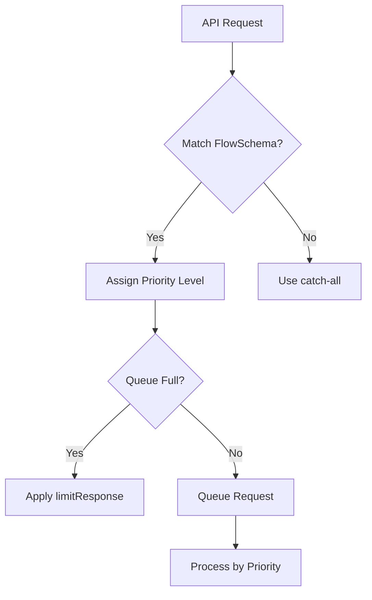

## API Priority and Fairness

API Priority and Fairness (APF) is a Kubernetes feature that ensures fair handling of requests to the API server, preventing resource starvation during high traffic periods and improving cluster stability. This critical component manages how the Kubernetes API server processes concurrent requests, replacing the older max-inflight request limiting with a more sophisticated approach that categorizes and prioritizes requests based on their source, type, and importance.

## Core Concepts

::steps
### Flow Control
- **Request categorization**: Classifies incoming requests based on attributes like user, namespace, and resource type
- **Priority levels**: Assigns different levels of importance to request categories, with critical system requests getting higher priority
- **Queue management**: Manages separate request queues for different priority levels to prevent high-priority requests from being blocked
- **Traffic shaping**: Controls the rate at which requests are processed to prevent API server overload
- **Starvation prevention**: Ensures that even low-priority requests eventually get processed, preventing complete starvation

### Fair Queuing
- **Request dispatching**: Efficiently distributes requests to available server resources
- **Flow distinction**: Groups related requests into "flows" based on shared characteristics
- **Shuffle sharding**: Uses a technique to distribute requests across multiple queues to reduce the impact of noisy neighbors
- **Concurrency limits**: Controls how many requests from each priority level can execute simultaneously
- **FIFO queuing within flows**: Processes requests in order within each flow to maintain fairness
::

## Key Components

::alert{type="info"}
API Priority and Fairness is built on two custom resources:
1. **PriorityLevelConfigurations**: Define different levels of priority for requests, including their concurrency limits, queuing configuration, and handling of excess requests. These determine how many requests of a given priority can execute simultaneously and what happens when limits are reached.
2. **FlowSchemas**: Route requests to appropriate priority levels based on attributes like user identity, namespace, resource type, and verb (GET, POST, etc.). FlowSchemas determine which priority level a given request should be assigned to and how requests are grouped into flows.
::

## Priority Level Configuration

```yaml
apiVersion: flowcontrol.apiserver.k8s.io/v1beta3
kind: PriorityLevelConfiguration
metadata:
  name: global-default
spec:
  type: Limited  # Can be 'Limited' or 'Exempt' (for critical system components)
  limited:
    assuredConcurrencyShares: 20  # Relative share of concurrency - higher values get more concurrent requests
    limitResponse:
      type: Reject  # What happens when the concurrency limit is hit - 'Reject' or 'Queue'
      queuing:
        queues: 128  # Number of queues (more queues reduce "noisy neighbor" problems)
        queueLengthLimit: 50  # Maximum number of requests per queue
        handSize: 8  # Number of queues a request can potentially be assigned to (shuffle sharding parameter)
```

This example defines a priority level named "global-default" that receives 20 concurrency shares. When the concurrency limit is reached, new requests will be rejected rather than queued. If queuing is enabled, the configuration specifies 128 queues with a maximum of 50 requests per queue, and uses a shuffle sharding approach with a hand size of 8.

## Flow Schema Configuration

::steps
### Basic Flow Schema
```yaml
apiVersion: flowcontrol.apiserver.k8s.io/v1beta3
kind: FlowSchema
metadata:
  name: service-accounts
spec:
  priorityLevelConfiguration:
    name: service-level  # References the PriorityLevelConfiguration to use
  distinguisherMethod:
    type: ByUser  # How to distinguish between flows - can be 'ByUser' or 'ByNamespace'
  matchingPrecedence: 1000  # Lower values have higher precedence when multiple FlowSchemas match
  rules:  # Define which requests match this FlowSchema
  - subjects:  # Who the rule applies to
    - kind: ServiceAccount  # Applies to all ServiceAccounts
    resourceRules:  # What API resources the rule applies to
    - apiGroups: ["*"]  # All API groups
      resources: ["*"]  # All resources
      verbs: ["*"]  # All verbs (GET, POST, etc.)
```

### Rules and Matching
```yaml
rules:
- subjects:  # The entities this rule applies to
  - kind: ServiceAccount  # A specific service account
    serviceAccount:
      name: controller  # Name of the service account
      namespace: kube-system  # Namespace of the service account
  - kind: User  # A specific user
    name: system:kube-controller-manager  # Name of the user
  resourceRules:  # Rules for API resources
  - apiGroups: ["*"]  # All API groups
    resources: ["*"]  # All resources
    verbs: ["*"]  # All verbs
  nonResourceRules:  # Rules for non-resource endpoints like /healthz
  - nonResourceURLs: ["*"]  # All non-resource URLs
    verbs: ["*"]  # All verbs
```

This example shows how to create a FlowSchema that directs requests from service accounts to a priority level called "service-level". The distinguisher method "ByUser" means each user gets its own flow. The rules section defines which requests match this FlowSchema, in this case all requests from any ServiceAccount. The second example shows more specific matching for a particular service account and user, with rules for both resource and non-resource endpoints.
::

## Predefined Configurations

::alert{type="warning"}
Kubernetes comes with several built-in APF configurations that establish a hierarchy of importance:
1. `system`: For critical system components that must function for cluster health (like API server, scheduler, and controllers)
2. `leader-election`: For controller leader election operations which are critical for controller functionality
3. `workload-high`: For important workload controllers handling core functionality like deployments and stateful sets
4. `workload-low`: For less critical workload operations such as batch jobs or cronjobs
5. `global-default`: For everything else that doesn't match a more specific FlowSchema

These built-in configurations ensure that cluster-essential operations always have priority over less critical workloads, maintaining cluster stability even under heavy load. It's generally not recommended to modify these system-defined configurations, as improper changes could affect cluster stability.
::

## Request Classification



When a request arrives at the API server:
1. The system evaluates all FlowSchemas in order of matchingPrecedence to find a match
2. Once matched, the request is assigned to the priority level specified by that FlowSchema
3. The system determines if the priority level's concurrency limit is reached
4. If the limit is reached, the system either queues or rejects the request based on the limitResponse configuration
5. Queued requests are placed into one of the available queues using shuffle sharding
6. Requests are processed according to their priority level and position in queue
7. If no FlowSchema matches, the request falls into the catch-all "global-default" configuration

This classification ensures that even during heavy API server load, critical operations continue to function while less important requests may be queued or rejected.

## Advanced Configuration

::steps
### Exempt Priority Level
```yaml
apiVersion: flowcontrol.apiserver.k8s.io/v1beta3
kind: PriorityLevelConfiguration
metadata:
  name: exempt-workloads
spec:
  type: Exempt  # 'Exempt' type means these requests bypass all APF limits
  exempt: {}    # No additional configuration needed for exempt requests
```

The Exempt priority level is special - requests assigned to this level bypass all concurrency limits and queue management. This should be used very sparingly and only for truly critical components where any delay could cause serious cluster issues. Overuse of exempt priority levels can defeat the purpose of API Priority and Fairness.

### Configuring Queue Parameters
```yaml
apiVersion: flowcontrol.apiserver.k8s.io/v1beta3
kind: PriorityLevelConfiguration
metadata:
  name: analytics-priority
spec:
  type: Limited
  limited:
    assuredConcurrencyShares: 10    # Relative priority compared to other levels
    limitResponse:
      type: Queue                   # Queue requests rather than rejecting them
      queuing:
        queues: 64                  # Number of queues - higher values reduce "noisy neighbor" problems
        queueLengthLimit: 50        # Max queue length - prevents unbounded memory growth
        handSize: 8                 # Shuffle sharding hand size - balances fairness and isolation
```

Shuffle sharding is a key concept in APF that helps balance fairness with isolation. With a handSize of 8 and 64 queues, each flow can be assigned to 8 of the 64 queues. This means that if one flow is very busy, it will only impact a fraction of the queues, reducing the "noisy neighbor" problem where a busy tenant impacts others.

The optimal values for these parameters depend on your cluster size, workload patterns, and priorities:
- Higher queue counts provide better isolation but consume more memory
- Larger handSize improves fairness but reduces isolation
- Higher queueLengthLimit allows more requests to be queued but increases memory usage
::

## Monitoring APF

::alert{type="info"}
The API server exposes detailed metrics for APF, enabling administrators to understand and optimize request handling:

1. `apiserver_flowcontrol_rejected_requests_total`: Number of rejected requests by priority level and flow schema
2. `apiserver_flowcontrol_dispatched_requests_total`: Number of dispatched requests by priority level and flow schema
3. `apiserver_flowcontrol_current_inqueue_requests`: Current number of requests in queues by priority level
4. `apiserver_flowcontrol_request_queue_length_after_enqueue`: Queue length after enqueue by priority level
5. `apiserver_flowcontrol_request_concurrency_limit`: Concurrency limits by priority level
6. `apiserver_flowcontrol_request_execution_seconds`: Request execution latency by priority level and flow schema
7. `apiserver_flowcontrol_request_wait_seconds`: Time requests spend waiting in queue by priority level and flow schema

These metrics can be collected by Prometheus and visualized in dashboards to identify bottlenecks, tune APF configurations, and ensure appropriate resource allocation across different types of requests. Monitoring these metrics is essential for ensuring your APF configuration is working as expected and for troubleshooting API server performance issues.
::

## Enabling APF

```yaml
# kube-apiserver configuration
--feature-gates=APIPriorityAndFairness=true   # Enable the APF feature gate
--enable-priority-and-fairness=true           # Enable the APF functionality
--max-requests-inflight=0                     # Optional: disable the old limiting mechanism
--max-mutating-requests-inflight=0            # Optional: disable the old limiting mechanism
```

Starting with Kubernetes 1.20, API Priority and Fairness became beta and is enabled by default. In Kubernetes 1.23 and later, the feature gates aren't required as APF is enabled by default. However, you may need to explicitly set the `--enable-priority-and-fairness=true` flag in some environments.

When transitioning from the older max-inflight limiting approach to APF, you can run both simultaneously (which is the default) or completely disable the old mechanism by setting the max-inflight values to 0. Running both provides a safety net during the transition, but eventually switching completely to APF provides the most benefits.

## Use Cases

::steps
### Critical API Protection
- **Protect system components**: Ensure core Kubernetes components like controllers and schedulers always have API access
- **Ensure cluster operation**: Maintain cluster health monitoring and management operations even under heavy load
- **Prevent admin lockout**: Guarantee administrators can always access the cluster to fix issues, even during overload
- **Critical path prioritization**: Ensure that operations in the critical path (like pod scheduling) take precedence
- **Control plane protection**: Shield the Kubernetes control plane from being overwhelmed by application workloads

For example, in a production cluster running hundreds of applications, during a mass restart event, APF ensures the scheduler and controllers can still function to restore the system, while potentially delaying less critical application-initiated API calls.

### Multi-tenant Fairness
- **Resource fairness between tenants**: Ensure each tenant gets their fair share of API server resources
- **Prevent tenant starvation**: Stop aggressive tenants from consuming all API resources and starving others
- **Noisy neighbor mitigation**: Isolate the impact of chatty applications to prevent them from affecting others
- **Workload isolation**: Separate production and development workloads to ensure production takes priority
- **Shared cluster management**: Enable multiple teams to share a cluster without interfering with each other

For example, in a shared development cluster where multiple teams deploy applications, APF prevents one team's CI/CD pipeline that makes hundreds of API calls per minute from blocking another team's ability to deploy or debug their applications.
::

## Best Practices

::alert{type="warning"}
1. **Avoid modifying built-in configurations**: The default configurations are carefully designed for cluster stability; modify them only if absolutely necessary and with thorough testing
2. **Create custom priority levels for specific workloads**: Define new priority levels for unique workloads rather than trying to fit everything into existing levels
3. **Test configurations in non-production environments**: Always validate APF changes in test environments first, as misconfiguration can affect cluster stability
4. **Monitor APF metrics to fine-tune settings**: Use the metrics exposed by the API server to identify bottlenecks and adjust configurations
5. **Consider user and namespace in flow schemas**: Structure flow schemas to match your organizational boundaries, using namespace and user identity to direct requests
6. **Set appropriate concurrency shares based on importance**: Allocate higher concurrency shares to more important workloads, but maintain balance to prevent starvation
7. **Use exempt priority level sparingly**: The exempt priority level bypasses all fairness controls and should only be used for truly critical system components
8. **Adjust queue parameters based on cluster size**: Larger clusters may need more queues and higher concurrency limits
9. **Plan for graceful degradation**: Configure less important workloads to be rejected first during overload scenarios
10. **Document your custom APF configurations**: Maintain clear documentation of any custom APF settings to aid in troubleshooting and handover
::

## Troubleshooting

::steps
### Common Issues
- **Too many rejected requests**: Indicates insufficient concurrency limits or queue sizes for the workload
- **Unexpected request queuing**: Requests may be categorized into a different priority level than expected
- **Priority level misconfiguration**: Incorrect concurrency shares or queue parameters causing bottlenecks
- **Flow schema conflicts**: Multiple flow schemas matching the same requests with unclear precedence
- **Performance degradation**: Overall API server slowdown due to APF overhead or misconfiguration
- **System component disruption**: Critical components being incorrectly throttled due to wrong priority levels
- **Inconsistent request handling**: Some requests processed promptly while similar ones face delays

### Diagnostic Approaches
```bash
# Check APF configuration
kubectl get prioritylevelconfigurations.flowcontrol.apiserver.k8s.io
kubectl get flowschemas.flowcontrol.apiserver.k8s.io

# View metrics
kubectl get --raw /metrics | grep apiserver_flowcontrol

# Check for rejected requests
kubectl get --raw /metrics | grep apiserver_flowcontrol_rejected_requests_total

# Check current queue status
kubectl get --raw /metrics | grep apiserver_flowcontrol_current_inqueue_requests

# Check execution and wait times
kubectl get --raw /metrics | grep apiserver_flowcontrol_request_execution_seconds
kubectl get --raw /metrics | grep apiserver_flowcontrol_request_wait_seconds

# View detailed configuration
kubectl describe prioritylevelconfiguration <name>
kubectl describe flowschema <name>

# Check which flow schema is handling specific requests
kubectl get --raw /debug/api_priority_and_fairness/dump_priority_levels

# Examine which requests are being queued or rejected
kubectl logs -n kube-system -l component=kube-apiserver | grep -i "priority and fairness"
```

When troubleshooting APF issues:
1. First identify if requests are being rejected, queued, or just slow
2. Determine which priority level and flow schema are handling the affected requests
3. Check if concurrency limits or queue parameters need adjustment
4. Verify that critical requests are being classified into the appropriate priority levels
5. Look for patterns in the metrics that might indicate misconfigurations
::

## Example Scenarios

::alert{type="info"}
### Scenario: Protecting Critical Components
Create a high-priority flow schema for critical components:
```yaml
apiVersion: flowcontrol.apiserver.k8s.io/v1beta3
kind: FlowSchema
metadata:
  name: critical-controllers
spec:
  priorityLevelConfiguration:
    name: system-high
  matchingPrecedence: 100  # Lower value means higher precedence
  rules:
  - subjects:
    - kind: ServiceAccount
      serviceAccount:
        name: critical-controller
        namespace: kube-system
    resourceRules:
    - apiGroups: ["*"]
      resources: ["*"]
      verbs: ["*"]
```

This example ensures that a critical controller service account always gets high-priority API access. This is useful for components that must function even during API server overload, such as monitoring systems, backup controllers, or security enforcement tools.

### Scenario: Tenant Isolation in Multi-tenant Clusters
```yaml
apiVersion: flowcontrol.apiserver.k8s.io/v1beta3
kind: PriorityLevelConfiguration
metadata:
  name: tenant-operations
spec:
  type: Limited
  limited:
    assuredConcurrencyShares: 30
    limitResponse:
      type: Queue
      queuing:
        queues: 128
        queueLengthLimit: 100
        handSize: 6

---
apiVersion: flowcontrol.apiserver.k8s.io/v1beta3
kind: FlowSchema
metadata:
  name: tenant-api-requests
spec:
  priorityLevelConfiguration:
    name: tenant-operations
  distinguisherMethod:
    type: ByNamespace  # Separate flows by namespace
  matchingPrecedence: 500
  rules:
  - subjects:
    - kind: Group
      name: system:authenticated
    resourceRules:
    - apiGroups: ["*"]
      resources: ["*"]
      verbs: ["*"]
    namespaces:  # Apply to tenant namespaces
      - "tenant-a-*"
      - "tenant-b-*"
      - "tenant-c-*"
```

This example creates a dedicated priority level for tenant operations with appropriate concurrency shares and queue parameters. It then routes all authenticated requests in tenant namespaces to this priority level, using ByNamespace distinguisher to ensure each tenant namespace gets its own fair share of resources. This prevents one tenant from monopolizing the API server at the expense of others.
::

## Advanced Topics

::steps
### Multiple API Servers
- **Configuration consistency**: Ensure all API servers have identical APF configurations to prevent inconsistent request handling
- **Load balancing implications**: Consider how load balancers distribute requests across API servers when designing APF settings
- **HA considerations**: In high-availability setups, ensure APF doesn't interfere with API server failover mechanisms
- **Metric aggregation**: Aggregate APF metrics across all API servers for a complete view of request handling
- **Cross-server fairness**: Understand that APF operates independently on each API server, so global fairness requires coordination

When running multiple API servers, each server maintains its own independent APF system. This means a request that might be queued on one API server could be immediately processed on another. Consider using consistent hashing at the load balancer level to direct similar requests to the same API server for more predictable behavior.

### Custom Metrics
- **Creating custom APF metrics**: Develop additional metrics to monitor specific aspects of API request handling
- **Integrating with monitoring**: Configure Prometheus to collect and alert on APF metrics
- **Setting alerts**: Create alerts for excessive request rejection or queuing to proactively address issues
- **Performance dashboards**: Build dashboards that visualize APF behavior over time
- **Historical trend analysis**: Analyze long-term trends to optimize APF configurations

Example Prometheus alert for detecting excessive API request rejection:
```yaml
- alert: KubeAPIServerRejectedRequests
  expr: sum(rate(apiserver_flowcontrol_rejected_requests_total[5m])) by (priority_level, flow_schema) > 10
  for: 15m
  labels:
    severity: warning
  annotations:
    summary: "Kubernetes API server is rejecting too many requests"
    description: "API server is rejecting requests for priority level {{ $labels.priority_level }} 
                 and flow schema {{ $labels.flow_schema }} at a rate of {{ $value }} per second 
                 over the last 15 minutes."
```
::

## Compatibility and Version Support

::alert{type="warning"}
API Priority and Fairness has evolved across Kubernetes versions:
1. Introduced as alpha in v1.18 with basic functionality and flowcontrol.apiserver.k8s.io/v1alpha1 API
2. Beta in v1.20 with improved stability and flowcontrol.apiserver.k8s.io/v1beta1 API, enabled by default
3. Improved in v1.22 with configurable queuing configuration and flowcontrol.apiserver.k8s.io/v1beta2 API
4. Enhanced in v1.24 with better metrics and observability features
5. Further refined in v1.25 with performance improvements and stability enhancements
6. Approaching stability in v1.26 with flowcontrol.apiserver.k8s.io/v1beta3 API and extensive production testing
7. Finally promoted to stable in v1.29 with the flowcontrol.apiserver.k8s.io/v1 API

When migrating between Kubernetes versions, be aware of API version changes:
- v1alpha1 resources will need to be migrated to v1beta1 when upgrading to v1.20+
- v1beta1 resources will need to be migrated to v1beta2 when upgrading to v1.22+
- v1beta2 resources will need to be migrated to v1beta3 when upgrading to v1.26+
- v1beta3 resources will eventually need to be migrated to v1 in future versions

Always check the Kubernetes release notes for specific APF changes when upgrading, as configuration formats and default behaviors may change between versions.
::

## Migration Considerations

::steps
### From max-in-flight Limits
- **Legacy settings**: `--max-requests-inflight` and `--max-mutating-requests-inflight` provide simple global limits on concurrent requests
- **More granular control with APF**: APF provides fine-grained control based on request attributes rather than simple global limits
- **Transition strategy**: Run both systems in parallel initially, then gradually shift reliance to APF
- **Behavioral differences**: APF queues and prioritizes requests rather than simply rejecting them when limits are reached
- **Performance impact assessment**: Monitor API server performance during transition to ensure no degradation

The traditional max-in-flight limits are a blunt instrument that treats all requests equally. For example, with `--max-requests-inflight=400`, the 401st request is rejected regardless of its importance. APF, in contrast, might allow a critical system request through while queuing a less important request, even if the overall number of requests is high.

### Upgrade Path
```bash
# Check existing settings
kubectl -n kube-system get configmap kube-apiserver -o yaml | grep max-

# Gradually transition
# 1. Enable APF alongside max-in-flight
# 2. Monitor APF metrics
# 3. Adjust APF configurations
# 4. Remove max-in-flight limits
```

When transitioning from max-in-flight to APF, follow these steps:

1. **Initial audit**: Document current settings and understand their impact
   ```bash
   kubectl -n kube-system get configmap kube-apiserver -o yaml | grep max-requests-inflight
   kubectl -n kube-system get configmap kube-apiserver -o yaml | grep max-mutating-requests-inflight
   ```

2. **Enable APF**: Turn on APF without disabling max-in-flight
   ```yaml
   # kube-apiserver configuration
   --feature-gates=APIPriorityAndFairness=true
   --enable-priority-and-fairness=true
   # Keep existing max-in-flight settings during transition
   ```

3. **Create baseline configurations**: Establish initial APF configurations that approximate your current limits
   ```yaml
   apiVersion: flowcontrol.apiserver.k8s.io/v1beta3
   kind: PriorityLevelConfiguration
   metadata:
     name: workload-standard
   spec:
     type: Limited
     limited:
       assuredConcurrencyShares: 100
       limitResponse:
         type: Queue
         queuing:
           queues: 64
           queueLengthLimit: 50
           handSize: 6
   ```

4. **Monitor and adjust**: Use metrics to fine-tune APF settings while still protected by max-in-flight
   ```bash
   # Track rejection rates
   kubectl get --raw /metrics | grep apiserver_flowcontrol_rejected_requests_total
   # Monitor queue lengths
   kubectl get --raw /metrics | grep apiserver_flowcontrol_current_inqueue_requests
   ```

5. **Final transition**: Once confident in APF configuration, consider disabling max-in-flight
   ```yaml
   # kube-apiserver configuration
   --max-requests-inflight=0
   --max-mutating-requests-inflight=0
   ```