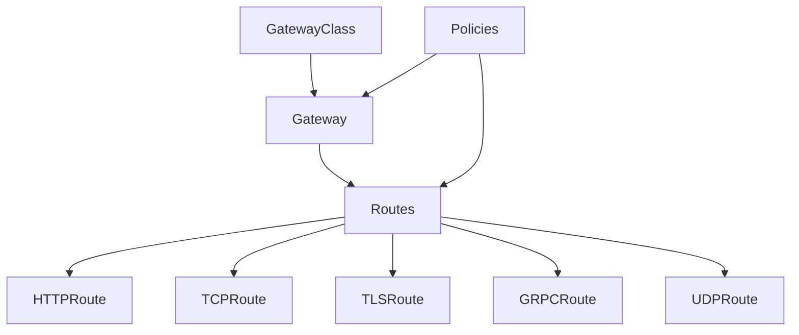

## Kubernetes Gateway API

The Gateway API is a next-generation networking API for Kubernetes that provides advanced traffic routing capabilities, moving beyond the limitations of Ingress resources for more complex networking scenarios. It offers a more expressive, extensible, and role-oriented approach to configuring service networking in Kubernetes, enabling sophisticated traffic management, multi-team collaboration, and better support for multiple protocols beyond HTTP.

## Gateway API Overview

::steps
### Core Concepts
- **Expressive, role-oriented API**: Designed with clear separation of concerns for infrastructure providers, cluster operators, and application developers
- **Extensible resource model**: Built to be extended with new capabilities and custom resources without breaking existing implementations
- **Advanced routing capabilities**: Supports sophisticated traffic management including header-based routing, traffic splitting, and multiple protocols
- **Multi-tenant friendly**: Enables secure sharing of networking resources across teams and namespaces with clear boundaries
- **Improved role delegation**: Allows cluster administrators to delegate specific networking responsibilities to application teams

### Key Resources
- **GatewayClass**: Infrastructure configuration that defines a specific type of load balancing implementation (similar to StorageClass)
- **Gateway**: Deployment configuration that represents a specific instance of the load balancing infrastructure
- **HTTPRoute**: HTTP traffic routing rules that define how HTTP requests should be processed and forwarded
- **GRPCRoute**: gRPC traffic routing with protocol-specific features like service and method matching
- **TCPRoute**: TCP traffic routing for non-HTTP protocols requiring raw TCP handling
- **TLSRoute**: TLS traffic routing based on SNI (Server Name Indication) for TLS passthrough scenarios
- **ReferenceGrant**: Cross-namespace references that explicitly allow resources in one namespace to reference resources in another
::

## Gateway API Architecture

::alert{type="info"}
The Gateway API follows a layered design with clear separation of concerns:
1. **GatewayClass**: Defines a type of load balancing infrastructure, owned by infrastructure providers or cluster operators. It represents the underlying implementation (e.g., a specific load balancer type, service mesh, or ingress controller)
2. **Gateway**: Represents a specific instance of the infrastructure, typically owned by platform or network administrators. It's a deployment of a particular GatewayClass with specific listeners
3. **Route resources**: Define traffic routing rules, typically owned by application developers. These attach to Gateways and control traffic flow to backend services
4. **Policy attachments**: Add cross-cutting functionality like rate limiting, authentication, or traffic metrics. These can attach to Gateways or Routes

This layered architecture enables clear ownership boundaries and simplifies multi-team collaboration on network configuration.
::



## Basic Gateway Example

```yaml
apiVersion: gateway.networking.k8s.io/v1beta1
kind: Gateway
metadata:
  name: prod-web-gateway
  namespace: prod
spec:
  gatewayClassName: acme-lb     # References the GatewayClass defining the implementation
  listeners:                     # Defines where and how to listen for traffic
  - name: http                   # Listener for HTTP traffic
    protocol: HTTP               # Protocol to use (HTTP, HTTPS, TLS, TCP, UDP)
    port: 80                     # Port to listen on
    allowedRoutes:               # Controls which Routes can attach to this listener
      namespaces:                # Namespace selection criteria
        from: Selector           # Use a label selector for namespaces
        selector:                # Select namespaces with label environment=prod
          matchLabels:
            environment: prod
  - name: https                  # Listener for HTTPS traffic
    protocol: HTTPS              # HTTPS protocol
    port: 443                    # Standard HTTPS port
    tls:                         # TLS configuration
      certificateRefs:           # References to TLS certificates
      - name: prod-web-cert      # Name of the Secret containing the certificate
    allowedRoutes:               # Which Routes can attach to this listener
      namespaces:
        from: Same               # Only allow Routes from the same namespace
```

This Gateway example defines:
1. Two listeners - one for HTTP (port 80) and one for HTTPS (port 443)
2. Namespace controls that determine which Routes can attach to each listener
3. TLS configuration for the HTTPS listener referencing a certificate
4. Implementation details via the gatewayClassName reference

The Gateway object is typically managed by platform or networking teams, with application teams creating Routes that attach to it.

## HTTPRoute Configuration

::steps
### Basic HTTP Routing
```yaml
apiVersion: gateway.networking.k8s.io/v1beta1
kind: HTTPRoute
metadata:
  name: store-route
  namespace: store
spec:
  parentRefs:                        # References to parent Gateway(s)
  - name: prod-web-gateway           # Name of the Gateway
    namespace: prod                  # Namespace of the Gateway
  hostnames:                         # Hostnames this route applies to
  - "store.example.com"              # Route handles requests for this domain
  rules:                             # Routing rules
  - matches:                         # Match conditions for this rule
    - path:                          # Path-based matching
        type: PathPrefix             # Match type: PathPrefix, Exact, or RegularExpression
        value: /catalog              # Match path prefix /catalog
    backendRefs:                     # Backend service reference
    - name: catalog-svc              # Service name
      port: 8080                     # Service port
  - matches:                         # Another rule
    - path:
        type: PathPrefix
        value: /cart                 # Match path prefix /cart
    backendRefs:
    - name: cart-svc                 # Different backend service
      port: 8080
```

This basic HTTPRoute:
1. Attaches to the `prod-web-gateway` in the `prod` namespace
2. Handles requests for the hostname "store.example.com"
3. Routes requests with path prefix `/catalog` to the `catalog-svc` service
4. Routes requests with path prefix `/cart` to the `cart-svc` service

### Advanced HTTP Routing
```yaml
apiVersion: gateway.networking.k8s.io/v1beta1
kind: HTTPRoute
metadata:
  name: advanced-routing
  namespace: store
spec:
  parentRefs:
  - name: prod-web-gateway
    namespace: prod
  hostnames:
  - "store.example.com"
  rules:
  - matches:
    - path:
        type: PathPrefix              # Path prefix matching
        value: /api                   # Match /api path
      headers:                        # Header-based matching
      - name: Version                 # Header name
        value: v2                     # Header value to match
    backendRefs:                      # Multiple backends with weights
    - name: api-v2-svc                # Primary service (90% of traffic)
      port: 8080
      weight: 90                      # Weight for traffic splitting
    - name: api-v2-beta-svc           # Secondary service (10% of traffic)
      port: 8080
      weight: 10                      # Lower weight for canary testing
```

This advanced HTTPRoute demonstrates:
1. Combining path and header matching for more specific routing
2. Traffic splitting across multiple backend services using weights
3. Canary deployment pattern with 90/10 traffic distribution
4. Sophisticated request matching that considers both path and headers

These capabilities allow for advanced deployment patterns like A/B testing, canary releases, and gradual migrations between service versions.
::

## Cross-Namespace Routing

::alert{type="warning"}
For security reasons, cross-namespace references require explicit authorization using ReferenceGrant. This security feature prevents unauthorized access to services across namespace boundaries:

```yaml
apiVersion: gateway.networking.k8s.io/v1beta1
kind: ReferenceGrant
metadata:
  name: allow-store-routes
  namespace: prod            # The namespace containing the target resources
spec:
  from:                      # Source of the reference
  - group: gateway.networking.k8s.io
    kind: HTTPRoute          # Allow HTTPRoutes to reference resources
    namespace: store         # Only from the 'store' namespace
  to:                        # Target resources
  - group: ""                # Core API group (for Services)
    kind: Service            # Allow references to Services

# Usage example:
# HTTPRoute in 'store' namespace can reference Services in 'prod' namespace
```

ReferenceGrant provides a precise security model for cross-namespace routing:
1. It's defined in the target namespace (where the referenced resources exist)
2. It explicitly lists which resources from which namespaces can make references
3. It specifies which kinds of resources can be referenced
4. Without a ReferenceGrant, cross-namespace references are rejected by controllers

This model follows the principle of least privilege, requiring explicit opt-in for cross-namespace references rather than allowing them by default, enhancing the security posture of multi-tenant clusters.
::

## TLS Configuration

```yaml
apiVersion: gateway.networking.k8s.io/v1beta1
kind: Gateway
metadata:
  name: tls-gateway
  namespace: prod
spec:
  gatewayClassName: acme-lb           # Type of Gateway implementation
  listeners:
  - name: https                       # HTTPS listener
    protocol: HTTPS                   # Protocol is HTTPS (HTTP+TLS)
    port: 443                         # Standard HTTPS port
    tls:
      mode: Terminate                 # TLS termination mode
                                      # Other modes include: Passthrough (forward encrypted)
      certificateRefs:                # References to TLS certificates
      - name: example-com-cert        # Name of the certificate
        kind: Secret                  # Kind of resource (Secret)
                                      # Must be a TLS secret with cert and key
    allowedRoutes:
      namespaces:
        from: All                     # Allow routes from all namespaces
```

This TLS configuration demonstrates:
1. **TLS Termination**: The Gateway terminates TLS connections (decrypts traffic)
2. **Certificate References**: References a Kubernetes Secret containing TLS certificate and private key
3. **Namespace Permissions**: Allows Routes from all namespaces to attach to this listener

The Gateway API supports multiple TLS modes:
- **Terminate**: The Gateway handles TLS termination (decryption)
- **Passthrough**: Encrypted traffic is passed through to backend services (for end-to-end encryption)

For production systems, you might also configure:
- Multiple certificates for different domains
- Certificate rotation strategies
- Automatic certificate management with cert-manager
- TLS version and cipher suite restrictions

## Traffic Splitting and Weighted Routing

::steps
### Canary Deployments
```yaml
apiVersion: gateway.networking.k8s.io/v1beta1
kind: HTTPRoute
metadata:
  name: canary-route
  namespace: store
spec:
  parentRefs:
  - name: prod-web-gateway            # Parent Gateway
  hostnames:
  - "api.example.com"                 # Hostname to match
  rules:
  - matches:
    - path:
        type: PathPrefix               # Path matching type
        value: /service                # Path to match
    backendRefs:                       # Multiple backends with weights
    - name: service-v1                 # Stable version (receives 90% of traffic)
      port: 8080
      weight: 90                       # 90% of traffic goes to v1
    - name: service-v2                 # Canary version (receives 10% of traffic)
      port: 8080
      weight: 10                       # 10% of traffic goes to v2
```

This canary deployment pattern enables:
1. **Gradual rollout**: New versions can be tested with a small percentage of traffic
2. **Risk mitigation**: Limits the impact of potential issues in the new version
3. **Progressive delivery**: Weights can be adjusted over time to increase traffic to the new version
4. **Performance comparison**: Traffic to both versions allows performance comparison
5. **Quick rollback**: Simply adjust weights to 100/0 to roll back if issues are detected

### Header-Based Routing
```yaml
apiVersion: gateway.networking.k8s.io/v1beta1
kind: HTTPRoute
metadata:
  name: header-based-route
spec:
  parentRefs:
  - name: prod-web-gateway            # Parent Gateway
  rules:
  - matches:                          # Match based on User-Agent header
    - headers:
      - name: User-Agent              # Header name to match
        value: ".*Mobile.*"           # Regular expression pattern
        type: RegularExpression       # Match type
    backendRefs:
    - name: mobile-frontend           # Route to mobile-optimized backend
      port: 8080
  - matches:                          # Second match rule for desktop
    - headers:
      - name: User-Agent
        value: ".*Desktop.*"
        type: RegularExpression
    backendRefs:
    - name: desktop-frontend          # Route to desktop-optimized backend
      port: 8080
```

Header-based routing enables sophisticated traffic management:
1. **Device-specific routing**: Different backends for mobile vs. desktop users
2. **Feature targeting**: Route users with specific headers to feature-specific implementations
3. **Testing with specific users**: Target internal users with custom headers
4. **API versioning**: Route based on API version headers
5. **Geographic routing**: Route based on geolocation headers from edge proxies

You can combine header matching with path matching and weights for even more sophisticated routing scenarios.
::

## TCPRoute and GRPCRoute

::alert{type="info"}
Gateway API supports multiple protocol-specific route types, providing native handling for different protocols beyond HTTP:

```yaml
# TCPRoute example
apiVersion: gateway.networking.k8s.io/v1alpha2
kind: TCPRoute
metadata:
  name: tcp-app-route
spec:
  parentRefs:
  - name: production-gateway          # Parent Gateway with TCP listener
  rules:
  - backendRefs:                      # TCP has simplified routing (no path/header matching)
    - name: tcp-app-svc               # Backend service for TCP traffic
      port: 8080                      # Port number

# GRPCRoute example
apiVersion: gateway.networking.k8s.io/v1alpha2
kind: GRPCRoute
metadata:
  name: grpc-route
spec:
  parentRefs:
  - name: grpc-gateway                # Parent Gateway
  hostnames:
  - "grpc.example.com"                # Hostname for gRPC service
  rules:
  - matches:
    - method:                         # gRPC-specific matching
        service: shipping.ShippingService  # gRPC service name
                                      # Optional: add method: "Track" for method-specific routing
    backendRefs:
    - name: shipping-svc              # Backend service implementing the gRPC service
      port: 9000                      # Service port
```

The Gateway API provides protocol-aware routing:

1. **TCPRoute**:
   - Simple TCP forwarding without HTTP-specific features
   - Useful for databases, messaging systems, and custom protocols
   - Limited matching capabilities (no path/header matching)
   - Can route to different backends based on listener or port

2. **GRPCRoute**:
   - Protocol-aware routing for gRPC services
   - Match on gRPC service and method names
   - Support for header matching and traffic splitting
   - Better visibility and control for gRPC microservices

3. **Other route types**:
   - **TLSRoute**: For TLS passthrough scenarios
   - **UDPRoute**: For UDP protocols (alpha)

This protocol diversity enables unified management of network traffic beyond what was possible with Ingress, making Gateway API suitable for a wider range of application networking scenarios.
::

## Integration with Service Mesh

::steps
### Istio Integration
- **Istio implements Gateway API**: Istio fully supports Gateway API as a first-class API
- **Consistent routing model**: Unified approach for north-south (ingress) and east-west (service-to-service) traffic
- **Mesh-wide traffic policies**: Apply consistent policies across both Gateway and mesh traffic
- **Enhanced telemetry**: Detailed observability for all traffic through Gateways
- **Advanced security features**: mTLS, authorization policies, and certificate management

Example Istio Gateway API implementation:
```yaml
# Install Istio Gateway API controller
$ istioctl install --set components.ingressGateways.enabled=true \
                  --set values.pilot.env.PILOT_ENABLED_SERVICE_APIS=true

# Istio automatically implements GatewayClass
apiVersion: gateway.networking.k8s.io/v1beta1
kind: GatewayClass
metadata:
  name: istio
spec:
  controllerName: istio.io/gateway-controller
```

### Linkerd Integration
- **Gateway API compatibility**: Linkerd works with Gateway API for ingress traffic
- **Simplified service mesh model**: Lightweight proxy focusing on core functionality
- **Automatic mTLS**: Transparent mutual TLS for secure communication
- **Traffic metrics**: Rich observability with Prometheus integration
- **Lightweight implementation**: Lower resource footprint than other mesh solutions

Example Linkerd and Gateway API:
```yaml
# Linkerd typically works with external Gateway implementations
apiVersion: gateway.networking.k8s.io/v1beta1
kind: Gateway
metadata:
  name: linkerd-gateway
  namespace: linkerd-gateway
  annotations:
    # Annotation to inject Linkerd proxy
    linkerd.io/inject: enabled
spec:
  gatewayClassName: nginx
  listeners:
  - name: http
    port: 80
    protocol: HTTP
```

Service meshes enhance Gateway API implementations by providing:
1. End-to-end encryption with mTLS
2. Detailed metrics and tracing
3. Consistent policy enforcement
4. Advanced traffic management capabilities
5. Circuit breaking and resilience features
::

## Policy Attachment

```yaml
# Example using Gateway API policy extension
apiVersion: policy.gateway.networking.k8s.io/v1alpha1
kind: HTTPRouteRateLimitPolicy
metadata:
  name: rate-limit-policy
spec:
  targetRef:                                 # Reference to the object this policy applies to
    group: gateway.networking.k8s.io         # API group of the target
    kind: HTTPRoute                          # Kind of the target
    name: example-route                      # Name of the target
  limits:
  - requests: 100                            # Number of requests allowed
    period: 1m                               # Time period (1 minute)
```

Policy attachment is a powerful extension mechanism in the Gateway API that allows for modular, reusable policies to be applied to routes and gateways. This approach:

1. **Separates concerns**: Traffic routing logic remains separate from cross-cutting policies
2. **Enables reuse**: The same policy can be applied to multiple routes
3. **Promotes standardization**: Common policies can be templated and consistently applied
4. **Supports role separation**: Security teams can manage policies while app teams manage routes

Other policy types include:

```yaml
# Timeout policy example
apiVersion: policy.gateway.networking.k8s.io/v1alpha1
kind: HTTPRouteTimeoutPolicy
metadata:
  name: timeout-policy
spec:
  targetRef:
    group: gateway.networking.k8s.io
    kind: HTTPRoute
    name: example-route
  request:
    timeout: 10s    # Request timeout
  backendRequest:
    timeout: 5s     # Backend request timeout
```

```yaml
# Retry policy example
apiVersion: policy.gateway.networking.k8s.io/v1alpha1
kind: HTTPRouteRetryPolicy
metadata:
  name: retry-policy
spec:
  targetRef:
    group: gateway.networking.k8s.io
    kind: HTTPRoute
    name: example-route
  retryOn:
  - "5xx"           # Retry on 5xx errors
  numRetries: 3     # Maximum number of retries
  backoff:
    baseInterval: 100ms
    maxInterval: 1s
```

The policy attachment model is still evolving, with different implementations supporting various policy types. Check your specific Gateway implementation for supported policies.

## Multi-Cluster Gateway Support

::alert{type="warning"}
The Gateway API is designed to support multi-cluster scenarios through various approaches:

1. **Federation of Gateway resources**: Centralized management of Gateway resources across multiple clusters
   ```yaml
   # Example concept (implementation varies by provider)
   apiVersion: gateway.federation.example.io/v1alpha1
   kind: FederatedGateway
   metadata:
     name: global-gateway
   spec:
     template:
       apiVersion: gateway.networking.k8s.io/v1beta1
       kind: Gateway
       spec:
         gatewayClassName: multi-cluster-lb
         listeners:
         - name: http
           port: 80
           protocol: HTTP
     placement:
       clusters:
       - name: cluster-east
       - name: cluster-west
   ```

2. **Mirroring Gateway configurations**: Replicating identical Gateway configurations across clusters
   - Manual or automated replication of Gateway and Route resources
   - Consistent naming and structure across environments
   - Configuration management tools (Argo CD, Flux) to maintain consistency

3. **Service export/import models**: Explicitly sharing services between clusters
   ```yaml
   # Example using Kubernetes multi-cluster services (MCS)
   apiVersion: multicluster.x-k8s.io/v1alpha1
   kind: ServiceExport
   metadata:
     name: backend-svc
     namespace: prod
   ---
   # In another cluster
   apiVersion: multicluster.x-k8s.io/v1alpha1
   kind: ServiceImport
   metadata:
     name: backend-svc
     namespace: prod
   ```

4. **Multi-cluster service discovery**: Discovering and accessing services across cluster boundaries
   - DNS-based approaches (e.g., CoreDNS with multicluster plugin)
   - Service mesh implementations (Istio, Linkerd multi-cluster)
   - Custom multi-cluster service registries

5. **Cross-cluster load balancing**: Distributing traffic across services in multiple clusters
   - Global load balancers that direct traffic to regional/zonal clusters
   - Health-aware routing between clusters
   - Proximity-based routing to reduce latency

Multi-cluster Gateway setups require additional components and configurations beyond standard Gateway API resources. Major implementers like Istio, Cilium, and cloud providers offer various approaches to multi-cluster networking that build on Gateway API foundations.
::

## Comparison with Ingress

::steps
### Limitations of Ingress
- **Limited protocol support**: Primarily designed for HTTP/HTTPS only
- **Basic routing capabilities**: Simple path-based routing with limited matching options
- **Annotation-based extensions**: Non-standard extensions via implementation-specific annotations
  ```yaml
  # Ingress with implementation-specific annotations
  apiVersion: networking.k8s.io/v1
  kind: Ingress
  metadata:
    annotations:
      nginx.ingress.kubernetes.io/rewrite-target: /$2
      nginx.ingress.kubernetes.io/ssl-redirect: "true"
      # Annotations differ between implementations
  ```
- **Implementation inconsistencies**: Behavior varies significantly between different controllers
- **Limited role separation**: No clear boundaries between infrastructure, network, and application teams

### Gateway API Advantages
- **Protocol diversity**: Native support for HTTP, HTTPS, TCP, TLS, gRPC, and UDP
  ```yaml
  # Gateway supporting multiple protocols
  listeners:
  - name: http
    protocol: HTTP
    port: 80
  - name: tcp-db
    protocol: TCP
    port: 5432
  ```
- **Advanced traffic routing**: Sophisticated matching and traffic splitting capabilities
  ```yaml
  # Advanced matching in Gateway API
  matches:
  - path:
      type: PathPrefix
      value: /api
    headers:
    - name: Version
      value: "v2"
    queryParams:
    - name: debug
      value: "true"
  ```
- **Standardized extensions**: Well-defined extension points with policy attachment model
  ```yaml
  # Standard policy attachment
  apiVersion: policy.gateway.networking.k8s.io/v1alpha1
  kind: HTTPRouteRetryPolicy
  metadata:
    name: standard-retry
  spec:
    targetRef:
      kind: HTTPRoute
      name: api-route
    retryOn: ["5xx"]
  ```
- **Consistent implementations**: More standardized behavior across different controllers
  ```yaml
  # Same configuration works across implementations
  apiVersion: gateway.networking.k8s.io/v1beta1
  kind: HTTPRoute
  metadata:
    name: portable-route
  spec:
    hostnames: ["app.example.com"]
    rules:
    - matches:
      - path:
          type: PathPrefix
          value: /api
  ```
- **Clear separation of responsibilities**: Role-oriented API design with explicit boundaries
  ```yaml
  # Infrastructure team manages GatewayClass
  apiVersion: gateway.networking.k8s.io/v1beta1
  kind: GatewayClass
  metadata:
    name: production-class
  spec:
    controllerName: example.net/gateway-controller
  
  # Network team manages Gateway
  apiVersion: gateway.networking.k8s.io/v1beta1
  kind: Gateway
  metadata:
    name: production-gateway
  spec:
    gatewayClassName: production-class
  
  # Application team manages HTTPRoute
  apiVersion: gateway.networking.k8s.io/v1beta1
  kind: HTTPRoute
  metadata:
    name: myapp-route
  ```
- **Improved multi-team workflows**: Delegation of specific networking responsibilities
  ```yaml
  # Gateway with namespace delegation
  allowedRoutes:
    namespaces:
      from: Selector
      selector:
        matchLabels:
          team: frontend
  ```
::

## Implementation Status

::alert{type="info"}
The Gateway API has different maturity levels:
1. **Core resources (Gateway, HTTPRoute)**: Beta status in v1.2+ - suitable for production use
2. **TLSRoute, TCPRoute**: Alpha status - stable API but may change in future versions
3. **GRPCRoute, UDPRoute**: Alpha status - API may change significantly
4. **Policy attachment**: Alpha status - experimental feature with evolving API

Major implementations include:
- **Contour**: HashiCorp's L7 proxy with robust Gateway API support
- **Istio**: Full-featured service mesh with advanced Gateway API integration
- **Kong**: API gateway with Gateway API controller
- **Traefik**: Cloud-native edge router with Gateway API support
- **Envoy Gateway**: Official Envoy-based implementation
- **Cilium**: eBPF-based networking with Gateway API support
- **AWS Gateway API Controller**: Native AWS integration
- **Google Kubernetes Engine (GKE)**: Native support in Google Cloud
- **Azure Application Gateway**: Native support in Azure
- **Nginx Gateway Fabric**: Official Nginx-based implementation

Each implementation has different levels of support for various Gateway API features, with some focusing on core HTTP routing and others supporting the full range of protocol-specific routes and policies.
::

## Best Practices

::steps
### Design Principles
- **Use namespace isolation**: Separate Gateways by environment, team, or security boundary
  ```yaml
  # Create Gateways in dedicated infrastructure namespaces
  apiVersion: v1
  kind: Namespace
  metadata:
    name: networking-system
    labels:
      purpose: gateway-infrastructure
  ```
- **Implement least privilege**: Restrict Gateway access with explicit allowedRoutes
  ```yaml
  # Restrict Routes to specific namespaces
  allowedRoutes:
    namespaces:
      from: Selector
      selector:
        matchLabels:
          environment: production
  ```
- **Define clear ownership boundaries**: Use labels and annotations to indicate resource ownership
  ```yaml
  metadata:
    labels:
      owner: platform-team
      tier: frontend
      environment: production
  ```
- **Structure routes logically**: Organize routes by domain, application, or function
  ```yaml
  # Group related routes
  apiVersion: gateway.networking.k8s.io/v1beta1
  kind: HTTPRoute
  metadata:
    name: payment-api-routes
    labels:
      component: payment-system
  ```
- **Follow naming conventions**: Use consistent naming patterns for all Gateway API resources
  ```yaml
  # Naming convention examples
  <environment>-<team>-gateway
  <app>-<function>-route
  ```
- **Document routing policies**: Add annotations to describe routing behavior and ownership
  ```yaml
  metadata:
    annotations:
      description: "Routes traffic to payment processing microservices"
      owner: "payments-team@example.com"
      documentation: "https://wiki.example.com/gateways/payment"
  ```

### Operational Guidelines
```yaml
# Example of gateway with operational considerations
apiVersion: gateway.networking.k8s.io/v1beta1
kind: Gateway
metadata:
  name: production-gateway
  namespace: infrastructure
  annotations:
    monitoring.example.com/scrape: "true"    # Enable metrics scraping
    alerting.example.com/team: "platform-networking"  # Alert routing
    documentation: "https://internal.example.com/gateway"  # Documentation link
    last-updated: "2023-11-15"  # Change tracking
    change-ticket: "NETW-2023-156"  # Change management reference
spec:
  gatewayClassName: cloud-lb
  listeners:
  - name: http
    protocol: HTTP
    port: 80
    allowedRoutes:
      namespaces:
        from: Selector
        selector:
          matchLabels:
            gateway-access: allowed  # Only allow routes from namespaces with this label
```

Additional operational considerations:
1. **Implement health checks**: Monitor Gateway health and backend service availability
2. **Set up alerting**: Create alerts for Gateway errors, certificate expiration, and traffic anomalies
3. **Establish backup procedures**: Backup Gateway configurations and have rollback procedures
4. **Create runbooks**: Document common operations and troubleshooting procedures
5. **Version control**: Store Gateway configurations in Git with proper review processes
6. **Automated testing**: Test Gateway configurations before deployment
7. **Capacity planning**: Monitor Gateway resource usage and plan for scaling
::

## Troubleshooting

::alert{type="warning"}
Common issues and troubleshooting approaches:

1. **Route not accepted**: Check parentRefs and ReferenceGrants
   ```bash
   # Check if route is accepted by the gateway
   kubectl get httproute my-route -o jsonpath='{.status.conditions[?(@.type=="Accepted")]}'
   
   # Check for cross-namespace references
   kubectl get referencegrant -A
   
   # Verify Gateway listeners match Route
   kubectl get gateway -o yaml
   ```

2. **TLS issues**: Verify certificate references and secrets
   ```bash
   # Check if certificate secret exists and has correct format
   kubectl get secret my-cert -o yaml
   
   # Verify TLS configuration in Gateway
   kubectl get gateway -o jsonpath='{.spec.listeners[?(@.protocol=="HTTPS")].tls}'
   
   # Check for TLS errors in controller logs
   kubectl logs -n gateway-system -l app=gateway-controller
   ```

3. **Cross-namespace problems**: Ensure proper ReferenceGrants exist
   ```bash
   # Create ReferenceGrant for cross-namespace references
   kubectl apply -f - <<EOF
   apiVersion: gateway.networking.k8s.io/v1beta1
   kind: ReferenceGrant
   metadata:
     name: allow-routes
     namespace: target-namespace
   spec:
     from:
     - group: gateway.networking.k8s.io
       kind: HTTPRoute
       namespace: source-namespace
     to:
     - group: ""
       kind: Service
   EOF
   ```

4. **Implementation differences**: Check provider documentation
   ```bash
   # Identify your implementation
   kubectl get gatewayclass -o jsonpath='{.items[].spec.controllerName}'
   
   # Check implementation-specific conditions
   kubectl get gateway -o jsonpath='{.status.conditions}'
   ```

5. **Status reporting**: Examine resource status fields
   ```bash
   # Check Gateway status
   kubectl get gateway my-gateway -o yaml
   
   # Check HTTPRoute status
   kubectl get httproute my-route -o jsonpath='{.status}'
   
   # Use kubectl wait to monitor readiness
   kubectl wait --for=condition=Ready gateway/my-gateway --timeout=60s
   ```

6. **Gateway not provisioned**: Verify GatewayClass exists and is supported
   ```bash
   # List available GatewayClasses
   kubectl get gatewayclass
   
   # Check controller status
   kubectl get pods -n gateway-system
   
   # View detailed GatewayClass status
   kubectl describe gatewayclass my-class
   ```

When troubleshooting Gateway API issues, check both the status fields of the resources and the logs of the controller implementation. Most Gateway controllers add detailed information to the status fields of Gateway and Route resources that can help diagnose problems.
::

## Gateway API Roadmap

::steps
### Upcoming Features
- **Enhanced policy attachment**: More standardized policies for security, traffic management, and observability
  ```yaml
  # Future policy examples (conceptual)
  apiVersion: policy.gateway.networking.k8s.io/v1alpha1
  kind: JWTPolicy
  spec:
    targetRef:
      kind: HTTPRoute
      name: api-route
    jwks:
      remote:
        uri: https://auth.example.com/.well-known/jwks.json
  ```

- **Layer 7 load balancing improvements**: Advanced traffic management for HTTP and gRPC
  ```yaml
  # Future weighted routing enhancements (conceptual)
  weightedClusters:
  - name: v1
    weight: 90
    requestHeaderModifier:
      set:
      - name: X-Version
        value: v1
  - name: v2
    weight: 10
  ```

- **Extended service mesh integration**: Deeper integration with service mesh implementations
  ```yaml
  # Conceptual mesh integration
  apiVersion: gateway.networking.k8s.io/v1beta1
  kind: MeshRoute
  spec:
    innerService: true
    consistentHash:
      httpHeaderName: "user-id"
  ```

- **Multi-cluster gateway federation**: Standardized approach to multi-cluster networking
  ```yaml
  # Conceptual multi-cluster federation
  apiVersion: gateway.networking.k8s.io/v1alpha1
  kind: GatewayFederation
  spec:
    clusters:
    - name: east
      weight: 1
    - name: west
      weight: 1
  ```

- **Advanced security features**: Enhanced TLS configuration, certificate management, and authentication
  ```yaml
  # Future TLS enhancements (conceptual)
  tls:
    mode: Terminate
    options:
      minVersion: TLSv1.3
      cipherSuites:
      - TLS_AES_128_GCM_SHA256
      - TLS_AES_256_GCM_SHA384
    certificateRefs:
    - name: example-com-cert
    certificateAuthorityRefs:
    - name: private-ca
  ```

- **Implementation consistency**: More aligned behavior across different Gateway API implementations
  ```yaml
  # Conformance testing for implementations
  $ gateway-conformance-tests --implementation=istio
  Running 120 tests for Gateway API conformance...
  ```

### Evolution Strategy
- **Stable core resources**: Stabilize foundational resources before experimental features
  ```bash
  # Gateway API versioning strategy
  v0.5.0: HTTPRoute, Gateway, GatewayClass to Beta
  v0.6.0: TLSRoute, TCPRoute to Beta
  v1.0.0: Core resources to Stable (v1)
  ```

- **Extensible design**: Well-defined extension points for vendor-specific capabilities
  ```yaml
  # Extension points via custom resources
  apiVersion: networking.example.com/v1alpha1
  kind: RateLimitExtension
  spec:
    targetRef:
      kind: HTTPRoute
      name: api-route
    rateLimit:
      requests: 100
      period: 1m
  ```

- **Graduation of alpha features**: Progressive maturation of experimental features based on feedback
  ```bash
  # Feature graduation process
  Alpha → Beta → Stable
  Experimental → Production Ready → Long-term Support
  ```

- **Community feedback incorporation**: Active engagement with users and implementers
  ```bash
  # Community engagement channels
  Kubernetes SIG-Network meetings
  Gateway API Working Group
  GitHub issues and discussions
  CNCF events and meetups
  ```

- **Kubernetes SIG Network oversight**: Governance through established Kubernetes processes
  ```bash
  # SIG Network maintains the API
  sig-network-leads@kubernetes.io
  Regular meetings: https://github.com/kubernetes/community/tree/master/sig-network
  ```

- **Broad implementation support**: Ensure multiple implementations for all features
  ```bash
  # Implementation diversity
  Implementation Matrix:
  - Cloud providers (GCP, AWS, Azure)
  - Open source (Contour, Istio, Envoy, Cilium)
  - Commercial (Kong, Traefik, F5, Nginx)
  ```

The Gateway API is following Kubernetes' API evolution patterns, with careful attention to backwards compatibility and gradual feature maturation. The core resources are reaching stability while newer features continue to evolve based on real-world usage and feedback.
::

## Resources

::alert{type="info"}
To learn more about Gateway API:
1. [Official Gateway API Documentation](https://gateway-api.sigs.k8s.io/) - Comprehensive documentation covering all aspects of the API
2. [Kubernetes SIG Network](https://github.com/kubernetes/community/tree/master/sig-network) - The special interest group responsible for Gateway API development
3. [Gateway API GitHub Repository](https://github.com/kubernetes-sigs/gateway-api) - Source code, issue tracking, and development discussions
4. [Gateway API Concept Documentation](https://gateway-api.sigs.k8s.io/concepts/api-overview/) - Detailed explanations of key concepts and resource relationships
5. [Implementation Guides](https://gateway-api.sigs.k8s.io/implementations/) - Information about different Gateway API implementations
6. [Gateway API Slack Channel](https://kubernetes.slack.com/archives/C036CEBLBTH) - Join #sig-network-gateway-api for community discussions
7. [Gateway API Presentations](https://gateway-api.sigs.k8s.io/references/presentations/) - Videos and slides explaining Gateway API concepts
8. [Gateway API Specification](https://gateway-api.sigs.k8s.io/reference/specification/) - Formal specification of the API
9. [Gateway API Guides](https://gateway-api.sigs.k8s.io/guides/) - Practical guides for various Gateway API use cases
10. [Gateway API Conformance Tests](https://github.com/kubernetes-sigs/gateway-api/tree/master/conformance) - Tests to verify implementation conformance

Additional resources for specific implementations:
- [Istio Gateway API Documentation](https://istio.io/latest/docs/tasks/traffic-management/ingress/gateway-api/)
- [Contour Gateway API Guide](https://projectcontour.io/guides/gateway-api/)
- [Kong Gateway API Documentation](https://docs.konghq.com/kubernetes-ingress-controller/latest/guides/using-gateway-api/)
- [Cilium Gateway API Guide](https://docs.cilium.io/en/stable/network/servicemesh/gateway-api/)
- [Envoy Gateway Documentation](https://gateway.envoyproxy.io/v0.5.0/user/)
::