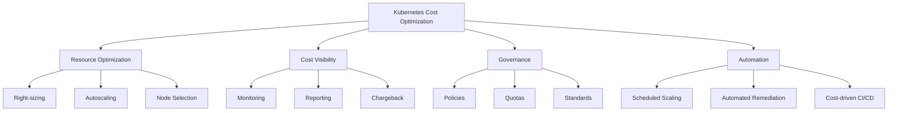
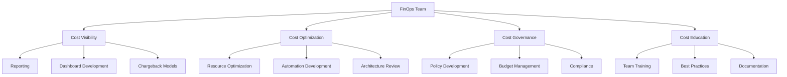

## Introduction to Kubernetes Cost Optimization

Kubernetes cost optimization is a critical aspect of managing cloud-native infrastructure. As organizations scale their Kubernetes deployments, understanding and controlling costs becomes increasingly important. FinOps (Financial Operations) provides a framework for managing these costs effectively while maintaining operational excellence.

::alert{type="info"}
According to the Cloud Native Computing Foundation (CNCF), organizations can reduce their Kubernetes infrastructure costs by 20-40% through proper cost optimization practices without compromising performance or reliability.
::

Effective cost management in Kubernetes environments requires a combination of technical practices, organizational processes, and cultural shifts. This guide covers the essential components of a comprehensive Kubernetes FinOps strategy.



## Core Concepts of Kubernetes FinOps

::steps
### Resource Allocation and Utilization
- **Understanding compute, memory, and storage costs**: Different resource types have different cost implications and scaling characteristics
- **Monitoring actual resource usage versus requests**: Identify discrepancies between allocated and consumed resources
- **Identifying idle and underutilized resources**: Find resources that are provisioned but not actively used
- **Implementing resource quotas and limits**: Enforce boundaries for resource consumption
- **Using metrics-based scaling decisions**: Scale resources based on actual usage metrics
- **Regular resource usage auditing**: Systematically review resource allocation and consumption
- **Cost allocation across teams and projects**: Attribute costs to specific business units and applications

### Cost Visibility and Attribution
- **Implementing resource tagging strategies**: Add metadata to resources for better cost categorization
- **Setting up cost centers and budgets**: Create financial boundaries and planning
- **Using namespace-based cost allocation**: Leverage Kubernetes namespaces for cost organization
- **Creating chargeback/showback models**: Implement internal billing or reporting mechanisms
- **Monitoring cost trends and anomalies**: Track changes in spending patterns
- **Generating cost reports and dashboards**: Visualize spending for different stakeholders
- **Understanding cloud provider billing**: Map Kubernetes resources to cloud provider billing line items

### Optimization Strategies
- **Right-sizing container resources**: Adjust resource requests and limits to match actual needs
- **Implementing horizontal pod autoscaling**: Scale pod replicas based on metrics
- **Using vertical pod autoscaling**: Automatically adjust resource requests
- **Leveraging spot instances effectively**: Use discounted, interruptible compute resources
- **Optimizing cluster autoscaling**: Configure efficient node addition and removal
- **Managing persistent storage costs**: Optimize volume provisioning and retention
- **Implementing multi-tenancy efficiently**: Share cluster resources across teams and applications
::

## Resource Optimization Techniques

### Container Resource Management

```yaml
# Example of a well-optimized deployment
apiVersion: apps/v1
kind: Deployment
metadata:
  name: optimized-app
  labels:
    app: optimized-app
    cost-center: marketing
    environment: production
    team: frontend
spec:
  replicas: 3
  selector:
    matchLabels:
      app: optimized-app
  template:
    metadata:
      labels:
        app: optimized-app
        cost-center: marketing
        environment: production
        team: frontend
    spec:
      containers:
      - name: app
        image: my-app:1.0
        resources:
          requests:             # Precisely calculated resource requests
            cpu: "250m"         # 0.25 CPU cores
            memory: "256Mi"     # 256 MiB memory
          limits:               # Reasonable limits to prevent resource hogging
            cpu: "500m"         # 0.5 CPU cores max
            memory: "512Mi"     # 512 MiB memory max
        readinessProbe:         # Probes ensure efficient resource usage
          httpGet:
            path: /health
            port: 8080
          initialDelaySeconds: 5
          periodSeconds: 10
        livenessProbe:
          httpGet:
            path: /health
            port: 8080
          initialDelaySeconds: 15
          periodSeconds: 20
```

::alert{type="success"}
Well-defined resource requests and limits are the foundation of cost optimization. They enable efficient scheduling, prevent resource hogging, and allow accurate capacity planning.
::

::steps
### Resource Request Optimization
- **CPU Request Calculation**
  ```bash
  # Get CPU usage metrics
  kubectl top pod -n my-namespace
  
  # Get detailed resource usage
  kubectl describe pod my-pod
  
  # Find pods with the highest CPU usage
  kubectl top pod -n my-namespace --sort-by=cpu
  
  # Get average CPU usage for a deployment (requires metrics-server)
  kubectl get po -n my-namespace -l app=my-app -o jsonpath='{.items[*].metadata.name}' | \
    xargs -I {} kubectl top pod -n my-namespace {} | \
    awk '{if(NR>1)sum+=$2; if(NR>1)count+=1} END{print sum/count}'
  ```
- **Memory Request Sizing**
  ```bash
  # Monitor memory usage
  kubectl top pod -n my-namespace --sort-by=memory
  
  # Check container memory stats
  kubectl exec -it my-pod -- cat /sys/fs/cgroup/memory/memory.stat
  
  # Analyze memory usage patterns over time (if Prometheus is available)
  # PromQL example:
  # avg_over_time(container_memory_working_set_bytes{namespace="my-namespace", container!="POD", container!=""}[7d])
  ```
- **Storage Optimization**
  ```yaml
  # Example of storage class with optimization
  apiVersion: storage.k8s.io/v1
  kind: StorageClass
  metadata:
    name: optimized-storage
    labels:
      cost-tier: standard
  provisioner: kubernetes.io/aws-ebs
  parameters:
    type: gp3               # More cost-effective than gp2 on AWS
    iopsPerGB: "3000"       # Optimal performance/cost ratio
    throughput: "125"       # Adequate for most workloads
  reclaimPolicy: Delete     # Automatically clean up when no longer needed
  allowVolumeExpansion: true # Allow growing without recreation
  volumeBindingMode: WaitForFirstConsumer # Delay volume creation until pod scheduled
  ```

### Advanced Scaling Strategies
- **Horizontal Pod Autoscaling**
  ```yaml
  apiVersion: autoscaling/v2
  kind: HorizontalPodAutoscaler
  metadata:
    name: cost-efficient-hpa
    annotations:
      cost-optimization: "enabled"
  spec:
    scaleTargetRef:
      apiVersion: apps/v1
      kind: Deployment
      name: my-app
    minReplicas: 1          # Minimum pods to maintain
    maxReplicas: 10         # Maximum pods to scale to
    metrics:                # Multiple metrics for scaling
    - type: Resource
      resource:
        name: cpu
        target:
          type: Utilization
          averageUtilization: 70  # Scale when CPU reaches 70%
    - type: Resource
      resource:
        name: memory
        target:
          type: Utilization
          averageUtilization: 80  # Scale when memory reaches 80%
    behavior:               # Fine-tune scaling behavior
      scaleDown:
        stabilizationWindowSeconds: 300  # Wait 5 min before scaling down
        policies:
        - type: Percent
          value: 100
          periodSeconds: 15
      scaleUp:
        stabilizationWindowSeconds: 0    # Scale up immediately when needed
        policies:
        - type: Percent
          value: 100
          periodSeconds: 15
        - type: Pods
          value: 4
          periodSeconds: 15
        selectPolicy: Max
  ```

### Node Pool Optimization
- **Node Selector Implementation**
  ```yaml
  apiVersion: v1
  kind: Pod
  metadata:
    name: cost-optimized-pod
    labels:
      workload-type: batch
  spec:
    nodeSelector:               # Target specific node pools
      instance-type: spot       # Use spot/preemptible instances
      cost-optimization: enabled
    tolerations:                # Allow scheduling on tainted nodes
    - key: "spot"
      operator: "Equal"
      value: "true"
      effect: "NoSchedule"
    containers:
    - name: app
      image: my-app:1.0
  ```

- **Cluster Autoscaler Configuration**
  ```yaml
  # Cluster Autoscaler configuration for cost efficiency
  apiVersion: v1
  kind: ConfigMap
  metadata:
    name: cluster-autoscaler-config
    namespace: kube-system
  data:
    config.yaml: |
      expendablePodsPriorityCutoff: -10  # Pods below this priority are expendable
      scaleDownUtilizationThreshold: 0.5 # Scale down when utilization below 50%
      scaleDownUnneededTime: 10m         # Wait 10m before removing nodes
      scaleDownDelayAfterAdd: 10m        # Wait after scaling up
      maxNodeProvisionTime: 15m          # Max time to wait for node provisioning
      newPodScaleUpDelay: 0s             # Scale up immediately for new pods
      balanceSimilarNodeGroups: true     # Balance similar node groups
      skipNodesWithLocalStorage: true    # Respect local storage
  ```
::

## Cost Allocation and Chargeback

::alert{type="warning"}
Without proper cost allocation, organizations cannot understand which teams, applications, or services are driving costs, making it impossible to optimize effectively or charge back to the appropriate business units.
::

### Namespace Resource Quotas

Implementing resource quotas at the namespace level helps enforce budget constraints and prevents resource hogging:

```yaml
apiVersion: v1
kind: ResourceQuota
metadata:
  name: team-quota
  namespace: team-a
  labels:
    cost-center: "CC-12345"
    department: "engineering"
spec:
  hard:
    requests.cpu: "4"              # Total CPU requests
    requests.memory: 8Gi           # Total memory requests
    limits.cpu: "8"                # Total CPU limits
    limits.memory: 16Gi            # Total memory limits
    persistentvolumeclaims: "10"   # Maximum number of PVCs
    services.loadbalancers: "2"    # Maximum number of LoadBalancer services
    services.nodeports: "5"        # Maximum number of NodePort services
    count/deployments.apps: "10"   # Maximum number of deployments
    count/replicasets.apps: "20"   # Maximum number of replica sets
```

Resource quotas can be combined with chargeback systems to allocate costs accurately to different teams and projects.

### LimitRange Implementation

LimitRanges provide default resource constraints for containers in a namespace, ensuring cost predictability:

```yaml
apiVersion: v1
kind: LimitRange
metadata:
  name: default-limits
  namespace: team-a
spec:
  limits:
  - default:                  # Default limits if not specified
      cpu: 500m               # Default CPU limit
      memory: 512Mi           # Default memory limit
    defaultRequest:           # Default requests if not specified
      cpu: 200m               # Default CPU request
      memory: 256Mi           # Default memory request
    max:                      # Maximum allowed values
      cpu: 2                  # Max 2 CPU cores per container
      memory: 2Gi             # Max 2 GiB memory per container
    min:                      # Minimum allowed values
      cpu: 100m               # Min 0.1 CPU cores per container
      memory: 128Mi           # Min 128 MiB memory per container
    type: Container           # These limits apply to containers
```

::alert{type="warning"}
Without LimitRanges, containers without explicit resource requests and limits can consume unrestricted resources, leading to unexpected costs and resource contention.
::

## Advanced Cost Monitoring

Effective cost management requires comprehensive monitoring of resource usage, allocation, and trends.

::steps
1. **Resource Usage Tracking**: Monitor actual CPU, memory, and storage consumption
2. **Cost Allocation**: Track costs by namespace, label, or other metadata
3. **Trend Analysis**: Identify patterns and forecast future costs
4. **Anomaly Detection**: Quickly identify unexpected cost increases
5. **Budget Tracking**: Monitor actual costs against budgeted amounts
6. **Chargeback Reporting**: Generate reports for internal cost attribution
::

### Prometheus Monitoring Setup

Set up Prometheus to collect detailed resource usage metrics:

```yaml
apiVersion: monitoring.coreos.com/v1
kind: ServiceMonitor
metadata:
  name: cost-metrics
  namespace: monitoring
spec:
  selector:
    matchLabels:
      app: cost-exporter
  endpoints:
  - port: metrics
    interval: 30s
  namespaceSelector:
    matchNames:
    - default
    - production
    - development
    - staging
```

### Grafana Dashboard Configuration

Visualize cost data with comprehensive Grafana dashboards:

```yaml
apiVersion: integreatly.org/v1alpha1
kind: GrafanaDashboard
metadata:
  name: cost-dashboard
spec:
  json: |
    {
      "annotations": {
        "list": []
      },
      "editable": true,
      "panels": [
        {
          "title": "Cluster Cost Overview",
          "type": "graph",
          "datasource": "Prometheus",
          "targets": [
            {
              "expr": "sum(container_cpu_usage_seconds_total) by (namespace)",
              "legendFormat": "{{namespace}}"
            }
          ]
        },
        {
          "title": "Namespace Cost Comparison",
          "type": "bargauge",
          "datasource": "Prometheus",
          "targets": [
            {
              "expr": "sum(rate(container_cpu_usage_seconds_total[24h]) * 0.06) by (namespace)",
              "legendFormat": "{{namespace}}"
            }
          ]
        },
        {
          "title": "Storage Cost Trends",
          "type": "graph",
          "datasource": "Prometheus",
          "targets": [
            {
              "expr": "sum(kubelet_volume_stats_used_bytes) by (persistentvolumeclaim)",
              "legendFormat": "{{persistentvolumeclaim}}"
            }
          ]
        },
        {
          "title": "Cost by Label",
          "type": "piechart",
          "datasource": "Prometheus",
          "targets": [
            {
              "expr": "sum(kube_pod_labels{label_cost_center!=\"\"}) by (label_cost_center)",
              "legendFormat": "{{label_cost_center}}"
            }
          ]
        },
        {
          "title": "Wasted Resources",
          "type": "stat",
          "datasource": "Prometheus",
          "targets": [
            {
              "expr": "sum(kube_pod_container_resource_requests{resource=\"cpu\"} - on(namespace,pod,container) container_cpu_usage_seconds_total) * 0.06",
              "legendFormat": "Unused CPU Cost"
            }
          ]
        }
      ]
    }
```

## Cost Optimization Automation

### Automated Scaling Policies

```yaml
apiVersion: keda.sh/v1alpha1
kind: ScaledObject
metadata:
  name: automated-scaling
  labels:
    deploymentName: my-deployment
    cost-center: "CC-98765"
spec:
  scaleTargetRef:
    name: my-deployment
  pollingInterval: 30           # Check every 30 seconds
  cooldownPeriod: 300           # Wait 5 minutes before scaling down
  minReplicaCount: 1            # Never scale below 1 replica
  maxReplicaCount: 10           # Never scale above 10 replicas
  advanced:
    horizontalPodAutoscalerConfig:
      behavior:
        scaleDown:
          stabilizationWindowSeconds: 300
  triggers:
  - type: prometheus
    metadata:
      serverAddress: http://prometheus.monitoring.svc
      metricName: http_requests_total
      threshold: '100'
      query: sum(rate(http_requests_total{service="my-service"}[2m]))
  - type: cron
    metadata:
      timezone: UTC
      start: 30 8 * * *         # Scale up at 8:30 AM
      end: 30 17 * * *          # Scale down at 5:30 PM
      desiredReplicas: "5"
```

### Cost-Based Pod Scheduling

```yaml
apiVersion: scheduling.k8s.io/v1
kind: PriorityClass
metadata:
  name: cost-optimized
  labels:
    cost-tier: "economy"
value: 1000
globalDefault: false
description: "Priority class for cost-optimized workloads"
---
apiVersion: apps/v1
kind: Deployment
metadata:
  name: cost-aware-app
  labels:
    cost-optimization: "enabled"
spec:
  template:
    metadata:
      labels:
        cost-optimization: "enabled"
    spec:
      priorityClassName: cost-optimized   # Use the priority class
      affinity:
        nodeAffinity:                     # Schedule on cheaper nodes
          preferredDuringSchedulingIgnoredDuringExecution:
          - weight: 100
            preference:
              matchExpressions:
              - key: node-cost
                operator: In
                values:
                - low
        podAntiAffinity:                  # Spread for resilience
          preferredDuringSchedulingIgnoredDuringExecution:
          - weight: 50
            podAffinityTerm:
              topologyKey: "kubernetes.io/hostname"
              labelSelector:
                matchLabels:
                  app: cost-aware-app
      topologySpreadConstraints:          # Efficient distribution
      - maxSkew: 1
        topologyKey: topology.kubernetes.io/zone
        whenUnsatisfiable: ScheduleAnyway
        labelSelector:
          matchLabels:
            app: cost-aware-app
```

## Advanced FinOps Integration

### Cloud Provider Cost Integration

```yaml
# AWS Cost Explorer Integration
apiVersion: aws.crossplane.io/v1beta1
kind: ProviderConfig
metadata:
  name: cost-explorer
spec:
  credentials:
    source: Secret
    secretRef:
      namespace: crossplane-system
      name: aws-creds
      key: creds
---
apiVersion: services.aws.crossplane.io/v1alpha1
kind: CostExplorer
metadata:
  name: cluster-costs
  labels:
    environment: production
spec:
  forProvider:
    region: us-west-2
    timeUnit: MONTHLY
    metrics:
      - BlendedCost
      - UnblendedCost
      - UsageQuantity
    filters:
      tags:
        - key: "kubernetes.io/cluster/my-cluster"
          values:
            - "owned"
      dimensions:
        - name: SERVICE
          values:
            - "Amazon Elastic Kubernetes Service"
            - "Amazon Elastic Compute Cloud"
            - "Amazon Elastic Block Store"
            - "Amazon Simple Storage Service"
```

### Budget Alerts and Notifications

```yaml
apiVersion: monitoring.coreos.com/v1
kind: PrometheusRule
metadata:
  name: cost-alerts
  namespace: monitoring
spec:
  groups:
  - name: cost.rules
    rules:
    - alert: HighCostDetected
      expr: sum(container_cpu_usage_seconds_total * 0.06) > 1000
      for: 1h
      labels:
        severity: warning
        team: finops
      annotations:
        description: "High cost detected in cluster: $value USD"
        runbook_url: "https://wiki.example.com/costs"
        summary: "Cluster costs have exceeded threshold"
    - alert: RapidCostIncrease
      expr: sum(rate(container_cpu_usage_seconds_total[6h]) * 0.06) > sum(rate(container_cpu_usage_seconds_total[6h] offset 1d) * 0.06) * 1.5
      for: 30m
      labels:
        severity: critical
        team: finops
      annotations:
        description: "Rapid cost increase detected: 50% increase over 24h"
        runbook_url: "https://wiki.example.com/costs/rapid-increase"
    - alert: StorageCostWarning
      expr: sum(kubelet_volume_stats_used_bytes) / 1024 / 1024 / 1024 * 0.08 > 500
      for: 6h
      labels:
        severity: warning
        team: storage
      annotations:
        description: "Storage costs have exceeded $500"
        summary: "High storage costs detected"
```

## Cost Analysis and Reporting

### Cost Report Generation

```python
#!/usr/bin/env python3
import kubernetes
import pandas as pd
import numpy as np
import matplotlib.pyplot as plt
from datetime import datetime, timedelta
import argparse
import os

def generate_cost_report(namespace=None, days=30, output_format="excel", include_trends=True):
    """Generate comprehensive cost report with detailed analysis."""
    # Initialize Kubernetes client
    kubernetes.config.load_kube_config()
    v1 = kubernetes.client.CoreV1Api()
    apps_v1 = kubernetes.client.AppsV1Api()
    
    # Configure filter
    namespace_filter = f"--namespace={namespace}" if namespace else "--all-namespaces"
    
    # Get pod resources and usage
    print(f"Collecting data for {namespace if namespace else 'all namespaces'}...")
    
    # Get all pods
    if namespace:
        pods = v1.list_namespaced_pod(namespace)
    else:
        pods = v1.list_pod_for_all_namespaces()
    
    # Calculate costs
    cost_data = []
    
    # Define cost rates - these should be configured based on your actual cloud costs
    COST_PER_CPU_HOUR = 0.04  # $0.04 per CPU hour
    COST_PER_GB_HOUR = 0.01   # $0.01 per GB-hour for memory
    COST_PER_GB_STORAGE = 0.10 # $0.10 per GB for storage
    
    # Get current time for time-based calculations
    now = datetime.now()
    
    # Process each pod
    for pod in pods.items:
        namespace = pod.metadata.namespace
        pod_name = pod.metadata.name
        
        # Skip system pods if configured
        if namespace in ["kube-system"] and not include_system:
            continue
        
        # Extract labels for cost allocation
        labels = pod.metadata.labels or {}
        cost_center = labels.get("cost-center", "unallocated")
        team = labels.get("team", "unallocated")
        app = labels.get("app", pod_name)
        environment = labels.get("environment", "unknown")
        
        # Process each container
        for container in pod.spec.containers:
            # Get resource requests
            resources = container.resources
            cpu_request = 0
            mem_request = 0
            
            if resources and resources.requests:
                # Parse CPU request
                cpu_str = resources.requests.get('cpu', '0')
                if cpu_str.endswith('m'):
                    cpu_request = float(cpu_str[:-1]) / 1000
                else:
                    cpu_request = float(cpu_str)
                
                # Parse memory request
                mem_str = resources.requests.get('memory', '0')
                # Handle different memory units
                if mem_str.endswith('Ki'):
                    mem_request = float(mem_str[:-2]) / (1024 * 1024)  # Convert to GB
                elif mem_str.endswith('Mi'):
                    mem_request = float(mem_str[:-2]) / 1024  # Convert to GB
                elif mem_str.endswith('Gi'):
                    mem_request = float(mem_str[:-2])
                elif mem_str.endswith('Ti'):
                    mem_request = float(mem_str[:-2]) * 1024
                else:
                    mem_request = float(mem_str) / (1024 * 1024 * 1024)  # Assume bytes
            
            # Calculate cost per day
            cpu_cost = cpu_request * 24 * COST_PER_CPU_HOUR
            mem_cost = mem_request * 24 * COST_PER_GB_HOUR
            total_cost = cpu_cost + mem_cost
            
            # Add to dataset
            cost_data.append({
                'namespace': namespace,
                'pod': pod_name,
                'container': container.name,
                'app': app,
                'environment': environment,
                'cost_center': cost_center,
                'team': team,
                'cpu_request': cpu_request,
                'memory_request_gb': mem_request,
                'cpu_cost_daily': cpu_cost,
                'memory_cost_daily': mem_cost,
                'total_cost_daily': total_cost,
                'total_cost_monthly': total_cost * 30,
            })
    
    # Create dataframe
    df = pd.DataFrame(cost_data)
    
    # Calculate storage costs (simplified - actual implementation would query PVCs)
    storage_data = []
    try:
        if namespace:
            pvcs = v1.list_namespaced_persistent_volume_claim(namespace)
        else:
            pvcs = v1.list_persistent_volume_claim_for_all_namespaces()
            
        for pvc in pvcs.items:
            pvc_namespace = pvc.metadata.namespace
            pvc_name = pvc.metadata.name
            
            # Get storage capacity
            storage_str = pvc.spec.resources.requests.get('storage', '0')
            storage_gb = 0
            
            # Parse storage size
            if storage_str.endswith('Ki'):
                storage_gb = float(storage_str[:-2]) / (1024 * 1024)
            elif storage_str.endswith('Mi'):
                storage_gb = float(storage_str[:-2]) / 1024
            elif storage_str.endswith('Gi'):
                storage_gb = float(storage_str[:-2])
            elif storage_str.endswith('Ti'):
                storage_gb = float(storage_str[:-2]) * 1024
            
            # Calculate cost
            storage_cost = storage_gb * COST_PER_GB_STORAGE
            
            # Add to dataset
            storage_data.append({
                'namespace': pvc_namespace,
                'pvc_name': pvc_name,
                'storage_gb': storage_gb,
                'storage_cost_daily': storage_cost,
                'storage_cost_monthly': storage_cost * 30
            })
            
        storage_df = pd.DataFrame(storage_data)
    except Exception as e:
        print(f"Warning: Error collecting storage data: {e}")
        storage_df = pd.DataFrame()
    
    # Generate report
    report_time = datetime.now().strftime('%Y%m%d_%H%M%S')
    report_name = f"cost_report_{namespace + '_' if namespace else ''}{report_time}"
    
    # Summary statistics
    if not df.empty:
        summary = {
            'Total Daily Cost': df['total_cost_daily'].sum() + (storage_df['storage_cost_daily'].sum() if not storage_df.empty else 0),
            'Total Monthly Cost': df['total_cost_monthly'].sum() + (storage_df['storage_cost_monthly'].sum() if not storage_df.empty else 0),
            'Compute Costs': df['total_cost_monthly'].sum(),
            'Storage Costs': storage_df['storage_cost_monthly'].sum() if not storage_df.empty else 0,
            'Top Namespace': df.groupby('namespace')['total_cost_monthly'].sum().idxmax() if len(df) > 0 else 'N/A',
            'Top Cost Center': df.groupby('cost_center')['total_cost_monthly'].sum().idxmax() if len(df) > 0 else 'N/A',
            'Report Generated': datetime.now().strftime('%Y-%m-%d %H:%M:%S'),
            'Period': f"Last {days} days",
        }
        
        # Generate visualizations if requested
        if include_trends and not df.empty:
            # Create directory for report assets
            os.makedirs('report_assets', exist_ok=True)
            
            # Cost by namespace
            namespace_costs = df.groupby('namespace')['total_cost_monthly'].sum().sort_values(ascending=False)
            plt.figure(figsize=(10, 6))
            namespace_costs.plot(kind='bar', color='skyblue')
            plt.title('Monthly Cost by Namespace')
            plt.ylabel('Cost (USD)')
            plt.tight_layout()
            plt.savefig(f'report_assets/namespace_costs_{report_time}.png')
            
            # Cost by cost center
            if 'cost_center' in df.columns:
                cc_costs = df.groupby('cost_center')['total_cost_monthly'].sum().sort_values(ascending=False)
                plt.figure(figsize=(10, 6))
                cc_costs.plot(kind='bar', color='lightgreen')
                plt.title('Monthly Cost by Cost Center')
                plt.ylabel('Cost (USD)')
                plt.tight_layout()
                plt.savefig(f'report_assets/costcenter_costs_{report_time}.png')
    
        # Output report in requested format
        if output_format.lower() == 'excel':
            with pd.ExcelWriter(f"{report_name}.xlsx") as writer:
                # Summary sheet
                pd.DataFrame([summary]).T.reset_index().rename(columns={'index': 'Metric', 0: 'Value'}).to_excel(writer, sheet_name='Summary', index=False)
                
                # Detailed costs
                if not df.empty:
                    df.to_excel(writer, sheet_name='Container Costs', index=False)
                    
                    # Cost by namespace
                    ns_costs = df.groupby('namespace')[['cpu_cost_daily', 'memory_cost_daily', 'total_cost_daily', 'total_cost_monthly']].sum()
                    ns_costs.sort_values('total_cost_monthly', ascending=False).to_excel(writer, sheet_name='Namespace Costs')
                    
                    # Cost by application
                    app_costs = df.groupby('app')[['cpu_cost_daily', 'memory_cost_daily', 'total_cost_daily', 'total_cost_monthly']].sum()
                    app_costs.sort_values('total_cost_monthly', ascending=False).to_excel(writer, sheet_name='Application Costs')
                    
                    # Cost by cost center
                    if 'cost_center' in df.columns:
                        cc_costs = df.groupby('cost_center')[['cpu_cost_daily', 'memory_cost_daily', 'total_cost_daily', 'total_cost_monthly']].sum()
                        cc_costs.sort_values('total_cost_monthly', ascending=False).to_excel(writer, sheet_name='Cost Center')
                
                # Storage costs
                if not storage_df.empty:
                    storage_df.to_excel(writer, sheet_name='Storage Costs', index=False)
            
            print(f"Excel report generated: {report_name}.xlsx")
            return f"{report_name}.xlsx"
        
        elif output_format.lower() == 'csv':
            # Save to CSV files
            if not df.empty:
                df.to_csv(f"{report_name}_containers.csv", index=False)
            if not storage_df.empty:
                storage_df.to_csv(f"{report_name}_storage.csv", index=False)
            
            # Save summary
            pd.DataFrame([summary]).T.reset_index().rename(
                columns={'index': 'Metric', 0: 'Value'}
            ).to_csv(f"{report_name}_summary.csv", index=False)
            
            print(f"CSV reports generated with prefix: {report_name}")
            return f"{report_name}_*.csv"
    else:
        print("No data found for cost reporting.")
        return None

if __name__ == "__main__":
    parser = argparse.ArgumentParser(description='Generate Kubernetes cost report')
    parser.add_argument('--namespace', help='Namespace to analyze (default: all namespaces)')
    parser.add_argument('--days', type=int, default=30, help='Number of days to analyze')
    parser.add_argument('--format', choices=['excel', 'csv'], default='excel', help='Output format')
    parser.add_argument('--trends', action='store_true', help='Include trend visualizations')
    args = parser.parse_args()
    
    report = generate_cost_report(
        namespace=args.namespace,
        days=args.days,
        output_format=args.format,
        include_trends=args.trends
    )
    print(f"Cost report generated: {report}")
```

### Trend Analysis

```sql
-- Example PromQL queries for cost trend analysis
-- CPU usage trend by namespace
rate(container_cpu_usage_seconds_total{namespace!=""}[1h]) * 0.06

-- Memory usage trend by namespace (converted to cost)
sum by (namespace) (container_memory_working_set_bytes{namespace!=""} / 1024 / 1024 / 1024 * 0.01)

-- Storage cost trend
sum by (persistentvolumeclaim) (kubelet_volume_stats_used_bytes / 1024 / 1024 / 1024 * 0.10)

-- Cost by application label
sum by (label_app) (
  kube_pod_container_resource_requests{resource="cpu"} * on(namespace,pod) 
  group_left(label_app) kube_pod_labels{label_app!=""} * 0.06
)

-- Cost forecasting using linear prediction
predict_linear(sum(container_cpu_usage_seconds_total)[30d:1h], 7 * 24 * 3600) * 0.06
```

## Advanced Topics

### Multi-Cloud Cost Management

```yaml
# Example of multi-cloud cost configuration
apiVersion: v1
kind: ConfigMap
metadata:
  name: multi-cloud-cost-config
  labels:
    app: cost-management
    component: configuration
data:
  aws-regions: |
    - us-east-1
    - us-west-2
  gcp-projects: |
    - project-1
    - project-2
  azure-subscriptions: |
    - sub-1
    - sub-2
  pricing-config: |
    aws:
      cpu_per_hour: 0.0416
      memory_gb_per_hour: 0.0045
      storage_gb_per_month: 0.10
    gcp:
      cpu_per_hour: 0.0475
      memory_gb_per_hour: 0.0050
      storage_gb_per_month: 0.08
    azure:
      cpu_per_hour: 0.0523
      memory_gb_per_hour: 0.0055
      storage_gb_per_month: 0.12
---
apiVersion: apps/v1
kind: Deployment
metadata:
  name: multi-cloud-cost-analyzer
  labels:
    app: cost-management
    component: analyzer
spec:
  template:
    spec:
      containers:
      - name: analyzer
        image: cost-analyzer:v1
        resources:
          limits:
            cpu: 500m
            memory: 512Mi
          requests:
            cpu: 200m
            memory: 256Mi
        volumeMounts:
        - name: config
          mountPath: /etc/config
      volumes:
      - name: config
        configMap:
          name: multi-cloud-cost-config
```

### Machine Learning Workload Optimization

```yaml
# Example of ML workload-specific optimization
apiVersion: scheduling.k8s.io/v1
kind: PriorityClass
metadata:
  name: ml-training
  labels:
    workload-type: ml-training
value: 9000
globalDefault: false
description: "Priority class for ML training jobs"
---
apiVersion: batch/v1
kind: Job
metadata:
  name: ml-training
  labels:
    app: model-training
    cost-center: research
    priority: high
spec:
  template:
    spec:
      priorityClassName: ml-training      # Use high priority class
      terminationGracePeriodSeconds: 30   # Allow proper shutdown
      containers:
      - name: training
        image: ml-training:v1
        env:
        - name: NVIDIA_VISIBLE_DEVICES    # Configure GPU visibility
          value: all
        - name: MODEL_CHECKPOINT_PATH     # Save progress for resumability
          value: "/checkpoints/model"
        resources:
          limits:
            nvidia.com/gpu: 1             # Request exactly 1 GPU
            cpu: "8"                      # Reserve 8 CPU cores
            memory: "32Gi"                # Reserve 32GB memory
          requests:
            nvidia.com/gpu: 1
            cpu: "6"                      # Request 6 CPU cores
            memory: "24Gi"                # Request 24GB memory
        volumeMounts:
        - name: checkpoints
          mountPath: /checkpoints
      nodeSelector:                       # Run on specific GPU nodes
        cloud.google.com/gke-accelerator: nvidia-tesla-v100
      affinity:
        nodeAffinity:
          requiredDuringSchedulingIgnoredDuringExecution:
            nodeSelectorTerms:
            - matchExpressions:
              - key: node.kubernetes.io/instance-type
                operator: In
                values:
                - g4dn.2xlarge          # Specific instance type for ML
      tolerations:                       # Tolerate GPU taints
      - key: nvidia.com/gpu
        operator: Exists
        effect: NoSchedule
      restartPolicy: OnFailure
      volumes:
      - name: checkpoints
        persistentVolumeClaim:
          claimName: ml-checkpoints-pvc
```

## FinOps Team Structure

Establishing a dedicated FinOps team with clear responsibilities is key to sustained cost management:



## Conclusion

The implementation of comprehensive cost optimization and FinOps practices requires continuous monitoring, adjustment, and automation. By following these detailed examples and best practices, organizations can achieve significant cost savings while maintaining optimal performance and reliability.

::alert{type="success"}
Remember to regularly review and update your cost optimization strategies as your infrastructure evolves and new tools become available. Effective FinOps is not a one-time exercise but an ongoing discipline that evolves with your organization's needs.
::

::alert{type="info"}
According to FinOps Foundation research, organizations with mature FinOps practices typically reduce their cloud spend by 20-30% within the first six months of implementation while improving resource utilization and application performance.
::