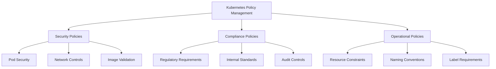
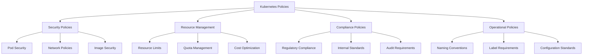

## Introduction to Policy Management

Kubernetes policy management is essential for maintaining security, compliance, and operational consistency across clusters. As organizations scale their Kubernetes deployments, managing policies programmatically becomes critical. Open Policy Agent (OPA) and its Kubernetes-native extension, Gatekeeper, provide powerful tools for implementing and enforcing policies as code.



## Understanding OPA and Gatekeeper

### Open Policy Agent (OPA)

OPA is a general-purpose policy engine that decouples policy decision-making from policy enforcement. It provides a high-level declarative language called Rego for specifying policy as code and simple APIs to offload policy decision-making.

::steps
1. **Policy as Code**: Define policies in Rego language
2. **Decoupled Architecture**: Separation of policy decisions from enforcement
3. **Unified Framework**: Single policy engine for multiple platforms
4. **Context-Aware**: Makes decisions based on structured data input
5. **Stateless Design**: Focused on pure policy evaluation
6. **General Purpose**: Not limited to Kubernetes use cases
7. **Extensible**: Can be integrated into various systems
::

### Gatekeeper

Gatekeeper is a customizable admission webhook for Kubernetes that enforces policies executed by OPA. It extends Kubernetes with Custom Resource Definitions (CRDs) for defining and managing policies.

::steps
1. **Native Kubernetes Integration**: Implemented as admission controller
2. **Custom Resource Definitions**: Define policy using Kubernetes resources
3. **Audit Capabilities**: Evaluates existing resources for violations
4. **Template System**: Reusable policy templates with parameters
5. **Extensible Constraint Framework**: Flexible policy definition model
6. **Dry-Run Mode**: Test policies before enforcement
7. **Violation Reporting**: Structured feedback on policy violations
::

::alert{type="info"}
The architectural relationship between OPA and Gatekeeper: Gatekeeper is an OPA-powered Kubernetes admission controller. It embeds OPA as its policy engine, while providing Kubernetes-native interfaces and additional features specifically designed for Kubernetes environments.
::

## Policy Types and Use Cases

### Common Policy Categories



### Security Policies

Security policies help enforce best practices for securing your Kubernetes workloads:

::steps
1. **Pod Security Standards**: Enforce security contexts, privilege restrictions
2. **Image Source Control**: Limit image repositories and require signatures
3. **Secret Management**: Enforce proper handling of sensitive information
4. **Network Controls**: Implement network segmentation and access controls
5. **RBAC Validation**: Ensure role-based access control follows least privilege
::

### Resource Management

Resource management policies ensure efficient utilization of cluster resources:

::steps
1. **Resource Quotas**: Enforce namespace resource quotas
2. **Limit Ranges**: Set default and max/min resource limits
3. **Storage Class Usage**: Control storage provisioning
4. **Node Affinities**: Enforce proper workload placement
5. **Cost Allocation**: Ensure proper tagging for billing
::

### Compliance

Compliance policies help meet regulatory and organizational requirements:

::steps
1. **Industry Standards**: Implement PCI-DSS, HIPAA, SOC2, etc.
2. **Data Sovereignty**: Enforce geographic placement requirements
3. **Audit Trail**: Ensure logging and monitoring configurations
4. **Organizational Standards**: Implement company-specific policies
5. **Configuration Standards**: Standardize resource configurations
::

## Implementing OPA Gatekeeper

### Installation and Setup

To install Gatekeeper in your Kubernetes cluster:

```bash
# Install Gatekeeper using kubectl
kubectl apply -f https://raw.githubusercontent.com/open-policy-agent/gatekeeper/release-3.11/deploy/gatekeeper.yaml

# Verify installation
kubectl get pods -n gatekeeper-system
```

::alert{type="warning"}
After installation, Gatekeeper doesn't enforce any policies by default. You need to create and configure policies according to your requirements.
::

### Basic Policy Example

Let's implement a simple policy that requires all pods to have resource limits defined:

```yaml
apiVersion: templates.gatekeeper.sh/v1
kind: ConstraintTemplate
metadata:
  name: k8srequiredresources
spec:
  crd:
    spec:
      names:
        kind: K8sRequiredResources
      validation:
        openAPIV3Schema:
          properties:
            resources:
              type: array
              items:
                type: string
  targets:
    - target: admission.k8s.gatekeeper.sh
      rego: |
        package k8srequiredresources

        violation[{"msg": msg}] {
          container := input.review.object.spec.containers[_]
          required_resource := input.parameters.resources[_]
          not container.resources.limits[required_resource]
          msg := sprintf("Container %v must specify resource limit for %v", [container.name, required_resource])
        }

        violation[{"msg": msg}] {
          container := input.review.object.spec.containers[_]
          required_resource := input.parameters.resources[_]
          not container.resources.requests[required_resource]
          msg := sprintf("Container %v must specify resource request for %v", [container.name, required_resource])
        }
```

Apply the constraint to enforce the policy:

```yaml
apiVersion: constraints.gatekeeper.sh/v1beta1
kind: K8sRequiredResources
metadata:
  name: require-cpu-memory-limits
spec:
  match:
    kinds:
      - apiGroups: [""]
        kinds: ["Pod"]
  parameters:
    resources: ["cpu", "memory"]
```

This policy ensures that all containers in pods specify both CPU and memory limits and requests, preventing unbounded resource consumption.

## Common Policy Patterns

### Image Security Policies

Control which container registries are allowed in your cluster:

```yaml
apiVersion: templates.gatekeeper.sh/v1
kind: ConstraintTemplate
metadata:
  name: k8sallowedrepos
spec:
  crd:
    spec:
      names:
        kind: K8sAllowedRepos
      validation:
        openAPIV3Schema:
          properties:
            registries:
              type: array
              items:
                type: string
  targets:
    - target: admission.k8s.gatekeeper.sh
      rego: |
        package k8sallowedrepos

        violation[{"msg": msg}] {
          container := input.review.object.spec.containers[_]
          image := container.image
          not startswith_in_list(image, input.parameters.registries)
          msg := sprintf("container <%v> uses an invalid image repo <%v>, allowed repos are %v", [container.name, image, input.parameters.registries])
        }

        startswith_in_list(image, registries) {
          registry := registries[_]
          startswith(image, registry)
        }
```

Application of the constraint:

```yaml
apiVersion: constraints.gatekeeper.sh/v1beta1
kind: K8sAllowedRepos
metadata:
  name: require-trusted-registries
spec:
  match:
    kinds:
      - apiGroups: [""]
        kinds: ["Pod"]
  parameters:
    registries:
      - "gcr.io/production/"
      - "docker.io/companyname/"
      - "quay.io/companyname/"
```

### Resource Constraints

Implement policies to enforce resource limit ranges:

```yaml
apiVersion: templates.gatekeeper.sh/v1
kind: ConstraintTemplate
metadata:
  name: k8smemoryconstraints
spec:
  crd:
    spec:
      names:
        kind: K8sMemoryConstraints
      validation:
        openAPIV3Schema:
          properties:
            maxLimitMi:
              type: integer
  targets:
    - target: admission.k8s.gatekeeper.sh
      rego: |
        package k8smemoryconstraints

        violation[{"msg": msg}] {
          container := input.review.object.spec.containers[_]
          memory := container.resources.limits.memory
          max_memory_mi := input.parameters.maxLimitMi
          
          mem_mi := to_mi(memory)
          mem_mi > max_memory_mi
          
          msg := sprintf("Container %v memory limit %v exceeds maximum allowed %vMi", [container.name, memory, max_memory_mi])
        }
        
        to_mi(memory) = mi {
          endswith(memory, "Mi")
          mi := to_number(substring(memory, 0, count(memory) - 2))
        }
        
        to_mi(memory) = mi {
          endswith(memory, "Gi")
          mi := to_number(substring(memory, 0, count(memory) - 2)) * 1024
        }
        
        to_mi(memory) = mi {
          endswith(memory, "M")
          mi := to_number(substring(memory, 0, count(memory) - 1))
        }
        
        to_mi(memory) = mi {
          endswith(memory, "G")
          mi := to_number(substring(memory, 0, count(memory) - 1)) * 1024
        }
```

Apply the constraint:

```yaml
apiVersion: constraints.gatekeeper.sh/v1beta1
kind: K8sMemoryConstraints
metadata:
  name: memory-limits
spec:
  match:
    kinds:
      - apiGroups: [""]
        kinds: ["Pod"]
  parameters:
    maxLimitMi: 4096  # 4GB maximum memory limit
```

## Policy Testing and Validation

### Policy Testing

Testing policies before applying them in production is essential:

::steps
1. **Dry Run Mode**: Apply constraints in "warn" mode before enforcing
2. **Unit Testing**: Test policy rules with sample input
3. **Integration Testing**: Test policies against real cluster state
4. **Test Environment**: Dedicated environment for policy testing
5. **CI/CD Pipeline Integration**: Automate policy testing
::

### Validation Methods

```bash
# Test a policy with sample input using conftest
cat sample-pod.yaml | conftest test --policy policy.rego -

# Use OPA Playground for interactive testing
# Visit: https://play.openpolicyagent.org/

# Use Gatekeeper audit functionality
kubectl get constraint -o json | jq '.items[].status.violations'
```

Example test case for a policy:

```yaml
apiVersion: v1
kind: Pod
metadata:
  name: test-pod
spec:
  containers:
  - name: nginx
    image: nginx:latest
    # Intentionally missing resources to test policy
```

::alert{type="info"}
Using the "warn" enforcement action allows you to observe policy violations without blocking deployments, which is ideal for testing and phased rollouts:

```yaml
apiVersion: constraints.gatekeeper.sh/v1beta1
kind: K8sRequiredResources
metadata:
  name: require-cpu-memory-limits-warn
spec:
  enforcementAction: warn  # Only warn, don't block
  match:
    kinds:
      - apiGroups: [""]
        kinds: ["Pod"]
  parameters:
    resources: ["cpu", "memory"]
```
::

## Advanced Policy Concepts

### Custom Resource Validation

Validate custom resources with Gatekeeper:

```yaml
apiVersion: templates.gatekeeper.sh/v1
kind: ConstraintTemplate
metadata:
  name: customresourcevalidation
spec:
  crd:
    spec:
      names:
        kind: CustomResourceValidation
      validation:
        openAPIV3Schema:
          properties:
            patterns:
              type: array
              items:
                type: string
  targets:
    - target: admission.k8s.gatekeeper.sh
      rego: |
        package customresourcevalidation

        violation[{"msg": msg}] {
          input.review.object.kind == "MyCustomResource"
          pattern := input.parameters.patterns[_]
          value := object.get(input.review.object.spec, pattern, "")
          value == ""
          msg := sprintf("Custom resource is missing required field: %v", [pattern])
        }
```

### Policy Exceptions

Create exceptions to policies when needed:

```yaml
apiVersion: constraints.gatekeeper.sh/v1beta1
kind: K8sRequiredLabels
metadata:
  name: require-team-label
spec:
  match:
    kinds:
      - apiGroups: [""]
        kinds: ["Namespace"]
  parameters:
    labels: ["team"]
  enforcementAction: deny
  excludedNamespaces: ["kube-system", "gatekeeper-system"]
```

You can also use ReferenceExemption (available in newer versions):

```yaml
apiVersion: exemptions.gatekeeper.sh/v1alpha1
kind: ReferenceExemption
metadata:
  name: exempted-deployments
spec:
  match:
    source:
      kind: "Pod"
      selector:
        matchLabels:
          exempt: "true"
    target:
      kind: "K8sRequiredLabels"
      name: "require-team-label"
```

## Best Practices and Guidelines

### Policy Development

Follow these best practices when developing policies:

::steps
1. **Start Simple**: Begin with basic policies and iterate
2. **Use Templates**: Create reusable constraint templates
3. **Version Control**: Manage policies in source control
4. **Documentation**: Document policy intent and exceptions
5. **Phased Rollout**: Implement policies gradually
6. **Review Process**: Establish policy review procedures
7. **Test Coverage**: Ensure comprehensive testing of all policies
8. **Performance Impact**: Consider the performance implications of complex policies
::

### Policy Management

Effective policy management requires a structured approach:

::steps
1. **Policy Governance**: Define ownership and approval process
2. **Policy Catalog**: Maintain an inventory of policies
3. **Exception Process**: Create a clear exception process
4. **Monitoring**: Track policy violations and trends
5. **Regular Reviews**: Periodically review and update policies
6. **Change Management**: Control how policies are updated
7. **Documentation**: Maintain clear documentation of all policies
8. **Training**: Educate teams about policy requirements and benefits
::

## Policy Monitoring and Reporting

### Monitoring Setup

Set up Prometheus monitoring for Gatekeeper:

```yaml
apiVersion: monitoring.coreos.com/v1
kind: ServiceMonitor
metadata:
  name: gatekeeper-metrics
  namespace: monitoring
spec:
  selector:
    matchLabels:
      gatekeeper.sh/system: "yes"
  endpoints:
  - port: metrics
    interval: 15s
    scrapeTimeout: 15s
```

### Violation Reporting

Create dashboards and reports to track policy violations:

```bash
# Get all policy violations in the cluster
kubectl get constraints -o json | jq '.items[] | select(.status.totalViolations > 0) | {name: .metadata.name, violations: .status.totalViolations, details: .status.violations}'

# Create a script to generate violation reports
#!/bin/bash
echo "Policy Violation Report - $(date)"
echo "=================================="
kubectl get constraints -o json | jq -r '.items[] | "Policy: \(.metadata.name) - Violations: \(.status.totalViolations)"'
```

Example Prometheus alerts for policy violations:

```yaml
apiVersion: monitoring.coreos.com/v1
kind: PrometheusRule
metadata:
  name: gatekeeper-alerts
spec:
  groups:
  - name: gatekeeper
    rules:
    - alert: HighPolicyViolations
      expr: sum(gatekeeper_constraints_violations_total) > 50
      for: 15m
      labels:
        severity: warning
        team: security
      annotations:
        description: "High number of policy violations detected"
        summary: "Cluster has {{ $value }} policy violations"
```

## Integration Patterns

### CI/CD Integration

Integrate policy validation in CI/CD pipelines:

::steps
1. **Pre-commit Hooks**: Validate policies before committing
2. **Pipeline Validation**: Enforce policies in CI/CD pipelines
3. **Deployment Gates**: Block deployments that violate policies
4. **Automated Remediation**: Automatically fix simple violations
5. **Vulnerability Scanning**: Combine with image vulnerability scanning
6. **Policy Drift Detection**: Detect deviations from approved policies
::

Example of GitLab CI/CD integration:

```yaml
policy-validation:
  stage: validate
  image: openpolicyagent/conftest:latest
  script:
    - find k8s/ -name "*.yaml" | xargs conftest test --policy policy/
  allow_failure: false
```

### External Systems

Integrate policy management with external systems:

::steps
1. **CMDB Integration**: Sync policies with configuration database
2. **Compliance Reporting**: Feed policy data to compliance systems
3. **Ticketing Systems**: Create tickets for violation remediation
4. **Audit Tools**: Provide data for audit processes
5. **Security Scanners**: Integrate with vulnerability management tools
::

## Troubleshooting and Maintenance

### Common Issues

Troubleshoot common Gatekeeper issues:

::steps
1. **Policy Not Enforced**: Check webhook configuration and admission review
2. **False Positives**: Refine policy rules and test thoroughly
3. **Performance Impact**: Monitor and optimize resource usage
4. **Version Compatibility**: Ensure compatibility with Kubernetes version
5. **Unexpected Denials**: Use audit logs to understand policy decisions
6. **Missing Policies**: Verify policy CRDs are properly applied
7. **CRD Changes**: Handle updates to underlying CRDs gracefully
::

Debugging techniques:

```bash
# Check webhook configuration
kubectl get validatingwebhookconfigurations gatekeeper-validating-webhook-configuration

# Check Gatekeeper logs
kubectl logs -n gatekeeper-system -l control-plane=controller-manager

# Verify constraint is active
kubectl get constraint

# Test policy against specific resource
kubectl explain pod.spec.containers.securityContext --recursive
```

## Advanced Policy Implementation

### Pod Security Policies

Implement comprehensive pod security policies:

```yaml
apiVersion: templates.gatekeeper.sh/v1
kind: ConstraintTemplate
metadata:
  name: k8spsprivilegedcontainer
spec:
  crd:
    spec:
      names:
        kind: K8sPSPPrivilegedContainer
      validation:
        openAPIV3Schema:
          properties:
            privileged:
              type: boolean
            allowPrivilegeEscalation:
              type: boolean
            allowedCapabilities:
              type: array
              items:
                type: string
  targets:
    - target: admission.k8s.gatekeeper.sh
      rego: |
        package k8spsprivilegedcontainer

        violation[{"msg": msg}] {
          input.parameters.privileged == false
          c := input.review.object.spec.containers[_]
          c.securityContext.privileged
          msg := sprintf("Privileged container is not allowed: %v", [c.name])
        }

        violation[{"msg": msg}] {
          input.parameters.allowPrivilegeEscalation == false
          c := input.review.object.spec.containers[_]
          c.securityContext.allowPrivilegeEscalation
          msg := sprintf("Privilege escalation container is not allowed: %v", [c.name])
        }

        violation[{"msg": msg}] {
          c := input.review.object.spec.containers[_]
          c.securityContext.capabilities.add
          forbidden := [cap | cap = c.securityContext.capabilities.add[_]; not allowed_capability(cap)]
          count(forbidden) > 0
          msg := sprintf("Container %v has forbidden capabilities: %v", [c.name, forbidden])
        }

        allowed_capability(cap) {
          allowed := {c | c = input.parameters.allowedCapabilities[_]}
          cap == allowed[_]
        }
```

Apply the constraint:

```yaml
apiVersion: constraints.gatekeeper.sh/v1beta1
kind: K8sPSPPrivilegedContainer
metadata:
  name: psp-privileged-container
spec:
  match:
    kinds:
      - apiGroups: [""]
        kinds: ["Pod"]
  parameters:
    privileged: false
    allowPrivilegeEscalation: false
    allowedCapabilities: ["NET_BIND_SERVICE"]
```

### Network Policies

Enforce network segmentation with policies:

```yaml
apiVersion: templates.gatekeeper.sh/v1
kind: ConstraintTemplate
metadata:
  name: k8srequirednetworkpolicies
spec:
  crd:
    spec:
      names:
        kind: K8sRequiredNetworkPolicies
      validation:
        openAPIV3Schema:
          properties:
            namespaces:
              type: array
              items:
                type: string
  targets:
    - target: admission.k8s.gatekeeper.sh
      rego: |
        package k8srequirednetworkpolicies

        violation[{"msg": msg}] {
          namespace := input.review.object
          namespace.kind == "Namespace"
          required_ns(namespace.metadata.name)
          
          # Check if network policy exists
          not has_network_policy(namespace.metadata.name)
          
          msg := sprintf("Namespace %v requires at least one NetworkPolicy", [namespace.metadata.name])
        }
        
        required_ns(ns) {
          required := {n | n = input.parameters.namespaces[_]}
          ns == required[_]
        }
        
        has_network_policy(ns) {
          policies := data.inventory.namespace[ns]["networking.k8s.io/v1"]["NetworkPolicy"]
          count(policies) > 0
        }
```

Apply the constraint:

```yaml
apiVersion: constraints.gatekeeper.sh/v1beta1
kind: K8sRequiredNetworkPolicies
metadata:
  name: require-network-policies
spec:
  match:
    kinds:
      - apiGroups: [""]
        kinds: ["Namespace"]
  parameters:
    namespaces: ["default", "production", "staging"]
```

## Policy Testing Framework

### Unit Testing Policies

Create a unit testing framework for policies:

```python
import unittest
import json
import subprocess

class OPATestCase(unittest.TestCase):
    def setUp(self):
        self.policy_file = "policy.rego"
        self.test_input = "test_input.json"
    
    def test_policy(self):
        # Test cases
        test_cases = [
            {
                "name": "valid_pod",
                "input": {
                    "review": {
                        "object": {
                            "kind": "Pod",
                            "spec": {
                                "containers": [
                                    {
                                        "name": "app",
                                        "resources": {
                                            "limits": {
                                                "cpu": "500m",
                                                "memory": "512Mi"
                                            },
                                            "requests": {
                                                "cpu": "250m",
                                                "memory": "256Mi"
                                            }
                                        }
                                    }
                                ]
                            }
                        }
                    },
                    "parameters": {
                        "resources": ["cpu", "memory"]
                    }
                },
                "expected_violations": 0
            },
            {
                "name": "invalid_pod",
                "input": {
                    "review": {
                        "object": {
                            "kind": "Pod",
                            "spec": {
                                "containers": [
                                    {
                                        "name": "app",
                                        "resources": {
                                            "requests": {
                                                "cpu": "250m",
                                                "memory": "256Mi"
                                            }
                                            # Missing limits
                                        }
                                    }
                                ]
                            }
                        }
                    },
                    "parameters": {
                        "resources": ["cpu", "memory"]
                    }
                },
                "expected_violations": 2  # Missing both CPU and memory limits
            }
        ]
        
        for tc in test_cases:
            # Write test input to file
            with open(self.test_input, "w") as f:
                json.dump(tc["input"], f)
            
            # Run policy evaluation
            result = self._evaluate_policy()
            violations = len(result.get("violation", []))
            
            # Assert expected result
            self.assertEqual(
                violations, 
                tc["expected_violations"], 
                f"Test case '{tc['name']}' failed: expected {tc['expected_violations']} violations, got {violations}"
            )
    
    def _evaluate_policy(self):
        cmd = [
            "opa", "eval", 
            "--format", "json",
            "--data", self.policy_file,
            "--input", self.test_input,
            "data.k8srequiredresources"
        ]
        
        result = subprocess.run(cmd, capture_output=True, text=True)
        if result.returncode != 0:
            raise Exception(f"Policy evaluation failed: {result.stderr}")
        
        return json.loads(result.stdout)
```

### Integration Testing

Set up integration tests in your Kubernetes environment:

```yaml
apiVersion: v1
kind: ConfigMap
metadata:
  name: policy-tests
data:
  test-cases.yaml: |
    - name: "test-required-labels"
      resource:
        apiVersion: v1
        kind: Namespace
        metadata:
          name: test-namespace
      constraint: K8sRequiredLabels
      parameters:
        labels: ["team", "environment"]
      expected:
        violation: true
        message: "you must provide labels: team, environment"
    
    - name: "test-allowed-repos"
      resource:
        apiVersion: v1
        kind: Pod
        metadata:
          name: test-pod
        spec:
          containers:
          - name: nginx
            image: nginx:latest
      constraint: K8sAllowedRepos
      parameters:
        registries: ["gcr.io/", "docker.io/company/"]
      expected:
        violation: true
        message: "container <nginx> uses an invalid image repo <nginx:latest>"

apiVersion: batch/v1
kind: Job
metadata:
  name: policy-test-job
spec:
  template:
    spec:
      containers:
      - name: test-runner
        image: policy-test:v1
        command: ["python", "/scripts/run_tests.py"]
        volumeMounts:
        - name: test-cases
          mountPath: /tests
        - name: policy-files
          mountPath: /policies
      volumes:
      - name: test-cases
        configMap:
          name: policy-tests
      - name: policy-files
        configMap:
          name: policy-files
      restartPolicy: Never
```

## Policy Monitoring and Analytics

### Prometheus Metrics

Monitor Gatekeeper performance and policy violations:

```yaml
apiVersion: monitoring.coreos.com/v1
kind: ServiceMonitor
metadata:
  name: gatekeeper
spec:
  selector:
    matchLabels:
      gatekeeper.sh/system: "yes"
  endpoints:
  - port: metrics
    interval: 15s
```

Configure Prometheus alert rules:

```yaml
apiVersion: monitoring.coreos.com/v1
kind: PrometheusRule
metadata:
  name: gatekeeper-alerts
spec:
  groups:
  - name: gatekeeper
    rules:
    - alert: GatekeeperRejections
      expr: sum(increase(gatekeeper_constraint_template_ingestion_count{status="rejected"}[5m])) > 0
      for: 5m
      labels:
        severity: warning
      annotations:
        description: "Gatekeeper is rejecting admission requests"
```

### Grafana Dashboard

Create a Grafana dashboard to visualize policy compliance:

```json
{
  "title": "Gatekeeper Policy Compliance",
  "panels": [
    {
      "title": "Policy Violations by Constraint",
      "type": "graph",
      "datasource": "Prometheus",
      "targets": [
        {
          "expr": "sum by (constraint) (gatekeeper_constraints_violations_total)",
          "legendFormat": "{{constraint}}"
        }
      ]
    },
    {
      "title": "Total Policy Violations",
      "type": "stat",
      "datasource": "Prometheus",
      "targets": [
        {
          "expr": "sum(gatekeeper_constraints_violations_total)",
          "instant": true
        }
      ]
    },
    {
      "title": "Admission Request Duration",
      "type": "heatmap",
      "datasource": "Prometheus",
      "targets": [
        {
          "expr": "rate(gatekeeper_request_duration_seconds_bucket[5m])",
          "format": "heatmap"
        }
      ]
    }
  ]
}
```

## Advanced Policy Patterns

### Multi-Cluster Policy Management

Manage policies across multiple clusters:

```yaml
apiVersion: apps.open-cluster-management.io/v1
kind: PlacementRule
metadata:
  name: policy-placement
  namespace: policies
spec:
  sync:
    syncOnly:
      - group: templates.gatekeeper.sh
        version: v1
        kind: ConstraintTemplate
      - group: constraints.gatekeeper.sh
        version: v1beta1
        kind: "*"
  match:
    excludedNamespaces: ["kube-system"]
    processes: ["deployments"]
```

Implement a policy hub using Open Cluster Management:

```yaml
apiVersion: policy.open-cluster-management.io/v1
kind: Policy
metadata:
  name: policy-gatekeeper-sample
  namespace: policies
spec:
  remediationAction: enforce
  disabled: false
  policy-templates:
    - objectDefinition:
        apiVersion: policy.open-cluster-management.io/v1
        kind: ConfigurationPolicy
        metadata:
          name: policy-gatekeeper-k8srequiredlabels
        spec:
          remediationAction: enforce
          severity: high
          object-templates:
            - complianceType: musthave
              objectDefinition:
                apiVersion: constraints.gatekeeper.sh/v1beta1
                kind: K8sRequiredLabels
                metadata:
                  name: ns-must-have-gk
                spec:
                  match:
                    kinds:
                      - apiGroups: [""]
                        kinds: ["Namespace"]
                  parameters:
                    labels: ["team"]
```

### Dynamic Policy Updates

Create a system for dynamic policy updates:

```yaml
apiVersion: batch/v1
kind: CronJob
metadata:
  name: policy-updater
spec:
  schedule: "0 0 * * *"  # Daily at midnight
  jobTemplate:
    spec:
      template:
        spec:
          containers:
          - name: policy-updater
            image: policy-manager:v1
            env:
            - name: GITHUB_TOKEN
              valueFrom:
                secretKeyRef:
                  name: github-token
                  key: token
            - name: POLICY_REPO
              value: "organization/policy-repo"
            - name: CLUSTER_NAME
              value: "production"
            command: ["/scripts/update-policies.sh"]
          restartPolicy: OnFailure
```

### Compliance Reporting

Create a comprehensive compliance reporting system:

```python
class ComplianceReporter:
    def __init__(self):
        self.kubeconfig = os.environ.get('KUBECONFIG', '~/.kube/config')
        
    def generate_report(self):
        """Generate a compliance report for the entire cluster"""
        cluster_report = self._get_cluster_compliance()
        namespace_reports = self._get_namespace_compliance()
        
        report = {
            "timestamp": datetime.now().isoformat(),
            "cluster": cluster_report,
            "namespaces": namespace_reports
        }
        
        return report
    
    def _get_cluster_compliance(self):
        """Gather cluster-level compliance information"""
        # Get all constraints
        cmd = ["kubectl", "get", "constraints", "-o", "json"]
        result = subprocess.run(cmd, capture_output=True, text=True)
        constraints = json.loads(result.stdout)
        
        # Calculate compliance metrics
        total_constraints = len(constraints["items"])
        violated_constraints = 0
        total_violations = 0
        
        for constraint in constraints["items"]:
            status = constraint.get("status", {})
            violations = status.get("totalViolations", 0)
            
            if violations > 0:
                violated_constraints += 1
                total_violations += violations
        
        compliance_score = 0
        if total_constraints > 0:
            compliance_score = ((total_constraints - violated_constraints) / total_constraints) * 100
            
        return {
            "compliance_score": compliance_score,
            "total_constraints": total_constraints,
            "violated_constraints": violated_constraints,
            "total_violations": total_violations,
            "violations_by_category": self._get_policy_violations()
        }
    
    def _get_namespace_compliance(self):
        """Get compliance information by namespace"""
        # Get all namespaces
        cmd = ["kubectl", "get", "ns", "-o", "json"]
        result = subprocess.run(cmd, capture_output=True, text=True)
        namespaces = json.loads(result.stdout)
        
        namespace_reports = {}
        
        for ns in namespaces["items"]:
            ns_name = ns["metadata"]["name"]
            violations = self._get_namespace_violations(ns_name)
            
            compliance_score = 100
            if violations["total"] > 0:
                # Simple calculation - can be refined based on severity
                compliance_score = max(0, 100 - (violations["total"] * 5))
                
            namespace_reports[ns_name] = {
                "compliance_score": compliance_score,
                "violations": violations
            }
            
        return namespace_reports
    
    def _get_policy_violations(self):
        """Get violations grouped by policy category"""
        cmd = ["kubectl", "get", "constraints", "-o", "json"]
        result = subprocess.run(cmd, capture_output=True, text=True)
        constraints = json.loads(result.stdout)
        
        # Group constraints by category (using labels)
        categories = {}
        
        for constraint in constraints["items"]:
            metadata = constraint.get("metadata", {})
            labels = metadata.get("labels", {})
            category = labels.get("category", "uncategorized")
            
            status = constraint.get("status", {})
            violations = status.get("totalViolations", 0)
            
            if category not in categories:
                categories[category] = {
                    "constraints": 0,
                    "violations": 0
                }
                
            categories[category]["constraints"] += 1
            categories[category]["violations"] += violations
            
        return categories
    
    def _get_namespace_violations(self, namespace):
        """Get violations for a specific namespace"""
        cmd = ["kubectl", "get", "constraints", "-o", "json"]
        result = subprocess.run(cmd, capture_output=True, text=True)
        constraints = json.loads(result.stdout)
        
        violations = {
            "total": 0,
            "by_constraint": {}
        }
        
        for constraint in constraints["items"]:
            constraint_name = constraint["metadata"]["name"]
            status = constraint.get("status", {})
            
            # Filter violations by namespace
            ns_violations = []
            all_violations = status.get("violations", [])
            
            for v in all_violations:
                if v.get("namespace") == namespace:
                    ns_violations.append(v)
            
            if ns_violations:
                violations["by_constraint"][constraint_name] = len(ns_violations)
                violations["total"] += len(ns_violations)
                
        return violations
```

## Policy Migration and Version Control

### Policy Version Control

Version control your policy definitions:

```yaml
apiVersion: templates.gatekeeper.sh/v1
kind: ConstraintTemplate
metadata:
  name: k8srequiredlabels
  annotations:
    policy.version: "2.0"
    policy.description: "Requires resources to have specific labels"
    policy.author: "Security Team"
    policy.approved-date: "2023-06-15"
spec:
  crd:
    spec:
      names:
        kind: K8sRequiredLabels
      validation:
        openAPIV3Schema:
          properties:
            labels:
              type: array
              items:
                type: string
            version:
              type: string
  targets:
    - target: admission.k8s.gatekeeper.sh
      rego: |
        package k8srequiredlabels

        violation[{"msg": msg, "details": {"missing_labels": missing}}] {
          provided := {label | input.review.object.metadata.labels[label]}
          required := {label | label := input.parameters.labels[_]}
          missing := required - provided
          count(missing) > 0
          msg := sprintf("you must provide labels: %v", [missing])
        }
```

### Policy Migration Tools

Create tools to manage policy migrations between versions:

```python
class PolicyMigrator:
    def __init__(self):
        self.migrations = {}
        
    def register_migration(self, from_version, to_version, migration_func):
        """Register a migration function between policy versions"""
        key = (from_version, to_version)
        self.migrations[key] = migration_func
        
    def migrate_policy(self, policy, target_version):
        """Migrate a policy to the target version"""
        current_version = policy.get('metadata', {}).get('annotations', {}).get('policy.version')
        
        if not current_version:
            raise ValueError("Policy version not found")
            
        if current_version == target_version:
            return policy
            
        # Find migration path
        path = self._find_migration_path(current_version, target_version)
        
        # Apply migrations
        current_policy = policy
        for i in range(len(path) - 1):
            from_version = path[i]
            to_version = path[i + 1]
            migration_func = self.migrations.get((from_version, to_version))
            if not migration_func:
                raise ValueError(f"No migration found from {from_version} to {to_version}")
            current_policy = migration_func(current_policy)
            
        return current_policy
        
    def _find_migration_path(self, from_version, to_version):
        """Find the shortest path between versions using BFS"""
        if from_version == to_version:
            return [from_version]
            
        # All known versions
        versions = set()
        for (v1, v2) in self.migrations.keys():
            versions.add(v1)
            versions.add(v2)
            
        # BFS to find shortest path
        queue = [(from_version, [from_version])]
        visited = {from_version}
        
        while queue:
            current, path = queue.pop(0)
            
            for (v1, v2) in self.migrations.keys():
                if v1 == current and v2 not in visited:
                    if v2 == to_version:
                        return path + [v2]
                    queue.append((v2, path + [v2]))
                    visited.add(v2)
                    
        raise ValueError(f"No migration path found from {from_version} to {to_version}")

# Example migration function
def migrate_1_0_to_2_0(policy):
    """Migrate policy from v1.0 to v2.0"""
    new_policy = copy.deepcopy(policy)
    
    # Update version
    if 'metadata' not in new_policy:
        new_policy['metadata'] = {}
    if 'annotations' not in new_policy['metadata']:
        new_policy['metadata']['annotations'] = {}
        
    new_policy['metadata']['annotations']['policy.version'] = '2.0'
    
    # Update schema if needed
    if 'spec' in new_policy and 'crd' in new_policy['spec']:
        if 'validation' in new_policy['spec']['crd']:
            schema = new_policy['spec']['crd']['validation'].get('openAPIV3Schema', {})
            if 'properties' in schema:
                # Add new required field
                schema['properties']['version'] = {'type': 'string'}
                
    return new_policy
```

## Conclusion

Implementing a comprehensive policy management framework with OPA and Gatekeeper provides organizations with the ability to enforce security, compliance, and operational standards consistently across Kubernetes environments. By adopting a policy-as-code approach, teams can achieve better governance, reduce risk, and enable secure, automated deployment workflows.

::alert{type="success"}
Remember that effective policy management is an ongoing process. Start with simple policies, test thoroughly, and gradually build up to more complex policies as your team gains experience with policy implementation and enforcement.
::

::alert{type="info"}
Policy enforcement should be balanced with developer experience. Use tools like dry-run mode and policy exceptions to make adoption smoother and avoid unnecessarily blocking legitimate workloads.
::