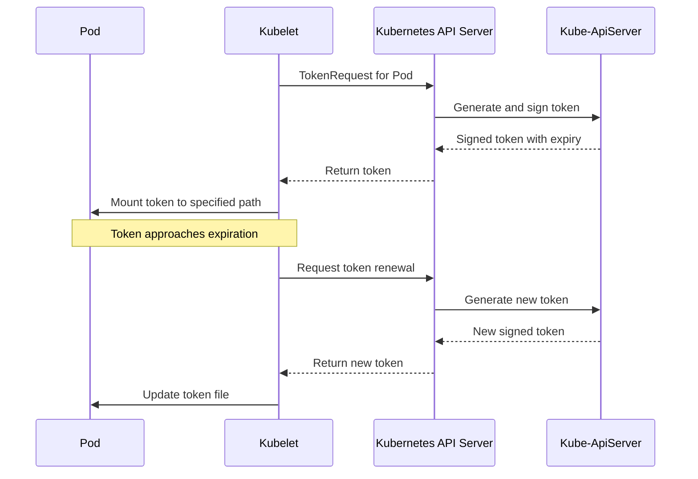

## Introduction to Service Account Token Volume Projection

Service Account Token Volume Projection is an advanced security feature in Kubernetes that enhances the way pods authenticate to the Kubernetes API and other services. This mechanism provides fine-grained control over token properties, improves security posture, and enables sophisticated authentication workflows for applications running in Kubernetes clusters.

Introduced as an alpha feature in Kubernetes 1.12 and graduating to stable in 1.20, Service Account Token Volume Projection replaces the legacy method of mounting service account tokens. It addresses several security concerns with the traditional approach and aligns with modern security best practices for containerized applications.

## Service Account Authentication Evolution

Understanding the evolution of service account authentication in Kubernetes provides context for the importance of token volume projection:

::steps
### Legacy Token Mounting
- Traditional approach before Kubernetes 1.12
- Long-lived tokens with no expiration
- Automatically mounted at `/var/run/secrets/kubernetes.io/serviceaccount/token`
- Same token for all containers in a pod
- No audience binding or scope limitations
- Potential security risk if token is compromised
- Example of legacy token mounting:
  ```yaml
  apiVersion: v1
  kind: Pod
  metadata:
    name: legacy-token-pod
  spec:
    serviceAccountName: my-service-account
    # Token automatically mounted unless explicitly disabled
    # automountServiceAccountToken: false
    containers:
    - name: app
      image: app:1.0
      # Token available at /var/run/secrets/kubernetes.io/serviceaccount/token
  ```

### TokenRequest API
- Introduced in Kubernetes 1.10
- Enables programmatic token requests with specific properties
- Supports bound audiences, time-bound validity
- Foundation for projected service account tokens
- Example token request:
  ```bash
  kubectl create token my-service-account \
    --audience="https://kubernetes.default.svc" \
    --duration=1h
  ```

### Projected Service Account Tokens
- Introduced in Kubernetes 1.12 (alpha)
- Stable in Kubernetes 1.20
- Short-lived tokens with automatic rotation
- Audience-bound to prevent token misuse
- Independent token per container possible
- Support for additional properties like expiration path
- Example of projected token configuration:
  ```yaml
  apiVersion: v1
  kind: Pod
  metadata:
    name: projected-token-pod
  spec:
    serviceAccountName: my-service-account
    containers:
    - name: app
      image: app:1.0
    volumes:
    - name: token-volume
      projected:
        sources:
        - serviceAccountToken:
            path: token
            expirationSeconds: 3600
            audience: "https://kubernetes.default.svc"
  ```

### BoundServiceAccountTokenVolume Feature
- Enabled by default in Kubernetes 1.21+
- Makes projected tokens the default mechanism
- Legacy tokens still available but deprecated
- Automatic projection with secure defaults
- Migration path for existing workloads
::

## How Service Account Token Volume Projection Works

The projected service account token system involves several components working together:

1. **TokenRequest API**: The kubelet uses this API to request tokens with specific properties
2. **Token Controller**: Manages token creation and signing using the cluster's signing key
3. **Volume Projection**: Mounts the token into the pod's filesystem
4. **Kubelet**: Automatically refreshes tokens before expiration

The process flow is as follows:



## Basic Implementation

To implement service account token volume projection in your pods, you need to configure the projected volume and mount it in your containers:

```yaml
apiVersion: v1
kind: Pod
metadata:
  name: token-projection-example
spec:
  serviceAccountName: my-service-account
  containers:
  - name: main-app
    image: myapp:1.0
    volumeMounts:
    - name: service-token
      mountPath: /var/run/secrets/tokens
      readOnly: true
  volumes:
  - name: service-token
    projected:
      sources:
      - serviceAccountToken:
          audience: "https://kubernetes.default.svc"
          expirationSeconds: 3600
          path: token
```

This configuration:
- Creates a projected volume named `service-token`
- Requests a token bound to the audience `https://kubernetes.default.svc`
- Sets a 1-hour expiration time
- Mounts the token at the path `/var/run/secrets/tokens/token`

## Advanced Configuration Options

Service account token projection offers several advanced configuration options:

::alert{type="info"}
1. **Multiple Audiences**
   ```yaml
   volumes:
   - name: service-tokens
     projected:
       sources:
       - serviceAccountToken:
           audience: "https://kubernetes.default.svc"
           expirationSeconds: 3600
           path: k8s-token
       - serviceAccountToken:
           audience: "https://vault.example.com"
           expirationSeconds: 7200
           path: vault-token
   ```
   This configuration provides two different tokens bound to different audiences.

2. **Custom Expiration Times**
   ```yaml
   volumes:
   - name: service-tokens
     projected:
       sources:
       - serviceAccountToken:
           audience: "https://app.example.com"
           expirationSeconds: 86400  # 24 hours
           path: long-lived-token
       - serviceAccountToken:
           audience: "https://api.example.com"
           expirationSeconds: 300    # 5 minutes
           path: short-lived-token
   ```
   Different expiration times can be set based on security requirements.

3. **Combining with Other Projected Sources**
   ```yaml
   volumes:
   - name: all-tokens
     projected:
       sources:
       - serviceAccountToken:
           audience: "https://kubernetes.default.svc"
           expirationSeconds: 3600
           path: k8s-token
       - configMap:
           name: trusted-ca
           items:
             - key: ca.crt
               path: ca.crt
       - secret:
           name: api-credentials
           items:
             - key: api-key
               path: api-key
   ```
   Projected volumes can combine service account tokens with other sources like ConfigMaps and Secrets.

4. **Multiple Containers with Different Tokens**
   ```yaml
   spec:
     containers:
     - name: frontend
       image: frontend:1.0
       volumeMounts:
       - name: frontend-token
         mountPath: /var/run/secrets/tokens
     - name: backend
       image: backend:1.0
       volumeMounts:
       - name: backend-token
         mountPath: /var/run/secrets/tokens
     volumes:
     - name: frontend-token
       projected:
         sources:
         - serviceAccountToken:
             audience: "https://frontend.example.com"
             expirationSeconds: 3600
             path: token
     - name: backend-token
       projected:
         sources:
         - serviceAccountToken:
             audience: "https://backend.example.com"
             expirationSeconds: 3600
             path: token
   ```
   Each container can have its own token with specific properties.
::

## Security Benefits

Service account token volume projection provides significant security benefits:

::steps
### Time-bound Tokens
- Tokens automatically expire after the specified period
- Limits the exposure window if tokens are compromised
- Provides defense-in-depth for pod security
- Example configuration with short expiration:
  ```yaml
  serviceAccountToken:
    expirationSeconds: 900  # 15 minutes
  ```

### Audience Binding
- Tokens are bound to specific audiences (recipients)
- Prevents token reuse for unintended services
- Implements the OAuth 2.0 audience restriction pattern
- Example with explicit audience:
  ```yaml
  serviceAccountToken:
    audience: "https://payment-processor.example.com"
  ```

### Automatic Rotation
- Kubelet refreshes tokens before expiration
- No application changes needed to use fresh tokens
- Maintains token validity without intervention
- Typically refreshed when 80% of lifetime has elapsed

### Principle of Least Privilege
- Different tokens with different permissions per container
- Fine-grained access control with audience restrictions
- Minimizes the impact of token compromise
- Example of least privilege implementation:
  ```yaml
  containers:
  - name: metrics
    image: metrics:1.0
    volumeMounts:
    - name: metrics-token
      mountPath: /var/run/secrets/tokens
  volumes:
  - name: metrics-token
    projected:
      sources:
      - serviceAccountToken:
          audience: "https://monitoring.example.com"
          expirationSeconds: 3600
          path: token
  ```
::

## Integration with External Systems

One of the most powerful aspects of service account token projection is integration with external authentication systems:

1. **HashiCorp Vault Integration**
   ```yaml
   volumes:
   - name: vault-token
     projected:
       sources:
       - serviceAccountToken:
           audience: "vault.example.com"
           expirationSeconds: 3600
           path: token
   ```
   This token can be used with Vault's Kubernetes authentication method.

2. **OAuth2 Proxy Authentication**
   ```yaml
   containers:
   - name: oauth-proxy
     image: oauth2-proxy:latest
     args:
     - --provider=oidc
     - --oidc-issuer-url=https://kubernetes.default.svc
     - --client-id=kubernetes
     - --token-path=/var/run/secrets/tokens/token
     volumeMounts:
     - name: k8s-token
       mountPath: /var/run/secrets/tokens
   volumes:
   - name: k8s-token
     projected:
       sources:
       - serviceAccountToken:
           audience: "kubernetes"
           expirationSeconds: 3600
           path: token
   ```

3. **Custom API Authentication**
   ```yaml
   containers:
   - name: api-client
     image: api-client:latest
     env:
     - name: TOKEN_PATH
       value: /var/run/secrets/tokens/api-token
     volumeMounts:
     - name: api-token
       mountPath: /var/run/secrets/tokens
   volumes:
   - name: api-token
     projected:
       sources:
       - serviceAccountToken:
           audience: "https://api.example.com"
           expirationSeconds: 3600
           path: api-token
   ```

4. **Service Mesh Authentication**
   ```yaml
   containers:
   - name: istio-proxy
     image: istio/proxyv2:latest
     volumeMounts:
     - name: istio-token
       mountPath: /var/run/secrets/tokens
   volumes:
   - name: istio-token
     projected:
       sources:
       - serviceAccountToken:
           audience: "istio-ca"
           expirationSeconds: 43200  # 12 hours
           path: istio-token
   ```

## Working with Token Volumes in Applications

Applications need to be aware of how to use the projected tokens:

::alert{type="warning"}
1. **Reading Token Files**
   ```go
   // Go example
   tokenBytes, err := os.ReadFile("/var/run/secrets/tokens/token")
   if err != nil {
       log.Fatalf("Failed to read token: %v", err)
   }
   token := string(tokenBytes)
   ```

2. **Handling Token Expiration**
   The kubelet refreshes tokens automatically, so applications can simply read the current token file when needed:
   ```python
   # Python example
   def get_current_token():
       with open("/var/run/secrets/tokens/token", "r") as f:
           return f.read().strip()
           
   # Use this function whenever you need the token
   # No need to track expiration or refresh manually
   ```

3. **Making Authenticated API Calls**
   ```javascript
   // JavaScript example
   const fs = require('fs');
   
   async function callAPI() {
     const token = fs.readFileSync('/var/run/secrets/tokens/token', 'utf8');
     const response = await fetch('https://api.example.com/data', {
       headers: {
         'Authorization': `Bearer ${token}`
       }
     });
     return response.json();
   }
   ```

4. **Adding Token to gRPC Calls**
   ```go
   // Go gRPC example
   func getGRPCClient() (pb.ServiceClient, error) {
       tokenBytes, err := os.ReadFile("/var/run/secrets/tokens/token")
       if err != nil {
           return nil, fmt.Errorf("failed to read token: %v", err)
       }
       
       creds := oauth.NewOauthAccess(&oauth2.Token{
           AccessToken: string(tokenBytes),
           TokenType:   "Bearer",
       })
       
       conn, err := grpc.Dial(
           "service.example.com:443",
           grpc.WithTransportCredentials(credentials.NewTLS(&tls.Config{})),
           grpc.WithPerRPCCredentials(creds),
       )
       if err != nil {
           return nil, fmt.Errorf("failed to dial: %v", err)
       }
       
       return pb.NewServiceClient(conn), nil
   }
   ```
::

## Advanced Usage Patterns

Service account token projection enables several advanced authentication patterns:

::steps
### Multi-service Authentication
- Single pod authenticating to multiple services
- Different tokens with different audiences
- Example configuration:
  ```yaml
  volumes:
  - name: tokens
    projected:
      sources:
      - serviceAccountToken:
          audience: "https://database.example.com"
          expirationSeconds: 3600
          path: db-token
      - serviceAccountToken:
          audience: "https://cache.example.com"
          expirationSeconds: 1800
          path: cache-token
      - serviceAccountToken:
          audience: "https://logging.example.com"
          expirationSeconds: 900
          path: logging-token
  ```

### Sidecar Auth Proxy
- Dedicated sidecar container for authentication
- Centralizes auth logic for the main application
- Provides authentication services to the main container
- Example implementation:
  ```yaml
  containers:
  - name: main-app
    image: main-app:1.0
    env:
    - name: AUTH_PROXY_URL
      value: "http://localhost:8181/token"
  - name: auth-proxy
    image: auth-proxy:1.0
    ports:
    - containerPort: 8181
    volumeMounts:
    - name: service-token
      mountPath: /var/run/secrets/tokens
      readOnly: true
  volumes:
  - name: service-token
    projected:
      sources:
      - serviceAccountToken:
          audience: "https://api.example.com"
          expirationSeconds: 3600
          path: token
  ```

### Token Exchange Service
- Exchange Kubernetes tokens for external service tokens
- Implement OAuth2 token exchange flows
- Maintain token lifecycle management
- Example configuration:
  ```yaml
  containers:
  - name: token-exchange
    image: token-exchange:1.0
    volumeMounts:
    - name: k8s-token
      mountPath: /var/run/secrets/tokens
    env:
    - name: TOKEN_EXCHANGE_URL
      value: "https://auth.example.com/token"
    - name: K8S_TOKEN_PATH
      value: "/var/run/secrets/tokens/token"
  volumes:
  - name: k8s-token
    projected:
      sources:
      - serviceAccountToken:
          audience: "https://auth.example.com"
          expirationSeconds: 3600
          path: token
  ```

### Zero-trust Architecture
- Short-lived tokens with minimal permissions
- Regular re-authentication for all service communications
- Defense in depth with multiple authentication layers
- Example zero-trust configuration:
  ```yaml
  volumes:
  - name: auth-token
    projected:
      sources:
      - serviceAccountToken:
          audience: "https://zero-trust-gateway.example.com"
          expirationSeconds: 300  # 5 minutes
          path: token
  ```
::

## Troubleshooting Token Projection

Common issues and troubleshooting steps for service account token projection:

1. **Token Not Found**
   - Verify volume and volumeMount paths match
   - Check for typos in the path configuration
   - Ensure the pod has a service account assigned
   - Example debug commands:
     ```bash
     # Check if token exists in the container
     kubectl exec -it <pod-name> -- ls -la /var/run/secrets/tokens/
     
     # Verify service account assignment
     kubectl get pod <pod-name> -o jsonpath='{.spec.serviceAccountName}'
     ```

2. **Token Rejected by Service**
   - Verify the audience matches the service's expected audience
   - Check token expiration time
   - Inspect token contents to verify claims
   - Example debugging steps:
     ```bash
     # Extract token from pod
     TOKEN=$(kubectl exec -it <pod-name> -- cat /var/run/secrets/tokens/token)
     
     # Decode JWT token to inspect claims
     echo $TOKEN | base64 --decode | jq .
     
     # Validate audience claim
     echo $TOKEN | base64 --decode | jq -r '.aud'
     ```

3. **Permission Issues**
   - Ensure the service account has necessary RBAC permissions
   - Check for proper role bindings
   - Verify namespace restrictions
   - Example RBAC verification:
     ```bash
     # Check service account roles and bindings
     kubectl get rolebindings,clusterrolebindings --all-namespaces \
       -o jsonpath='{range .items[?(@.subjects[0].name=="<service-account-name>")]}[{.roleRef.kind},{.roleRef.name}]{end}'
     ```

4. **Token Refresh Issues**
   - Check kubelet logs for token refresh errors
   - Verify Kubernetes API server is accessible
   - Ensure kubelet has appropriate permissions
   - Example kubelet log check:
     ```bash
     # Check kubelet logs for token-related errors
     sudo journalctl -u kubelet | grep -i token
     ```

## Best Practices

When implementing service account token volume projection, follow these best practices:

::alert{type="info"}
1. **Use Short Expiration Times**
   - Set the shortest practical expiration time for your use case
   - Balance security needs with API server load
   - Consider workload type and security requirements
   - Example for different security levels:
     ```yaml
     # High security (e.g., financial transactions)
     expirationSeconds: 300  # 5 minutes
     
     # Medium security (e.g., internal services)
     expirationSeconds: 3600  # 1 hour
     
     # Low security (e.g., read-only public data)
     expirationSeconds: 43200  # 12 hours
     ```

2. **Specify Explicit Audiences**
   - Always set an explicit audience that matches the service
   - Avoid generic audiences when possible
   - Use DNS names or URIs as audience values
   - Example best practice:
     ```yaml
     # Good: specific service audience
     audience: "https://payment-api.example.com"
     
     # Avoid: generic audience
     audience: "kubernetes"
     ```

3. **Implement Minimal Access**
   - Create service accounts with minimal permissions
   - Use different service accounts for different functions
   - Apply RBAC policies that follow least privilege
   - Example RBAC configuration:
     ```yaml
     apiVersion: rbac.authorization.k8s.io/v1
     kind: Role
     metadata:
       namespace: default
       name: pod-reader
     rules:
     - apiGroups: [""]
       resources: ["pods"]
       verbs: ["get", "list"]
     ---
     apiVersion: rbac.authorization.k8s.io/v1
     kind: RoleBinding
     metadata:
       name: read-pods
       namespace: default
     subjects:
     - kind: ServiceAccount
       name: my-service-account
       namespace: default
     roleRef:
       kind: Role
       name: pod-reader
       apiGroup: rbac.authorization.k8s.io
     ```

4. **Properly Mount Token Volumes**
   - Mount volumes as read-only
   - Use specific paths that are not easily guessable
   - Ensure proper file permissions within containers
   - Example secure mounting:
     ```yaml
     volumeMounts:
     - name: token-volume
       mountPath: /var/run/secrets/tokens
       readOnly: true
     ```

5. **Monitor Token Usage**
   - Implement logging for token access
   - Set up alerts for unusual token requests
   - Track token usage patterns
   - Example monitoring configuration:
     ```yaml
     # Prometheus alert for high token request rate
     alert: HighTokenRequestRate
     expr: rate(serviceaccount_token_requests_total[5m]) > 10
     for: 10m
     labels:
       severity: warning
     annotations:
       summary: "High token request rate detected"
       description: "Service account token requests exceeding normal threshold"
     ```
::

## Migration from Legacy Tokens

If you're migrating from legacy token mounting to projected tokens, follow these steps:

1. **Identify Workloads Using Legacy Tokens**
   ```bash
   # Find pods using the legacy token mount
   kubectl get pods --all-namespaces -o json | jq '.items[] | 
     select(.spec.automountServiceAccountToken == null or .spec.automountServiceAccountToken == true) | 
     .metadata.name + " in namespace " + .metadata.namespace'
   ```

2. **Update Application Code**
   - Modify code to read from the new token path
   - Consider supporting both paths during transition
   - Example updated code:
   ```python
   def get_token():
       # Try projected token first, fall back to legacy path
       token_paths = [
           "/var/run/secrets/tokens/token",  # Projected token
           "/var/run/secrets/kubernetes.io/serviceaccount/token"  # Legacy token
       ]
       
       for path in token_paths:
           try:
               with open(path, "r") as f:
                   return f.read().strip()
           except FileNotFoundError:
               continue
               
       raise Exception("No valid token found")
   ```

3. **Update Deployment Manifests**
   - Add projected token volume configuration
   - Set `automountServiceAccountToken: false` to disable legacy token
   - Deploy updated configuration
   - Example migration configuration:
   ```yaml
   apiVersion: v1
   kind: Pod
   metadata:
     name: migrated-pod
   spec:
     serviceAccountName: my-service-account
     automountServiceAccountToken: false  # Disable legacy token
     containers:
     - name: app
       image: app:1.0
       volumeMounts:
       - name: token-volume
         mountPath: /var/run/secrets/tokens
     volumes:
     - name: token-volume
       projected:
         sources:
         - serviceAccountToken:
             audience: "https://kubernetes.default.svc"
             expirationSeconds: 3600
             path: token
   ```

4. **Test Thoroughly**
   - Verify application functionality with projected tokens
   - Check for authentication errors or token handling issues
   - Validate token renewal behavior

## Service Account Token Volume Projection in Kubernetes v1.27+

Recent Kubernetes versions have introduced additional capabilities:

1. **ImplicitServiceAccountToken Feature Gate**
   - Controls automatic token mounting behavior
   - Setting to false requires explicit projection
   - Important for security-focused clusters
   - Example cluster configuration:
   ```yaml
   apiVersion: kubeadm.k8s.io/v1beta3
   kind: ClusterConfiguration
   apiServer:
     extraArgs:
       feature-gates: "ImplicitServiceAccountToken=false"
   ```

2. **TokenRequestProjection Stable API**
   - Fully supported stable API for token projection
   - Compatible with all modern Kubernetes distributions
   - No feature gate required in recent versions

3. **Extended Token Attributes**
   - Support for additional claims in projected tokens
   - Enhanced binding to specific resources or operations
   - Example with extended attributes:
   ```yaml
   apiVersion: v1
   kind: Pod
   metadata:
     name: extended-token-pod
   spec:
     serviceAccountName: my-service-account
     volumes:
     - name: token-volume
       projected:
         sources:
         - serviceAccountToken:
             audience: "https://kubernetes.default.svc"
             expirationSeconds: 3600
             path: token
   ```

## Conclusion

Service Account Token Volume Projection represents a significant advancement in Kubernetes security practices. By providing time-bound, audience-restricted tokens that are automatically rotated, this feature addresses many of the security concerns associated with the legacy token mounting system.

Key takeaways about service account token projection:

1. It provides enhanced security through time-limited, audience-bound tokens
2. It supports complex authentication scenarios with multiple tokens and audiences
3. It integrates well with external authentication systems and service meshes
4. It requires minimal application changes when migrating from legacy tokens
5. It follows modern security best practices for containerized applications

As Kubernetes environments face increasing security challenges, implementing service account token projection should be considered a standard practice for securing application authentication and maintaining a strong security posture in your cluster.